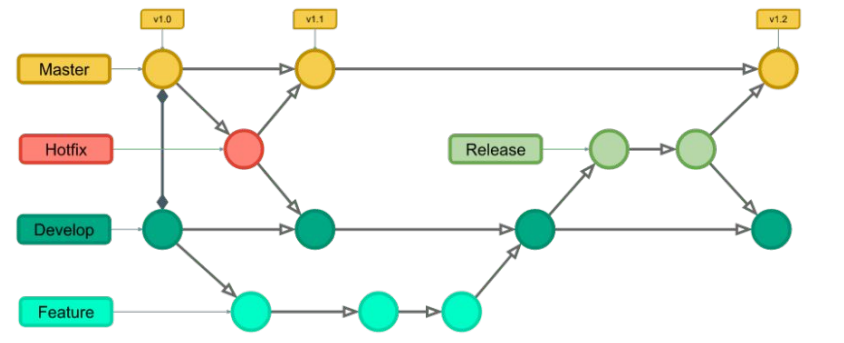
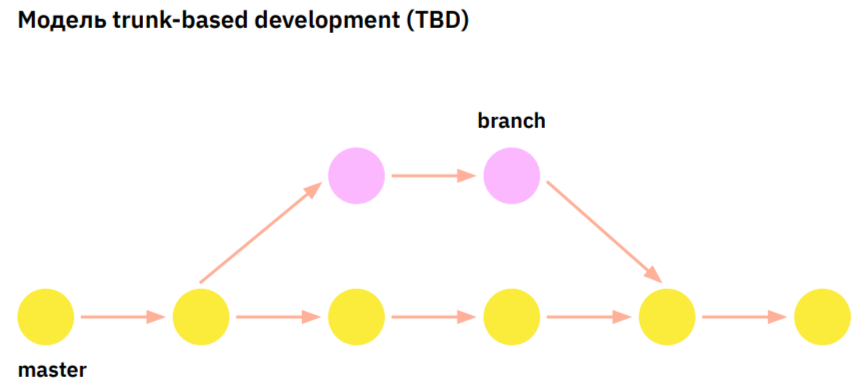

Преподаватель - Даниил Пилипенко (Директор центра подбора IT-специалистов SymbioWay)

# GIT

### **GitHub** - крупнейший веб-сервис для хостинга IT-проектов и их совместной разработки. Мы используем его для работы с удалёнными репозиториями. 

### **Репозиторий** - это хранилище файлов, поддерживающее версионность (историю сохранений (изменений))

> При первом запуске : 
* git config --global user.name "Your Name"  
* git config --global user.email "your.mail@mail.com"

> Команды для работы с GIT:  
* git init - создать локальный репозиторий
* git status - информация о текущем состоянии
* git checkout 12345 - для перехода в другой коммит (нумерация вызывается из лога, переход возможно осуществеить по первым 4 - это минимум) 
  * git checkout 1234 index.html - вернуть файл в состояние старого коммита 
  * git checkout master/main - выйти в текущей версии (голова)  
  * git checkout -b 'new branch' - выйти из текущей ветки с созданием новой ветки 
* git add hello_world.md - добавить файл "hello_world.md" для отслеживания Git-ом состояния файла и его сохранений в будущем  (называется - `добавление в индекс`)
  * git add. - добавить все имеющиеся в папке локального репозитория файлы 
* git commit -m "comment" - сохраняет изменения файла (перед этой командой необходимо добавть файл с помощью "add")  
  * **git commit -am "comment"** - сразу и добавить файл и закоммитировать его  
  * git commit --amend -m "another comment" - изменить содержание текста последнего коммита
  * git commit --amend --no-edit - (предварительно git add file) - добавить какие-то изменения к предыдущему коммиту
* git show - показать содержимое последнего коммита
* git log - журнал всех изменений (коммитов)  
  * git log --graph - вывести лог коммитов в **графическом** виде  
  * git log origin/new-branch ^new-branch - посмотреть какие изменения были внесены в удаленную ветку при статусе ветки 'local out of date'
* git diff - показать отличия текущего (закомиттированного) состояния файла от предыдущего 
  * git diff - без параметров, покажет все файлы и изменения в них после последнего коммита
  * git diff 1234 - где 1234 - хэш коммита (локального или удаленного после fetch)
  * git diff index.html - покажет разницу между последним коммитом и текущим состоянием файла (внесенных измененениях с последнего коммита)
  * git diff хэш1 хэш2 file.format  - разница между двумя любыми коммитами, относительно конкретного файла //важна последовательность коммитов, от этого зависит отображение изменений
  * git diff file.txt file1.txt - сравнить две версии одного и того же файла (могут быть и не отслеживаемые гитом)
* git branch - вывести все ветки проекта
* git merge name_branch - слияние **текущей** ветки с другой (сливать из той, в которую и надо)
  * git merge origin/name_branch - слияние после fetch из удаленного репо
  * --allow-unrelated-histories - если проекты не связанны изначально и у них свои истории
  * git merge --abort - отменить слияние (мердж), если он был с конфликтом
* git branch -d name_branch - удалить ветку
* git chechout branch_name - переключиться на другую ветку
* git branch -m new_name - переименовать ветку
  * git branch -m old_name new_name - переименовать удаленно
* git blame file - показать информацию об изменении каждой строки файла (хэш коммита, пользователь, время)
* git restore file - для отката изменений файла до крайнего коммита 
  * git restore --staged file - для того, чтобы убрать файл из индекса
* git reset --hard - удалить все незакомиченные изменения (в т.ч. в индексе), но не касается неотслижваемых (новых файлов)
  * git reset --soft хэш_коммита - переместить указатель HEAD на указанный коммит, при этом, последующие коммиты исчезают (изменения остаются в индексе)
  * git reset --mixed хэш_коммита (или git reset хэш), т.к. mixed по умолчанию - тоже самое, только изменения в индексе не будут
  * git reset --hard хэш_коммита - удалить все коммиты до указанного, все изменения также будут удалены
  * git reset --merge хэш_предыдущего_до_мерджа_коммита - отменить успешное слияние (мердж), если без конфликтов 
* git clean -df - удалить все неотслеживаемые файлы. -d - рекурсивно, -f - force
* git rm -r --cached file - удалить файл из отслеживания гитом (предполагаю, что предварительно записав в гитигнор) //-r для папок (рекурсивно)
* git revert хэш - отменить какой-то конкретный коммит (при этом последующие и предыдущие коммиты остаются в силе)
  * git revert --no-commit хэш - тоже самое, но без коммита (для последовательного удаления с последующим 1 коммитом)

> Команды для работы с удалёнными репозиториями: 

* git clone hyperlink - клонирует удалённый репозиторий в нашу локальную папку на компьютере //для подключения к уже созданному репозиторию
* git remote rm origin - удалить обявленный удаленный репозиторий (origin - его имя)  
* git remote add origin link - установить в локальном репозитории путь к удаленному (origin - имя репо), также можно добавить еще один репо, поменяв имя, например, на vendor
  * git remote add vendor link - добавить другой репо
  * git remote set-url origin link - изменить адрес для репозитория куда пушим, или откуда тянем
  * git remote set-url --push origin link - изменить адрес именно для команды push, также можно сделать для fetch
    * git remote set-url --add --push all new-link - добавить еще один путь для push (может понадобиться сделать два раза, если первая команда перезапишет базовую ссылку для пуша)
* git remote show origin - показывает, какие локальные ветки связанны с ветками удаленного репо
  * напротив веток будет инфа об внесенных изменениях:
    * up to date - локальная соответствует удаленной
    * fast-forwardable - удаленный репо еще не содержит внесенных локальных изменений
    * local out of date - локальная ветка устарела (удаленный репо содержит новую инфу, кто-то внес изменения помимо нас) - далее git fetch - далее git log origin/new-branch ^new-branch - далее git diff 1234(хэш) - git merge хэш-код - git push origin main
* git remote -v - показывает пути к удаленным репозиториям (имя + путь)
* git fetch - скачать из удаленного репо данные в локальный, но сами ветки не обновляем (слияние не происходит)
  * git fetch --all - затянуть изменения из всех удаленных репо в локальный (без слияния)
* git stash - отложить изменения, в т.ч. в индексе (при этом, они пропадают из файла) // может понадобиться при переключении на другую задачу, и тогда, когда коммитить еще рано ввиду незавершенности задачи (неотслеживаемые файлы не включаются). p.s. работает по принципу очереди LIFO
  * git stash pop - достать отложенные изменения в проект (может произойти конфликт. по факту - это слияние с отложенным коммитом в стэше. после его разрешения, отложенное изменения может остаться в стэше. Можно просто его дропнуть)
  * git stash list - просмотреть список отложенных изменений
  * git stash drop - удалить последнее отложенное изменение
* git rebase - вместо мерджа. Вместо слияния веток, вторая ветка станет продолжением первой. Все коммиты второй ветки станут новыми коммитами первой ветки. Первая ветка будет выглядит: состояние до ребейса и далее все коммиты другой ветки. При этом, вторая ветка исчезает. //делать из ветки, в которую нужно залить другую ветки в виде новых коммитов
* git cherry-pick - скопировать выбранный коммит из одной ветки в конец другой в виде нового коммита. При этом, вторая ветка остается прежней. //делать из ветки, в которую нужно дозалить выбранный коммит

> ! После клонирования необходимо перейти в папку скачанного проекта, для этого мы используем команду:  
>cd .\folder - для перехода к скачанному репозиторию  
>cd .. - для перехода выше на одну папку по корневому дереву 

* git push - отправляет файл на удалённый репозиторий  
  * git push -u origin master //origin - имя основного репо, master - конкретная ветка, -u - отслеживание для локальной ветки и удаленной. При дальнейших пушках без указания ветки, будет испльзоваться удаленная ветка, как отслеживаемая для локальной
  * если пушить другую ветку, то указываем тот же origin - т.к. это весь репо:
  git push -u origin another-branch
  * Чтобы запушить сразу в несколько репо: 
  1. создаем новый репо git remote add all(название) link(ссылка одного из уже существующих репо)
  2. git remote set-url --add --push all new-link //add - добавить еще один путь, --push - для команды push, all - имя репо, далее ссылка
  * git push origin --force - даже в случае отличия истории коммитов, запушится все то, что у нас в локальном репо

* git pull - скачать актуальную версию из удалённого репозитория и замерджить с локальным состоянием файла автоматически
  * git pull origin branch - с указанием конкретной ветки и конкретного репозитория, будет мерджить со связанной или с текущей
  
* fork (вилка) - на сайте Git, для копирования проекта из чужого репозитория

> Чтобы **игнорировать** перечень файлов:  
Необходимо создать файл **.gitignore** и прописать там файлы, которые необходимо игнорировать 
  * *.log - добавить все файлы с расширением лога в игнор
  * dir/ - игнорировать целую папку
  * !special.log - чтобы не игнорировать используем анти-паттерн

> Не рекомендуется хранить(отслеживать) в Git-репозиториях:
* лог-файлы (логи)
* пользовательские файлы (аватарки, pdf-файлы и т.п.)
* служебные файлы сред разработки (индивидуальные настройки среды разработки и т.п.)
* внешние библиотеки
* файлы локальной конфигурации ???
* файлы операционной системы (скрытые)
* очень большие файлы

---

Альтернатива GitHub = `GitLab`

Возможности:  
* в настройках удаленного репозитория можно добавлять членов проекта по @mail - для проверки, изменять права доступа и удалять их
* сравнивать два любых коммита
* наглядное визуальное представление репозиториев
* ведения TaskTracker - системы управления задачами 
  * ставить задачи любому члену команды, прикреплять файлы
  * переписка по этим задачам
  * комментарии к задачам
  * изменение статуса задачи
  * перераспределение задач между пользователями
  * привязка задачи к коммиту

Отличия `GitHub` и `GitLab`

| Отличие | GitHub | GitLab | 
|---------|---------|--------|
| Возможность размещения на своем сервере    | нет   | да  |
| Бесплатные возможности для командной работы и DevOps    | нет   | да  |
| Возможность доработок системы    | нет   | да  |

Что выбрать?
- для OpenSource-проектов и личного портфолио - GitHub
- для коммерческих проектов с размещением на собственном сервере - GitLab

> Способы создания удаленного репозитория GitHub:
1. В верхней строке - создать хотя бы один файл и закоммитить его
2. Там же - загрузить хотя бы один файл и закоммитить его
3. ...or create a new repo.... - создание файла README.md на компьютере + пушим его в репозиторий
4. ...or push an existing repo...//самое частое - запушить уже существующий локальный репозиторий

Именование репозиториев Git:  
1. имя папки проекта = имя репозитория. 
2. Заглавные буквы заменяем на строчные. 
3. Пробелы на дефисы

`Конфликты версий Git:`
1. Простые (разрешаются автоматически) //при возникновении ошибки обычно решается с помощью git pull
   * в случаях изменений в файле в разных строках кода
2. Сложные (Могут быть разрешены только вручную) //также делаем pull, в конфликтном файле будет пометка (часть нашего кода + часть кода из коммита в удаленном репо - нужно отредактировать файл по своему усмотрению и запушить)
   * в случаях изменений в одних и тех же строках кода

`Алгоритм решения проблем в Git`
1. Прочитать, что написал Git
2. Понять, что произошло
3.1. Решить проблемы самостоятельно
3.2. Выполнить рекомендации Git

* Чтобы удалить файл в самом репозитории:
заходим в файл - три кнопки - внизу Delete file

`Состояние файлов в репозитории`
1. закоммичен/commited (изменения сохранены)
2. изменен/not staged (изменены и не сохранены)
3. готов к коммиту/staged (с помощью git add - добавление в индекс)
* либо не отслеживаются системой контроля версий git

`Индекс` в системе Git - область, где хранятся изменения файлов, готовые к коммиту

Указатель `HEAD` - указывает на последний коммит в текущей ветке

`Как отменить слияние (мердж):`

Если слияние было успешным (без конфликтов), то:
  * git reset --merge хэш_предыдущего_до_мерджа_коммита 
Если слияние было с конфликтом, то:
  * git merge --abort - отменить слияние (мердж), если он был с конфликтом

`Использовать вместо дефолтного редактора vim - nano`
git config --global core.editor "nano"

> `2 основные модели ветвления в GIT:`

1. `Git flow`:
  * master - защищается от вливания не проверенных изменений
  * develop - вливаются все свежие изменения и проверяется работоспособность кода
  * new-branch - для каждой новой задачи
  * release - протестированный dev, где еще раз очень тщательно тестируется и вливается в ветку мастер
  * hotfix - внедрение быстрых изменений - сразу вливается в ветку master

2. `Trunk-based development` (TBD) 
  * основана на 1 основной ветке - master
  * новые ветки создаются для новых задач и удаляются после их вливанию в мастер
  * все фичи помечаются булевыми флагами "Feature flags", которые отвечают за включение этой фичи в коде

`Процесс работы в Git-команде:`
1. Подключение к проекту и клонирование
2. Создание ветки и выполнение задачи
3. Отправка на сервер, переназначение задачи на руководителя, создания merge request
4. Руководитель проверяет изменения в коде (оставляет замечания), принимает merge request

Чтобы `подключиться к проетку` в GitLub после того, как пригласили в проект:  
prifile - edit profile - ssh keys - сгенерировать("ssh-keygen" в командной строке (мб линукс)) - пусть по умолчанию (тот же можно) - пароль (можно без) - cat ./ssh/id_rsa.pub (выведет публичный ключ) - вставить его на страницу.(авторизация в этом репозитории будет работать автоматически теперь)

`Виды прав доступа` в репозитории коммерческого проекта GitHub:
- Read - права на ознакомпление с проектом
- Triage - ознакамливаться и ставить задачи
- Write - для разработчиков - писать проект
- Maintain - права для работы с репозиторием
- Admin ...

* Чтобы поставить планируемое время выполнения в списке задач в GitLub:
List - в теле блока "/estimate 10m/10h/10d

* Чтобы отметить затраченное время выполнения в блоке описания в GitLub:
/spend 12

`Правила работы в GIT-команде:`
* Именование веток - латинские буквыв нижнем регистре, цифры и дефисы
  * пример: 17-new-list-pagination
  * начало - номер задачи (для автоопределения соответствия задач и веток)
  * суть задачи, решаемой в ветке

`Набор базовых веток:`
* master/main - основная
* dev/devel/develop - ветка для разработки и вливания отдельных мелких веток 
* test/staging - ветки для команд-тестировщиков
* prod/production - ветки для продакшн-релизов
* fixes/hot-fixes/hotfixes - для быстрого внесения изменений в обход основного процесса и вливания в продакшн

`Содержание коммитов:`
1. Когда делать коммиты:
   * завершенная работа либо логически понятный фрагмент кода
   * результат работы за сутки, отправляемый в ветку каждый вечер //если задача занимает более одного дня
2. Комментарии к коммитам:
   * желательно, на англ. языке
   * отражение сути содержимого
   * соответствие стандартм компании

`Единый международный стандарт коммитов`: https://www.conventionalcommits.org/en/v1.0.0/

* Чтобы поставить задачу в GitHub:
оргиназиция - репозиторий - issues. Определить исполнителя - assignees (справа)

+ следует ограничивать доступ членов команды к ветке main, запрещать форс пуши, удаления и т.д.

`Возможные роблемы: ` 

1. Ошибка при коммите: error: 
'docker/' does not have a commit checked out
fatal: adding files failed
   * **Решение**: удалить скрытую папку .git в папке, которую пытаешься добавить в отслеживание
 
2. error: remote origin already exists. //возникает, когда уже связались в другим репозиторием(или ссылка URL не соответствет тому, который вписываем)   
   * **Решение**:  
git remote rm origin // удаляем ссылку на удаленный репозиторий, после чего задаем новую ссылку
