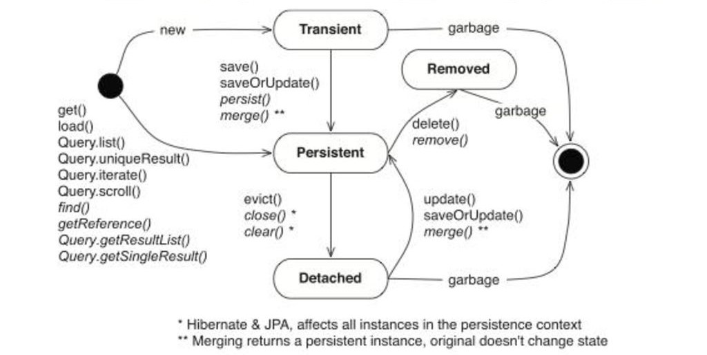

### Hibernate - enterprise-фреймворк для Java - решает задачу связи классов Java с таблицами базы данных (и типов данных Java с типами данных SQL)

ORM - object-relation-mapping - отношение объекта к БД крч. Является стандартом JPA. То, как мы соотносим поля объекта к столбцам в БД с помощью аннотаций. Hibernate относится к ORM и соответствует стандартам JPA.

> учу здесь: https://javarush.com/groups/posts/hibernate-java
для друзей: https://www.youtube.com/watch?v=emg94BI2Jao

> ссылка на PostgreSQL: https://www.postgresql.org/download/

Пользователь по умолчанию в PostgreSQL:  'postgres', заданный мной пароль: мой дефолтный, порт: 8083

Jakarta Persistence API (`JPA`; ранее Java Persistence Arhitecture) — спецификация API Jakarta EE, предоставляет возможность сохранять в удобном виде Java-объекты в базе данных[1].

JDBC - средства подключения к БД

`Аннотации`:
@Entity (сущность)

`Entity` (Сущность) — POJO-класс(англ. Plain Old Java Object) — «старый добрый Java-объект», связанный с БД с помощью аннотации или через XML. 
```java 
@Entity 
```
К такому классу предъявляются следующие **требования**:

* Должен иметь пустой конструктор (public или protected)
* Не может быть вложенным, интерфейсом или enum
* Не может быть final и **не может содержать final-полей/свойств**
* Должен содержать хотя бы одно @Id-поле

При этом entity **может**:
* Содержать непустые конструкторы
* Наследоваться и быть наследованным
* Содержать другие методы и реализовывать интерфейсы
* Entities могут быть связаны друг с другом (один-к-одному, один-ко-многим, многие-к-одному и многие-ко-многим)

> Проверьте ваши entity-классы, эти пункты — очень популярное место для "выстрела себе в ногу". Очень легко что-нибудь забыть. 

```java

@Id // это указание, что поле является идентификатором объектов этого класса. 

@Table //над классом указывает как называется таблица, в которую записываются объекты.
  * @Table (name = "users")

@Transient //помечать поля, которые не нужно серриализовывать

@Column(name = "name") // над полем или сеттером. Можно не размещать над полем, если имя поля класса и имя колонки совпадает.

@GeneratedValue(strategy = GenerationType.IDENTITY) //генерация id. 
/*
Всего 4 стратегии:
AUTO - по умолчанию
IDENTITY //БД сама будет устанавливать id. Обычно, у этой колонки стоит PRIMARY KEY, AUTOINCREMENT
SEQUENCE - генерация в определенном порядке. Ниже, начиная с 4 будет применен инкремент
	@GeneratedValue(generator = "sequence-generator")
	@GenericGenerator(
  	name = "sequence-generator",
  	strategy = "org.hibernate.id.enhanced.SequenceStyleGenerator",
  	parameters = {
    	@Parameter(name = "sequence_name", value = "user_sequence"),
    	@Parameter(name = "initial_value", value = "4"),
    	@Parameter(name = "increment_size", value = "1")
    	}
	)
TABLE
*/

/*
В основной таблице - поле с "mappedBy", а во второй - JoinColumn
*/

@OneToMany(mappedBy = "user", cascade = CascadeType.ALL, orphanRemoval = true) //связь поля с нескольким полями в др. табл. user - свойство в классе Auto (соотношение по классам, а не по таблицам). orphanRemoval = true - удалять все связные объекты при удалении этого.

@ManyToOne(fetch = FetchType.LAZY) //отношение свойства класса многие:1 - другому классу. Lazy - чтобы не вытащить вместе с объектом кучу других зависимостей по цепочке до бесконечности. Если обратимся к полю, которое не вытащилось из БД - хибернейт его сам дотянет. (в момент Persistance, конечно)

//ЕСЛИ ТАК: - ЛУЧШЕ ТАК НЕ ДЕЛАТЬ
@ManyToOne(fetch = FetchType.EAGER) //то все зависимости будут вытащены вместе с требуемым объектом. Например: получить университет - получим, вместе со списком студентов. 

//для такой связи создается связующая таблица - id to id (так называемый Join Table)
@ManyToMany //многие ко многим. Пример - читатели и книги.
@JoinTable( //во втором классе ссылки наоборот. 
	name = "books_readers",
	joinColumns = @JoinColumn(name = book_id), //в текущем классе Book. в классе Reader здесь reader_id
	inverseJoinColumns = @JoinColumn(name = reader_id) //во втором классе. в классе Reader здесь book_id
)

@OneToOne //отношение один к одному

@JoinColumn(name = "user_id") //свойство, которое в таблице связано с другой таблицей через вторичный ключ. Здесь имя своего столбца! Прописывать в таблице с Foreign key

```

> Для подключения к БД: две зависимости: hibernate-core и mysql-connector-java

`Фабрика сессия для работы с БД`:
Для этого используются классы библиотеки hibernate:
Класс `Configuration`:
  1. Configuration configuration = new Configuration().configure(); //берет конфиги из файла `hibernate.cfg.xml` - нужно его создать предварительно //пример на ПК в папке Hibernate
  2. configuration.addAnnotatedClass(User.class); //добавляем наши Entity-классы

Класс `StandardServiceRegistryBuilder`:
StandardServiceRegistryBuilder builder = new StandardServiceRegistryBuilder().applySettings(configuration.getProperties()); //билдер, в который кладутся конфиги из предыдущего класса

Класс `SessionFactory:` - создается 1 раз во всем приложении (очень тяжеловестный)
sessionFactory = configuration.buildSessionFactory(builder.build()); //строим сессию с помощью билдера

Методы:
.getCurrentSession(); - возвращают Session

> для КАЖДОЙ НОВОЙ ТРАНЗАКЦИИ нужна НОВАЯ сессия!

`класс Session`

Методы:
.beginTransaction() - начать транзакцию
-- здесь действия с БД
session.getTransaction().commit() - закончить транзакцию
session.get(User.class, id);
session.save(user)
session.update(user); `НО`! как делаетс update - когда я достану объект из базы с помощью get и изменю его свойства - изменения автоматиески применяются и в базе после transaction.commit! Либо - можно принудительно - `session.flush()`
session.delete(user);

HQL - Не SQL запросы. Разница в том, что обращаемся по имени класса, а на таблицы:
session.createQuery("From User").list(); //походу запрос SELECT * FROM table - получить список
session.createQuery("From User", CLASS).getSingleResult() - получить единственный объект
  * или так: User user = session.createQuery("Select i From User i Where i.id = :id", User.class).setParameter("id", 4).getSingleResult();

### Моя реализация: https://github.com/timofeev-vadim-96/hibernate-app.git

`Цикл существования Entity, а также тонкости его нахождения в Persistance (отслеживание состояния после .get() из БД)`


Чтобы достать объект из не отслеживать: после .get():
* evict(Object obj) - не отслеживать конкретный объект  
* close() - закрыть сессию
* clear() - очистить контекст постоянства (Persistance) и все объекты переходят в "Detached"

Чтобы вернуть объект в отслеживание:
* update(Object object)
* saveOrUpdate()
* merge()


> Hibernate в своей работе **кэширует** все объекты в Persistance себе, из-за чего происходит их **дублирование** (ведь они есть и в куче). Если мы вытаскиваем большое кол-во объектов из БД, следует периодически либо производить clear(), либо удалять объекты из Persistance c помощью evict()

