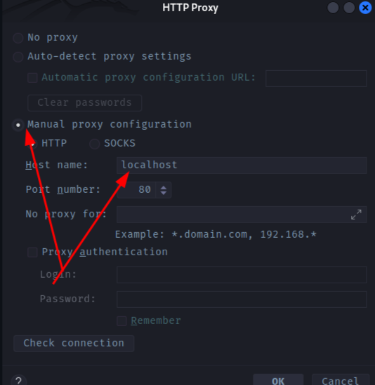

> лицензии для Intellia Idea
https://github.com/superbeyone/JetBrainsActiveCode/blob/master/licenses/2023/2023-12-22.md

> Если лицензия не встает: включить прокси

## IntelliJIdea хоткеи:

IDE (Integrated Development Environment) - интегрированная среда разработки

> Alt + J - `выбор символа где каретка`, еще раз - + след. символ
  * Alt + Shift + J - обратно
    * Ctrl + Alt + Shift + J - `выбор всех вхождений символ` (в этом режиме можно редактировать сразу все вхождения)
      * Esc - обратно

> Ctrl + D - `дублировать строку` (можно и несколько, при их выделении)

> Alt + Shift + стрелка - `перемещение строки вверх` или вниз по коду (можно и **целый метод**, выделив его)

> Alt + Enter - для выпадающего списка предложений по замене от IDE
  * это где **подсвечивает IDE**

> F2 - для перехода в место ошибки (или предупреждения) в коде
  * Ctrl + F1 - объясняние, почему выделено

> Ctrl + W - `выбор слова там, где каретка`, х2 - строки, х3 - с кавычками и т.д. (также можно выбрать сразу весь блок, если расположить каретку вначале выражения)
  * Ctrl + Shift + W - обратно

> Ctrl + P - показать сигнатуру метода (это те параметры, которые принимает метод при его задании)
  * мethod (и здесь Ctrl + P чтобы увидеть что принимает)

Ctrl + F, Ctrl + R - окна для поиска и замены

Shift + F10 - Запуск

Shift + F9 - Дебаг режим

Ctrl + Shift + U - для перевода ТЕКСТА в текст (нижний реестр)

Ctrl + Shift + A - поиск по всем возможным действиям в IDE

Ctrl + N - поиск по классам (тут же можно искать файл или переменную)

*Генерация решений* 
1. Ctrl + Space - для предложения подставки переменной или метода
  * Enter - для тупой вставки где каретка
  * Tab - для замены, если есть что заменять :)
2. Ctrl + Shift + Space - умный помощник 

* Ctrl + Shift + Enter - Чтобы запрыгнуть в блок (if, while и т.д.)

Ctrl + / - обычный коммит. 
Ctrl + Shift + / - коммит с помощью `блока коммита` /* */

Ctrl + "-" - Свернуть блок кода для лучшей читаемости 
  * Ctrl + Shift + "-" - Свернуть весь регион для лучшей читаемости

Сtrl + Alt + T - обернуть в блоки try - catch
  * Ctrl + Shift + Delete - обратно

Сtrl + Shift + F7 - подсветка всех вхождений чего-либо (переменной, метода) в файле

Shift + F6 - `переименовать`

Ctrl + Alt + V - выделенное выражение превратить в переменную (при этом везде, где было выражение появится переменная)
Ctrl + Alt + M - выделенный блок в отдельный метод

*Восстановить удаленный код после множественных изменений:*  
Правая кнопка мыши - Local History - и ищу то действие, которое нужно  

Сtrl + Q - краткая документация метода

Сtrl + Shift + I - показать реализация метода (код)

Ctrl + F12 - для навигации по файлу (здесь можно начать ввод для поиска)

Ctrl + H когда карретка на нужно классе или интерфейсе - покажет все классы, использующие данный

### `Plugins/Плагины:`

+ GrepConsole - для выделения в консоли маркером ошибок, предужпреждений, информации и т.д.
+ Nyan Progress Bar - анимация загрузки с котом
+ SonarLint - для инспекции чистоты кода
+ WakaTime - счетчик времени работы в IDE
+ Docker - для простой работы в Services с контейнерами и образами