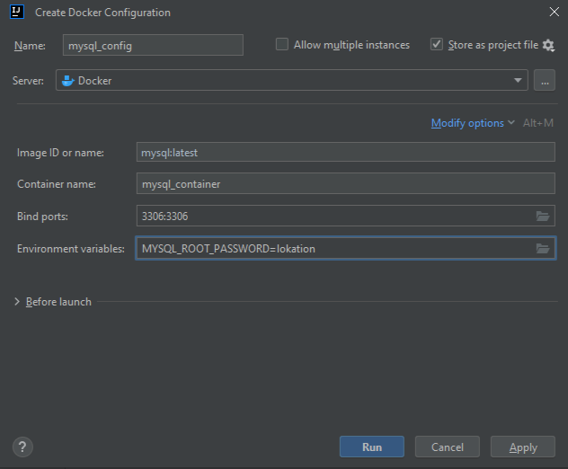

> [НАЗАД к СОДЕРЖАНИЮ](README.md)

---

`JDBC` (Java Database Connectivity) API — это программный интерфейс, предоставляющий набор классов и
методов для взаимодействия с базами данных из языка программирования Java. JDBC обеспечивает
стандартизированный способ подключения к различным системам управления базами данных (СУБД),
выполнения SQL-запросов, получения и обновления данных в базе. Он предоставляет абстракцию,
позволяющую разработчикам писать приложения, которые могут взаимодействовать с базами данных,
независимо от конкретной используемой СУБД. JDBC используется для создания портативных и
эффективных приложений, работающих с данными в базах данных. //

`JDBC` - крч это драйвер для конкретной СУБД (драйвер пишется самими разработчиками СУБД) c классами и методами для подключения и выполнения запросов к БД.

`Jakarta Persistence API` (`JPA`; ранее Java Persistence Arhitecture) — спецификация API Jakarta EE, которая описывает, как взаимодействовать с БД на уровне объектов. Она позволяет использовать БД как хранилище объектов, минуя SQL-запросы.   

`ORM` - object-relation-mapping - отношение объекта к БД крч. Механизм преобразования данных между java-объектом и таблицей в БД. Является стандартом JPA. То, как мы соотносим поля объекта к столбцам в БД с помощью аннотаций. Hibernate относится к ORM и соответствует стандартам JPA.


###  Чтобы подключиться к БД в контейнере:

1. поднять БД в `контейнере`
docker run --name mysql_container -e MYSQL_ROOT_PASSWORD=lokation -p 3306:3306  -d mysql  
docker run --name postgres_container -e POSTGRES_PASSWORD=root -p 5432:5432 -d postgres (username по умолчанию = postgres)  

либо создать в самой IDE (должно быть подключено расширение, после чего настройка -> будет доступно в сервисах):


2. добавить зависимость драйвера СУБД в `pom`
3. Создать класс с конфигом подключения к БД с помощью `JDBC`. В т.ч. пароль = "lokation". `Конфигурация` докер-контейнера будет сложена в xml-файл

```java
    private static final String URL = "jdbc:mysql://localhost:3306";
    private static final String USER = "root";
    private static final String PASSWORD = "lokation";

    public static void connection() {
        //для подключения к БД
        try (Connection connection = DriverManager.getConnection(URL, USER, PASSWORD)) {
            //SQL - запрос
            try (Statement statement = connection.createStatement()){
                    statement.execute("CREATE DATABASE container_database");
            };

        } catch (SQLException e) {
            throw new RuntimeException(e);
        }
    }
```

Для соединения с БД - интерфейс `DataSource`, который можно получить из контекста  

```java
DataSource dataSource = context.getBean(DataSource.class);

try (Connection connection = dataSouce.getConnection()){
    Statement statement = connection.createStatement();
}
```


```java
//Запрос с возвращением множества (коллекции объектов)
            ResultSet res = statement.executeQuery("select * from test;");
            //.next() - возвращает boolean, о том, что удалось прочетать очередную запись из таблицы
            while (res.next()){
                System.out.println("id: " + res.getInt(1) + //для возвращения интовых значений из таблицы (номер столбца)
                //можно еще res.getInt("id") - по наименованию столбца
                        " name: " + res.getString(3) + " " + //для стринговых значений
                        " second name: " + res.getString(2));
            }
```

* Чтобы выполнить `заранее подготовленный запрос`:  
```java
        Connection conncetion = DriverManager.getConnection();
        String someStatement = "CREATE DATABASE ....";

        try (PreparedStatement preparedStatement = conncetion.prepareStatement(someStatement)){
            preparedStatement.execute();
        }
```
        
Класс `PreparedStatement` - для выполнения подготовленных запросов
**Методы**:  
На примере: PreparedStatement statement = connection.preparedStatement
("INSERT INTO students (name, age) VALUES (?,?);");
- statement.setString(1, student.getName()) //задание параметру первого индекса типа VARCHAR
- statement.setInt //...
- statement.execute() - просто выполнить
- statement.executeUpdate() - для запросов типа INSERT, UPDATE and DELETE //возвращает количество измененных записей после выполнения запроса
- statement.executeQuery() - для возвращения объекта типа ResultSet (коллекции)

---

`Spring Data JDBC`  

