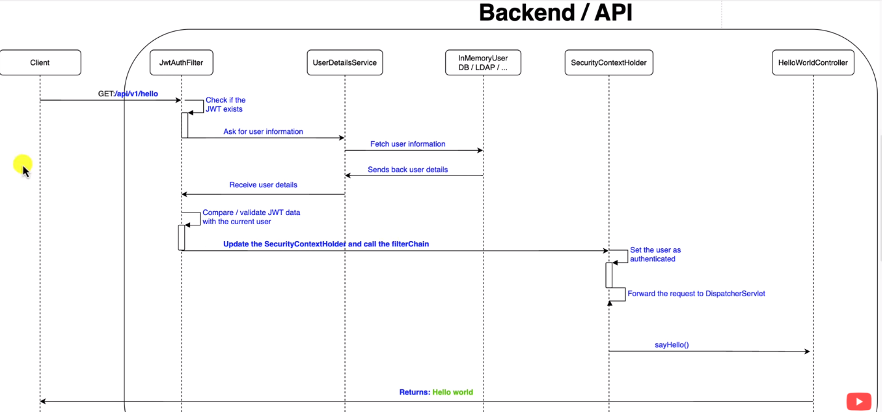
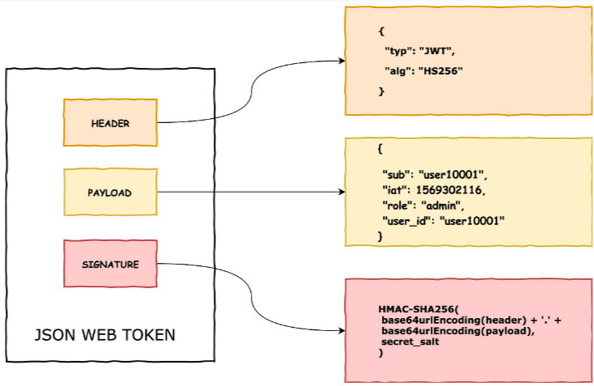

## JWT

`JWT` (**JSON WEB TOKEN**) - это стандарт, который определяет способ безопасной передачи информации между двумя
сторонами в виде JSON-объекта. Он зашит в Spring Security. Кроме самого факта аутентификации, в него можно зашить id пользователя и его метаданные. 

> учим: https://struchkov.dev/blog/ru/what-is-jwt/

`JWT`
 https://www.youtube.com/watch?v=EjrlN_OQVDQ 
 https://www.youtube.com/watch?v=mUq9MGe5vZA 
 https://www.youtube.com/watch?v=oeni_9g7too

> [Работающий конфиг JWT-аутентификации в+ Spring Security](https://github.com/timofeev-vadim-96/jwt-auth.git)

[Пример от OTUS](https://github.com/OtusTeam/Spring/blob/master/2024-05/spring-23-SS-auth/jwt/src/main/java/ru/otus/security/jwt/controller/TokenController.java) - для приложения, генерирующего токены самостоятельно

`зависимость` - для генерации jwt-токенов  
```xml
		<dependency>
			<groupId>io.jsonwebtoken</groupId>
			<artifactId>jjwt-api</artifactId>
			<version>0.12.5</version>
		</dependency>
		<dependency>
			<groupId>io.jsonwebtoken</groupId>
			<artifactId>jjwt-impl</artifactId>
			<version>0.12.5</version>
			<scope>runtime</scope>
		</dependency>
		<dependency>
			<groupId>io.jsonwebtoken</groupId>
			<artifactId>jjwt-jackson</artifactId>
			<version>0.12.5</version>
			<scope>runtime</scope>
		</dependency>
```

`Алгоритм работы с JWT-токенами`:    
  
  * на рисунке случай, когда JWT уже есть в теле запроса  

В Spring Security JWT обычно используется вместе с OAuth 2.0 для аутентификации и авторизации:
1. Пользователь аутентифицируется с помощью своих учетных данных.
2. После успешной аутентификации сервер создает JWT, который содержит уникальные данные
пользователя, и отправляет его обратно пользователю.
3. Пользователь сохраняет этот JWT и отправляет его в заголовке Authorization с каждым последующим запросом.
4. Сервер проверяет JWT в каждом запросе, чтобы аутентифицировать пользователя и определить его права доступа. 

JWT `состоит` из трех основных частей: 
* заголовка (header) - хранит тип токена и алгоритм шифрования
* нагрузки (payload) - данные пользователя, разрешения и тд (может быть всё что угодно)
* подписи (signature) - обеспечивает целостность данных, путём проверки, что токен не был изменён после создания


[Сайт для генерации секретных серверных ключей](https://randomkeygen.com/)

[Генерация JWT Secret](https://jwtsecret.com/generate)

---