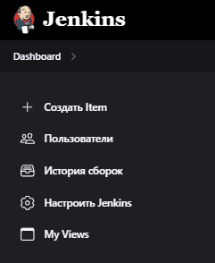
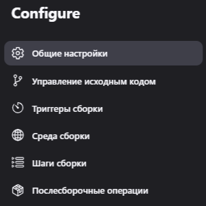

## Jenkins

`CI` - это конвейер для сборки, тестирования, деплоя на сервер и отправки сообщений разработчикам о результатах процесса CI

`Процесс`
1. Check in code (GitHub, SVN, BitBucket)
2. Build code
3. Run Unit Tests
4. Deploy to test server
5. Run end to end tests (Selenium)
6. Deploy to production or Rallback

`Преимущества:`
1. весь процесс быстрее (автоматизирован)
2. безопасность - программа проходит полный процесс установки и тестирования (от юнит до E2E тестов)
3. дешевле - люди не тратят свое время на повторяющиеся задачи
4. визуализация - все результаты остаются в системе, строятся графики и схемы
5. кроссплатформенность - CI-системы поддерживают любые языки программирования и любые ОС

`Jenkins`
- open-source инструмент
- написан на Java
- большое комьюнити
- мульти-платформенная система (Windows, Linux, MacOS...) 
- мульти-язычный
- множество доп. плагинов (некоторые из них сложны)
- легкий в использовании

---

`Начало работы с Jenkins`:
1. запуск Jenkins контейнера: 
```bash
docker run -p 8080:8080 -p 50000:50000 -d -v jenkins_home:/var/jenkins_home jenkins/jenkins:lts
```
  * 50000 - второй порт
2. 
**логин** дефолтный: admin  
**пароль** при входе (дефолтный): 
```bash
docker logs id_контейнера
```
либо по пути, указанном при создании контейнера, например: /var/jenkins_home/secrets/initialAdminPassword  
  * docker exec -it id_конт bash - войти в контейнер

3. выбрать install suggested plugins - установить рекомендуемые плагины
4. создаем профиль админа
5. далее - url дженкинса не менять

---

`Интерфейс Jenkins`:  

* Dashboard - начальный экран
* New item - для создания нового проекта
* People - инфа о пользователях
* Build hystory - история билдов, статистика
* Manage jenkins - настройки всей системы Jenkins
* My views - все проекты, которые мы мониторим
* Locable resources (практически не используется) - плагин Jenkins, с помощью которого мы можем типа syncronize один из ресурсво (например, принтер)

---

`Создание нового проекта: ` 
1. New item 
2. Выбрать один из типов проектов:  
  * Freestyle project - `дефолтный` вариант, свой конфиг
  * Pipeline - все настройки и конфиг в `скрипте`, находящемся на удаленной машине
  * Multi-configuration project - для прогонки сборок проектов с разной конфигурацией на разных системах и платформах
  * Folder - для сосредоточения нескольких проектов в одном месте
  * GitHub Organization - что-то для работы с гитом
3. Общие настройки:  


`Шаги сборки` (Build) -> добавить из списка -> apply -> save
    * Выполнить команду shell (для Linux) - если контейнер
    * Выполнить команду Windows

Конфиг проекта: 
 - выбрать "это параметризованная сборка" -> тип параметра... В дальнейшем, обращаться к параметру через "$"

`Типы параметров` в параметризованной сборке:
* String - строка
* Choice - несколько значений с новой строки

`Настроить Jenkins`  
* Tools - системы сборки (Maven)
* JDK

`Плагины`  
* Available - для установки новых, пример: **openjdk**
* restart [] после установки
* Tools -> JDK -> установить автоматически -> выбрать openJdk и версию Java

[РАБОТА СО СВОИМ ПРОЕКТОМ](https://www.blazemeter.com/blog/how-to-integrate-your-github-repository-to-your-jenkins-project)   
1. берем ссылку на прокт в git (**.git)
2. общие настройки -> управление исходным кодом -> git (сюда ссылку)


