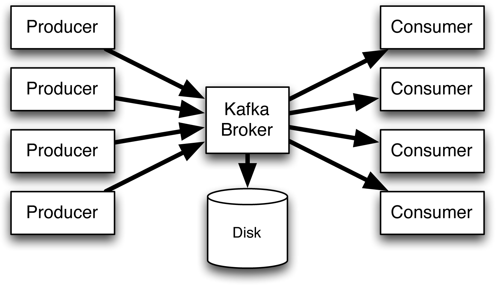

### Apache Kafka

> Афроамериканец (туториал от amigos): https://www.youtube.com/watch?v=SqVfCyfCJqw

> Быстрый старт: https://kafka.apache.org/quickstart

> это Publish - Subscribe система, используется как блокер сообщений между микросервисами, а также для отслеживания событий, таких как клики на сайте, а также для сбора статистики

`Apache Kafka` - распределенное, отказоустойчивое, горизонтально масштабируемое хранилище, основной структурой данных в котором является append-only лог, которое поддерживает потоковую обработку данных и имеет развитую экосистему коннекторов для интеграции с базами данных и другими хранилищами.

`Распределенное хранилище` - это система, которая как правило работает на нескольких машинах, каждая из этих машин в свою очередь является кусочком хранилища. Для пользователя это все представляется в виде единого целого.

`Горизонтальное масштабирование` - техника, в которой мы вместо увеличения мощностей одной машины, добавляем в систему дополнительные машины и тем самым увеличиваем доступные ресурсы.
  * `Вертикальное масштабирование` - противоположная ситуация, когда мы прокачиваем единственную машину, улучшая ее технические составляющие (доп. планки памяти и т.д.)

`Отказоустойчивость` - это свойство системы, позволяющее ей не иметь единую точку отказа. То есть если какая-то машина вышла из строя, то система продолжит работать.

`Лог` - это упорядоченная по времени append-only структура данных

`Принцип действия Kafka`:

Kafka действует как посредник (**Broker**), передавая данные, поступающие в систему (от производителей **Producer**) и исходящие из системы (к потребителям или конечным пользователям **Consumer**)  

`Свойства` Kafka:
* распределенность
* отказоустойчивость
* высокая доступность
* надежность и согласованность данных
* высокая производительность (пропускная способность)
* горизонтальное масштабирование
* интегрируемость

Три `способа доставки сообщений` Kafka:  
* не менее одного раза (at-least-once) – сообщение будет отправляется потребителям до тех пор, пока те не подтвердят его получение;
* не более одного раза (at-most-once) – сообщение отправляется
только один раз и в случае сбоя не отправляется повторно;
* точно один раз (exactly-once) – потребите

`Topic/Тема` - набор событий, которые реплецируются или разделяются на разделы. **Продолжительность жизни темы** - часы, дни, годы или вечно.

`Установка kafka:`  
1. https://www.apache.org/dyn/closer.cgi?path=/kafka/3.7.0/kafka_2.13-3.7.0.tgz
2. Разархивируем в Program Files или др. место
3. cd "C:\Program Files\kafka_2.13-3.7.0"
4. bin/zookeeper-server-start.sh config/zookeeper.properties - выполнить команду
5. новая оболочка -> bin/kafka-server-start.sh config/server.properties

`DOCKER`: 
```bash
docker run -p 9092:9092 apache/kafka:3.7.0
```
  * войти внутрь контейнера: docker exec -it id_конт bash 
  * корневая папка kafka находится в ~/opt/kafka

`Docker-compose`
```yml
  zookeeper:
    image: confluentinc/cp-zookeeper:latest
    environment:
      ZOOKEEPER_CLIENT_PORT: 2181 #порт, который ZooKeeper будет использовать для связи с клиентами.
      ZOOKEEPER_TICK_TIME: 2000 #(миллисекунды) интервал времени, через который ZooKeeper синхронизирует
      #состояние с другими узлами в кластере.
    ports:
      - 2181:2181

  kafka:
    image: confluentinc/cp-kafka:latest
    depends_on:
      - zookeeper #не будет запущен, пока ZooKeeper не будет запущен.
    ports:
      - 29092:29092
    hostname: kafka
    environment:
      KAFKA_BROKER_ID: 1
      KAFKA_ZOOKEEPER_CONNECT: zookeeper:2181 #подключение к ZooKeeper.
      KAFKA_ADVERTISED_LISTENERS: PLAINTEXT://kafka:29092 # устанавливает слушателей, которые будут рекламироваться
      #другим брокерам в кластере.
      KAFKA_LISTENER_SECURITY_PROTOCOL_MAP: PLAINTEXT:PLAINTEXT #Сопоставляет протокол безопасности "PLAINTEXT" со схемой "PLAINTEXT"
      KAFKA_INTER_BROKER_LISTENER_NAME: PLAINTEXT #устанавливает имя слушателя, который будет использоваться для межброкерской связи
      KAFKA_OFFSETS_TOPIC_REPLICATION_FACTOR: 2 #устанавливает коэффициент репликации для темы смещений

  kafka2:
    image: confluentinc/cp-kafka:latest
    depends_on:
      - zookeeper
    ports:
      - 29093:29092
    hostname: kafka2
    environment:
      KAFKA_BROKER_ID: 2
      KAFKA_ZOOKEEPER_CONNECT: zookeeper:2181
      KAFKA_ADVERTISED_LISTENERS: PLAINTEXT://kafka2:29093
      KAFKA_LISTENER_SECURITY_PROTOCOL_MAP: PLAINTEXT:PLAINTEXT
      KAFKA_INTER_BROKER_LISTENER_NAME: PLAINTEXT
      KAFKA_OFFSETS_TOPIC_REPLICATION_FACTOR: 2

  kafka-ui:
    image: provectuslabs/kafka-ui
    container_name: kafka-ui
    ports:
      - 8090:8080
    restart: always
    environment:
      - KAFKA_CLUSTERS_0_NAME=local #устанавливает имя кластера Kafka в "local"
      - KAFKA_CLUSTERS_0_BOOTSTRAPSERVERS=kafka:29092,kafka2:29093 #Устанавливает список адресов загрузки для кластера Kafka
      - KAFKA_CLUSTERS_0_ZOOKEEPER=zookeeper:2181
    links:
      - kafka
      - kafka2
      - zookeeper
```


`Проект под Kafka:`
1. Spring Web
2. Apache Kafka
3. Lombok

application.yml под Kafka
```yml
spring:
  kafka:
    bootstrap-servers: localhost:9092
```

`KafkaTemplate` - в Spring используется для отправки сообщений в брокер Kafka. 

Основные `возможности KafkaTemplate`:

 * Публикация сообщений: Отправка сообщений в определенные темы Kafka.  
 * Получение сообщений: Получение сообщений из определенных тем Kafka.
 * Подтверждение отправки: Управление подтверждениями отправки сообщений и обработка повторных попыток в случае сбоев.
 * Сериализация/десериализация: Автоматическая сериализация и десериализация сообщений с использованием настраиваемых сериализаторов и десериализаторов.
 * Управление разделами: Создание, удаление и управление разделами темы Kafka.
 * Конфигурация: Настройка различных параметров, таких как стратегия повторных попыток, размер буфера и параметры безопасности.

методы send() и receive() для отправки и получения сообщений соответственно.

Пример `отправки сообщения`:  
```java
//my-topic - тема
public void sendMessage(String message) {
    kafkaTemplate.send("my-topic", message);
}
```

Пример `получения сообщения`:
```java
@KafkaListener(topics = "my-topic")
public void receiveMessage(ConsumerRecord<String, String> record) {
    System.out.println("Received message: " + record.value());
}
```

`проверка наличия ивента` ИЗНУТРИ ДОКЕРА!!! (проверять из папки корня kafka):
```bash
# bash
bin/kafka-console-consumer.sh --topic testTopic --from-beginning --bootstrap-server localhost:9092
```
  * quickstart-events - топик


