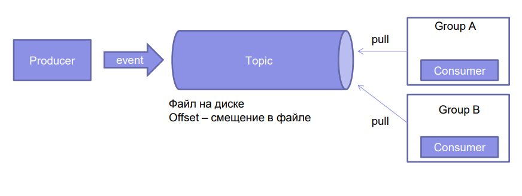
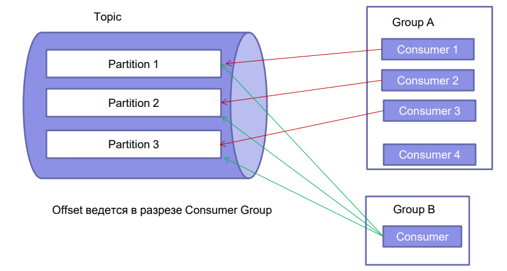
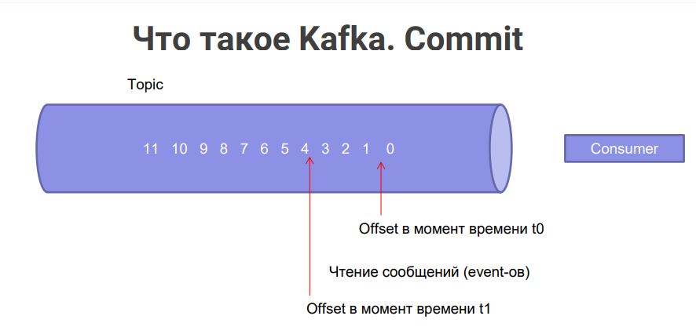

### Apache Kafka

> Афроамериканец (туториал от amigos): https://www.youtube.com/watch?v=SqVfCyfCJqw

> Быстрый старт: https://kafka.apache.org/quickstart

[ПРИМЕР OTUS](https://github.com/OtusTeam/Spring/tree/master/2024-05/spring-37-kafka)
  * на лекции практика примерно с 61:10

Очереди:
- RabbitMq
- Kafka
- JMS (IBM MQ) - самый немодный, но самый надежный

Для чего нужны очереди:
- распределение задач (между отдельными машинами консюмеров)
- коммуникация между приложениями
- сглаживание пика нагрузки (во время пика нагрузки консюмеры могут не успевать обрабатывать сообщения, и обработают из во время спада)

> это Publish - Subscribe система, используется как блокер сообщений между микросервисами, а также для отслеживания событий, таких как клики на сайте, а также для сбора статистики

`Apache Kafka` - распределенное, отказоустойчивое, горизонтально масштабируемое хранилище, основной структурой данных в котором является append-only лог, которое поддерживает потоковую обработку данных и имеет развитую экосистему коннекторов для интеграции с базами данных и другими хранилищами.

`Распределенное хранилище` - это система, которая как правило работает на нескольких машинах, каждая из этих машин в свою очередь является кусочком хранилища. Для пользователя это все представляется в виде единого целого.

`Горизонтальное масштабирование` - техника, в которой мы вместо увеличения мощностей одной машины, добавляем в систему дополнительные машины и тем самым увеличиваем доступные ресурсы.
  * `Вертикальное масштабирование` - противоположная ситуация, когда мы прокачиваем единственную машину, улучшая ее технические составляющие (доп. планки памяти и т.д.)

`Отказоустойчивость` - это свойство системы, позволяющее ей не иметь единую точку отказа. То есть если какая-то машина вышла из строя, то система продолжит работать.

`Лог` - это упорядоченная по времени append-only структура данных

`Принцип действия Kafka`:

Kafka действует как посредник (**Broker**), передавая данные, поступающие в систему (от производителей **Producer**) и исходящие из системы (к потребителям или конечным пользователям **Consumer**)  

`Свойства` Kafka:
* распределенность
* отказоустойчивость
* высокая доступность
* надежность и согласованность данных
* высокая производительность (пропускная способность)
* горизонтальное масштабирование
* интегрируемость

`Особенности` Kafka:
- Реплицированный шардированный лог сообщений. Реплики бывают: leader и followers. Если лидер отвалится, один из фолловеров становится лидером. Есть два режима сохранения сообщений: 1. сообщение рассылается между копиями без проверки (быстрый), и 2 - с подтверждением сохранения (надежный).
- Возможность проиграть сообщения еще раз (потому что они не удаляются, а сохраняются в файлы в рамках партиции)
- Строгая упорядоченность FIFO (в рамках партиции)
- Ограничение на кол-во потребителей. Одну партицию может читать только один консюмеров, или несколько, если все они из разных групп.
- Интеграция с экосистемой Apache

`Topic/Тема` - набор событий, которые реплецируются или разделяются на разделы. **Продолжительность жизни темы** - часы, дни, годы или вечно.

`Устройство Kafka`

  * группы в кафке - по смыслу потребителей. Например, обработка заказа (бэкэнд), или дата-science, или смс-увдоемители 

`Партицирование`

  * файл с сообщениями в топике делится на несколько файлов (партиции). Партиции, зачастую, раскидываются по разным хостам. Партиции могут реплецировать/шардироваться. 
  * 1 партицию может читать 1 консюмер или несколько партиций = 1 консюмер. НО 1 партиция могут читать несколько консюмеров только ЕСЛИ ОНИ ИЗ РАЗНЫХ ГРУПП.

`Offset`

Offset перемещается по команде commit (по таймеру или «руками»)

Три `способа доставки сообщений/семантика доставки` Kafka:  
* не менее одного раза (at-least-once) – сообщение будет отправляется потребителям до тех пор, пока те не подтвердят его получение. Может задвоиться;
* не более одного раза (at-most-once) – сообщение отправляется
только один раз и в случае сбоя не отправляется повторно;
* точно один раз (exactly-once) – и не потеряется, и не задвоится. (в Kafka из коробки нет. Нужно использовать РАСПРЕДЕЛЕННЫЕ ТРАНЗАКЦИИ)

Как реализуются распределенные транзакции?  
- за счет стороннего сервиса, наблюдающего за выполнением элементов распределенной транзакции. Обычно - Postres с таблицами.

Как управлять транзакциями между разными источниками данных
Для того чтобы управлять распределёнными транзакциями, вам нужно настроить JTA и использовать подходящий транзакционный менеджер, который поддерживает работу с несколькими источниками данных. Примером такого менеджера является BitronixTransactionManager или Atomikos.

Пример настройки распределённых транзакций с JTA:
Подключение нескольких источников данных (например, две базы данных):

Для каждой базы данных создаётся отдельный DataSource.
JTA-транзакции требуют, чтобы DataSource был XA-aware (использовал XA-протокол).

На что обращать внимание?  
- Множество параметров по умолчанию
- Возможность повторной обработки сообщений
- Зарание подумать про кол-во читателей
- Не полагаться на длительное хранение (админы это должны сами знать). По дефолту = 7 дней
Особое внимание на:
- параметры commit
- первоначальное значение offset

`Установка kafka:`  
1. https://www.apache.org/dyn/closer.cgi?path=/kafka/3.7.0/kafka_2.13-3.7.0.tgz
2. Разархивируем в Program Files или др. место
3. cd "C:\Program Files\kafka_2.13-3.7.0"
4. bin/zookeeper-server-start.sh config/zookeeper.properties - выполнить команду
5. новая оболочка -> bin/kafka-server-start.sh config/server.properties

`DOCKER`: 
```bash
docker run -p 9092:9092 apache/kafka:3.7.0
```
  * войти внутрь контейнера: docker exec -it id_конт bash 
  * корневая папка kafka находится в ~/opt/kafka

`Docker-compose`
```yml
  zookeeper:
    image: confluentinc/cp-zookeeper:latest
    environment:
      ZOOKEEPER_CLIENT_PORT: 2181 #порт, который ZooKeeper будет использовать для связи с клиентами.
      ZOOKEEPER_TICK_TIME: 2000 #(миллисекунды) интервал времени, через который ZooKeeper синхронизирует
      #состояние с другими узлами в кластере.
    ports:
      - 2181:2181

  kafka:
    image: confluentinc/cp-kafka:latest
    depends_on:
      - zookeeper #не будет запущен, пока ZooKeeper не будет запущен.
    ports:
      - 29092:29092
    hostname: kafka
    environment:
      KAFKA_BROKER_ID: 1
      KAFKA_ZOOKEEPER_CONNECT: zookeeper:2181 #подключение к ZooKeeper.
      KAFKA_ADVERTISED_LISTENERS: PLAINTEXT://kafka:29092 # устанавливает слушателей, которые будут рекламироваться
      #другим брокерам в кластере.
      KAFKA_LISTENER_SECURITY_PROTOCOL_MAP: PLAINTEXT:PLAINTEXT #Сопоставляет протокол безопасности "PLAINTEXT" со схемой "PLAINTEXT"
      KAFKA_INTER_BROKER_LISTENER_NAME: PLAINTEXT #устанавливает имя слушателя, который будет использоваться для межброкерской связи
      KAFKA_OFFSETS_TOPIC_REPLICATION_FACTOR: 2 #устанавливает коэффициент репликации для темы смещений

  kafka2:
    image: confluentinc/cp-kafka:latest
    depends_on:
      - zookeeper
    ports:
      - 29093:29092
    hostname: kafka2
    environment:
      KAFKA_BROKER_ID: 2
      KAFKA_ZOOKEEPER_CONNECT: zookeeper:2181
      KAFKA_ADVERTISED_LISTENERS: PLAINTEXT://kafka2:29093
      KAFKA_LISTENER_SECURITY_PROTOCOL_MAP: PLAINTEXT:PLAINTEXT
      KAFKA_INTER_BROKER_LISTENER_NAME: PLAINTEXT
      KAFKA_OFFSETS_TOPIC_REPLICATION_FACTOR: 2

  kafka-ui:
    image: provectuslabs/kafka-ui
    container_name: kafka-ui
    ports:
      - 8090:8080
    restart: always
    environment:
      - KAFKA_CLUSTERS_0_NAME=local #устанавливает имя кластера Kafka в "local"
      - KAFKA_CLUSTERS_0_BOOTSTRAPSERVERS=kafka:29092,kafka2:29093 #Устанавливает список адресов загрузки для кластера Kafka
      - KAFKA_CLUSTERS_0_ZOOKEEPER=zookeeper:2181
    links:
      - kafka
      - kafka2
      - zookeeper
```


`Проект под Kafka:`
1. Spring Web
2. Apache Kafka
3. Lombok

application.yml под Kafka
```yml
## ГНИВЦ
spring:
  kafka:
    bootstrap-servers: localhost:9092
```

application.yml под Kafka №2 (Producer)
```yml
application:
  kafka:
    topic: "demo-topic"

spring:
  kafka:
    producer:
      bootstrap-servers: "127.0.0.1:9092"
      client-id: "demo-producer"
```

application.yml под Kafka (Consumer)
```yml
application:
  kafka:
    topic: "demo-topic"


spring:
  kafka:
    consumer:
      group-id: "test-group" #здесь подразумевается, что консюмер читает партицию в рамках этой группы.
      bootstrap-servers: "localhost:9092"
      client-id: "demo-consumer"
      auto-offset-reset: earliest
```


`KafkaTemplate` - в Spring используется для отправки сообщений в брокер Kafka. 

Основные `возможности KafkaTemplate`:

 * Публикация сообщений: Отправка сообщений в определенные темы Kafka.  
 * Получение сообщений: Получение сообщений из определенных тем Kafka.
 * Подтверждение отправки: Управление подтверждениями отправки сообщений и обработка повторных попыток в случае сбоев.
 * Сериализация/десериализация: Автоматическая сериализация и десериализация сообщений с использованием настраиваемых сериализаторов и десериализаторов.
 * Управление разделами: Создание, удаление и управление разделами темы Kafka.
 * Конфигурация: Настройка различных параметров, таких как стратегия повторных попыток, размер буфера и параметры безопасности.

методы send() и receive() для отправки и получения сообщений соответственно.

Пример `отправки сообщения`:  
```java
//my-topic - тема
public void sendMessage(String message) {
    kafkaTemplate.send("my-topic", message);
}
```

Пример `получения сообщения`:
```java
@KafkaListener(topics = "my-topic")
public void receiveMessage(ConsumerRecord<String, String> record) {
    System.out.println("Received message: " + record.value());
}
```

`проверка наличия ивента` ИЗНУТРИ ДОКЕРА!!! (проверять из папки корня kafka):
```bash
# bash
bin/kafka-console-consumer.sh --topic testTopic --from-beginning --bootstrap-server localhost:9092
```
  * quickstart-events - топик


`Upset в Kafka.` Т.к. все сообщения в кафке сохраняются, то когда мы их читаем - двигается upset - например, 3/10 сообщений прочитаны, и т.д.

## CONSUMER

> !!! ЧТОБЫ приложение консюмера не падало при запуске при работающем продюсере, задавать параметры чтения (см. пример OTUS): 

В @Configuration классе
```java
    @Bean
    public ConsumerFactory<String, StringValue> consumerFactory(
            KafkaProperties kafkaProperties, ObjectMapper mapper) {
        var props = kafkaProperties.buildConsumerProperties();
        props.put(ConsumerConfig.KEY_DESERIALIZER_CLASS_CONFIG, StringDeserializer.class);
        props.put(ConsumerConfig.VALUE_DESERIALIZER_CLASS_CONFIG, JsonDeserializer.class);
        props.put(TYPE_MAPPINGS, "ru.demo.model.StringValue:ru.demo.model.StringValue");
        props.put(ConsumerConfig.MAX_POLL_RECORDS_CONFIG, 3); //чтение MAX по 3 сообщения из топика
        props.put(ConsumerConfig.MAX_POLL_INTERVAL_MS_CONFIG, 3_000);//макс интервал обращений за сообщениями к кафке. (Для самой кафки). Если больше, значит этот консюмер мертв, и нужно партицию отдать на чтение свободному консюмеру.

        var kafkaConsumerFactory = new DefaultKafkaConsumerFactory<String, StringValue>(props);
        kafkaConsumerFactory.setValueDeserializer(new JsonDeserializer<>(mapper));
        return kafkaConsumerFactory;
    }
```

> Важно настроить ConsumerFactory, иначе мы не сможем тянуть более, чем по 1 сообщению за раз!

```java
    @Bean("listenerContainerFactory")
    public KafkaListenerContainerFactory<ConcurrentMessageListenerContainer<String, StringValue>>
            listenerContainerFactory(ConsumerFactory<String, StringValue> consumerFactory) {
        var factory = new ConcurrentKafkaListenerContainerFactory<String, StringValue>();
        factory.setConsumerFactory(consumerFactory);
        factory.setBatchListener(true); //чтобы можно было тянуть более 1 сообщения за раз
        factory.setConcurrency(1); //если консюмер будет читать более 1 партиции, то значение можно увеличить на количество партиций
        factory.getContainerProperties().setIdleBetweenPolls(1_000); //сложно. промежуток времени между коннектом и реасайлентом
        factory.getContainerProperties().setPollTimeout(1_000); //(Ждун 1 сек) интервал, в течении которого консюмер после обращения к Кафке будет ждать прихода новых сообщений, если их небыло на момент обращения. 

        var executor = new SimpleAsyncTaskExecutor("k-consumer-");
        executor.setConcurrencyLimit(10); //Даже препод в ступоре. Это сколько в экзекьютере максимум может быть потоков. 
        var listenerTaskExecutor = new ConcurrentTaskExecutor(executor);
        factory.getContainerProperties().setListenerTaskExecutor(listenerTaskExecutor);
        return factory;
    }
```

## Reactive Kafka

[Пример OTUS](https://github.com/OtusTeam/Spring/tree/master/2024-05/spring-41-kafka-webflux)

Пример отправки-чтения сообщений в реактивной кафке:
```java
private final Sinks.Many<ConsumerRecords<K, V>> sink =
Sinks.many().unicast().onBackpressureBuffer();

//пишем
package reactor.kafka.receiver.internals;
class ConsumerEventLoop<K, V> implements Sinks.EmitFailureHandler {
...
 public void run() {
 ...
 records = consumer.poll(pollTimeout);
 ...
 sink.emitNext(records, ConsumerEventLoop.this);
...
}
...
}

//читаем
package reactor.kafka.receiver.internals;
class ConsumerHandler<K, V> {
...
 public Flux<ConsumerRecords<K, V>> receive() {
 return sink.asFlux().doOnRequest(consumerEventLoop::onRequest);
 }
...
} 
```