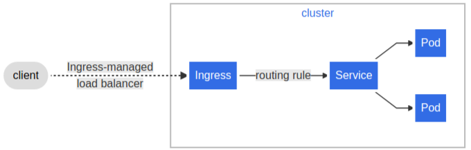
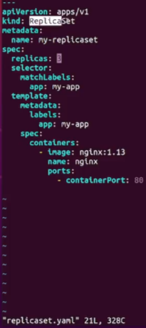

# Kubernetes

> [установка](https://minikube.sigs.k8s.io/docs/start/?arch=%2Fwindows%2Fx86-64%2Fstable%2F.exe+download)

Платформа для создания кластера Kubernetes - [SelectL](https://selectel.ru/)

- оркестратор контейнеров (на разных физических серверах)
- docker-compose на стероидах
- может работать на нескольких хостах

`Что умеет Kubernetes`  

* встроеннные load balancers (для распределения запросов на `стороне сервера`)
* встроенный server discovery (для получения ip-адресов от распределенной серверной части, и их последующего использования в принятии решения на какой сервер отправить запрос с `клиентской стороны`)
* автоматическое прокидывание волюмов (внешних директорий для сохранения данных из контейнеров)
* автоматический деплой и роллбэк версии приложения
* распределение контейнеров по нодам (требуется, когда контейнеры разные по потреблению CPU и памяти)
* автоматический перезапуск при health=DOWN
* хранение секретов и мапы с конфигами

`Требования к приложению на Кубере:`  
* У приложения больше нет хоста, т.к. постоянного диска (можно сделать, но это не поведение по умолчанию).
Отсюда следует:
  - Неоткуда читать с диска конфиги
  - Некуда писать на диск логи
* Приложение должно относительно быстро
стартовать и останавливаться.
* Приложение должно быть готово «отключиться в любой момент»
(stateless). Stateless - значит, что сессии при работе с БД должны быть максимально короткие, их нужно закрывать сразу после выполнения необходимых операций транзакций.
* Мониторинг становится обязательным.

`Основные части Kubernetes`:  
1. POD (контейнер) - основная единица работы
2. ReplicaSet (типа Collectoin<контейнер>) - коллекция контейнеров, следит за копиями pod-ов
3. Deployment - описывает конфигурацию приложения
4. Service - для балансировки нагрузки между подами внутри кластера. В отдельном файле
5. Ingress - для доступа к кластеру подов снаружи. Выполняет функцию роутера/gateway. В отдельном файле

Отображение Ingress, Service


[Пример манифеста Deployment от OTUS](https://github.com/petrelevich/rest-service/blob/main/kube/deployment.yaml)

Пример манифеста `Deployment`. При этом, манифест ReplicaSet уже не нужен
```yml
---
apiVersion: apps/v1
kind: Deployment
metadata:
  name: rest-hello-deployment
spec:
# кол-во реплик
  replicas: 10
  selector:
    matchLabels:
      app: rest-hello
# стратегия деплоя
  strategy:
    rollingUpdate:
      maxSurge: 2 #при накатке обновлений, количество реплик max = 10+2 (replicas + maxSurge)
      maxUnavailable: 3 #при накатке обновлений, max количество недоступных реплик = 10-3 (replicas - maxUnavailable)
    type: RollingUpdate
  template:
    metadata:
      labels:
        app: rest-hello
    spec:
      containers:
      # образ для контейнеров
        - image: registry.gitlab.com/petrelevich/dockerregistry/rest-hello:2.0.2-1.2d40be46.dirty-SNAPSHOT
          name: rest-hello
          ports:
            - containerPort: 8080
          envFrom:
    #задание XMS/XMX - начальный и макс. размер кучи JVM. В отдельном файле
            - configMapRef:
                name: rest-service-config
          resources:
    #выделение памяти приложению. На ноде скорее всего будет 2ГБ - остаток сожрет сам кубер
            requests:
              memory: "256M"
            limits:
              memory: "256M"
    #на этом эндпоинте в случае неудачи, кубер не перезапускает, а ожидает
          readinessProbe:
            failureThreshold: 3
            httpGet:
              path: /actuator/health/readiness
              port: 8090
            periodSeconds: 10
            successThreshold: 1
            timeoutSeconds: 1
    #эндпоинт проверки жизни приложения
          livenessProbe:
    #сколько раз должны получить статус DOWN, чтобы его перезапустить
            failureThreshold: 3
            httpGet:
              path: /actuator/health/liveness
              port: 8090
    #частота опроса
            periodSeconds: 10
    #сколько раз приложение должно ответить UP, чтобы кубер считал что оно живо
            successThreshold: 1
            timeoutSeconds: 1
    #сколько дать времени на старт приложению перед пробой
            initialDelaySeconds: 10
    # секрет для авторизации на github, где лежит образ для контейнеров
      imagePullSecrets:
        - name: regcred
```
  * эндпоинт /actuator/health/readiness нужно реализовать самостоятельно, в зависимости от логики приложения

Включить эндпоинт `liveness` для Deployment кубера:  
```yml
management:
    endpoints:
        enabled-by-default: false
    endpoint:
        health:
            enabled: true
            probes: true
```

`XMS/XMX конфиг` - размер кучи JVM при старте приложения (для Deployment-конфига)
```yml
---
apiVersion: v1
kind: ConfigMap
metadata:
  name: rest-service-config
data:
#80% от выделенной memory будет использовано для кучи в JVM
  JAVA_TOOL_OPTIONS: -XX:InitialRAMPercentage=80 -XX:MaxRAMPercentage=80
```

`Service-конфиг` пример
```yml
---
apiVersion: v1
kind: Service
metadata:
  name: rest-hello
spec:
  ports:
    - port: 80
    #редирект на
      targetPort: 8080
  selector:
    app: rest-hello
  type: ClusterIP
```

`Ingres-конфиг` - для роутинга, гейтвея
```yml
---
apiVersion: networking.k8s.io/v1
kind: Ingress
metadata:
  name: rest-hello
  annotations:
    nginx.ingress.kubernetes.io/use-regex: "true"
#значит, что после первого префикса - все остается. было /appl/book, стало /book
    nginx.ingress.kubernetes.io/rewrite-target: /$2
spec:
#фактическим исполнителем маршуритазии является nginx
  ingressClassName: nginx
  rules:
    - http:
        paths:
#здесь происходит роутинг. /appl откидывается как префикс
          - path: /appl(/|$)(.*)
            pathType: Prefix
            backend:
              service:
                name: rest-hello
                port:
                  number: 80
```


Пример манифеста `ReplicaSet` (коллекция контейнеров). При этом, манифест pod-a уже не нужен  

  * spec.replicas - количество реплик приложения. кубер будет следить, чтобы их было именно 3


Пример манифеста `Pod` (контейнер)


`Команды` (выполнять внутри миникуба или другого дистрибутива Kubernetes)
* kubectl get pod - список контейнеров
  * kubectl get pods -o wide --watch - список подов в динамическом отображении (например, во время деплоя в прод)
* kubectl apply -f pod.yml - создать контейнер на основе pod.yml
* kubectl delete pod my-pod - удалить контейнер "my-pod"
* kubectl get rs - показать все replicaSet-ы
* kubectl get secret - перечень сгенерированных секретов
* kubectl get node - показать ноды
* kubectl get ingress - показать все настроенные маршрутизаторы/балансировщики (типа nginx)
* kubectl describe pod some_pod_uuid - инфа о поде
* kubectl delete pod <имя пода> - удалить под
* kubectl logs some_pod_uuid -f - посмотреть логи пода. -f - логи прокручиваются
* kubectl scale replicaset rest-hello --replicas=3 - изменить налету количество реплик приолжения. replicaset - если создавали через репликасет, может быть и deployment
* kubectl get endpoints - для дебага сетевых траблов
* kubectl run -t -i --rm --image amouat/network-utils test bash
(запустить специальный диагностический pod ЕСЛИ ЕСТЬ ПРАВА)

[Скачать образ из приватного github-репозитория](https://kubernetes.io/docs/tasks/configure-pod-container/pull-image-private-registry/)

Из статьи: сделать секрет для входа кубера в приватный репозиторий
```bash
kubectl create secret generic regcred \
    --from-file=.dockerconfigjson=<path/to/.docker/config.json> \
    --type=kubernetes.io/dockerconfigjson
```