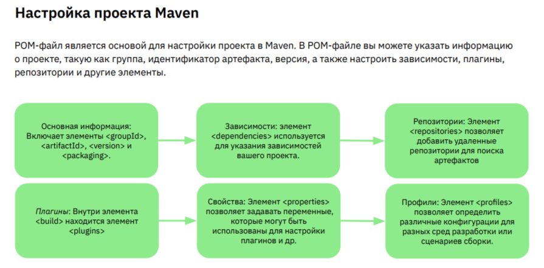
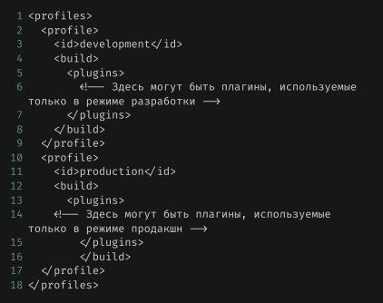
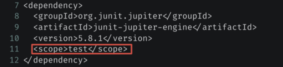

> [НАЗАД к СОДЕРЖАНИЮ](README.md)

---

У ВК и Яндекс свои собственные сборщики проектов. 

## Maven - для легаси проектов

`Maven` - это инструмент для автоматической сборки проектов на основе описания их структуры в специальных файлах на языке POM (Project Object Model)

```xml
    <!--after_properties-->
    
    <!--AssertJ-->

        <dependency>
            <groupId>org.assertj</groupId>
            <artifactId>assertj-core</artifactId>
            <version>3.24.2</version>
            <scope>test</scope>
        </dependency>


    <!--GSON-->
        <dependency>
            <groupId>com.google.code.gson</groupId>
            <artifactId>gson</artifactId>
            <version>2.10.1</version>
            <scope>compile</scope>
        </dependency>
    

    <!--JUnit-->
  
        <dependency>
            <groupId>org.junit.jupiter</groupId>
            <artifactId>junit-jupiter-api</artifactId>
            <version>5.10.0</version>
            <scope>test</scope>
        </dependency>
        <dependency>
            <groupId>org.junit.platform</groupId>
            <artifactId>junit-platform-commons</artifactId>
            <version>1.9.2</version>
        </dependency>
        <dependency>
            <groupId>org.junit.jupiter</groupId>
            <artifactId>junit-jupiter-params</artifactId>
            <version>5.9.1</version>
            <scope>test</scope>
        </dependency>

    </dependencies>

    <!--Для корректной сборк в jar-->
        <build>
        <plugins>
            <plugin>
                <groupId>org.apache.maven.plugins</groupId>
                <artifactId>maven-jar-plugin</artifactId>
                <version>3.2.0</version>
                <configuration>
                    <archive>
                        <manifest>
                            <mainClass>org.mainClass.Main</mainClass>
                        </manifest>
                    </archive>
                </configuration>
            </plugin>
        </plugins>
    </build></project>


<!--MOCKITO-->
    <!-- https://mvnrepository.com/artifact/org.mockito/mockito-core -->
<dependency>
    <groupId>org.mockito</groupId>
    <artifactId>mockito-core</artifactId>
    <version>4.11.0</version>
    <scope>test</scope>
</dependency>
<!--MOCKITO АННОТАЦИИ-->
<dependency>
    <groupId>org.mockito</groupId>
     <artifactId>mockito-junit-jupiter</artifactId>
     <version>3.5.10</version>
     <scope>test</scope>
 </dependency>


<!--Testcontainers-->
<!-- https://mvnrepository.com/artifact/org.testcontainers/testcontainers -->
<dependency>
    <groupId>org.testcontainers</groupId>
    <artifactId>testcontainers</artifactId>
    <version>1.17.6</version>
    <scope>test</scope>
</dependency>

<!--HIBERNATE-->
<!-- https://mvnrepository.com/artifact/org.hibernate/hibernate-core -->
<dependency>
    <groupId>org.hibernate</groupId>
    <artifactId>hibernate-core</artifactId>
    <version>5.6.15.Final</version>
</dependency>

<!---MySQL-->
<!-- https://mvnrepository.com/artifact/mysql/mysql-connector-java -->
<dependency>
    <groupId>mysql</groupId>
    <artifactId>mysql-connector-java</artifactId>
    <version>8.0.28</version>
</dependency>

<!-- LOMBOK-->
<!-- https://mvnrepository.com/artifact/org.projectlombok/lombok -->
<dependency>
    <groupId>org.projectlombok</groupId>
    <artifactId>lombok</artifactId>
    <version>1.18.24</version>
    <scope>provided</scope>
</dependency>

<!--JAXB для работы с XML-форматом-->
<!-- https://mvnrepository.com/artifact/javax.xml.bind/jaxb-api -->
<dependency>
    <groupId>javax.xml.bind</groupId>
    <artifactId>jaxb-api</artifactId>
    <version>2.3.1</version>
</dependency>
<dependency>
    <groupId>org.glassfish.jaxb</groupId>
    <artifactId>jaxb-runtime</artifactId>
    <version>2.3.3</version>
</dependency>

<!--SELENIUM_FOR_E2E_TESTS-->
<!-- https://mvnrepository.com/artifact/org.seleniumhq.selenium/selenium-java -->
<dependency>
    <groupId>org.seleniumhq.selenium</groupId>
    <artifactId>selenium-java</artifactId>
    <version>4.8.3</version>
</dependency>

<!--SPRING-->
        <dependency>
            <groupId>org.springframework</groupId>
            <artifactId>spring-core</artifactId>
            <version>6.1.2</version>
        </dependency>
        <dependency>
            <groupId>org.springframework</groupId>
            <artifactId>spring-beans</artifactId>
            <version>6.1.2</version>
        </dependency>
        <dependency>
            <groupId>org.springframework</groupId>
            <artifactId>spring-context</artifactId>
            <version>6.1.2</version>
        </dependency>
        <dependency>
        <!--SPRING (Для работы с MVC-приложениями)-->
            <groupId>org.springframework</groupId>
            <artifactId>spring-web</artifactId>
            <version>6.1.2</version>
        </dependency>
        <dependency>
            <groupId>org.springframework</groupId>
            <artifactId>spring-webmvc</artifactId>
            <version>6.1.2</version>
        </dependency>

<!--Themeleaf Spring6 шаблонизатор. ВАЖНО!! Версия такая же, как и SPRING!-->
        <dependency>
            <groupId>org.thymeleaf</groupId>
            <artifactId>thymeleaf-spring6</artifactId>
            <version>3.1.2.RELEASE</version>
        </dependency>

<!--Jakarta Servlet (старая Javax)-->
<!--Использует класс AbstractAnnotationConfigDispatcherServletInitializer, для замены web.xml-->
    <dependency>
      <groupId>jakarta.servlet</groupId>
      <artifactId>jakarta.servlet-api</artifactId>
      <version>6.0.0</version>
      <scope>provided</scope>
    </dependency>

<!--Hibernate validator-->
<dependency>
    <groupId>org.hibernate.validator</groupId>
    <artifactId>hibernate-validator</artifactId>
    <version>8.0.0.Final</version>
</dependency>

<!-- quartz-scheduler/quartz -->
<dependency>
    <groupId>org.quartz-scheduler</groupId>
    <artifactId>quartz</artifactId>
    <version>2.3.2</version>
</dependency>

<!--плагн для тестирования ВСЕГО ПРОЕКТА-->
        <dependency>
            <groupId>org.apache.maven.plugins</groupId>
            <artifactId>maven-surefire-plugin</artifactId>
            <version>3.0.0-M5</version>
        </dependency>
    <build>
        <plugins>
            <plugin>
                <groupId>org.apache.maven.plugins</groupId>
                <artifactId>maven-surefire-plugin</artifactId>
                <version>3.0.0-M5</version>
                <dependencies>
                    <dependency>
                        <groupId>org.junit.jupiter</groupId>
                        <artifactId>junit-jupiter-engine</artifactId>
                        <version>5.7.0</version>
                    </dependency>
                </dependencies>
            </plugin>
        </plugins>
    </build>

```

`groupId, artifactId и version (GAV)` - индентификаторы проекта    
* groupId - наименование организации или подразделения, туда записывают доменное имя организации или сайта проекта.
Например: com.google
* artifactId — название проекта.
Например: apache
* version - версия. Пример: 1.0

```xml
<properties></properties> - настройки проекта
<build></build> - параметры сборки проекта
```

Подуровень "build":
```xml
* <resources></resources> - доп.ресурсы. Например, свои доп. каталоги или файлы (например, файл с длинным SQL-запросом) (структура папок должна соответствовать проекту) org/example (именно через слэш, чтобы создалось две папки) и ниже (если есть).
* <finalName>имя, которое будет у проекта (структура папок), игнорируя GAV</finalName> //ХЗ, или в build, или ниже в плагине сборки проекта, под GAV
```

**Доп.инфа**  
`Компиллятор java` (тот, который по дефолту указан в "properties"), это плагин maven. Все эти настройки проекта можно также пересобрать в блоке "build".  
Вот так:  
```xml
    <build>
        <plugins>
            <plugin>
                <groupId>org.apache.maven.plugins</groupId>
                <artifactId>maven-compiler-plugin</artifactId>
                <version>3.8.1</version>
                <configuration>
                    <source>20</source>
                    <target>20</target>
                </configuration>
            </plugin>
        </plugins>
    </build>
```

Еще один плагин. "`maven assembly`" - для упаковывания всех ресурсов(и зависимостей) вместе с проектом в jar-файл. `Походу, обязательная история при использовании внешних библиотек`

```xml  
     <build>
        <plugins>
            <plugin>
                <groupId>org.apache.maven.plugins</groupId>
                <artifactId>maven-assembly-plugin</artifactId>
                <version>3.3.0</version>
                <configuration>
                    <archive>
                        <manifest>
                            <mainClass>red.dragon.Main</mainClass> <!--точка входа в программу-->
                        </manifest>
                    </archive>
                    <descriptorRefs>
                    <!--настройка, позволяющая упаковывать все зависимости в архив-->
                        <descriptorRef>jar-with-dependencies</descriptorRef>
                    </descriptorRefs>
                    <!--ПРОСТО ДЛЯ ПРИМЕРА: ФИНАЛЬНОЕ ИМЯ JAR СЮДА:-->
                    <finalName>HelloApp</finalName>
                </configuration>
                <executions>
                    <execution>
                        <id>make-assembly</id> <!--plugin_id-->
                        <phase>package</phase> <!--фаза сборки, когда будет испльзоваться-->
                        <goals>
                            <goal>single</goal><!--утилита плагина, которая будет запущена в данной фазе-->
                        </goals>
                    </execution>
                </executions>
            </plugin>
        </plugins>
    </build>
```

`Жизненный цикл Maven - описывает жизненный цикл разработки ПО`
* default - основной. Отвечает за сборку, тестирование, пакетирование и развертывание проекта
* clean - чистит проект от target и out (ранее скомпиллированные классы)
* validate - проверяет структуру и отсуствтие некорректных зависимостей (например, циклические зависимости, когда есть две зависимости, зависящие друг от друга). Maven ожидает, что все зависимости выстроятся в древовидную структуру, а не созависимую.
* compile - откомпиллит классы в target
* test - выполнение всех юнит-тестов в проекте
* package - создание jar
* verify - проверка, что пакет соответствует критериям проекта
* install - собранный артефакт сохраняется в локальный репозиторий на диске. В дальнейшем, можно будет либо испльзовать программу в других проектах, либо залить на maven repo
  * путь к локальному репо по умолчанию: «C:\Users\${UserName}\.m2\repository», где UserName это имя вашей учетной записи
* site - генерация документации
* deploy - заливка приложения на удаленный сервер и его запуск

`как добавить переменную в pom.xml: ` 
```xml
<spring.version>6.1.2</spring.version>
```
и в нужное место - ${}

---

С курса по спрингу:  

`Плагины` — это расширения Maven, предоставляющие дополнительные функции и возможности для
управления **процессом сборки** вашего проекта. Плагины состоят из одной или нескольких задач (goals),
которые могут быть вызваны в различных фазах жизненного цикла сборки.
Размещаются в   
```xml
<build><plugins><plugin>here</plugin></plugins></build>
```


`Репозитории` — это централизованные хранилища артефактов, таких как библиотеки и плагины. В Maven
существует три типа репозиториев: локальный, центральный, удаленный.
В случае с банком - это всегда локальный репозиторий (типа Nexus)   
Пример:
```xml
    <repositories>
        <repository>
            <id>example-repo</id>
            <url>https://example.com/repo</url>
        </repository>
    </repositories>
```

**Настройка проекта Maven**



**profiles** - настройка запуска приложения на разных средах



**УСТАНОВКА MAVEN:**   
https://maven.apache.org/install.html (распаковать и добавить в PATH папку bin)

`Команды mvn:`  
```bash
mvn archetype:generate -DgroupID=ru.geekbrains -DafrifactId="myProject" -DarchetypeArtifactId=maven-archetype-quickstart -DinteractiveMode=false #DarchetypeArtifactId - шаблон проекта, DinteractiveMode=false - создание папок с дефолтными именами  
mvn archetype:generate #создание проекта в интерактивном режиме  
mvn package # - сборка  
mvn package -P development # подключить профиль   development  
``` 

> плагин для проверки чистоты кода - checkstyle plugin

Для исключения зависимости из сборки - `scope`




`Создание собственного плагина: `  /sping_GB  
```xml 
<packing>maven-plugin</packing>  
А также, добавить зависимость maven-plugin-api
Создать класс, наследующий от AbstractMojo
```

`Версия проекта` 1.0.0 - мажор/минор/патч  

Для исключения отдельных компонентов зависимости
```xml
<exclusions></exclusions>
```

Для исключения данной библиотеки
```xml
<optional>true</optional>
```

> Подбор версий зависимостей автоматически и сбор проекта - используя https://start.spring.io/
