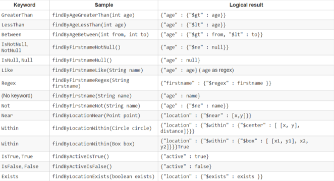

### MongoDb

> Все хранится в JSON

GUI для MongoDb - MongoDb Compass. Но можно и в Idea (даже лучше)

> docker run --name mongo-otus -d mongo:latest

ИЛИ полноценная:  

> docker run -d -p 27017:27017 --name some-mongo -e MONGO_INITDB_ROOT_USERNAME=mongoadmin -e MONGO_INITDB_ROOT_PASSWORD=bdung mongo:latest

default port: 27017

> [курсы по Mongo](https://learn.mongodb.com/catalog): basics, for java dev, aggregation, spring

`Плюсы:`  
1. Масштабируемая
2. Высокопроизводительная
3. Интерфейс на JS (!)
4. Простая в пользовании
5. Эффективно работает с большими данными
6. Хранит документы (документооренитрованная)
7. Никаких JOIN-ов

`Аналогия с RGB` (реляционные бд)  
RGB - MongoDB  
• Database = Database  
• Table = Collection  
• Row = Document  
• Column = Field  
• Join = Embedding & Linking + Lookup  
• Foreign Key = Reference (ссылка на другой документ)  

`Document (MongoDB)` – Row (SQL)  
• Document - документ  
• По сути дела – просто JSON  
• Хранится в формате BSON  
• Есть _id – аналог primary key (может сама создавать) 
• Поддерживает отношения с другим документами –
по ссылке или embedded  

`Collection (MongoDB)` – Table (SQL)  
• Collection – коллекция  
• Состоит из документов  

`Database (MongoDB)` – Database (SQL)  
• Database – база данных  
• Состоит из коллекций  
• Коллекция сама создаётся, если к ней обращаются 

Типы данных в MongoDB:  
* Geo-Coordinates [45.123,47.232]
* String
* Number
* massives
* вложенные json-документы

> В монге есть возможность орагизовывать связи между документами, но лучше ВСТРАИВАТЬ. И ничего страшного, что информация дублируется

Рекомендации для `организации связей` в MongoDB:    
* Внедряйте, если:  
  * доминирует чтение, а не запись  
  * повторяемость данных не проблема  
  * изменения на одной из сторон происходят чаще     
* Ссылайтесь, если:
  * много связанных сущностей
  * измения часто случаются в обеих сущностях
* Используйте смешанный подход для лучшей
производительности

`Зависимости`  
```xml
<dependency>
    <groupId>org.springframework.boot</groupId>
    <artifactId>spring-boot-starter-data-mongodb</artifactId>
    <version>3.3.2</version>
</dependency>
        <dependency>
            <groupId>com.github.cloudyrock.mongock</groupId>
            <artifactId>mongock-spring-v5</artifactId>
            <version>${mongock.version}</version>
        </dependency>

        <dependency>
            <groupId>com.github.cloudyrock.mongock</groupId>
            <artifactId>mongodb-springdata-v3-driver</artifactId>
            <version>${mongock.version}</version>
        </dependency>

<!--Встроенная монга = H2 для Реляционных-->
        <dependency>
            <groupId>de.flapdoodle.embed</groupId>
            <artifactId>de.flapdoodle.embed.mongo</artifactId>
            <version>${flapdoodle.version}</version>
            <scope>test</scope>
        </dependency>
        <dependency>
            <groupId>de.flapdoodle.embed</groupId>
            <artifactId>de.flapdoodle.embed.mongo.spring30x</artifactId>
            <version>${flapdoodle.version}</version>
        </dependency>
```

`Query (MongoDb` и аналог на MySQL)  
  
 * gt - greater that
 * _id выдаст даже без явного указания
 * 1 - boolean true

Еще пример `поиска`:  
```js
// поиск по тегу (если есть одно из значений)
db.books.find({
    "tags": {
        $in:['earlang', 'haskell']
    }
})
```

Пример `вставки`  
```js
db.products.insertOne({
     _id: 10, item: "box", qty: 20
})
```

Найти по id:  
```js
db.books.find({
    _id: 10
})
```

Найти все:  
```js
db.books.find({})
```

Вставить несколько записей:   
```js
db.products.insertMany([
    { _id: 11, item: "box", qty: 10 }
    { _id: 12, item: "cox", qty: 20 }
    { _id: 13, item: "fox", qty: 30 }
]
)
```

Сортировки + limit  
```js
db.products.find().sort({ item: 1 }).limit(5)
```

Агрегация (фильтрация + группировка)  
```js
//поле cust_id переименовывается в _id
//группировка по _id
//проссумировать по полю amount с именем total
db.orders.aggregate( [
    { $match: { status: A } },
    { $group: { _id: "$cust_id", total: { $sum: "$amount" } } }
]

)
```

Агрегация2 (поиск сущности по id + получения списка связных сущностей (знания у учителя), а именно двух его полей)
```java
    private final MongoTemplate mongoTemplate;

    @Override
    public List<Knowledge> getTeacherExperienceById(String teacherId) {
        val aggregation = newAggregation(
            //фильтрация по id
                match(Criteria.where("id").is(teacherId))
                //был учитель и список знаний. размножаем учителя по каждому знанию в списке
                , unwind("experience")
                //убираем все поля с помощью project, остается id (по дефолту). andExclude убирает id. И после добавляем уже нужные поля в иговоую выборку
                , project().andExclude("_id").and("experience.id").as("_id")
                        .and("experience.name").as("name")
        );
        return mongoTemplate.aggregate(aggregation, Teacher.class, Knowledge.class).getMappedResults();
    }
```


Конфиг MongoDb-spring
```yml
spring:
  data:  
    mongodb:
      authentication-database: admin #юзать, когда задан пользователь и пароль
      username: root
      password: root
      database: user_db
      port: 27017 #если по умолчанию, можно не указывать
      host: localhost
```

Аннотации MongoDB. [ссылка-тык](https://www.baeldung.com/spring-data-mongodb-index-annotations-converter)   
* @Document(collection = "someCollection") = @Entity
* @Field = @Column
* @Id
* @DBRef - ссылка на другой документ
* @Transient - не отражать поле

`@EnableMongoRepositories` - над основным классом

`Репозиторий`  
```java
public interface UserRepo extends MongoRepository<User, String> {}
```

Словарь MongoDB  
  

`@Query` кастомная, как в JPA
```java
//поиск по имени с выводом двух полей
@Query(value = "{'firstname' : :#{#firstname}}", fields="{ 'firstName' : 1, 'lastName' : 1}")
List<Person> findByPersonFirstName (@Param("firstname") String firstName);
```

`MongoTemplate`  
```java
Query query = new Query();
query.addCriteria(Criteria.where("name").is("Alex"));
Update update = new Update();
update.set("name", "James");
mongoTemplate.updateFirst(query, update, User.class);
```

---

## Mongock

> [примеры в git](https://github.com/mongock/mongock-examples)

Миграция для MongoDb - это `Mongock`

`Зависимости`  
```xml
        <dependency>
            <groupId>com.github.cloudyrock.mongock</groupId>
            <artifactId>mongock-spring-v5</artifactId>
            <version>${mongock.version}</version>
        </dependency>

        <dependency>
            <groupId>com.github.cloudyrock.mongock</groupId>
            <artifactId>mongodb-springdata-v3-driver</artifactId>
            <version>${mongock.version}</version>
        </dependency>
```

```java
@EnableMongock
@Configuration
public class MongockConfig{}
```

`Конфиг для Mongock`  
```yml
mongock:
  runner-type: "ApplicationRunner" # default - исп. для тестов если со Spring Shell
  #runner-type: "InitializationBean" #для работы совместно с Spring Shell

  #откуда брать changelog-и - это папка с java-классом! 
  change-logs-scan-package: 
    - ru.otus.spring.mongock.changelog
```

Пример `changelog-а для Mongock`:  
```java
import com.github.cloudyrock.mongock.ChangeLog;
import com.github.cloudyrock.mongock.ChangeSet;
import com.mongodb.client.MongoCollection;
import com.mongodb.client.MongoDatabase;
import org.bson.Document;
import ru.otus.spring.domain.Person;
import ru.otus.spring.repostory.PersonRepository;

@ChangeLog
public class DatabaseChangelog {

    @ChangeSet(order = "001", id = "dropDb", author = "stvort", runAlways = true)
    public void dropDb(MongoDatabase db) {
        db.drop();
    }

    @ChangeSet(order = "002", id = "insertLermontov", author = "ydvorzhetskiy")
    public void insertLermontov(MongoDatabase db) {
        MongoCollection<Document> myCollection = db.getCollection("persons");
        var doc = new Document().append("name", "Lermontov");
        myCollection.insertOne(doc);
    }

    @ChangeSet(order = "003", id = "insertPushkin", author = "stvort")
    public void insertPushkin(PersonRepository repository) {
        repository.save(new Person("Pushkin"));
    }
}
```

Организация удаления связных сущностей в MongoDB как в реляционных БД

Пример 1
```java
public class UserCascadeSaveMongoEventListener
 extends AbstractMongoEventListener<Object> {
 @Autowired
 private MongoOperations mongoOperations;

 //если ивент типа User, то достаем из юзера почту, и сохраняем ее отдельно
 @Override
 public void onBeforeConvert(BeforeConvertEvent<Object> event) {
 Object source = event.getSource();
 if ((source instanceOf User) && ((User) source).getEmailAddress() != null)) {
 mongoOperations.save(((User) source).getEmailAddress());
 }
 }
}
```

Пример 2
```java
@Component
@RequiredArgsConstructor
public class MongoKnowledgeCascadeDeleteEventsListener extends AbstractMongoEventListener<Knowledge> {

    private final StudentRepository studentRepository;

    @Override
    public void onAfterDelete(AfterDeleteEvent<Knowledge> event) {
        super.onAfterDelete(event);
        val source = event.getSource();
        val id = source.get("_id").toString();
        studentRepository.removeExperienceArrayElementsById(id);
    }
}
```

Тесты  
`@DataMongoTest` - над тестируемым классом

`Дропнуть` базу данных
```java
db.dropDatabase()
```

`Подключиться к БД из Idea`
- подключаться не к конкретной БД, а в целом к монге

`Показать базы данных`  
```
show dbs;
```