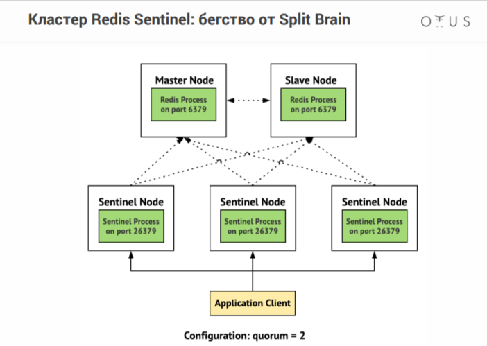
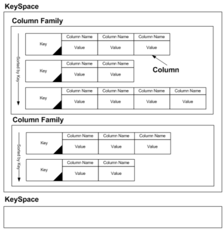
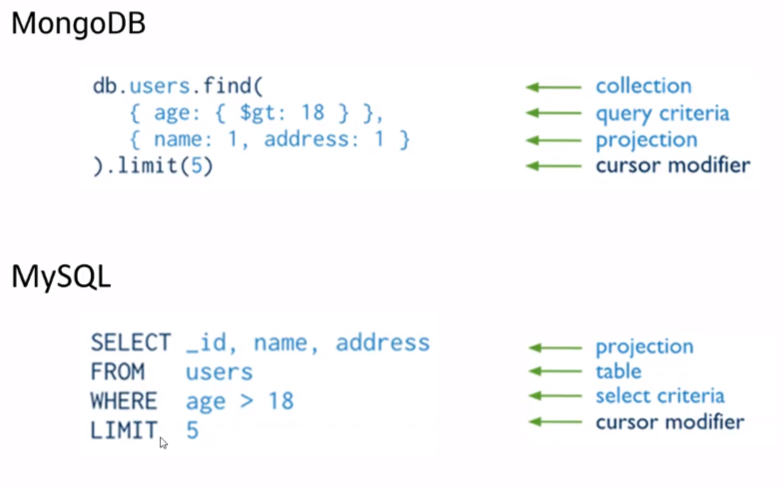
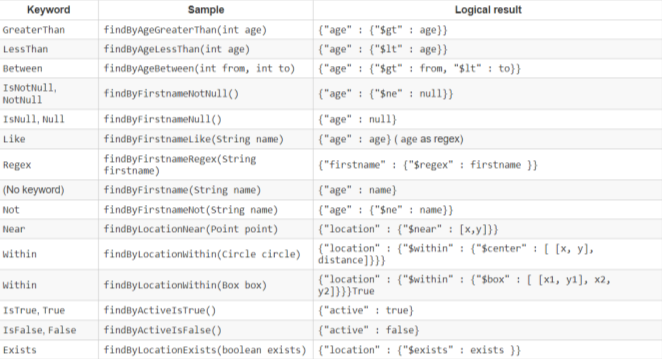
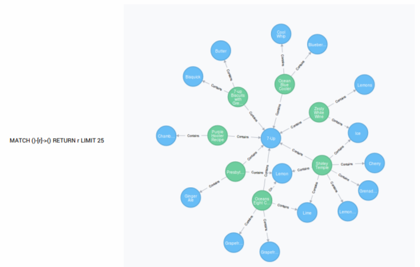
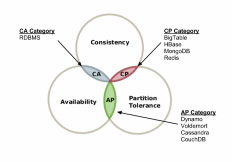

## NoSQL БД

Mongo, Cassandra, Redis

Нереляционные базы данных  
`Плюсы:`  
- могут в горизонтальное масштабирование

`BigData` - это когда не важен приоритет информации, сохраняем все подряд  

`Типы` No-SQL Database:  
1. Key-Value. По сути - словарь
2. Column-Family (колончатые)
3. Graph (граф-ориентированные)
4. Document (документо-ориентированные)

---

### Key-Value  (Redis)

Самый простой пример - HashMap. Ключ-массив байтов. В БД типа ключ-значение можно настроить время жизни пары ключ-значение 

Когда применяются:  
* хранилище сессий и профилей пользователей
* хранение количества пользователей онлайн, кодов патч, различных флагов
* СУБД для небольших приложений - сокращалок ссылок, имиджбордов, возможно даже блогов
* роль "словаря" в шардинге, то есть сервер, который знает какие шарды на каких серверах находятся (при горизонтальном масштабировании)
* хранилище для промежуточных результатов вычислений при обработке больших объемов данных
* кэши, индексы и т.д.

---

### `Redis` (key-value type) расшифровка: remote dictionary server

> [redis.io](https://redis.io/docs/latest/commands) - команды для работы с сервером Redis

`Статьи` про редис:  
[ч1](https://otus.ru/nest/post/715/)  
[ч2](https://otus.ru/nest/post/716/)  
[ч3](https://otus.ru/nest/post/723/)  
[Redis + Spring](https://habr.com/ru/companies/otus/articles/463365/)

Преимущества Redis:  
* очень быстрый
* возможность постоянного хранения на диске с асинхронной синхронизацией
* expire (время жизни) для ключей
* кластеризация и репликация (для горизонтального расширения)
* поддержка публикаций и подписок
* поддержка транзакций

`Value` in Redis - что может быть:  
* строки (до 512 МБ!)  
* списки (lists)
* хэши (hashes)
* множества (sets)
* упорядоченные множества (sorted sets)

Кластер узлов Redis
 
  * Sentinel Node - принимают запросы, осуществляют load balance, а также проверяют **кто master**  
  * quorum - должно быть значение больше половины количества sintinel node, чтобы правильно определить кто master

`Ситуации`:  
  * если отватилтся master, то slave станет master
  * если отватился slave, то мастер будет работать сам
  * если пропадет связь между master и slave, то slave станет master, и после восстановления связи произойдет конфликт версий БД (`разделенный мозг`/Split Brain). **Решение**: откатить БД до момента, когда связь была цела
  * если quorum меньше или равен половине количества sentinel node (когда мнение о том, кто мастер реазделилось), то из системы можно только читать, но возможность записи в БД блокируется

---

### Column-Family столбчатые/колончатые (Cassandra)

Пример: классный журнал с оценками учеников  

  
  * KeySpace - класс
  * Column Family - предмет (история)
  * Key - фамилия ученика
  * Column Name - дата проведения занятия
  * Value - оценка

---

### Cassandra

Пример Column-Family Db - `Cassandra`

`Статьи про Cassandra`   
[про Cassandra](https://habr.com/ru/companies/qiwi/articles/486800/)  
[про super column в Cassandra](https://habr.com/ru/articles/100075/)

* Cassandra создавалась для хранения временных данных
* чувствительна к времени (это ключевое понятие)  

Где применяется:  
* хранение (долговременное) больших наборов данных
* и там, где реально требуется масштабирование
* когда чаще пишется, значительно реже читается
* где данные не нужно обновлять

---

### Документо-ориентированные (MongoDb, ElasticSearch)

Часто применяется для интернет-страниц  

* хранят доки в виде json-ов (и не только?) любой структуры (например, характеристики яблок с утюгами)
* если их версии могут отличаться
* документы могут содержать ссылки на другие документы
* они могут редактироваться и запросы могут делаться по полям (которые могут отсутствовать)

---

### MongoDb

> Все хранится в JSON

GUI для MongoDb - MongoDb Compass. Но можно и в Idea (даже лучше)

> docker run --name mongo-otus -d mongo:latest

default port: 27017

> [курсы по Mongo](https://learn.mongodb.com/catalog): basics, for java dev, aggregation, spring

`Плюсы:`  
1. Масштабируемая
2. Высокопроизводительная
3. Интерфейс на JS (!)
4. Простая в пользовании
5. Эффективно работает с большими данными
6. Хранит документы (документооренитрованная)
7. Никаких JOIN-ов

`Аналогия с RGB` (реляционные бд)  
RGB - MongoDB  
• Database = Database  
• Table = Collection  
• Row = Document  
• Column = Field  
• Join = Embedding & Linking + Lookup  
• Foreign Key = Reference (ссылка на другой документ)  

`Document (MongoDB)` – Row (SQL)  
• Document - документ  
• По сути дела – просто JSON  
• Хранится в формате BSON  
• Есть _id – аналог primary key (может сама создавать) 
• Поддерживает отношения с другим документами –
по ссылке или embedded  

`Collection (MongoDB)` – Table (SQL)  
• Collection – коллекция  
• Состоит из документов  

`Database (MongoDB)` – Database (SQL)  
• Database – база данных  
• Состоит из коллекций  
• Коллекция сама создаётся, если к ней обращаются 

Типы данных в MongoDB:  
* Geo-Coordinates [45.123,47.232]
* String
* Number
* massives
* вложенные json-документы

> В монге есть возможность орагизовывать связи между документами, но лучше ВСТРАИВАТЬ. И ничего страшного, что информация дублируется

Рекомендации для `организации связей` в MongoDB:    
* Внедряйте, если:  
  * доминирует чтение, а не запись  
  * повторяемость данных не проблема  
  * изменения на одной из сторон происходят чаще     
* Ссылайтесь, если:
  * много связанных сущностей
  * измения часто случаются в обеих сущностях
* Используйте смешанный подход для лучшей
производительности

`Зависимости`  
```xml
<dependency>
    <groupId>org.springframework.boot</groupId>
    <artifactId>spring-boot-starter-data-mongodb</artifactId>
    <version>3.3.2</version>
</dependency>

<!--Встроенная монга-->
<dependency>
 <groupId>de.flapdoodle.embed</groupId>
 <artifactId>de.flapdoodle.embed.mongo</artifactId>
 <scope>test</scope>
</dependency>
```

`Query (MongoDb` и аналог на MySQL)  
  
 * gt - greater that
 * _id выдаст даже без явного указания
 * 1 - boolean true

Еще пример `поиска`:  
```js
// поиск по тегу (если есть одно из значений)
db.books.find({
    "tags": {
        $in:['earlang', 'haskell']
    }
})
```

Пример `вставки`  
```js
db.products.insertOne({
     _id: 10, item: "box", qty: 20
})
```

Найти по id:  
```js
db.books.find({
    _id: 10
})
```

Найти все:  
```js
db.books.find({})
```

Вставить несколько записей:   
```js
db.products.insertMany([
    { _id: 11, item: "box", qty: 10 }
    { _id: 12, item: "cox", qty: 20 }
    { _id: 13, item: "fox", qty: 30 }
]
)
```

Сортировки + limit  
```js
db.products.find().sort({ item: 1 }).limit(5)
```

Агрегация (фильтрация + группировка)  
```js
//поле cust_id переименовывается в _id
//группировка по _id
//проссумировать по полю amount с именем total
db.orders.aggregate( [
    { $match: { status: A } },
    { $group: { _id: "$cust_id", total: { $sum: "$amount" } } }
]

)
```

Конфиг MongoDb-spring
```yml
spring:
  data:  
    mongodb:
      authentication-database: admin #можно не уазывать
      username: root
      password: root
      database: user_db
      port: 27017 #если по умолчанию, можно не указывать
      host: localhost
```

Аннотации MongoDB. [ссылка-тык](https://www.baeldung.com/spring-data-mongodb-index-annotations-converter)   
* @Document(collection = "someCollection") = @Entity
* @Field = @Column
* @Id
* @DBRef - ссылка на другой документ
* @Transient - не отражать поле

`@EnableMongoRepositories` - над основным классом

`Репозиторий`  
```java
public interface UserRepo extends MongoRepository<User, String> {}
```

Словарь MongoDB  
  

`@Query` кастомная, как в JPA
```java
//поиск по имени с выводом двух полей
@Query(value = "{'firstname' : :#{#firstname}}", fields="{ 'firstName' : 1, 'lastName' : 1}")
List<Person> findByPersonFirstName (@Param("firstname") String firstName);
```

`MongoTemplate`  
```java
Query query = new Query();
query.addCriteria(Criteria.where("name").is("Alex"));
Update update = new Update();
update.set("name", "James");
mongoTemplate.updateFirst(query, update, User.class);
```


---

### Граф-ориентированные (Neo4j)

Особенность таких БД - рисуют графику при запросах, что облегчает понимание

Базы данных, построенные на графах - узлах и связях между ними - связей больше, чем объектов

---

### Neo4j

> очень круто подходит для фильтрации. сами свойства можно тянуть из Mongo (json) / SQL-based bd  

> подходит для вывода списка объектов по перечню компонентов (например вывод рецептов, содержащих имеющиеся у человека ингридиенты)

`статьи про Neo4j:`  
[про Neo4j + Spring](https://neo4j.com/developer/spring-data-neo4j/)

Язык написания запросов к Neo4j - Cypher/Сайфер (как SQL к реляционным БД)

`Neo4j`  
• node, нода — объект в базе данных, узел графа  
• node label, метка ноды — используется как условный «тип
ноды». Например, ноды типа movie могут быть связаны с
нодами типа actor  
• relation, связь — связь между двумя нодами, ребро графа (имеет направление от одной к другой)  
• relation identifier, тип связи — в Neo4j у связей  
• properties, свойства ноды — набор данных, которые можно
назначить ноде. Например, если нода — это товар, то в
свойствах ноды можно хранить id товара из базы MySQL  
• node ID, ID нода — уникальный идентификатор ноды (может ссылаться на id в другой БД для получения свего пула свойств)

Пример графического отображения `запроса Neo4j`  
  

`Cypher` (язык для Neo4J)   
• create (n:Ware {wareId: 1}); // Создание ноды с меткой  
• MATCH (n) RETURN n; // Выбрать все ноды  
• CREATE (n{wareId:1})-[r:SUIT]->(m{criteriaId:1}) // Создать 2
связанные ноды  
• MATCH (a {wareId: 1}), (b {criteriaId: 2}) MERGE (a)-
[r:SUIT]->(b) // Связать 2 существующие ноды  
• MATCH (a:Ware)-->(b:Criteria {criteriaId: 3})
RETURN a; // Выбрать товары, которым подходит критерий 3  
• Выбрать контакты пользователей, которые
лайкнули киноактерам, которые снялись в фильмах,
в которых звучали саунтдтреки, которые были
написаны музыкантами, которым я поставил лайк:  
MATCH (me:User {userId:123})-[:Like]->(musicants:User)-[:Author]->(s:Soundtrack)-
[:Used]->(f:Film)<-[:Starred]-(actor:User)<-[:Like]-(u:User) RETURN u  

Можно и через SQL:  
Список всех актеров, которые были в фильме с
Кевином Бэконом 
SELECT actor_name, role_name FROM roles WHERE movie_title IN (SELECT
DISTINCT movie_title FROM roles WHERE actor_name='Kevin Bacon')

---

### Распределенные системы (гориз. машстабирование)  

Особенности:  
* базы данных жертвуют не только структурой, но и принципами
* вплоть до того, что могут оказываться нудоступными или воообще терять данные
* об этом САР-теорема

`САР`  
• `Consistency` (Согласованность). Как только мы
успешно записали данные в наше распределенное
хранилище, любой клиент при запросе получит эти
последние данные.  
• `Avalability` (Доступность). В любой момент клиент
может получить данные из нашего хранилища, или
получить ответ об их отсутствии, если их никто еще
не сохранял.  
• `Partition Tolerance` (Устойчивость к разделению
системы). Потеря связи между компонентами
системы не влияет на работоспособность системы.

`Cap-теорема`  
  
  * одновременно можно выбрать лишь два свойства из трех
  * AP (зеленый) - Cassandra
  * CP (красный) - Mongo/Redis
  * CA (синий) - реляционные БД в распределенном случае
