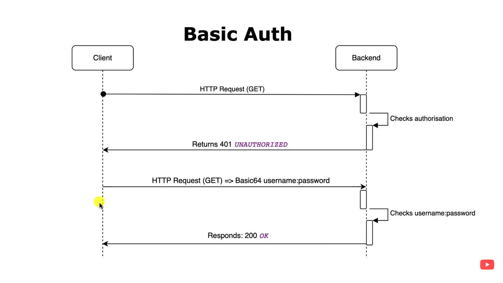
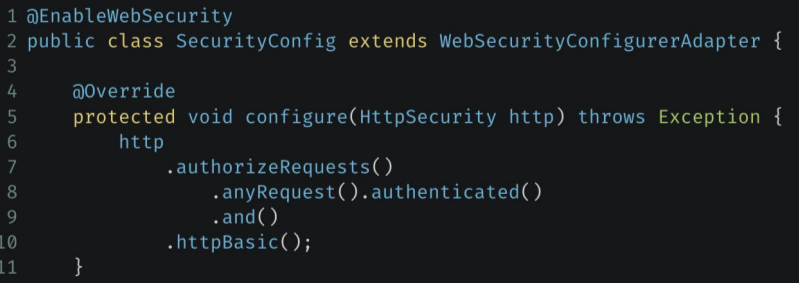
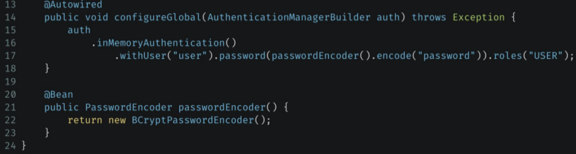
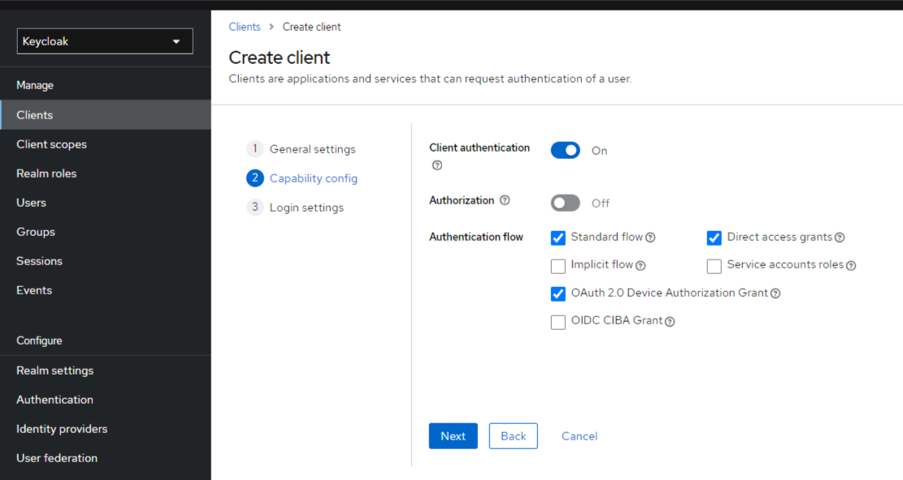
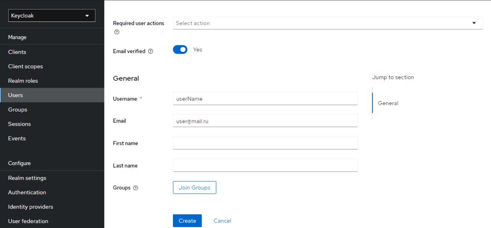
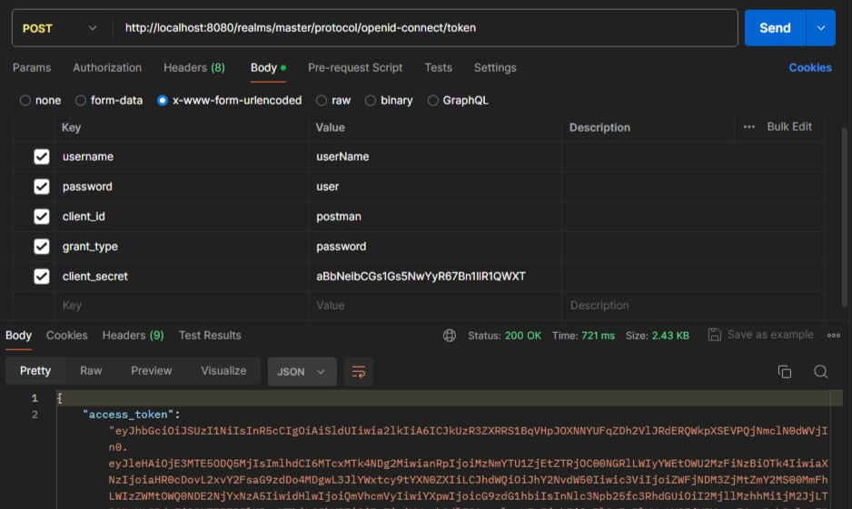
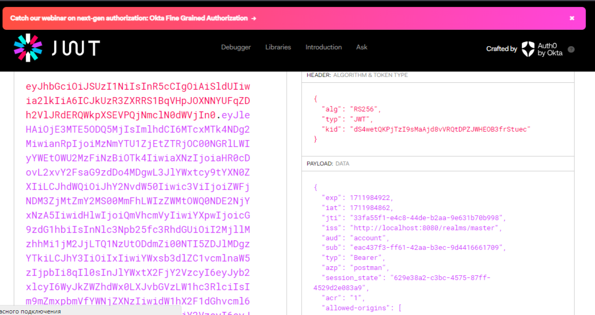

> [НАЗАД к СОДЕРЖАНИЮ](README.md)

---

### Spring Security, Информационная безопасность  

`Spring Security` - огромный модуль в Spring с перечнем инструментами для устранения уязвимостей  

`Аутентификация`  - доказать сервису, что это мы  
* вход в систему по логину и паролю
* вход по отпечатку пальца или face-id
* ввод pin-кода на экране блокировки
* ответ на секретный вопрос

`Авторизация`  - определение **уровня прав** пользователя после его аутентификации
* разница между игроком в игре и модератором или админом
* авторизация в банке позволяет управлять своим счетом, но не чужими
* авторизация в интернет-магазине позволяет купить товар, но не изменить его описание и все, что связано с его модерацией

Основные `принципы безопасности`:  
1. Минимальные привилегии (права пользователя). Например, сделать так, чтобы обычный пользователь не мог удалить или изменить данные в сервисе
2. Защита данных (пароли + шифрование БД с персональными данными)
3. Аудит и мониторинг (регулярно проверять безопасность системы и анализировать случаи неправомерного доступа пользователями)
4. Обработка ошибок и исключений (корректно обрабатывать исключения, чтобы они не выдали информацию злоумышленникам)
5. Обновления и патчи (исправлять ошибки в приложении)  

Основные компоненты `Spring Security`  
1. Аутентификация
2. Авторизация
3. Защита от атак
4. Шифрование паролей

`Базовый алгоритм аутентификации`  
  
**первый запрос** без параметров - не авторизован, **второй запрос** с параметрами пользователя и пароля - уже может быть авторизован и предоставлен доступ к запрашиваемому ресурсу

---

`2024` [Конфигурация Spring Security](https://spring.io/blog/2022/02/21/spring-security-without-the-websecurityconfigureradapter)  

`2023` [Туториал](https://www.youtube.com/watch?v=b9O9NI-RJ3o)

Виды `хакерских атак`:  
1. CSRF (межсайтовая подделка запроса) - выполнение пользователем нежелательных действий (не сознательно)
2. XSS (межсайтовый скриптинг) - вставка хакером злонамеренного скрипта в веб-страницу
3. SQL-инъекции.
4. Атаки с перехватом сессии (Session Hijacking) - зачастую перехват в рамках wifi-роутера вашей сессии на сайте и работа от лица авторизованного пользователя

`@Secured` - для определения ролей, которые могут получить доступ к ручке
```java
    @GetMapping("/any")
    @Secured("any")
    public String getPublic(){
        return "any";
    }
```

`Конфигурация Spring Security`  + @Configuration  

---

Для сборки `старого типа` проекта Spring Security **5.7.10**:  
```xml
    <parent>
        <groupId>org.springframework.boot</groupId>
        <artifactId>spring-boot-starter-parent</artifactId>
        <version>2.7.14</version>
        <relativePath/> <!-- lookup parent from repository -->
    </parent>
```
  

**Пример**  
```java
@Configuration
@EnableWebSecurity
public class WebSecurityConfig extends WebSecurityConfigurerAdapter {
    @Override
    protected void configure(HttpSecurity http) throws Exception {
        http
                .csrf().disable() //отрубаем стандартную проверку, вместо нее нужны JWT-токены
                .authorizeRequests().antMatchers("/public/**").permitAll()
                .anyRequest().authenticated()
                .and()
                .formLogin()
                .loginPage("/login")
                .permitAll()
                .and()
                .logout()
                .permitAll();
    }

//здесь просто создание пользователя
    @Bean
    public UserDetailsService userDetailsService(){
        InMemoryUserDetailsManager manager = new InMemoryUserDetailsManager();
        manager.createUser(
                User.withDefaultPasswordEncoder()
                        .username("user")
                        .password("password")
                        .roles("USER")
                        .build());
        return manager;
    }
}
```
* antMatchers - все запросы по адресу будут доступны всем  
* anyRequest().authenticated() - все остальные запросы только аутентифицированным пользователям  
* loginPage() и logOut() - доступны всем

в обязательном порядке переопределяется `метод configureGlobal`  


---

Как делается с помощью дефолтного Spring Security `в настоящее время`: 

`дефолтная защита` в Spinrg Security
```java
    @Bean
    public SecurityFilterChain filterChain(HttpSecurity http) throws Exception{

        http
                .authorizeHttpRequests((authz) -> authz
                        .anyRequest()//любой запрос
                        .authenticated()//должен быть аутентифицирован
                )
                .httpBasic(Customizer.withDefaults()); //дефолтная форма авторизации
        return http.build();
    }
```

`по дефолту`:
- страница входа использует логин: user и пароль: сгенерированный в терминале
- для выхода "/logout" 

1. Создать конфигурационный файл, в котором включим веб-безопасность с помощью аннотации `@EnableWebSecurity`  

`SecurityFilterChain` - конфиг спринга по доступу к ресурсам приложения пользователями  
```java
@Configuration
@EnableWebSecurity
public class WebSecurityConfig{
    /**
     * Бин, позволяющий разграничить доступ в зависимости от прав
     * @param httpSecurity - такой бин уже существует под капотом спринга
     */
    @Bean
    public SecurityFilterChain filterChain(HttpSecurity httpSecurity) throws Exception {
        return httpSecurity
                .authorizeHttpRequests(registry-> registry
                //requestMatchers вместо antMatchers в версии 6.0
                        .antMatchers("/user/**").hasAnyAuthority("user", "admin") //любая из ролей
                        .antMatchers("/admin/**").hasAuthority("admin") //конкретная роль
                        .antMatchers("/auth/**").authenticated() //любой авторизованный
                        .antMatchers("/any/**").permitAll() //доступ всем
                        .anyRequest().denyAll() //для всех остальных ресурсов - запрет всем (необязательно)
                )
                .formLogin(Customizer.withDefaults()) //если не авторизовались по фильтрам выше - выдать форму авторизации
                .build();
    }
}
```

`UserDetailsService` - класс, который будет обрабатывать запросы и давать доступ  
```java
@RequiredArgsConstructor
@Component
public class CustomUserDetailService implements UserDetailsService {
    private PersonDao dao;

    /**
     * Определяет, есть ли такой пользователь в БД и какие у него права
     */
    @Override
    public UserDetails loadUserByUsername(String login) throws UsernameNotFoundException {
        PersonEntity person = dao.findByLogin(login).orElseThrow(()->
                new UsernameNotFoundException(String.format("пользователь с логином %s не найден.", login)));
        return new User(person.getLogin(), person.getPassword(), List.of(new SimpleGrantedAuthority(person.getRole())));
    }
}
```

`PasswordEncoder` - класс, шифрующий пароли и определяющий их соответствие  
```java
@Component
@Profile("security_common")
public class CustomPasswordEncoder implements PasswordEncoder {

    /**
     * Метод шифрования данных в тот вид, в котором будут храниться данные
     */
    @Override
    public String encode(CharSequence rawPassword) {
        //шифруем данные
        BCryptPasswordEncoder passwordEncoder = new BCryptPasswordEncoder();
        return passwordEncoder.encode(rawPassword);
    }

    /**
     * Сравнение шифрованного пароля с паролем из БД для АВТОРИЗАЦИИ
     */
    @Override
    public boolean matches(CharSequence rawPassword, String encodedPassword) {
        BCryptPasswordEncoder passwordEncoder = new BCryptPasswordEncoder();
        return passwordEncoder.matches(rawPassword, encodedPassword);
    }
}

//ТОЖЕ САМОЕ БУДЕТ ЕСЛИ ЧЕРЕЗ БИН
    @Bean
    public PasswordEncoder passwordEncoder(){
        return new BCryptPasswordEncoder();
    }
```

Чтобы задать `PasswordEncoder, который ничего не делает`:  
```java
return NoOpPasswordEncoder.getInstance();
```

---

Как собирается безопасность на `реальных проектах в настоящее время`  

`OAuth 2.0`  

**OAuth 2.0** — это протокол авторизации, позволяющий выдать одному сервису (приложению) права на доступ к ресурсам пользователя на другом сервисе.
Протокол избавляет от необходимости доверять приложению логин и пароль, а также позволяет выдавать ограниченный набор прав, а не все сразу.

Система сервер (хранит ресуры) - авторизационный сервер (хранит информацию о пользователях) - клиент  

`Зависимость oauth`:  
```xml
        <dependency>
            <groupId>org.springframework.boot</groupId>
            <artifactId>spring-boot-starter-oauth2-resource-server</artifactId>
        </dependency>
```

В качестве авторизационного сервера может выступать [KeyCloak](https://www.keycloak.org/guides) 
Алгоритм работы:  
1. просто скачать и разорхивировать (возможно, может понадобится настроить переменные среды)
2. getting started на сайте -> docker -> выполнить команду  
```bash
docker run -p 8080:8080 -e KEYCLOAK_ADMIN=admin -e KEYCLOAK_ADMIN_PASSWORD=admin -v ./config/keycloak/import:/opt/keycloak/data/import quay.io/keycloak/keycloak:24.0.2 start-dev --import-realm
```

`application.yml для работы с oath 2.0`:  
```yml
spring:
  datasource:
    url: jdbc:h2:mem:test
    username: root
    password:
    driver-class-name: org.h2.Driver
  security:
    oauth2:
      resourceserver:
        jwt:
          issuer-uri: http://localhost:8080/realms/master #по этому адресу работает котейнер oauth 2.0, и из этой же информации наш сервер узнает, валиден ли JWT-токен пользователя  
server:
  port: 8081
```

`Настройка работы с oauth 2.0:`  

**Создать нового клиента** (клиент - это приложение) в oauth 2.0:  
1. запускаем контейнер
2. заходим на порт работы (дефолт=8080)
* создаем новый realm (здесь только придумать ему название)
* создаем необходимые группы (например, исполнители и логисты)
* создаем новые роли (ROLE_LOGISTICAN и др.) и связываем их с группами
3. clients -> create client
4. general settings -> имя в id прописать
5. capacity config -> рис. ниже (client authentication только для общения между серверами)
6. login settings -> ничего  

**Создание нового клиента в oauth 2.0**  
  
* client authentication ползунок - если обмен инфы будет между бэкэндами. Секретный ключ не стоит исопльзовать для связи с фронтом

`Настройка нового пользователя в клиенте:`    
    
здесь email просто будет в JWT-токене  и не играет роль при авторизации  

далее: установить пароль пользователю:  
users -> credentials -> set password  

вся `информация по oauth 2.0` в формате JSON:  Realm settings -> OpenID Endpoint Configuration   

Проверка `получения токена авторизации oauth` с помощью Postman:  
  
* **grant_type** = password - значит, что мы хотим получить токен авторизации  
  * grant_type = **refresh_token** - значит, что мы хотим обновить токен. В этом случае нужно еще одно поле refresh_token = скопировать весь refresh_token из ответа и убрать password
* **client_secret** - секретный пароль, созданный при создании клиента, чтобы вообще предоставлять возможность к нам обращаться. (обычно, только для связи между серверами. При связи с фронтом будет отсутствовать)  
Находится: client -> credentials -> client secret  

`jwt.io` (сайт) - для удобного вида JWT-токена  
  
jwt-token может хранить публичную информацию, такую как:  
* exp - время создания  
* roles
* email

> **access token** получается по дефолту на 60 минут, **refresh token** - на 1800 минут (время тоже содержится в ответе от сервера)


Конфиг спринга для работы с oauth 2.0:  

`SecurityFilterChain` - конфиг спринга по доступу через oauth, где приложение - сервер ресурсов  
```java
@Configuration
@EnableWebSecurity
@Profile("security_oauth")
public class WebSecurityConfig{

    /**
     * Бин, позволяющий разграничить доступ в зависимости от прав
     * @param httpSecurity - такой бин уже существует под капотом спринга
     */
    @Bean
    public SecurityFilterChain filterChain(HttpSecurity httpSecurity) throws Exception {

        //для того, чтобы вытащить роли из JWT-токена, который в формате JSON
        JwtAuthenticationConverter converter = new JwtAuthenticationConverter();
        converter.setJwtGrantedAuthoritiesConverter(source -> {
            Map<String, Object> claim = source.getClaim("realm_access"); //достаем заголовок
            List<String> roles = (List<String>) claim.get("roles"); //достаем роли из заголовка
            return roles.stream()
                    .map(SimpleGrantedAuthority::new)
                    .collect(Collectors.toList());
        });

        return httpSecurity
                .authorizeHttpRequests(registry-> registry
                //requestMatchers вместо antMatchers в версии 6.0
                        .antMatchers("/user/**").hasAnyAuthority("user", "admin") //любая из ролей
                        .antMatchers("/admin/**").hasAuthority("admin") //конкретная роль
                        .antMatchers("/auth/**").authenticated() //любой авторизованный
                        .antMatchers("/any/**").permitAll() //доступ всем
                        .anyRequest().denyAll() //для всех остальных ресурсов - запрет всем (необязательно)
                )
//                .oauth2ResourceServer(configurer-> configurer
//                        .jwt(Customizer.withDefaults())) //если токен валидный - то происходит авторизация

                //здесь мы говорим - когда придет токен, с помощью конвертера извлекать из него роли
                .oauth2ResourceServer(configurer->configurer
                        .jwt(jwtConfigurer -> jwtConfigurer.jwtAuthenticationConverter(converter)))
                .build();
    }
}
```

`Проверка работы через Postman приложения + oauth 2.0`:  
1. также получаем токен, как было выше (по адресу oauth, дефолт=8080)
2. отправляем гет-запрос, с 1 параметров хедере: Authorization = Bearer eyJhbGci..... (access token), по адресу=8081 или любой другой кастомный  


Чтобы `создать роли и задать их пользователям в oauth`:   
1. realms roles -> create role
2. users -> конкретный пользователь -> role mapping -> assign role

---

`CSRF` (Cross Site Request Forgery) - дефолтная защита он небезопасных запросов (все, исключая GET-запросы). По дефолту не пропускает их.  

Как пропускать:  (лишнее закоммитил)  
1. отключить защиту
```java
    // @Bean
    // public SecurityFilterChain filterChain(HttpSecurity httpSecurity) throws Exception {

    //     return httpSecurity
    //             .authorizeHttpRequests(registry-> registry
    //                     .requestMatchers("/ui/issue/**").hasAuthority("manager")
    //                     .requestMatchers("/ui/reader/**", "/ui/issue/**").hasAuthority("admin") //конкретная роль
    //                     .requestMatchers("/ui/book/**").authenticated() //любой авторизованный
    //                     .requestMatchers("/book/**", "/issue/**", "/reader/**").permitAll() //доступ всем
    //                     .anyRequest().denyAll() //для всех остальных ресурсов - запрет всем (необязательно)
    //             )
    //             .formLogin(Customizer.withDefaults()) //если не авторизовались по фильтрам выше - выдать форму авторизации

                //вообще вырубить защиту
                .csrf(AbstractHttpConfigurer::disable)
                //допустить к исполнению пост запрос на такой адрес
                .csrf(httpSecurityCsrfConfigurer -> httpSecurityCsrfConfigurer.ignoringRequestMatchers("/book"))
                
    //             .build();
    // }
```

`Варианты настройки создания сессий в Spring Security`:  

* SessionCreationPolicy.ALWAYS — сессия будет всегда создаваться (если она не существует).
* SessionCreationPolicy.NEVER — Spring Security никогда не создаст HttpSession, но будет использовать его, если он уже существует (доступен через сервер приложений).
* SessionCreationPolicy.IF_REQUIRED — Spring Security будет создавать HttpSession только при необходимости (по умолчанию).
* SessionCreationPolicy.STATELESS — Spring Security никогда не создаст HttpSession и не будет использовать его для получения SecurityContext.
