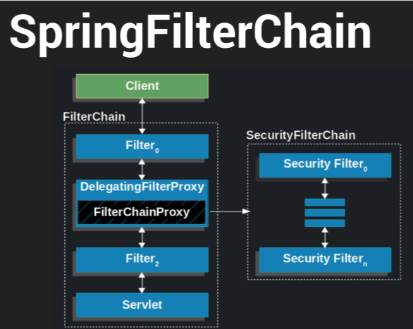
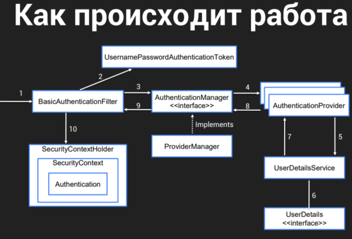
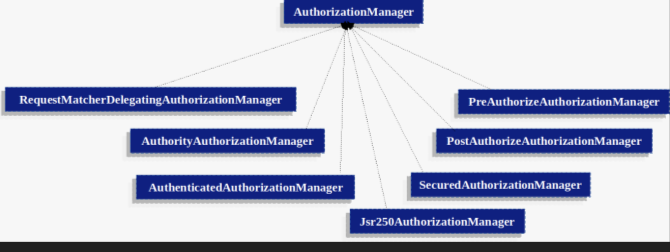
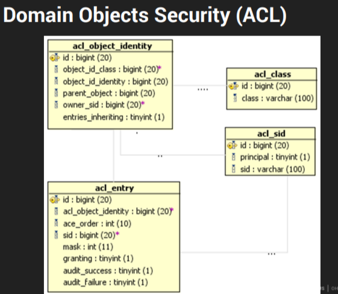

> [НАЗАД к СОДЕРЖАНИЮ](README.md)

---

### Spring Security, Информационная безопасность  

`Spring Security` - огромный модуль в Spring с перечнем инструментами для устранения уязвимостей  

`JWT`
 https://www.youtube.com/watch?v=EjrlN_OQVDQ 
 https://www.youtube.com/watch?v=mUq9MGe5vZA 
 https://www.youtube.com/watch?v=oeni_9g7too

Пример конфига от OTUS (базовый): https://github.com/OtusTeam/Spring/blob/master/2024-03/spring-23/3.x-style/src/main/java/ru/otus/spring/security/SecurityConfiguration.java  
Пример простого конфига (свой):   
https://github.com/timofeev-vadim-96/library-api

`Зависимость`
```xml
        <dependency>
            <groupId>org.springframework.boot</groupId>
            <artifactId>spring-boot-starter-security</artifactId>
        </dependency>
<!--для ТЕСТОВ безопаности-->
        <dependency>
            <groupId>org.springframework.security</groupId>
            <artifactId>spring-security-test</artifactId>
            <version>${spring-security.version}</version>
        </dependency>
```

`Аутентификация`  - доказать сервису, что это мы  
* вход в систему по логину и паролю
* вход по отпечатку пальца или face-id
* ввод pin-кода на экране блокировки
* ответ на секретный вопрос

`Авторизация`  - определение **уровня прав** пользователя после его аутентификации
* разница между игроком в игре и модератором или админом
* авторизация в банке позволяет управлять своим счетом, но не чужими
* авторизация в интернет-магазине позволяет купить товар, но не изменить его описание и все, что связано с его модерацией

Основные `принципы безопасности`:  
1. Минимальные привилегии (права пользователя). Например, сделать так, чтобы обычный пользователь не мог удалить или изменить данные в сервисе
2. Защита данных (пароли + шифрование БД с персональными данными)
3. Аудит и мониторинг (регулярно проверять безопасность системы и анализировать случаи неправомерного доступа пользователями)
4. Обработка ошибок и исключений (корректно обрабатывать исключения, чтобы они не выдали информацию злоумышленникам)
5. Обновления и патчи (исправлять ошибки в приложении)  

Основные компоненты `Spring Security`  
1. Аутентификация
2. Авторизация
3. Защита от атак
4. Шифрование паролей

`Механизмы авторизации` Spring Security  
1. По URL-ам
2. Методы в сервисах, контроллерах 
3. По бизнес-объектам (документы, пользователи, счета и т.д.) - с помощью ACL (Access Control List)

`Механизмы аутентификации`
1. HTTP Basic autentification
2. Form-based autentification
3. HTTP X.509 (через сертификаты)
4. OpenID/OAuth2.0
5. LDAP, Active Directory

`Сценарий Аутентификации` SS:
* Полученные имя и пароль с помощью Authentication фильтра
помещаются в UsernamePasswordAuthenticationToken
(реализует Authentication) в SecurityContext
* Созданный AuthToken передаётся для проверки в
AuthenticationManager через другие фильтры
* AuthenticationManager возвращает полностью
инициализированный объект Authentication
* Устанавливается контекст безопасности
посредством вызова SecurityContextHolder.
getContext().setAuthentication(...)
* С этого момента пользователь считается
аутентифицированным
* Кстати достать можно в Spring MVC контроллере:
SecurityContextHolder.getContext().getAuthentication()

> Про цепочку фильтров https://stackoverflow.com/questions/41480102/how-spring-security-filter-chain-works

`Порядок фильтров (фильтры)` Spring Security:  
* ChannelProcessingFilter - проверяет, был ли запрос выполнен по защищённому каналу (например, HTTPS).
* `SecurityContextPersistenceFilter`. Этот фильтр восстанавливает SecurityContext между запросами. В SecurityContext хранится информация о текущем пользователе, и его состояние сохраняется, например, в сессии или в заголовках запросов. Фильтр восстанавливает контекст при каждом запросе и сохраняет его снова после завершения обработки.
* HeaderWriterFilter - добавляет заголовки безопасности к ответам.
* LogoutFilter - обрабатывает запросы на выход из системы.
* CorsFilter, CsrfFilter
* `UsernamePasswordAuthenticationFilter`: Обрабатывает аутентификацию через форму логина. Этот фильтр отвечает за получение учетных данных пользователя (имя пользователя и пароль), проверяет их и аутентифицирует пользователя через AuthenticationManager.
* BasicAuthenticationFilter: Обрабатывает HTTP Basic Authentication, где имя пользователя и пароль передаются в заголовке Authorization. Этот фильтр проверяет, что пользователь передал корректные данные, и выполняет аутентификацию.
* RequestCacheAwareFilter - сохраняет и восстанавливает запрашиваемые URL для перенаправления после аутентификации.
* SecurityContextHolderAwareRequestFilter - позволяет получить доступ к объекту SecurityContext в контексте запроса
* AnonymousAuthenticationFilter - создает анонимного пользователя, если пользователь не аутентифицирован.
* SessionManagementFilter - управляет сессиями, например, предотвращает одновременные сессии.
* AuthorizationFilter //отвечает за авторизацию по URL
* `ExceptionTranslationFilter`: Обрабатывает любые исключения, которые возникают в процессе фильтрации или аутентификации. Например, если доступ запрещен, этот фильтр может отправить перенаправление на страницу логина или вернуть HTTP-ответ с ошибкой (например, 403 Forbidden).
* `FilterSecurityInterceptor`: Фильтр, который выполняет авторизацию, проверяя, имеет ли текущий пользователь права доступа к запрашиваемому ресурсу. Он использует конфигурации безопасности, заданные для приложения, чтобы определить, разрешено ли выполнение текущей операции для аутентифицированного пользователя.

`Куда вставлять кастомный фильтр:`
* Аутентификация (Authentication):
Если ваш кастомный фильтр отвечает за процесс аутентификации (например, проверка токена, кастомная логика аутентификации), то часто логично вставить его перед стандартным UsernamePasswordAuthenticationFilter.

* Авторизация (Authorization):
Если ваш фильтр связан с авторизацией, то его место может быть перед FilterSecurityInterceptor, который обычно отвечает за принятие решения о доступе на основе правил конфигурации безопасности.

* Другое
Если ваш фильтр выполняет какую-то другую функциональность (например, обработка специфических HTTP-заголовков, логгирование, обработка специфических типов запросов), то вставьте его перед фильтрами, которые имеют отношение к этой функциональности.

Для отладки и просмотра порядка фильтров, а также логирования запросов в Spring Security, вы можете воспользоваться следующими методами:

Логирование с использованием Logback или Log4j:

Настройте вашу систему логирования для вывода информации о фильтрах и запросах. В Spring Security многие компоненты логируют свою деятельность. Например, уровень логирования DEBUG для пакета org.springframework.security может предоставить вам детальную информацию о том, как обрабатываются запросы.

Как Spring Security встраивает свои фильтры в общую цепочку фильтров:  
  
  * внедряется прокси DelegatingFilterProxy со списком кастомных фильтров Spring Security

`Модели прав доступа` в Spring Security:  
* **Ролевая модель** - у пользователей есть роли (разрешения)
* **ACL (Access Control List)** – очень навороченная модель (для очень сложной кастомной настройки разрешений пользователей),
на основе бизнес-сущностей (аналогичная правам доступа к файлам и
папкам в ОС: чтение/запись/изменение/удаление)

> Отличие roles от authorities: авторитис с префиксом ROLE_, роли без. Пример авторити: ROLE_ADMIN, пример роли: ADMIN

Добавить `иерархию ролям` (очень редко используется)  
```java
@Bean
public RoleHierarchyImpl roleHierarchy() {
 RoleHierarchyImpl roleHierarchy = new RoleHierarchyImpl();
 roleHierarchy.setHierarchy("ROLE_ADMIN > ROLE_USER"); //тогда у админа есть доступ везде, где есть доступ у юзера
 return roleHierarchy;
}
```

`Проверка прав`  
* Проверка прав осуществляется в
AccessDecisionManager
* AccessDecisionManager при проверке прав опирается
на GrantedAuthorities

`Авторизация для методов` (через AOP - выполняются после фильтров, когда запрос уже доходит до DispetcherServlet) 
3 способа: 
1. Аннотацию @Secured("ROLE_ADMIN") – можно несколько авторитис
2. Аннотации JSR-250 - очень старая штука
3. Spring Security аннотации позволяющие
поддерживающие EL выражения (самая круть)


`Включить авторизацию для методов`
```java
@EnableMethodSecurity(
    securedEnabled = true,
    prePostEnabled = true
)
public class MethodSecurityConfiguration {
}
```
Атрибуты аннотации @EnableMethodSecurity:  
* pre-post-annotations
* jsr250-annotations (https://en.wikipedia.org/wiki/
JSR_250)
* secured-annotations
Все отключены по умолчанию.

`Аннотации, поддерживающие EL` (expression language) - для методов
* @PreAuthorize (ТОП 1) - обычно юзается для проверки на основе ролей
* @PreFilter - работает очень похожим образом, однако фильтрация применяется к списку, который передается в качестве входного параметра аннотированному методу.
  * принимает параметры 
  * filterObject - для ссылки на объект фильтрации в EL выражении
  * filterTarget - для определения имени параметра для фильтрации
* @PostAuthorize - юзать для проверки соответствия полей результирующего объекта после отработки метода
* @PostFilter (ТОП 2) - определяет правило для фильтрации возвращаемой коллекции(**не массива**!!) методом путем применения этого правила к каждому элементу в списке. Если вычисленное значение равно true, элемент будет сохранен в списке. В противном случае элемент будет удален.

`Авторизация для методов класса` пример:  
```java
    @PreAuthorize("hasRole('USER') && {new java.util.Random().nextInt()%2 == 0}")
    public String onlyUser() {
        return "My love";
    }

    @PostAuthorize ("returnObject.owner == authentication.name")
	public Book getBook();

    @Secured("ADMIN")
    public void onlyAdmin() {
    }

    @PostFilter("hasRole('MANAGER') or filterObject.assignee == authentication.name")
List<Task> findAll() {
    // ...

    @PreFilter("hasRole('MANAGER') or filterObject.assignee == authentication.name")
Iterable<Task> save(Iterable<Task> entities) {
    // ...
}
}
```


`Базовый алгоритм аутентификации`  
  
**первый запрос** без параметров - не авторизован, **второй запрос** с параметрами пользователя и пароля - уже может быть авторизован и предоставлен доступ к запрашиваемому ресурсу

`Способы аутентификации`
1. HTTP Basic/Digest authentication - форма аутентификации будет предоставляться самим браузером. 
  * логин и пароль передаются в HTTP-заголовке "Authorization" в кодировщике Base64
2. Form-based authentication (Customizer.withDefaults() - будет стандартная форма, но можно реализовать свою)
  * логин и пароль из формы передаются в качестве requestParam в теле Post-запроса
3. HTTP X.509 (сертификаты)
4. OpenID/OAuth
5. LDAP
6. Можно реализовать свой механизм

`HTTP Basic`, (юзать только между микросервисами в локальной сети)   
* BasicAuthenticationFilter читает из заголовка HTTP
запроса имя и пароль и использует для
аутентификации
* BasicAuthenticationFilter соответствует RFC-1945

преимущества и недостатки:   

Преимущества:
* Простота механизма
* Поддержка всеми браузерами
* Идеально для микросервисов  

Недостатки:  
* Имя пользователя и пароль передаются в открытом
виде (необходимо использовать HTTPS)

`Form-based`, пример кастомной реализации:  
```java
@Bean
public SecurityFilterChain securityFilterChain(HttpSecurity http)
throws Exception {
 http.formLogin(
fm -> fm.loginPage("/extlogin")
.loginProcessingUrl("/extlogin_process") //редирект
.usernameParameter("extuser") //requestParam логина
.passwordParameter("extpass") //requestParam пароля
);
}
```

`Цепочка фильтров` при form-based аутентификации:  
1. DelegatingFilterProxy - вставляет список кастомных фильтров в общую цепочку спринга
2. FilterChainProxy - хранит список фильтров
3. SecurityContextFilterProxy - хранит данные об аутентифицированных пользователях
4. UsernamePasswordAuthenticationFilter - проверяет юзака на аутентификацию
5. ProviderManager - юзает провайдеров для аутентификации пользователя
6. DaoAuthenticationProvider - тащит из UserDetailsService данные о пользователе

`Основные компоненты` Spring Security:  
1. SecurityContext - контейнер, в котором хранится информация о текущем аутентифицированном пользователе (объекты типа Authentication). Отражает текущий контекст безопасности 
2. Authentication - объект, представляющий собой аутентифицированного пользователя и его привелегии (token)
  * principal = login (учетная запись пользователя). Основная реализация = UserDetails
  * credentials = пароль
  * authorities = права (в спринге - должны начинаться на "ROLE_". Пример: ROLE_ADMIN)
3. UserDetails (доменный объект, представляющий пользователя) - инфа о пользователе (логи, пароль, роли)
4. UserDetailsService - сервис, подгружающий UserDetails из БД. Реализации: InMemoryDaoImpl, JdbcDaoImpl (во втором случае провались внутрь, реализация уже есть для реляционных БД, ИМЕНА ТАБЛИЦ должны совпадать с внутренней реализацией)
5. GrantedAuthority - разрешение на какое-то действие

InMemoryDaoImpl - реализация **UserDetailsService**  
```java
    @Bean
    public InMemoryUserDetailsManager userDetailsService() {
        UserDetails user = User
                .builder()
                .username( "user" )
                .password( "password" )
                .roles( "USER" )
                .build();
        return new InMemoryUserDetailsManager( user );
    }
```

`Алгоритм работы` Spring Security
  
  * BasicAuthenticationFilter - это если аутентификация на базе httpBasic()
  * AuthenticationManager - интерфейс объекта, выполняющего аутентификацию. Чаще всего делегирует AuthenticationProvider-ам, которых может быть несколько
  * AuthenticationProvider - скорее всего будет залазить в UserDetailsService

Реализации AuthenticationManager-a  
  
  * вся левая часть - для выдачи разрешения по URL
  * правая часть - для доступа к методам сервисов и сущностям через @Secured и @PreAuthorized

> Цепочку фильтров по порядку можно посмотреть в дебаг-режиме в классе `FilterChainProxy`

Пример своей реализации `AuthenticationManager`
```java
class SampleAuthenticationManager implements AuthenticationManager {
 public Authentication authenticate(Authentication auth) throws
AuthenticationException {
 Collection<GrantedAuthority> roles = Collections.emptyList();
 if (auth.getName().equals(auth.getCredentials())) {
 return new UsernamePasswordAuthenticationToken(
 auth.getName(), auth.getCredentials(), roles);
 }
 throw new BadCredentialsException("Bad Credentials");
 }
}
```

Кастомно `аутентифицировать пользователя` (функционал уже есть в Spring Security)  
```java
String name = "<USERNAME>";
String password = "<PASSWORD>";
AuthenticationManager am = new SampleAuthenticationManager();
try {
 Authentication request =
 new UsernamePasswordAuthenticationToken(name, password);
 Authentication result = am.authenticate(request);
 SecurityContextHolder.getContext().setAuthentication(result);
} catch (AuthenticationException e) {
 System.out.println("Authentication failed.");
}
```

Режимы работы контектса и где он хранится  
`SecurityContextHolder` - то, на каком уровне многопоточности доступен контекст безопасности:  
1. MODE_THREADLOCAL (дефолт) - контекст безопасности доступен из потока, в котором происходит HTTP-запрос
2. MODE_INHERITABLETHREADLOCAL - контекст доступен в дочерних потоках
3. MODE_GLOBAL - для десктоп-приложений, где 1 приложение = 1 пользователь

---

`2024` [Конфигурация Spring Security](https://spring.io/blog/2022/02/21/spring-security-without-the-websecurityconfigureradapter)  

`2023` [Туториал](https://www.youtube.com/watch?v=b9O9NI-RJ3o)

Виды `хакерских атак`:  
1. CSRF (межсайтовая подделка запроса) - выполнение пользователем нежелательных действий (не сознательно)
2. XSS (межсайтовый скриптинг) - вставка хакером злонамеренного скрипта в веб-страницу
3. SQL-инъекции.
4. Атаки с перехватом сессии (Session Hijacking) - зачастую перехват в рамках wifi-роутера вашей сессии на сайте и работа от лица авторизованного пользователя

`@Secured` - для определения ролей, которые могут получить доступ к ручке
```java
    @GetMapping("/any")
    @Secured({"USER", "ADMIN"})
    public String getPublic(){
        return "any";
    }
```

`Конфигурация Spring Security`  + @Configuration  

---

Для сборки `старого типа` проекта Spring Security **5.7.10**:  
```xml
    <parent>
        <groupId>org.springframework.boot</groupId>
        <artifactId>spring-boot-starter-parent</artifactId>
        <version>2.7.14</version>
        <relativePath/> <!-- lookup parent from repository -->
    </parent>
```

`Способы настройки Spring Security`:  
1. наследоваться от **WebSecurityConfigurerAdapter** и реализовать метод configure(HttpSecurity http)
2. создать бин класса SecurityFilterChain (HttpSecurity http) с версии 3.x, в классе @Configuration

  

**Пример**  
```java
@Configuration
@EnableWebSecurity
public class WebSecurityConfig extends WebSecurityConfigurerAdapter {
    @Override
    protected void configure(HttpSecurity http) throws Exception {
        http
                .csrf().disable() //отрубаем стандартную проверку, вместо нее нужны JWT-токены
                .authorizeRequests().antMatchers("/public/**").permitAll()
                .anyRequest().authenticated()
                .and()
                .formLogin()
                .loginPage("/login")
                .permitAll()
                .and()
                .logout()
                .permitAll();
    }

//здесь просто создание пользователя
    @Bean
    public UserDetailsService userDetailsService(){
        InMemoryUserDetailsManager manager = new InMemoryUserDetailsManager();
        manager.createUser(
                User.withDefaultPasswordEncoder()
                        .username("user")
                        .password("password")
                        .roles("USER")
                        .build());
        return manager;
    }
}
```
* antMatchers - все запросы по адресу будут доступны всем  
* anyRequest().authenticated() - все остальные запросы только аутентифицированным пользователям  
* loginPage() и logOut() - доступны всем

в обязательном порядке переопределяется `метод configureGlobal`  


---

Как делается с помощью дефолтного Spring Security `в настоящее время`: 

`дефолтная защита` в Spinrg Security
```java
    @Bean
    public SecurityFilterChain filterChain(HttpSecurity http) throws Exception{

        http
                .authorizeHttpRequests((authz) -> authz
                        .anyRequest()//любой запрос
                        .authenticated()//должен быть аутентифицирован
                )
                .httpBasic(Customizer.withDefaults()); //дефолтная форма авторизации
        return http.build();
    }
```

`по дефолту`:
- страница входа использует логин: user и пароль: сгенерированный в терминале
- для выхода "/logout" 

1. Создать конфигурационный файл, в котором включим веб-безопасность с помощью аннотации `@EnableWebSecurity` ИЛИ повесить над main-ом 

`SecurityFilterChain` - конфиг спринга по доступу к ресурсам приложения пользователями  
```java
@Configuration
@EnableWebSecurity
public class WebSecurityConfig{
    /**
     * Бин, позволяющий разграничить доступ в зависимости от прав
     * @param httpSecurity - такой бин уже существует под капотом спринга
     */
    @Bean
    public SecurityFilterChain filterChain(HttpSecurity httpSecurity) throws Exception {
        return httpSecurity
                .authorizeHttpRequests(registry-> registry
                //requestMatchers вместо antMatchers в версии 6.0
                        .antMatchers("/user/**").hasAnyAuthority("user", "admin") //любая из ролей
                        .antMatchers("/admin/**").hasAuthority("admin") //конкретная роль
                        .antMatchers("/auth/**").authenticated() //любой авторизованный
                        .antMatchers("/any/**").permitAll() //доступ всем
                        .anyRequest().denyAll() //для всех остальных ресурсов - запрет всем (необязательно)
                )
                .formLogin(Customizer.withDefaults()) //если не авторизовались по фильтрам выше - выдать форму авторизации
                .build();
    }
}
```

`UserDetailsService` - класс, который будет обрабатывать запросы и давать доступ  
```java
@RequiredArgsConstructor
@Component
public class CustomUserDetailService implements UserDetailsService {
    private PersonDao dao;

    /**
     * Определяет, есть ли такой пользователь в БД и какие у него права
     */
    @Override
    public UserDetails loadUserByUsername(String login) throws UsernameNotFoundException {
        PersonEntity person = dao.findByLogin(login).orElseThrow(()->
                new UsernameNotFoundException(String.format("пользователь с логином %s не найден.", login)));
        return new User(person.getLogin(), person.getPassword(), List.of(new SimpleGrantedAuthority(person.getRole())));
    }
}
```
  * SimpleGrantedAuthority у пользака должна начинаться с "ROLE_". Например: ROLE_USER 

`PasswordEncoder` - класс, шифрующий пароли и определяющий их соответствие  

Стандартные реализации `PasswordEncoder`:  
* ShaPasswordEncoder
* Md5PasswordEncoder
* Md4PasswordEncoder
* PlaintextPasswordEncoder
* BCryptPasswordEncoder - TOP!!! Добавляет соль (левый набор символов) к паролю перед шифрованием

`PasswordEncoder`  
```java
@Component
@Profile("security_common")
public class CustomPasswordEncoder implements PasswordEncoder {

    /**
     * Метод шифрования данных в тот вид, в котором будут храниться данные
     */
    @Override
    public String encode(CharSequence rawPassword) {
        //шифруем данные
        BCryptPasswordEncoder passwordEncoder = new BCryptPasswordEncoder();
        return passwordEncoder.encode(rawPassword);
    }

    /**
     * Сравнение шифрованного пароля с паролем из БД для АВТОРИЗАЦИИ
     */
    @Override
    public boolean matches(CharSequence rawPassword, String encodedPassword) {
        BCryptPasswordEncoder passwordEncoder = new BCryptPasswordEncoder();
        return passwordEncoder.matches(rawPassword, encodedPassword);
    }
}

//ТОЖЕ САМОЕ БУДЕТ ЕСЛИ ЧЕРЕЗ БИН
    @Bean
    public PasswordEncoder passwordEncoder(){
        return new BCryptPasswordEncoder();
    }
```

Чтобы задать `PasswordEncoder, который ничего не делает`:  
```java
return NoOpPasswordEncoder.getInstance();
```

`Anonymous Authentication` 
- поведение по умолчанию для не аутентифицированных юзаков. Обычно используется для открытых ресурсов
- Основная идея – иметь пользователя с самыми
дохлыми правами

`AnonymousAuthenticationToken`  
* Реализация интерфейса Authentication для
анонимной аутентификации
* Хранит список GrantedAuthority для анонимной
аутентификации

`AnonymousAuthenticationFilter`
* Аутентифицирует пользователя как анонимного в
случае если отсутствует другая аутентификация
* Находится в цепочке после всех настроенных
фильтров аутентификации

Пример добавления анонимному юзеру прав
```java
public SecurityFilterChain securityFilterChain (HttpSecurity http)
throws Exception {
 http.formLogin(Customizer.withDefaults())
 .anonymous(a -> a.principal("anonymousUser") //сюда можно также положить объект класса, наследуемого от UserDetails
.authorities("ROLE_ANONYMOUS") //права анонимного юзера
);
}
```

`Remember Me Authentication` 
* Добавит галочку "запомнить меня" под формой аутентификации
* Remember Me аутентификация позволяет сохранять
информацию о пользователе между HTTP сессиями 
* Использование Remember Me аутентификации
позволяет при очередном обращении к приложению
использовать ранее введённые имя и пароль
* Обычно реализуется через сохранение cookie в
браузере
* **Работает только с form-based аутентификацией**
* Simple Hash-Based Token подход (кстати
переписываем обычно на JWT) //вся необходимая инфа для аутентификации есть в токене - по ДЕФОЛТУ
* Persistent Token подход //должен ходить в хранилище токенов
* RememberMeAuthenticataionFilter проверяет есть ли кука, и пытается залогинить пользака по принципалу и кредам этого пользака

`Cookie` содержит закодированную в Base64 строку с:
* Именем пользователя
* Временем экспирации токена
* Md5(хэш-код) от имени + пароль + время экспирации + ключ

Включить remember-me
```java
@Bean
public SecurityFilterChain securityFilterChain (HttpSecurity http)
throws Exception {
http.rememberMe(rm -> rm.key("AnyKey") //здесь ключ нужен рандомный для сложности
.tokenValiditySeconds(600));
}
```

`Simple hash-based token`:  
```
base64(
 username + ":" + expirationTime + ":" +
 md5Hex(
 username + ":" +
 expirationTime + ":" + password
 + ":" + key
 )
)

key - для усиления хэш-кода
```

`Persistent Token` подход для remember-me  
* Альтернатива подходу Simple Hash-Based Token
* Основное отличие - содержимое Remember-Me cookie
* Для работы необходимо хранилище для RememberMe токенов
* Токены в хранилище доступны по ключу (значения из cookie)

`Тестирование Spring-Security:`  
```java
@WebMvcTest(PagesController.class)
@Import(SecurityConfiguration.class) //импортировать конфиг безопаности
public class PagesControllerTest {

    @Autowired
    private MockMvc mockMvc;

//моковый аутентифизированный юзер
    @WithMockUser(
            username = "admin",
            authorities = {"ROLE_ADMIN"}
    )
    @Test
    public void testAuthenticatedOnAdmin() throws Exception {
        mockMvc.perform(get("/authenticated"))
                .andExpect(status().isOk());
    }
}
```

---

Как собирается безопасность на `реальных проектах в настоящее время`  

`OAuth 2.0`  

**OAuth 2.0** — это протокол авторизации, позволяющий выдать одному сервису (приложению) права на доступ к ресурсам пользователя на другом сервисе.
Протокол избавляет от необходимости доверять приложению логин и пароль, а также позволяет выдавать ограниченный набор прав, а не все сразу.

Система сервер (хранит ресуры) - авторизационный сервер (хранит информацию о пользователях) - клиент  

`Зависимость oauth`:  
```xml
        <dependency>
            <groupId>org.springframework.boot</groupId>
            <artifactId>spring-boot-starter-oauth2-resource-server</artifactId>
        </dependency>
```

В качестве авторизационного сервера может выступать [KeyCloak](https://www.keycloak.org/guides) 
Алгоритм работы:  
1. просто скачать и разорхивировать (возможно, может понадобится настроить переменные среды)
2. getting started на сайте -> docker -> выполнить команду  
```bash
docker run -p 8080:8080 -e KEYCLOAK_ADMIN=admin -e KEYCLOAK_ADMIN_PASSWORD=admin -v ./config/keycloak/import:/opt/keycloak/data/import quay.io/keycloak/keycloak:24.0.2 start-dev --import-realm
```

`application.yml для работы с oath 2.0`:  
```yml
spring:
  datasource:
    url: jdbc:h2:mem:test
    username: root
    password:
    driver-class-name: org.h2.Driver
  security:
    oauth2:
      resourceserver:
        jwt:
          issuer-uri: http://localhost:8080/realms/master #по этому адресу работает котейнер oauth 2.0, и из этой же информации наш сервер узнает, валиден ли JWT-токен пользователя  
server:
  port: 8081
```

`Настройка работы с oauth 2.0:`  

**Создать нового клиента** (клиент - это приложение) в oauth 2.0:  
1. запускаем контейнер
2. заходим на порт работы (дефолт=8080)
* создаем новый realm (здесь только придумать ему название)
* создаем необходимые группы (например, исполнители и логисты)
* создаем новые роли (ROLE_LOGISTICAN и др.) и связываем их с группами
3. clients -> create client
4. general settings -> имя в id прописать
5. capacity config -> рис. ниже (client authentication только для общения между серверами)
6. login settings -> ничего  

**Создание нового клиента в oauth 2.0**  
  
* client authentication ползунок - если обмен инфы будет между бэкэндами. Секретный ключ не стоит исопльзовать для связи с фронтом

`Настройка нового пользователя в клиенте:`    
    
здесь email просто будет в JWT-токене  и не играет роль при авторизации  

далее: установить пароль пользователю:  
users -> credentials -> set password  

вся `информация по oauth 2.0` в формате JSON:  Realm settings -> OpenID Endpoint Configuration   

Проверка `получения токена авторизации oauth` с помощью Postman:  
  
* **grant_type** = password - значит, что мы хотим получить токен авторизации  
  * grant_type = **refresh_token** - значит, что мы хотим обновить токен. В этом случае нужно еще одно поле refresh_token = скопировать весь refresh_token из ответа и убрать password
* **client_secret** - секретный пароль, созданный при создании клиента, чтобы вообще предоставлять возможность к нам обращаться. (обычно, только для связи между серверами. При связи с фронтом будет отсутствовать)  
Находится: client -> credentials -> client secret  

`jwt.io` (сайт) - для удобного вида JWT-токена  
  
jwt-token может хранить публичную информацию, такую как:  
* exp - время создания  
* roles
* email

> **access token** получается по дефолту на 60 минут, **refresh token** - на 1800 минут (время тоже содержится в ответе от сервера)


Конфиг спринга для работы с oauth 2.0:  

`SecurityFilterChain` - конфиг спринга по доступу через oauth, где приложение - сервер ресурсов  
```java
@Configuration
@EnableWebSecurity
@Profile("security_oauth")
public class WebSecurityConfig{

    /**
     * Бин, позволяющий разграничить доступ в зависимости от прав
     * @param httpSecurity - такой бин уже существует под капотом спринга
     */
    @Bean
    public SecurityFilterChain filterChain(HttpSecurity httpSecurity) throws Exception {

        //для того, чтобы вытащить роли из JWT-токена, который в формате JSON
        JwtAuthenticationConverter converter = new JwtAuthenticationConverter();
        converter.setJwtGrantedAuthoritiesConverter(source -> {
            Map<String, Object> claim = source.getClaim("realm_access"); //достаем заголовок
            List<String> roles = (List<String>) claim.get("roles"); //достаем роли из заголовка
            return roles.stream()
                    .map(SimpleGrantedAuthority::new)
                    .collect(Collectors.toList());
        });

        return httpSecurity
                .authorizeHttpRequests(registry-> registry
                //requestMatchers вместо antMatchers в версии 6.0
                        .antMatchers("/user/**").hasAnyAuthority("user", "admin") //любая из ролей
                        .antMatchers("/admin/**").hasAuthority("admin") //конкретная роль
                        .antMatchers("/auth/**").authenticated() //любой авторизованный
                        .antMatchers("/any/**").permitAll() //доступ всем
                        .anyRequest().denyAll() //для всех остальных ресурсов - запрет всем (необязательно)
                )
//                .oauth2ResourceServer(configurer-> configurer
//                        .jwt(Customizer.withDefaults())) //если токен валидный - то происходит авторизация

                //здесь мы говорим - когда придет токен, с помощью конвертера извлекать из него роли
                .oauth2ResourceServer(configurer->configurer
                        .jwt(jwtConfigurer -> jwtConfigurer.jwtAuthenticationConverter(converter)))
                .build();
    }
}
```

> `использование паттернов` в requestMatchers/antMatchers: /book/* - все урлы, после которых идет еще один элемент. /book/** - все урлы с любым продолжением

`Проверка работы через Postman приложения + oauth 2.0`:  
1. также получаем токен, как было выше (по адресу oauth, дефолт=8080)
2. отправляем гет-запрос, с 1 параметров хедере: Authorization = Bearer eyJhbGci..... (access token), по адресу=8081 или любой другой кастомный  


Чтобы `создать роли и задать их пользователям в oauth`:   
1. realms roles -> create role
2. users -> конкретный пользователь -> role mapping -> assign role

---

`CSRF` (Cross Site Request Forgery) - дефолтная защита он небезопасных запросов (все, исключая GET-запросы). По дефолту не пропускает их.  

Как пропускать:  (лишнее закоммитил)  
1. отключить защиту
```java
    // @Bean
    // public SecurityFilterChain filterChain(HttpSecurity httpSecurity) throws Exception {

    //     return httpSecurity
    //             .authorizeHttpRequests(registry-> registry
    //                     .requestMatchers("/ui/issue/**").hasAuthority("manager")
    //                     .requestMatchers("/ui/reader/**", "/ui/issue/**").hasAuthority("admin") //конкретная роль
    //                     .requestMatchers("/ui/book/**").authenticated() //любой авторизованный
    //                     .requestMatchers("/book/**", "/issue/**", "/reader/**").permitAll() //доступ всем
    //                     .anyRequest().denyAll() //для всех остальных ресурсов - запрет всем (необязательно)
    //             )
    //             .formLogin(Customizer.withDefaults()) //если не авторизовались по фильтрам выше - выдать форму авторизации

                //вообще вырубить защиту
                .csrf(AbstractHttpConfigurer::disable)
                //допустить к исполнению пост запрос на такой адрес
                .csrf(httpSecurityCsrfConfigurer -> httpSecurityCsrfConfigurer.ignoringRequestMatchers("/book"))
                
    //             .build();
    // }
```

`Варианты настройки создания сессий в Spring Security`:  

* SessionCreationPolicy.ALWAYS — сессия будет всегда создаваться (если она не существует).
* SessionCreationPolicy.NEVER — Spring Security никогда не создаст HttpSession, но будет использовать его, если он уже существует (доступен через сервер приложений).
* SessionCreationPolicy.IF_REQUIRED — Spring Security будет создавать HttpSession только при необходимости (по умолчанию).
* SessionCreationPolicy.STATELESS — Spring Security никогда не создаст HttpSession и не будет использовать его для получения SecurityContext.

## Reactive Spring Security

* Для защиты приложений на базе Spring WebFlux
* Нереактивный Spring Security совсем не
прикручивается к Spring WebFlux
* отсутствует анонимная аутентификация
* нет режима без сессий
* Многие вещи теперь написаны под Mono/Flux 

Чтобы `врубить Reactive Spring Security`:  
```java
@EnableWebFluxSecurity
```

Простенький [пример](https://github.com/OtusTeam/Spring/blob/master/2024-05/spring-25-SS-auth/WebFlux/src/main/java/ru/otus/spring/security/SecurityConfiguration.java) настройки:  
```java
@EnableWebFluxSecurity
@Configuration
public class SecurityConfiguration {

    @Bean
    public SecurityWebFilterChain springWebFilterChain( ServerHttpSecurity http ) {
        return http
                .authorizeExchange((exchanges)->exchanges
                        .pathMatchers( HttpMethod.GET, "/authenticated.html" ).authenticated()
                        .pathMatchers( "/person" ).hasAnyRole( "USER" )
                        .anyExchange().denyAll()
                )
                .httpBasic( Customizer.withDefaults())
                .build();
    }

    @Bean
    public PasswordEncoder passwordEncoder() {
        return NoOpPasswordEncoder.getInstance();
    }

    @Bean
    public ReactiveUserDetailsService userDetailsService() {
        UserDetails user = User
                .withUsername( "user" )
                .password( "password" )
                .roles( "USER" )
                .build();
        return new MapReactiveUserDetailsService( user );
    }
}
```

## ACL (Access Control List) - когда нужно осуществлять доступ к каждому отдельному бизнес-объекту по правам каждого отдельного пользователя

`Зависимости`
```xml
        <!-- Spring Security ACL и зависимости-->
        <dependency>
            <groupId>org.springframework.security</groupId>
            <artifactId>spring-security-acl</artifactId>
        </dependency>
        <dependency>
            <groupId>net.sf.ehcache</groupId>
            <artifactId>ehcache-core</artifactId>
            <version>${ehcache-core.version}</version>
            <type>jar</type>
        </dependency>
        <dependency>
            <groupId>org.springframework</groupId>
            <artifactId>spring-context-support</artifactId>
        </dependency>
```

> ACL пример OTUS: https://github.com/OtusTeam/Spring/blob/master/2024-05/spring-24/ACL/src/main/java/ru/otus/spring/model/NoticeMessage.java

> BAELDUNG: https://www.baeldung.com/spring-security-acl

Чтобы `юзать ACL`, нужно создать ряд таблиц:  
  
  * acl_class - таблица, где будут хранится все классы приложения, к которым могут быть применены права доступа
    * id - первичный ключ
    * class - имя java-класса
  * acl_sid - таблица, где хранятся имена пользователей (или роли - но зачем?), у которых могут быть права к тем или иным бизнес-объектам
    * id - первичный ключ
    * principal - определяет тип security identiity (0/1 - роль/имя пользователя)
    * sid - содержит security identity (логин пользователя или название authority)
  * acl_object_identity - таблица, расширяющая сущность в таблице классов дополнительными параметрами
    * id - первичный ключ
    * object_id_class - ссылка на ACL_CLASS
    * object_id_identity - индетификатор бизнес сущности
    * parent_object - ссылка на родительский класс
    * owner_sid - ссылка на ACL_SID определяющая владельца объекта
  * acl_entry - таблица для сущностей доступа. Хранит непосредственно права + id пользаков + id бизнес-объектов. 
    * id - первичный ключ
    * ace_order - порядок проверки прав. Например, если у пользователя права administer permission, то их стоит проверить первыми, т.к. они включают в себя остыльные
    * audit_success - нужно ли логировать в случае успеха использ. ACE (acl_entry)
    * audit_failure - нужно ли логировать в случае неудачи использ. ACE (acl_entry)
    * mask - права
    * acl_object_identity - ссылка на таблицу ACL_OBJECT_IDENTITY (что)
    * sid - пользак (кому)
    * granting - тип назначения прав (1 - разрешающие, 0 - запрещающие)

`SQL для создания таблиц ACL`:  
```sql
CREATE TABLE IF NOT EXISTS acl_sid (
  id bigint(20) NOT NULL AUTO_INCREMENT,
  principal tinyint(1) NOT NULL,
  sid varchar(100) NOT NULL,
  PRIMARY KEY (id),
  UNIQUE KEY unique_uk_1 (sid,principal)
);

CREATE TABLE IF NOT EXISTS acl_class (
  id bigint(20) NOT NULL AUTO_INCREMENT,
  class varchar(255) NOT NULL,
  PRIMARY KEY (id),
  UNIQUE KEY unique_uk_2 (class)
);
 
CREATE TABLE IF NOT EXISTS acl_entry (
  id bigint(20) NOT NULL AUTO_INCREMENT,
  acl_object_identity bigint(20) NOT NULL, объект
  ace_order int(11) NOT NULL, порядок фильтра
  sid bigint(20) NOT NULL, пользак
  mask int(11) NOT NULL, маска прав
  granting tinyint(1) NOT NULL, запрещающие или разрешающие
  audit_success tinyint(1) NOT NULL,
  audit_failure tinyint(1) NOT NULL,
  PRIMARY KEY (id),
  UNIQUE KEY unique_uk_4 (acl_object_identity,ace_order)
);
 
CREATE TABLE IF NOT EXISTS acl_object_identity (
  id bigint(20) NOT NULL AUTO_INCREMENT,
  object_id_class bigint(20) NOT NULL,
  object_id_identity bigint(20) NOT NULL,
  parent_object bigint(20) DEFAULT NULL,
  owner_sid bigint(20) DEFAULT NULL,
  entries_inheriting tinyint(1) NOT NULL,
  PRIMARY KEY (id),
  UNIQUE KEY unique_uk_3 (object_id_class,object_id_identity)
);
 
ALTER TABLE acl_entry
ADD FOREIGN KEY (acl_object_identity) REFERENCES acl_object_identity(id);

ALTER TABLE acl_entry
ADD FOREIGN KEY (sid) REFERENCES acl_sid(id);
 
--
-- Constraints for table acl_object_identity
--
ALTER TABLE acl_object_identity
ADD FOREIGN KEY (parent_object) REFERENCES acl_object_identity (id);

ALTER TABLE acl_object_identity
ADD FOREIGN KEY (object_id_class) REFERENCES acl_class (id);

ALTER TABLE acl_object_identity
ADD FOREIGN KEY (owner_sid) REFERENCES acl_sid (id);
```

Битовые `маски для acl_entry.mask`:  
* bit 0 - read permission
* bit 1 - write permission
* bit 2 - create permission
* bit 3 - delete permission
* bit 4 - administer permission (не включает в себя остальные, но можно проверять на них и только)


`@PreAuthorize`  - проверка прав текущего пользователя на входящий объект
```java
@PreAuthorize("hasPermission(#customer, 'READ')") //проверяет у текущего пользователя права на чтение объекта "customer"
 public List<BankAccount> getBankAccounts(
 Customer customer) {
 ...
 }
```

`@PreFilter` - проверка прав текущего пользователя на входящие объекты и их фильтрация
```java
//здесь если у текущего пользователя нет permission на READ одного из customers, то они будут удалены из списка
 @PreFilter(
 value = "hasPermission(filterObject,'READ')",
 filterTarget = "customers" //ссылка на объект для фильтрации
 )
 public List<BankAccount> getBankAccounts(
 List<Customer> customers) {
 ...
 }
```

`@PostAuthorize` - проверка прав текущего пользователя на возвращенный объект
```java
 @PostAuthorize("hasPermission(returnObject, 'WRITE')")
 public BankAccount getBankAccount() {
 ...
 }
```

`@PostFilter` - проверка прав текущего пользователя на каждый объект из возвращенной коллекции
```java
 @PostFilter("hasPermission(filterObject, 'READ')")
 public List<BankAccount> getBankAccounts(
 Customer customer) {
 ...
 }
```


## Основые классы Spring Security

`AuthenticationManager`

Интерфейс, который определяет контракт для объектов, ответственных за аутентификацию пользователя.
Его основной метод — authenticate(), который проверяет предоставленные учетные данные.
Обычно в Spring используется его стандартная реализация — ProviderManager.
public interface AuthenticationManager {
    Authentication authenticate(Authentication authentication) throws AuthenticationException;
}

* `Authentication`

Представляет собой объект, содержащий информацию об аутентификации пользователя, включая его учетные данные и полномочия.
Основные свойства:
principal (пользователь или субъект аутентификации),
credentials (пароль или токен),
authorities (список ролей или прав пользователя).
* `UserDetails` и `UserDetailsService`

Интерфейс UserDetails определяет контракт для объектов, представляющих пользователя в системе.
Интерфейс UserDetailsService используется для получения объекта UserDetails на основе имени пользователя.
Пример метода в UserDetailsService:

```java
public interface UserDetailsService {
    UserDetails loadUserByUsername(String username) throws UsernameNotFoundException;
}
```

`AuthenticationProvider`

Интерфейс для реализации разных механизмов аутентификации. Например, аутентификация на основе пароля, токена или сертификатов.
Реализация должна переопределить метод authenticate(), который пытается аутентифицировать пользователя.
Пример:

```java
public interface AuthenticationProvider {
    Authentication authenticate(Authentication authentication) throws AuthenticationException;
    boolean supports(Class<?> authentication);
}
```

`UsernamePasswordAuthenticationFilter`

Один из ключевых фильтров, который обрабатывает форму логина на основе имени пользователя и пароля.
Фильтр перехватывает запросы аутентификации и передает их в AuthenticationManager для проверки.
SecurityContext и SecurityContextHolder

SecurityContext хранит информацию о текущей аутентификации (текущий Authentication объект).
SecurityContextHolder — это вспомогательный класс, который предоставляет доступ к SecurityContext в любом месте приложения.
Пример получения текущего пользователя:

Authentication authentication = SecurityContextHolder.getContext().getAuthentication();


## Oauth 2.0 и OpenID Connect от JavaCode

Как реализовать и использовать Spring Security для внедрения OAuth 2.0 и OpenID Connect для обеспечения безопасности в микросервисной архитектуре?

Аутентификация через OpenID Connect
Для аутентификации пользователей вы можете использовать OpenID Connect. Микросервис, который отвечает за аутентификацию пользователей (например, API Gateway или Authentication Service), будет действовать как OAuth 2.0 Client.

Пример настройки аутентификации через OpenID Connect:
Добавьте зависимости для OAuth 2.0 Client:

`Зависимость`
```xml
<dependency>
    <groupId>org.springframework.boot</groupId>
    <artifactId>spring-boot-starter-oauth2-client</artifactId>
</dependency>

```

`КЛИЕНТ`
```yml
spring:
  security:
    oauth2:
      client:
        registration:
          keycloak: //google //github
            client-id: your-client-id
            client-secret: your-client-secret
            scope: openid, profile, email
            authorization-grant-type: authorization_code
            redirect-uri: "{baseUrl}/login/oauth2/code/{registrationId}"
        provider:
          //
```

FilterChain КЛИЕНТ
```java
@Bean  
public SecurityFilterChain securityFilterChain(HttpSecurity http) throws Exception {  
			// Ваша логика
            .oauth2Login(oauth2Login -> oauth2Login  
                    .loginPage("/") // Указываем страницу для входа  
                    .userInfoEndpoint(userInfoEndpoint -> userInfoEndpoint  
                            .userService(socialAppService))  
                    .defaultSuccessUrl("/user")  
            )  
            .logout(logout -> logout  
                    .logoutUrl("/logout") // URL для выхода  
                    .logoutSuccessHandler(oidcLogoutSuccessHandler()) // Обработчик для логаута  
                    .invalidateHttpSession(true)  
                    .deleteCookies("JSESSIONID")  
            );  
    return http.build();  
}
```