> [НАЗАД к СОДЕРЖАНИЮ](README.md)

---

### Spring AOP (под капотом AspectJ)

> https://docs.spring.io/spring-framework/reference/core/aop/ataspectj/pointcuts.html  

`Spring AOP` (Aspect-Oriented Programming) — это часть
фреймворка Spring, позволяющая вводить аспекты в
программный код, что упрощает модульность приложения
путем разделения кросс-куттинговой функциональности,
такой как логирование, безопасность и транзакции.

**Преимущества Spring AOP**:  
1. Повторное использование кода и модульность .
2. Улучшение читаемости и поддержки кода
3. Гибкая настройка
4. Обработка исключений
5. Безупречные транзакции
6. Понимание проксирования 

`Зависимость Spring-AOP ` 
```xml
		<dependency>
			<groupId>org.springframework.boot</groupId>
			<artifactId>spring-boot-starter-aop</artifactId>
		</dependency>
```

---

`Аспект` в Spring AOP — это специальный класс, который определяет
“перекрестные” или “сквозные” задачи, такие
как логирование, безопасность или транзакции.
Аспекты работают таким образом, что они
“внедряются” или “вплетаются” в ваш код в определенные
места, которые вы указываете.

> Преимущественно, используй @Annotation-based аспекты!!! (явное поведение)

> Аспект - это "обертка" над вызываемым классом (прокси-объект), который подменяет реальный во время вызова

Типы технологии для создания прокси:  
1. JDK Proxy (интерфейсы) - через имплементацию
2. CGLib Proxy (классы) - через наследование

Weaving - процесс связывания доп. функционала аспекта с базовым кодом. 
1. Runtime weaving - в процессе компила. Зависимость aspectj-weaver - используется в Spring
2. Compile time weaving - внедрение аспектов в классы на этапе компилляции
3. Load time weaving  - внедрение аспектов на этапе загрузки в JVM

`Логирование методов`  
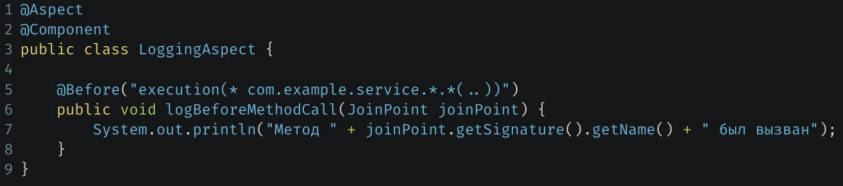  
@Before... перед всеми выполнениями (execution)  
  * .* - первая звезда - означает все классы пакета
  * .*(..) - все методы классов  
  * joinPoint.getSignature().getName() - имя метода  

**JoinPoint** - класс, содержащий информацию о точке внедрения аспекта.  Это место в программе, где аспект может
быть применен. Это может быть при вызове метода, при обработке
исключения, при инициализации объекта и так далее.  
Место в программе прописывается с помощью языка `Pointcut`  

`Примеры Pointcut-ов` - мест выполнения в программе  
```java
//1. все методы
@Pointcut("execution(* *.*(..))")
private void selectAllMetchods(){}

//2. все сеттеры
@Pointcut("execution(* *.set*(..))")
private void selectAllSetters(){}

//3. все методы по поиску строк 
@Pointcut("execution(* *.find*(String))")
private void selectAllStringFinders(){}
```

> @Pointcut можно использовать в других аспектах, типа:  
```java
@Around("selectAllSetters()")
```

В поинткатах (Pointcut) можно указывать несколько точек ввода через || / &&  

Другой пример аспекта `логирования конкретного метода`  
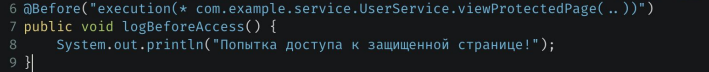  

`@Around`  
Здесь - измерение времени  
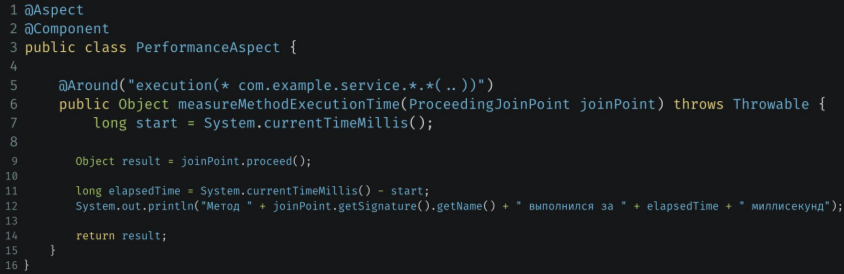   
* ProceedingJoinPoint - точка для выполненного метода  
* @Arount - навешивание функционала вокруг метода (сам аспект как обертка), а выполнение реального метода здесь в **9 строке**  
* обязательно возвращать Object, чтобы отработавший метод вернул значение дальше  

Другой пример **@Around**, здесь вместо пакета используется аннотация (`вызов по наличию аннотации`)  
```java
//аннотация:  
@Target(ElementType.METHOD)
@Retention(RetentionPolicy.RUNTIME)
public @interface Timer {
}

//Spring AOP
@Aspect
@Component
public class TimerAspect {
    @Around("@within(Timer) || @annotation(Timer)") //методы, помеченные аннотацией
    private Object measureExecutionTime(ProceedingJoinPoint joinPoint) throws Throwable {
        long start = System.currentTimeMillis();

        Object result = joinPoint.proceed();

        long elapsedTime = System.currentTimeMillis() - start;

        System.out.println("Метод " + joinPoint.getSignature().getName() + " класса " +
                joinPoint.getTarget().getClass().getSimpleName() + " выполнился за " + elapsedTime + " миллисекунд");

        return result;
    }
}
```


**Аннотации аспектов (виды)**: (Advice - действие, выполняемое аспектом)
* Before Advice - что-то сделать перед выполнением метода. (Можно не заходить в метод)   
Пример - логирование или проверка прав доступа
* After Returning Advice (@AfterReturning) - для изменения возвращаемого значения (после того, как метод УСПЕШНО отработал)
* After Throwing Advice - для перехвата исключения (добавить метрики, логирование и т.д.)
* After (or After Finally) Advice - выполняется каждый раз после вызова метода (даже после исключения)

Как реализовать все возможные функции:  
1. Логирование - Before, Around, After, After Returning, After Throwing
2. Авторизация - Before, Around
3. Exception Handling - After Throwing
4. Транзакции - Around
5. Кэширование - Around
6. Benchmarking (метрики) - Around

`Around Advice` (@Around) - объединяет в себе все остальные
типы advices, так как позволяет вам вмешиваться в вызов
метода до его выполнения, после него и даже изменять
возвращаемое значение или кидать исключение
вместо целевого метода.  

`@After` advice конкретного метода - после выполнения метода (независимо от результата выполнения), пример:  
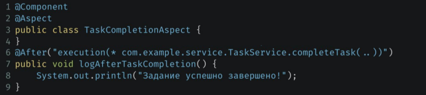  

`@AfterReturning`, здесь - логирование возвращаемого значения конкретного метода. Можно и поменять возвращаемое значение    
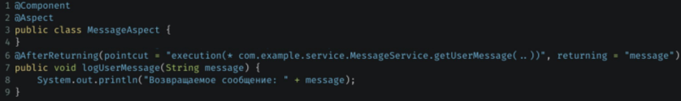 
* message - имя переменной, в которой будет сохранено возвращаемое значение

`@AfterThrowing` - выполнить действие, если целевой метод выбросит исключение. Работает как блок **catch**    
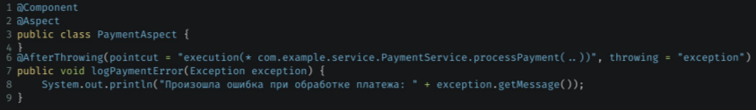  
С помощью этого способа можно:  
1. Логирование.
2. Уведомления. (например, сообщение в телеграмм если приложение упало)
3. Трансформация исключений.
4. Откат транзакций.  

Другой пример `@AfterThrowing` с трасформацией исключений:  
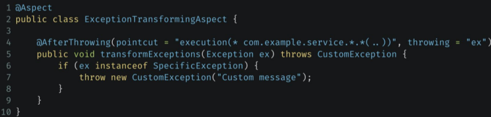  
* название переменной в декларации аннотации должно соответствовать имени аргумента, принимаемого на вход метода

Задать `порядок выполнения аспектов`:  
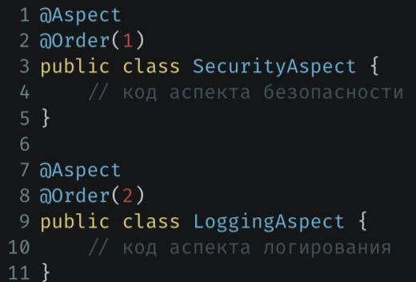 
  * если не задать Order, то advice's в аспекте (классе) будут выполняться в рандомном порядке


---

`Introductions`(Mixin) - компоненты аспектов. Позволяют добавлять новые методы или свойства в существующие бины.  

**Introductions могут быть полезны** в ряде сценариев:  
1. Переиспользование кода
2. Постепенное внедрение новых возможностей
3. Работа с сторонними библиотеками  

**Пример introductions.**  
Здесь, существующий класс Car теперь будет имплементировать интерфейс  
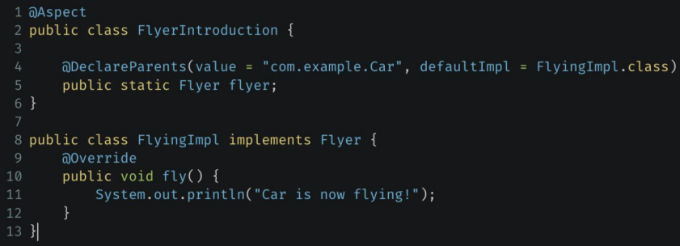  

---

`JDK Dynamic Proxy vs. CGLIB proxy`  - 2 основных механизма создания proxy

**JDK Dynamic Proxy** - создает прокси для интерфейсов (через рефлексию)

**CGLIB proxy** - создает прокси для классов

Аспекты по своей сути - это прокси объекты.   
`Proxy-объект` - это посредник между вызывающим и целевым объектом. (обертка над самим классом)

---

### Транзакции

Транзакция - способ объединения нескольких действий в одно  

Где НЕ ВЕШАТЬ:  
* над интерфейсами - они не имеют отношения к бизнес-логике
* над классом - можно о ней забыть (это плохо)

`@Transational`
  * springframework.transaction.annotation.Transaction - в спринге юзать эту
  * jakarta.transaciton.Transaction

Обозначить метод, как `Транзакцию`:  
```java
@Transactional(propagation = REQUIRED) //из библиотеки спринга
@Transactional(propagation = Propagation.REQUIRED, isolation = Isolation.DEFAULT) //дефолт. REQUIRED - если нет транзакции, то она будет создана
@Transactional(readOnly = true) //над методами СЕРВИСА, которые не подразумевают сохранения/изменения сущностей
```  

`Параметры` аннотации @Transaction:  
* isolation - уровень изоляции
* propagation - как вкладываются транзакции
* timeout - время жизни
* readOnly - true - без права на коммит (намного дешевле по ресурсам)
* rollbackFor - классы исключений, на которых делать откат транзакции (`по умолчанию нет отката на checked-исключениях`)
* norollbackFor - обратная история

`Propagation` (**вложенность/поведение транзакции**):  
* Propagation.**REQUIRED** (дефолтное) - если нет транзакции, то она будет создана. Если произойдет Rollback, то откатятся обе 
* Propagation.**REQUIRED_NEW** - создание новой транзакции в вызываемОМ методе. Транзакция в вызывающЕМ будет приостановлена и возобновлена по завершению вложенной. (пример: попытка списания денег со счета должна быть зафиксирована даже тогда, когда списание в итоге не произошло)
* Propagation.**SUPPORT** - если есть транзакция над вызывающим методом - то будет исполнена, если нет - то метод исполнится без транзакции (БЕСПОЛЕЗНАЯ)
* Propagation.**MANDATORY** - если нет транзакции, то будет брошено ИСКЛЮЧЕНИЕ (исп. на методах Репозитория)
* Propagation.REQUIRED_NEW - всегда создается новая транзакция
* Propagation.**NOT_SUPPORTED** - в момент выполения метода приостанавливаются любые внешние транзакции, чтобы тело метода было выполнено **нетранзакционно**
* Propagation.**NEVER** - если испольуется транзакция, то бросается ИСКЛЮЧЕНИЕ
* Propagation.**NESTED** - запускается во внутренней транзакции, если текущая существует (НА УРОВНЕ `БД`) 

> При вызове внутреннего метода @Transaction над ним не сработает, т.к. идет обращение к классу, а не а бину. (AOP)

`Isolation` (**уровни изоляции транзакции**)  - в соответствии с уровнями изоляции в Википедии и проблемами, которые они решают  

Пример **транзакции**. 
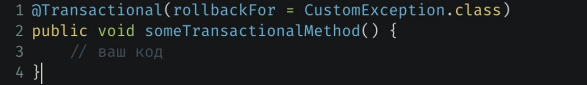  
* rollbackFor - откатываться только  при возникновении CustomException.class

`Rollback` - отрабатывает при exception-ах  
* дефолтно, транзакции не откатываются при checked-исключениях и происходит commit!

`Свойства Транзакции` ACID (с англ. кислота): 
1. **Атомарность** - все или ничего
2. **Консистентность** - результат транзакции становится доступен всем потребителям по окончании транзакции
  * под **консистентностью** понимает переход из одного состояния в другое (счет с деньгами до и после перевода)
3. **Изоляция** - транзакции друг на друга никак не влияют
4. **Дурабилити** - результат выполнения транзакции будет сохранен и откату уже не подлежит

Виды транзакций в реале:
1. локальная - 1 БД для двух точек А и Б
2. глобальная/распределенная - разные БД для точек А и Б на разных машинах - для этих целей может быть общей диспетчер транзакций (ждет сообщения от обеих БД о готовности к коммитам)

`Spring Tx` - модуль для управления транзакциями (часть Spring-JDBC)
  * поддерживает транзакции для разных технологий - JDBC, JPA и т.д.
  * TransactionManager управляет транзакциями

`Виды TransactionManager-a`:  - включаются неявно (автоматически). spring-boot-starter-tx включает в себя все бины
* DataSourceManager - для JDBC
* HibernateTransactionManager - для Hibernate
* JmsTransactionManager - java
* JmsTransactionManager102 - java
* JpaTransactionManager - для JPA

`Виды управления транзакциями`:  
* декларативное - аннотация @Transaction - магия
* императивное - класс TransactionTemplate - много кода

`Блокировка` - способ достижения уровня изоляции транзакции  
  * оптимистичная - исп. версионность изменений в таблице и проверка версии записи перед обновлением. При попытке изменения записи другой версии - WrongVersionException или подобное (исп. когда много чтения и мало изменения)
  * пессимистичная - блокировка записи в БД, когда не позволит зайти другой транзакции (медленнее работает на чтении, исп. на частых модификациях)

---

### Interceptors (перехватчики) 
Обычно используются для перехвата сообщений или HTTP-запросов, а также запросов на выполнение методов  

`Пример перехватчика`  
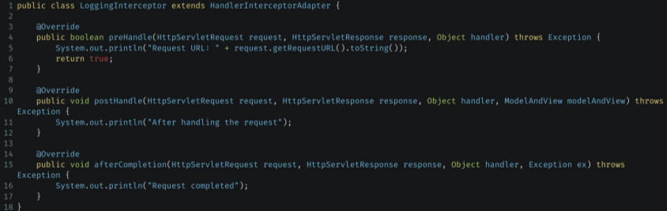  


`все методы в классах вложенных пакетов конкретного пакета`  
```java
@Around("execution(* com.example.restapi.controllers..*.*(..))")
```

---

## OTUS

`Ортогональная функциональность` (cross cutting) - это функциональность приложения, пересекающая все слои. Например, логирование/транзакции/права/кэширование/ловля исключение. Напрямую относится к аспектам.

Нужно добавить над main, если приложение обычный Spring, а не Spring Boot
```java
@EnbaleAspectJAutoProxty
```

еще для выполнения над аннотациями:  
```java
//методы в классах. Помеченные аннотацией
@target("org.springframework.stereotype.Repository")
//методы, помеченные аннотацией
@annotation("org.springframework.annotation.Loggable")
//наследники класса
@this("org.springframework.stereotype.UserSerivceImpl")
//классы, реализующие интерфейсы
@target("org.springframework.stereotype.UserService") //не будет наработать с CGLib
//над конкретным бином
@bean("someBeanName")
```

Когда применять аспекты:  
* только для методов бинов, которые лежат в контексте
* только для публичных методов. На приватных не заработает!
* только если один бин вызывает другой бин


