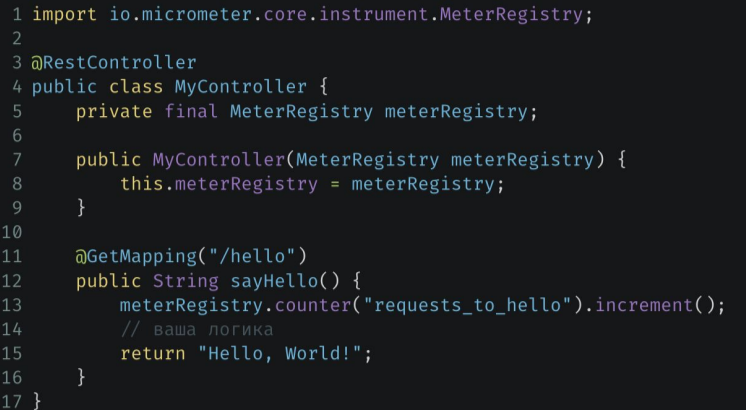

> [НАЗАД к СОДЕРЖАНИЮ](README.md)

---

### Spring Actuator

`Spring Acruator` - вспомогательный элемент для контроля правильности работы приложения, его метрик и его доступности.  

> [Туториал по конфигу актуатора](https://docs.spring.io/spring-boot/docs/current/actuator-api/htmlsingle/#overview) 

`Зависимость`:  
```xml
<dependency>
    <groupId>org.springframework.boot</groupId>
    <artifactId>spring-boot-starter-actuator</artifactId>
</dependency>
```

Эндпоинт `Health` - подняд ли проект, статусы состояния компонентов

> localhost:8080/actuator/health

Кастомизация эндпоинта `Health`  
  

Эндпоинт `Metrics` - сколько оперативной памяти используется, какая нагрузка на процессор, какие запросы к API занимают больше всего времени

> localhost:8080/actuator/metrics   

Кастомизация эндпоинта `Metrics`  
  
* здесь - какой-то свой кастомный счетчик со своей логикой

`Пример своей метрики`   
```java
@Component
public class MyMetric {
    private final AtomicInteger number;
    private final Counter counter; //из библиотеки micrometer

    public MyMetric(MeterRegistry meterRegistry) { //метрики автоматически добавятся в Prometheus
        number = meterRegistry.gauge("custom_gauge", new AtomicInteger());
        counter = meterRegistry.counter("custom_counter");
    }

    @Scheduled(fixedDelay = 1000, initialDelay = 0) //для периодического выполнения
    public void schedule(){
        int random = (int) (Math.random() * 100);
        number.set(random);

        counter.increment();
    }
}
```

Эндпоинт `Info` - визитная карточка приложения. Инфа о разрабе, версия приложения, основные функции
applicatoin.yml: 
```yml 
info:
  app:
    name: library-api
    version: 1.0.0
```

Эндпоинт `Loggers` - эндпоинт для логирования

`JVM-метрики` - по использованию памяти, конфликту потоков и т.д.

`HTTP-метрики` - инфа о взаимодействии с API, время ответа на ручках, какие дольше выполняются и т.д.

Способ изменения уровнея логирования в реальном времени:  
```bash
curl -i -X POST -H `Content-Type: application/json` -d `{"configuredLevel": "DEBUG"}` http://localhost:8080/actuator/logger/com.example.YourClass
```

`Свой эндпоинт`:  


---

ПРАКТИКА

1. Добавить зависимость
2. Включить эндпоинты
```yml
management:
  endpoints:
    jmx:
      exposure:
        include: *
```

---

Системы мониторинга: `Prometheus` и `Grafana`

`Prometheus` - для СБОРА метрик загруженности ручек контроллеров, потоков. Он сам забирает метрики из приложения. Нужно лишь указать путь где ему эти метрики брать  


Включить Prometheus:  //не работает
```yml
management:
  prometheus:
    metrics:
      export:
        enabled: true
```

`Micrometer`:  

1. Добавить зависимость //не забыть сюда же актуатор
```xml
<!--- нужен для таких классов как Timer, Counter и др., подлежащие регистрации в Prometheus-->
<dependency> 
    <groupId>io.micrometer</groupId> 
    <artifactId>micrometer-core</artifactId>
    <version>1.12.4</version>
</dependency>
<!--Prometheus-->
<dependency>
    <groupId>io.micrometer</groupId>
    <artifactId>micrometer-registry-prometheus</artifactId>
    <version>1.12.5</version>
</dependency>
```

2. `Включить метрики и prometheus в проекте`: //РАБОЧИЙ КОНФИГ
```yml
management:
# показывать значение в ДЕшифрованном виде 
  endpoint:
    env:
      show-values: always # все

  endpoints:
    web:
      exposure:
        include: env, metrics, prometheus, health, info
```
> http://localhost:8080/actuator/env - метрики по-максимуму

> http://localhost:8081/actuator/prometheus - постим данные для Prometheus. С этой адреса он будет забирать их для анализа и передачи графане

3. Вызывать где надо //это счетчики и таймеры
  

Создание `кастомной метрики-счетчика`:  


Создание `кастомной метрики-таймера`:  


Поднять Prometheus и Grafana из докера:  
1. отдельная папка
2. prometheus.yml:
```yml
global:
  scrape_interval: 15s #как часто собирать метрики

scrape_configs:
  - job_name: 'library-api'
    metrics_path: 'actuator/prometheus' #где брать метрики
    static_configs:
      - targets: ['host.docker.internal:8081'] #при запущенных нескольких экземплярах приложения -
    #можно указать путь ко всем в массиве
```
3. поднимаем прометеус: 
```bash
docker run -d -p 9090:9090 --name prometheus -v "C:\Users\DELL\Desktop\Разработчик GB\Spring_GB\prometheus-grafana\src\main\resources\prometheus.yml:/etc/prometheus/prometheus.yml" prom/prometheus

```
4. http://localhost:9090 - работающих прометеус (подключенные сервисы будут в разделе Status.Targets)
5. поднимаем графану: 
```bash
docker run -d -p 3000:3000 --name=grafana grafana/grafana
```
6. http://localhost:3000 - работающая графана. Дефолтные логин и пароль: admin
7. на сайте графаны -> menu -> datasource -> add data source -> prometheus (просто выбрать) -> поменять url: http://host.docker.internal:9090 -> save
8. с начальной страницы графаны -> create new dashboard -> настраивать вручную, выбирать метрики и т.д.

---

`Spring Boot Admin` - аналог Prometheus + Grafana.   
  


