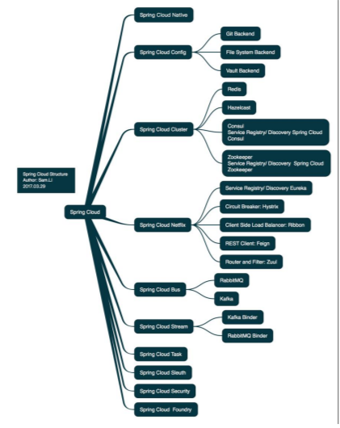
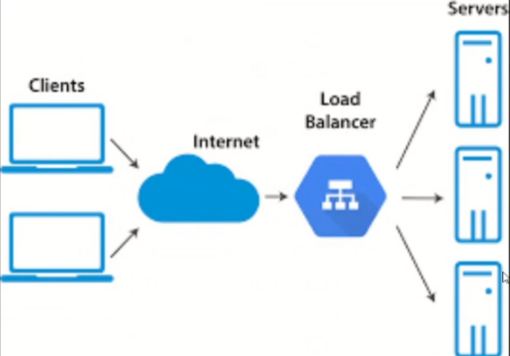
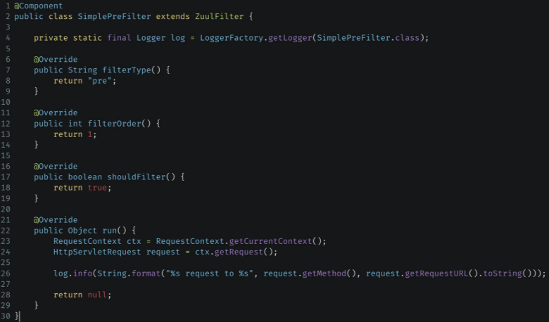
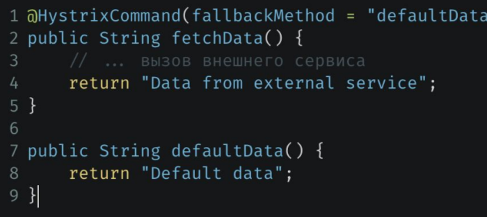

> [НАЗАД к СОДЕРЖАНИЮ](README.md)

---

`Хостеры в РФ`:  
1. Yandex Cloud
2. SelectL
3. best-hoster.ru (дешево, но гибкость меньше)
4. VK Cloud
5. Sber Cloud
6. MTC Cloud
7. Ростелеком

### Spring Cloud (микросервисы) 

- набор инструментов, позволяющих разрабатывать компоненты распределенных систем

Структура Spring Cloud экосистемы:  


`Облако` - это удаленные вычислительные мощности или сервера хранения данных.

`Уровни облаков`:  
1. IaaS (Infrustructure as a Service) - облако = железо
  * уровень администраторов
2. PaaS (Platform as a Service) - облако = железо + ПО для разрабов (БД/tomcat/OC)
  * уровень разработчиков ПО
  * вендоры: Яндекс Cloud, SelectL (русские), Azure (Microsoft), AWS (Amazon), Netflix
3. SaaS (Software as a Service) - облако = железо + готовые решения типа Google Docs, 1C-Cloud (ПО, которое использует БД/tomcat/OC)
  * уровень пользователей

`Виды облаков`:  
1. публичные (Яндекс Cloud, SelectL (русские), Amazon, Azure, Яндекс Cloud, ...)
2. приватные (на своих серверах в своем датацентре)
3. гибрид

`Преимущества микросервисов`:  
1. Быстрый time to market - фичи быстро попадают в прод
2. Опытные команды (команда может отвечать только за свой микросервис и шарить в одном направлении без необходимости разбираться во всем проекте)
3. Масштабирование при минимальных затратах (можно масштабировать отдельный сервис, а не все приложение). Пример: когда корзина в приложении не лагает, а просмотр списка товаров лагает
4. Разделение ответственности (между разными командами - разные микросервисы)
5. Нововведения и эксперименты

`Компоненты Spring Cloud`:  
1. Spring Cloud Config - дает возможность изменять конфиги и в режиме онлайн они вступают в силу. Здесь хранятся ключи, токены, параметры и конфиги
2. Spring Cloud Netflix - для обнаружения сервисов
3. Spring Cloud Gateway - какой-то маршрутизатор. Определяет, к какому микросервису нужно отправить запрос. Еще используется `Zuul` и `Spring Cloud Gateway`
4. Spring Cloud Bus - использует Kafka для обмена сообщениями между разными частями приложения

Простая схема `работы Spring Cloud`:  


> [Алгоритм балансировки нагрузки в Spring Cloud](https://habr.com/ru/companies/ruvds/articles/732648/)  

---

`Eureka` — это **система обнаружения сервисов**,
которую можно представить как «телефонную книгу»
для ваших микросервисов.

**Компоненты:**  
1. Eureka Server - глобальный реестр микросервисов
2. Eureka Client - средство взаимодействия с сервером

Зачем нужна **Eureka**:  
1. Динамичность (подтягивания новых изменений в сервисах)
2. Балансировка нагрузки (между экземплярами сервиса)
3. Отказоустойчивость (перенаправление трафика на работающие экземпляры микросервиса)

---

### Eureka-SERVER

Алгоритм работы:
1. Все сервисы реализуются в виде модулей приложения + зависимость Eureka client
2. Создается отдельный модуль `discover-service`, в котором буду регистрироваться все сервисы. Типа мапы название сервиса - его адрес. Тут две зависимости: spring-boot-starter и Eureka Server

> Все зарегистрированные в Eureka сервисы-клиенты можно найти по адресу: 
localhost:8761/eureka/apps, 8761 - default port  - JSON-версия    
http://localhost:8761/  - UI
  * параметры в UI
    * `Renews(last min)` - 6 количество полученных подтверждений о статусе UP от приложений. По дефолту раз в 30sec, так что значение будет = количество приложений * 2
    * `Renews threshold` - пороговое значение ответов от клиентских приложений. Если (Renews threshold < Renews(last min)), то какие-то проблемы с сетью между клиентским приложением и Eureka-сервером
      * Renews threshold = timeout (по дефолту 30sec) * eureka.server.renewal-percent-threshold/количество приложений

Зависимость `Eureka-СЕРВЕР`:  
```xml
<dependency>
    <groupId>org.springframework.cloud</groupId>
    <artifactId>spring-cloud-starter-netflix-eureka-server</artifactId>
</dependency>
```

Подключить сервер Eureka:  
```java
//над основных классом Application
@EnableEurekaServer
```

Конфиг `application.yml` для Eureka-СЕРВЕР:  
```yml
server:
  port: 8761
eureka:
  server: 
  # для расчета Renews threshold (на UI эврики). default = 0.75
    renewal-percent-threshold: 0.5
  instance:
    hostname: localhost
    #через сколько забыть приложение после потери с ним сети
    lease-expiration-duration-in-seconds: 90
  client:
  #регистрировать ли данное приложение в Eureka-server в качестве клиента
    register-with-eureka: false
    #получать ли данные о приложениях, зарегистрированных в Eureka. Для Eureka-сервера не нужно крч.
    fetch-registry: false
    service-url:
      defaultZone: http://${eureka.instance.hostname}:${server.port}/eureka/
```

Получить приложения, зарегистрированные в Eureka:  
```java
Application application = eurekaClient.getApplication("BOOK-SERVICE");
//List<InstanceInfo> instanceInfos = application.getInstances(); // - если приложений с таким ключом несколько  (когда несколько экземпляров приложения находятся на разных серверах, например)
```

---

### Eureka-CLIENT

Зависимость `Eureka-КЛИЕНТ`:  
```xml
<dependency>
    <groupId>org.springframework.cloud</groupId>
    <artifactId>spring-cloud-starter-netflix-eureka-client</artifactId>
</dependency>
```

Подключить клиент к Eureka:  
```java
//над основных классом Application
@EnableDiscoveryClient //от сельского джависта
```

Конфиг `application.yml` для Eureka-КЛИЕНТ: 
```yml
spring:
  application:
    name: issue-service ## как будет называться приложение в регистре Eureka
eureka:
  client:
    register-with-eureka: true
    fetch-registry: true
    service-url:
      defaultZone : http://localhost:8761/eureka/
  instance:
    # как часто отправлять данные о себе на Eureka-сервер
    lease-renewal-interval-in-seconds: 30
```

Получить `ip-адрес и порт` EUREKA-клиента (1 способ):  
```java
    private String getBookServiceIp(){
        Application application = eurekaClient.getApplication("BOOK-SERVICE");
        List<InstanceInfo> instanceInfos = application.getInstances();

        Random random = new Random();
        InstanceInfo randomInstance = instanceInfos.get(random.nextInt(instanceInfos.size()));
        return "http://" + randomInstance.getIPAddr() + ":" + randomInstance.getPort();
    }
```

Получить `ip-адрес и порт` EUREKA-клиента (2 способ):  
```java
private final EurekaClient discoveryClient; //бин заинжектится
//
var clientInfo = discoveryClient.getNextServerFromEureka("SERVICE-CLIENT-INFO", false);
```

---


### Zuul //лучше spring-cloud-gateway

`Zuul` -  это API Gateway, что в переводе
можно назвать «шлюзом для API». Он осуществляет маршрутизацию запроса между микросервисами  

**Функции Zuul**:  
1. Маршрутизация между сервисами
2. Фильтрация - аутентификация и авторизация и т.д.
3. Защита от нежелательного трафика, ограничение запросов
4. Отказоустойчивость - может автоматически повторять запросы к другим экземплярам микросервиса, если первый экземпляр не отвечат

В основе работы Zuul лежат фильтры.  
`Типы фильтров Zuul`:  
1. Пред-фильтры (Pre Filters) - для задач по предварительной обработке запросов. Также могут играть роль регистратора или логгера
2. Фильтры маршрутизации (Route Filters) - определяют путь, куда будет направлен запрос
3. Пост-фильтры (Post Filters)
4. Фильтры ошибок (Error Filters)

`Зависимость Zuul`: 
* использовать совместно с зависимостью Eureka-CLIENT     
```xml
<dependency>
    <groupId>org.springframework.cloud</groupId>
    <artifactId>spring-cloud-starter-netflix-zuul</artifactId>
</dependency>
```

`Включить Zuul`:  
```java
//Над основным классом Application
@EnableZuulProxy
```

`Конфиг application.yml для Zuul`:  
```yml
eureka:
  client:
    service-url:
      defaultZone : http://localhost:8761/eureka/
zuul:
  routes:
    myservice:
      url: http://localhost:8080
```

`Применение Zuul-фильтра`  
  
* filterType - тип фильтра, с которым мы бы хотели раотать
* filterOrder - порядковый номер выполнения фильтра
* shoultFilter - следует ли вообще запускать этот фильтр
* run - реализация логики фильтра

---

### Spring Cloud Config

Плюсы:  
1. Централизованное хранилище конфигов
2. Динамическое обновление приложения
3. Безопасность - шифрование данных

### Cloud Config Server

`Зависимость` Spring Cloud Config SERVER:  
```xml
<dependency>
    <groupId>org.springframework.cloud</groupId>
    <artifactId>spring-cloud-config-server</artifactId>
</dependency>
```

`Включить Cloud Config SERVER`:  
```java
//Над основным классом Application
@EnableConfigServer
```

`Конфиг application.yml для CloudConfig SERVER`:  
```yml
spring:
  cloud:
    config:
      server:
        git:
          uri: URL_РЕПОЗИТОРИЯ
```

---

### Cloud Config Client

`Зависимость`:  
```xml
<dependency>
    <groupId>org.springframework.cloud</groupId>
    <artifactId>spring-cloud-config-client</artifactId>
</dependency>
```

`Конфиг application.yml для CloudConfig CLIENT`:  
```yml
spring:
  cloud:
    config:
          uri: URL_CONFIG_SERVER
```

`Зависимость для HTTP-запросов между микросервисами`  
```xml
        <dependency>
            <groupId>org.springframework.boot</groupId>
            <artifactId>spring-boot-starter-webflux</artifactId>
        </dependency>
```

Пример Spring HTTP-запросов к другим сервисам Eureka:  
```java
public class BookProvider {

    private final WebClient webClient;

    public BookProvider(ReactorLoadBalancerExchangeFilterFunction loadBalancerExchangeFilterFunction) {
        webClient = WebClient.builder()
                .filter(loadBalancerExchangeFilterFunction) //автоматическая балансировка между сервисами
                .build();
    }

//для получения примитива
    public UUID getRandomBookId() {
        Book randomBook = webClient.get()
//                .uri("http://localhost:8180/book/random")
//                .uri(getBookServiceIp() + "/book/random")
                .uri("http://book-service/book/random") //на какой адрес запрос. Работает с ReactorLoad... в фильтре
                .retrieve() //осуществит запрос
                .bodyToMono(Book.class) //преобразовать ответ в объект Класса
                .block(); //ждем ответа, только потом продолжаем выполнять остальной код

        return randomBook.getId();
    }

//для получения списка
    public List<IssueEntity> getReaderIssues(long readerId) {

        return webClient.get()
                .uri("http://issue-microservice/readersIssues/" + readerId)
                .retrieve() //осуществить запрос
                .bodyToFlux(IssueEntity.class) //преобразовать ответ в объект Класса
                .collectList()
                .block();
    }
```

> Обновление конфига НЕМЕДЛЕННО
```xml
<dependency>
    <groupId>org.springframework.cloud</groupId>
    <artifactId>spring-cloud-starter-bus-amqp</artifactId>
</dependency>
```  
и делать какой-то POST-запрос

---

### Hystrix

`Hystrix` - контролирует сбои и время ожидания ответов от сервисов. Предоставляет «обертку» вокруг ваших внешних вызовов.   

**Функции**:  
1. Обнаружение ошибок
2. Обход ошибок
3. Ограничение потоков
4. Резервные стратегии
5. Мониторинг и метрики

`Зависимость`:  
```xml
<dependency>
    <groupId>org.springframework.cloud</groupId>
    <artifactId>spring-cloud-starter-netflix-hystrix</artifactId>
</dependency>
```

`Активация Hystrix`:  
```java
@EnableCircuitBreaker
```

`Защита метода с помощью Hystrix`:  

* второй метод должен находиться в этом же классе (вроде как)

Один из `конфигов Hystrix`:  
```yml
# таймаут в миллисекундах
hystrix:
  command:
    default:
      execution:
        isolation:
          thread:
            timeoutInMilliseconds: 2000
```

---

### Hystrix Dashboard - для мониторинга

`Зависимость`
```xml
<dependency>
    <groupId>org.springframework.cloud</groupId>
    <artifactId>spring-cloud-starter-netflix-hystrix-dashboard</artifactId>
</dependency>
```

`Активация мониторинга Hystrix`:  
```java
@EnableHystrixDashboard
```

---

### Spring Cloud Gateway

`Spring Cloud Gateway` - это новый компонент в библиотеке Spring Cloud, который предоставляет реактивный и неразрывный шлюз API для микросервисных архитектур. Он использует проект Reactor для обеспечения высокой производительности и надежности при обработке запросов. Для использования Spring Cloud Gateway в вашем проекте выполните следующие шаги:

1. Добавьте `зависимость` Spring Cloud Gateway в ваш проект:
   Добавьте зависимость spring-cloud-starter-gateway в pom.xml или build.gradle вашего проекта Spring Cloud. Это позволит использовать Spring Cloud Gateway и его функциональные возможности в вашем приложении.

2. Создайте `класс конфигурации` и настройте маршруты:
   Создайте класс конфигурации, в котором определены маршруты, которые должны быть обработаны Spring Cloud Gateway. Это можно сделать с помощью класса RouteLocatorBuilder, который предоставляет удобный DSL для создания маршрутов.

```java
   @Configuration
   public class GatewayConfig {

    //Spring Cloud Gateway
    @Bean
    public RouteLocator customRouteLocator(RouteLocatorBuilder builder) {
        return builder.routes()
                .route("issue-microservice", r -> r
                        .path("/issue/**", "/ui/issue/**")
                        .uri("http://issue-microservice")
                )
                .route("book-microservice", r -> r
                        .path("/book/**", "/ui/book/**")
                        .uri("http://book-microservice")
                )
                .route("reader-microservice", r -> r
                        .path("/reader/**", "/ui/reader/**")
                        .uri("http://reader-microservice")
                )
                .build();
    }
```

   В этом примере определены два маршрута: users-route и orders-route. Запросы, начинающиеся с /users/, будут направляться на микросервис "users-service", а запросы, начинающиеся с /orders/, будут направляться на микросервис "orders-service".

### Spring Cloud Трассировка / Spring Cloud Sleuth

- проект больше не поддерживается командой Spring. Новая замена: `Micrometer Tracing`

Observability - способность наблюдать за поведением/изменением внутреннего состояния приложения.

`Виды обсервабилити`:
1. логи
2. метрики
3. трассировка

`Трассировка` - это пусть, по которому запрос проходил через систему. Зачем нужно? Вычихлить, где и какие запросы работают медленно

`Zipkin` - система для распределенной трассировки

`Docker для Zipkin`
```bash
docker run -d -p 9411:9411 openzipkin/zipkin
```

`Зависимости`
```xml
<dependency>
    <groupId>io.micrometer</groupId>
    <artifactId>micrometer-tracing-bridge-otel</artifactId>
    <version>1.3.5</version>
</dependency>
<dependency>
    <groupId>io.opentelemetry</groupId>
    <artifactId>opentelemetry-exporter-zipkin</artifactId>
    <version>1.43.0</version>
</dependency>
```

Конфиг трассировки
```yml
management:
  tracing:
    sampling:
      probability: 1.0 #какой процент трассировок сохранять. Здесь 100%, в реале 
```

### Spring Cloud Circuit Breaker

`Зависимость`
```xml
<dependency>
    <groupId>org.springframework.cloud</groupId>
    <artifactId>spring-cloud-starter-circuitbreaker-resilience4j</artifactId>
    <version>3.1.2</version>
</dependency>
```

[Пример OTUS](https://github.com/petrelevich/jvm-digging/blob/main/spring-cloud/service-client/src/main/java/ru/demo/controller/ClientController.java)

- раньше использовался **Netflix Hystrix**
- интегрируется с несколькими библиотеками. Основная: `Resilience4J`

`Resilience4J` - предоставляет разные функции обеспечения устойчивости приложения. Основная идея - если отваливаетя один из микросервисов, изолировать его и не давать отправлять в него HTTP-запросы.
  * реализует паттерны Circuit Breaker, Rate Limiter, Retry, Bulkhead

[Resilience4j через Аннотации Habr](https://habr.com/ru/articles/793550/)

Элементы Resilience4J:
  * circuitBreaker - ограничитель времени на ответ от внешних сервисов
  * rateLimiter - ограничитель запросов в единицу времени

java-конфиг Resilience4J
```java
    @Bean
    public RateLimiterConfig rateLimiterConfig() {
        return RateLimiterConfig.custom()
                .timeoutDuration(Duration.ofMillis(100)) //точность измерения временного окна, относительно времени текущего запроса - limitRefreshPeriod
                .limitForPeriod(1) //сколько запросов можно отправить 
                .limitRefreshPeriod(Duration.ofSeconds(30)) //в этот интервал времени
                .build();
    }

    @Bean
    public RateLimiter rateLimiter(RateLimiterConfig config) {
        return RateLimiter.of("defaultRateLimiter", config);
    }

//фабрика circuitBreaker
    @Bean
    public Customizer<Resilience4JCircuitBreakerFactory> defaultCustomizer() {
        return factory -> factory.configureDefault(id -> new Resilience4JConfigBuilder(id)
        //настройка, при которой если приложение, к которому мы обращаемся, не отвечает в течении 5 секунд, то изолировать его и более не ждать ответа
                .timeLimiterConfig(TimeLimiterConfig.custom().timeoutDuration(Duration.ofSeconds(5)).build())
                .circuitBreakerConfig(CircuitBreakerConfig.ofDefaults())
                .build());
    }

//создание дефолтного circuitBreaker
    @Bean
    public CircuitBreaker circuitBreaker(CircuitBreakerFactory<?,?> circuitBreakerFactory) {
        return circuitBreakerFactory.create("defaultCircuitBreaker");
    }
```

`Как это работает`. Обернуть нужный функционал в circuitBreaker. Пример:
```java
private final CheckedFunction<String, String> getAdditionalInfoFunction;
//
//конструктор класса, в котором применяется
    public ClientController(
                            CircuitBreaker circuitBreaker,
                            RateLimiter rateLimiter) {

        this.getAdditionalInfoFunction = RateLimiter.decorateCheckedFunction(rateLimiter,
                name -> circuitBreaker.run(() -> getAdditionalInfo(name),
                        t -> {
                            log.error("delay call failed error:{}", t.getMessage());
                            //что возвращать, если время обращения к другому сервису истекло, и мы его считаем изолированным с помощью circuitBreaker 
                            return "unknown info";
                        }));
    }
```