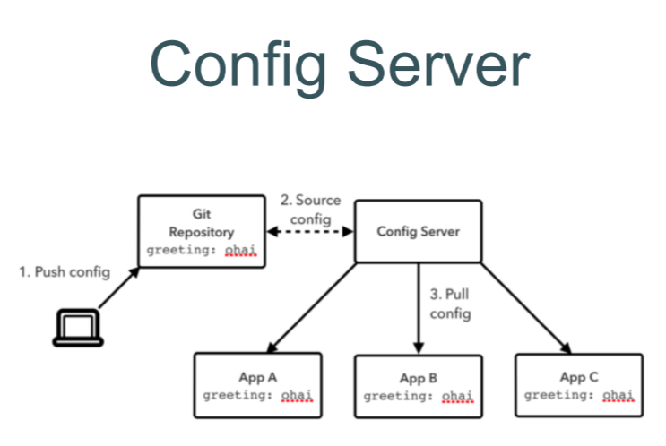

# Spring Cloud Config

- по REST раздает конфиги, в основном из Git

[Пример репо с конфигами от OTUS](https://github.com/petrelevich/jvm-digging/blob/main/spring-cloud/git-config/application.yml)

[Habr](https://habr.com/ru/articles/764402/)

Алгоритм работы: 
1. расположить в отдельном git-репозитории yml-конфиги для приложения
2. добавить зависимость конфиг-сервера в отдельное приложение-сервер
3. повесить над Main аннотацию `@EnableConfigServer`
4. прописать конфиг в application.yml
5. добавить конфиг в приложения-клиенты

`Зависимость`
```xml
<dependency>
    <groupId>org.springframework.cloud</groupId>
    <artifactId>spring-cloud-config-server</artifactId>
</dependency>
```



`конфиг .yml для приложения-сервера`. Оно будет тянуть настройки из гита. К нему будут обращаться приожения-клиенты за конфигами
```yml
spring: 
  cloud:
    config:
      server:
        git:
          uri: "git@github.com:timofeev.vadim.96/some-projectname.git"
          #если в репозитории нет подмодулей, то штука подобного рода не нужна
          search-paths: "spring-cloud/git-config"
          #хз шо это. Как-то относится к настройкам авторизации
          ignoreLocalSshSettings: false
          strictHostKeyChecking: false
```
  * по умолчанию ищет в ветке "main"

`конфиг .yml для приложения-клиента`. Оно будет обращаться к отдельном приложению-серверу за конфгиами, скачанными из гита
```yml
spring:
  cloud:
    config:
    # если приложению не удалось получить конфигурацию, оно не будет запущено.
      fail-fast: true
      retry:
      #через какое время после запуска приложения обращаться за настройками к конфиг-серверу
        initial-interval: 5000
        max-attempts: 10
        max-interval: 5000
        multiplier: 1.2
  #куда обращаться за конфигами (отдельное приложение)
  config:
    import: optional:configserver:http:localhost:8080
  #ограничивает вес конфигурационного файла
  codec:
    max-in-memory-size: 10MB
```


