> [НАЗАД к СОДЕРЖАНИЮ](README.md)

---

Евгений Манько - преподаватель GeekBrains 

`Framework` - каркас/платформа, которая определяет структуру системы (приложения), и облегчает разработку компонентов
системы и их интеграцию, предоставляет определенные паттерны разработки

## SPRING FRAMEWORK

от 2003г. 

Spring базируется не нескольких принципах. Ключевые из них:  
💡 **DI**, или внедрение зависимостей, — это  
концепция, которая позволяет нам делать  
наши приложения более гибкими и легкими  
для тестирования.  
Способы внедрять зависимости:
1. Через конструктор //99% случаев
2. Через сеттер
3. Через поле, помеченное @Autowired

💡 **IoC**, или инверсия управления, — это еще  
одна важная концепция в Spring. Она означает,  
что не наше приложение контролирует  
жизненный цикл его компонентов (как это  
обычно происходит), а наоборот —  фреймворк  
контролирует наше приложение.

### Spring Boot

`Spring Boot` - это популярный фреймворк для создания веб-приложений с использованием Java. Это часть фреймворка Spring, которая представляет собой набор инструментов и библиотек для создания приложений корпоративного уровня. Spring Boot упрощает создание автономных приложений производственного уровня, которые можно легко развернуть и запустить с минимальной конфигурацией.

@SpringBootApplication - точка входа в SPRING-приложение

> Визуальный конструктор MAVEN pom.xml проекта SPRING: https://start.spring.io/ - сам проверит совместимость версий !!!!!!!!!!!!

### Тема: Spring `Аннотации`

`Java Аннотации` - специальный вид комментариев для передачи инструкций компллятору, либо анализаторам кода, а также метаданные, исполуемые другими приложениями или фреймворками.

+ @Component("musicBean") - для создания бина из класса. Можно указать id. по дефолту - id=название класса с маленькой буквы
+ @Service - тоже самое,что компонент. Только сервисом называют тот класс, который выполнеяет отдельную задачу приложения
+ @Controller / @RestController -тоже самое. Используется на классах, контролирующих состояние ряда моделей
+ @Autowired - для автоматического внедрения зависимостей. Фактически, используется с полем только. Ищет подходящий тип по интерфейсу или классу
  * если спринг не найдет зависимость -> UnsatisfiedDependencyException
  * если спринг находит несколько подходящих бинов -> UnsatisfiedDependencyException
  * используется на полях - внедрит даже в приватное, даже без сеттера или конструктора (с помощью Reflection API)  

> при работе с контроллерами отключай транзакционность

```yml
  jpa:
    open-in-view: false
```

`@GetMapping`("/some-url", produces = MediaType.TEXT_PLAIN_VALUE, consumes = ..., params = "name") //помечаются методы, которые будут вызываться при вызове определенной URL, **produces** - тип данных, которые возвращает, **consumes** - тип принимаемых данных, **params** - указывать, если метод принимает @RequestParam, чтобы отличать два эндпоинта с одинаковым путем, но разными входными параметрами

p.s.
Spring берет все наши классы как бы из контейнера. 
Есть две реализации этого контейнера:  
* BeanFactory - базовая реализация
* ApplicationContext - расширение BeanFactory, предоставляющее возможность интеграции с другими компонентами и использование аннотаций

**Бины** могут быть помечены:  
@Component  - просто бин
@Service  - тоже самое
@Repository  - тоже самое
@Contoller  - тоже самое
@Configuration  - используется с @Bean для более сложного создания бинов
@Bean  - используется с @Configuration

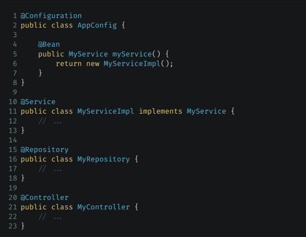
 

`Область видимости бинов` (Bean scope)  
@Scope - задает то, КАК Spring будет создавать бины  
Виды scope:   
* Чаще всего - Singleton - по умолчанию. При всех вызовах getBean() - возвращается один и тот же объект //используетяс тогда, когда у нашего бина нет изменяемых состояний (свойств)
* Prototype - создает новый объект каждый раз при вызове getBean() //не до конца решает вопрос многопоточности - реально помогает лишь не шарить уникальное состояние. Практически используется в КЭШЭ (p.s. если запроксировать с помощью proxyMode = ScopeProxyMode.INTERFACES, то будет вести себя как Request)
* Request - создается и живет в рамках каждого HTTP-запроса - использовать для хранения временных данных, данных о пользователе, сообщений об ошибках
* Session - тоже самое, только в рамках HTTP-сессии (корзина покупок, настройки пользователя или информация о входе в систему)
* Web-socket - область видимости для бинов, связваемых в жизненном цикле web-socket

Чтобы `внедрить бин, создающийся не сразу` - можно создать его прокси при подъеме контекста:  
```java
@Scope(value = "session", proxyMode = ScopedProxyMode.INTERFACES)
@Bean
public AnyDependency anyDependency() {
    return new AnyDependency();
}

//внедряем его в синглтон-бин
@Bean
public AnyService anySerivce(AnyDependency anyDep){
    ...
}
```

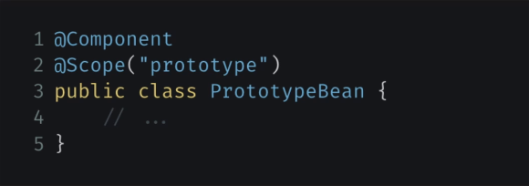

`Алгоритм создания под капотом Spring-приложения: ` 
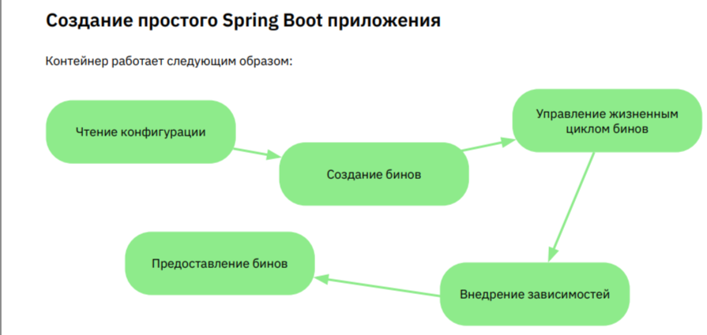

Способы конфигурации:  
1. через файлы application.properties или properties.yml  
  1.1 .properties - каждый параметр задается в виде пары ключ=значение  
  1.2 .yml - структурированные данные с помощью отступов  
2. через Java-код

Пример yaml:  
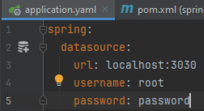

**Другие параметры конфигурации:**  
✔ server.port: порт, на котором будет работать ваше приложение.  
По умолчанию это 8080, но вы можете задать любой другой порт.  
```yaml
server:
  port: 8180
``` 
✔ spring.application.name: имя вашего приложения.  
Оно может быть полезно для логирования и других вещей.  
✔ **spring.profiles**.active: активные профили Spring.  
✔ logging.level.root: уровень логирования для вашего приложения.  
Вы можете задать его, например, как INFO, WARN, ERROR или DEBUG.  
  * DEBUG - писать все   

✔ spring.main.banner-mode: режим баннера при запуске вашего приложения.  Вы можете отключить баннер, установив этот параметр в OFF  

Чтобы достать нужные поля из конфигурационного файла, нужно пометить класс, в который достаем с помощью `@ConfigurationProperties`  

> НЕ ЗАБУДЬ СЕТТЕРЫ К ПОЛЯМ!!!

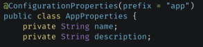  
Здесь prefix - **необязательный** параметр

`Профили`   
С помощью профилей можно использовать классы, предназначенные для одних целей, но с разными реализациями на разных машинах  
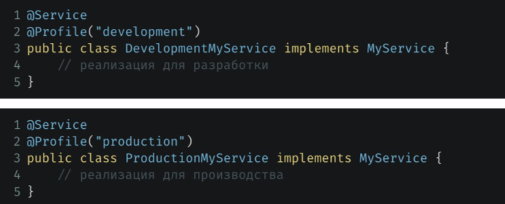  
Например, в первом случае используется локальная БД, а во втором - корпоративная БД. **Ключевой момент** - реализация одного интерфейса  

`Использовать профиль`  
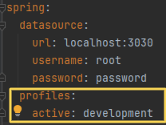  
  * можно указать НЕСКОЛЬКО профилей через запятую

Также, можно `включать каскад настроек` в зависимости от наличия профиля:  
```yml
condition:
    yanis-exists: false
spring:
    profiles:
        active: Oleg, Peter
---
spring:
    config:
        activate:
            on-profile: Peter
# перебьет конфиг, если подрублен профиль Peter
condition:
    yanis-exists: true
```

> Можно подрубить еще один файл конфигурации, если профиль активен. В таком случае, он должен называться application-profileName.yml

`@Configuration` - для конфигурации через Java-код
```java
@Configuration
@ComponentScan("org.example") //рекурсивно сканирует все бины в указанном пакете, либо если не указан пакет - в текущем и ниже (не ищет интерфейсы)
public class SpringConfig {
    @Bean
    public RockMusic rockMusic(){
        return new RockMusic();
    }
}
```

@Import(SomeClazz.class) - для импорта конерктного класса или класса-конфига, когда другие бины не нужны

### Клиент-сервер  

**Клиентом** является обычно браузер или приложение,
который отправляет HTTP-запросы на сервер.   
**Сервер** — это
машина или приложение, которое слушает эти запросы,
обрабатывает их и отправляет обратно HTTP-ответы.

`Протоколы`  
- **HTTP**, или гипертекстовый протокол передачи данных, —
это основной протокол, используемый в вебе для
передачи данных. HTTPS — это просто защищенная версия HTTP.
- **WebSocket** — это другой протокол, который
предназначен для обеспечения двусторонней связи между
клиентом и сервером.  
- **gRPS** - протокол от Google. Он поддерживает
множество языков программирования и позволяет
клиентам и серверам обмениваться данными как
через единственный запрос/ответ, так и через
потоковые вызовы.

## REST

`REST` - это архитектурный стиль, используемый для обмена данными в вебе в формате клиент-сервер. (пример: **JSON**)  
`Требования`  
  * общение в формате запрос-ответ
  * на сервер отсутствует состояние клиента (сервер не знает, что на данный момент видит пользователь)   
  Пример: корзина с покупками должна быть на фронтенде вплоть до формирования заказа
  * юзаем кэширование
  * простой интерфейс API (ресуры идентифицируются по URL как ресурс/папка) 
    * person/12/order/12 - однозначно идентифицируют пользователя и его заказ
  * клиент не должен знать общается ли он с сервером, или с промежуточным звеном (балансер, сервер авторизации)

---

`Методы HTTP-запросов:`
* Get - для запроса данных с сервера. Тело запроса пустое. Но некоторые **параметры** поиска могут передаваться в самом URL после знака "?" в формате ключ=значение, такие параметры разделяются амперсантом И "&"  
* Post - для отправки данных на сервер, чтобы создать новый ресурс. 
* Put - для обновления существующего ресурса на сервере. 
* Patch
* Delete - для удаления ресурса на сервере.

`HTTP-коды ответов:`  
* 200 ОК - запрос был успешно обработан.  
* 201 Created - запрос был успешно обработан, и был
создан новый ресурс. 
* 400 Bad Request - запрос неправильно сформирован и
сервер не может его обработать.
* 404 Not Found - запрошенный ресурс не найден
на сервере.
* 500 Internal Server Error - на сервере произошла ошибка при обработке запроса.   

`Структура http-запроса`  
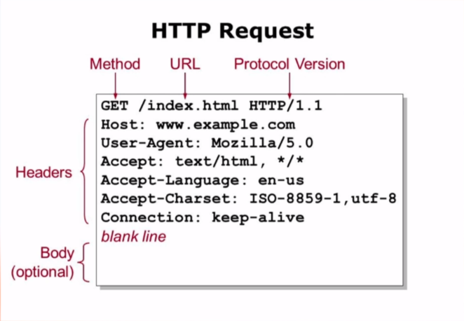  
* method - тип запроса  
* url - запришиваемый ресурс
* protocol version - версия протокола
* header - заголовки (информация о клиенте)
* body (не обязательно) - тело запроса

CRUD-APP стандарт адресов (из стандарта REST):  

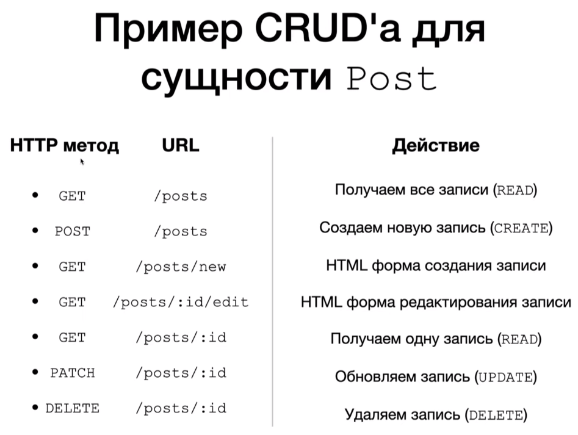

`Контроллер в Spring` — это компонент, который
обрабатывает входящие HTTP-запросы. В нем прописываются какие именно запросы могут быть обработаны и как на них реагировать.  
Контроллер в Spring помечается аннотацией `@Controller`

`@Controller` - именно в таком виде аннотации - для возвращения HTML-страниц.

`@RestController` - является специализацией @Controller и используется, когда вы хотите, чтобы результат вашего метода контроллера был автоматически преобразован в JSON (или в другой формат, такой как XML), чтобы возвращаться как тело HTTP-ответа. Она часто используется для создания веб-сервисов (RESTful API). Автоматически добавляет @ResponseBody к каждому методу контроллера, что позволяет возвращать данные напрямую в теле HTTP-ответа вместо представлений (views). (чаще всего - JSON).

`Разница между @Controller и @RestController`  
В Spring, аннотация **@RestController** используется для
создания HTTP API, возвращая данные, которые клиент может
обрабатывать, в то время как **@Controller** обрабатывает HTTPзапросы и возвращает веб-страницу с возможными
динамическими данными. При использовании @Controller,
наш код легко интегрируется с **Thymeleaf** и другими
технологиями для создания динамических веб-страниц.


`Образец REST-контроллера` 
```java
@RestController
@RequestMapping("/task")
public class TaskController {
    private TaskService taskService;

    public TaskController(TaskService taskService) {
        this.taskService = taskService;
    }

    @GetMapping
    public List<Task> getAllTasks(){
        return taskService.getTasks();
    }

    @GetMapping("/{id}")
    public Task getTask(@PathVariable("id") UUID id){
        return taskService.getTask(id);
    }

    @PostMapping
    public ResponseEntity<Task> postTask(@RequestBody Task newTask){
        Task createdTask = taskService.add(newTask);
        return new ResponseEntity<>(createdTask, HttpStatus.CREATED);
    }
    @PutMapping("/{id}")
    public ResponseEntity<Task> updateTask(@PathVariable("id") UUID id, @RequestBody Task newTask){
        Task createdTask = taskService.update(id, newTask);
        return new ResponseEntity<>(createdTask, HttpStatus.OK);
    }

    @DeleteMapping("/{id}")
    public void deleteTask(@PathVariable("id") UUID id){
        taskService.delete(id);
    }

}
```

> В случае, когда `ресурс не найден` можно вернуть 
```java
return ResponseEntity.notFound().build();
```

Правильное `возвращение объекта при его создании` (с его адресом, куда можно обратиться в дальнейшем для его получения):  
```java
    @PostMapping
    public ResponseEntity<BookEntity> addBook(@RequestBody BookEntity inputBookEntity) {
        BookEntity bookEntity = service.save(inputBookEntity);
        URI location = ServletUriComponentsBuilder 
                .fromCurrentRequest() //создать сервлет на основе текущего HTTP-запроса
                .path("/{id}") //добавляет путь /{id} к URI, где {id} - это идентификатор сущности bookEntity.
                .buildAndExpand(bookEntity.getId()) // заменяет переменные пути ({id}) значением фактического идентификатора сущности bookEntity.
                .toUri(); //возвращает объект URI, представляющий конечную точку ресурса, к которому следует перейти или созданный ресурс.
        return ResponseEntity.created(location).body(bookEntity);
    }
```

**Альтернатива положительного ответа** через new ResponseEntity... :  
```java
ResponseEntity.status(HttpStatus.CREATED).body(issue);
```

`При Delete-запросе HTTP возвращать: ` 
```java
ResponseEntity<Void>
```

`@RequestMapping`("/api", params = "name") - указывать params, если метод принимает @RequestParam, чтобы отличать два эндпоинта с одинаковым путем, но разными входными параметрами

Аннотация `@RequestMapping`("/api") - все URL-запросы должны иметь в теле "/api/"
  * Устаревший вариант > 5 лет - @RequestMapping(value = "/new", method = RequestMethod.GET) //после точки - вид запроса

`Аннотация @RequestMapping`
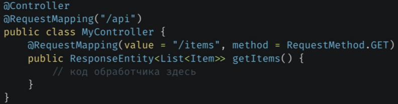

**Возвращаем ответ**  
Чтобы вернуть ответ из обработчика, мы просто возвращаем объект, который должен быть включен в тело
ответа. Spring автоматически преобразует его в нужный формат (обычно JSON). Чтобы контролировать
другие аспекты ответа, такие как HTTP-статус, мы можем использовать класс `ResponseEntity`. В него можно засунуть:  
* HTTP status code
* Response Body
* Header-ы
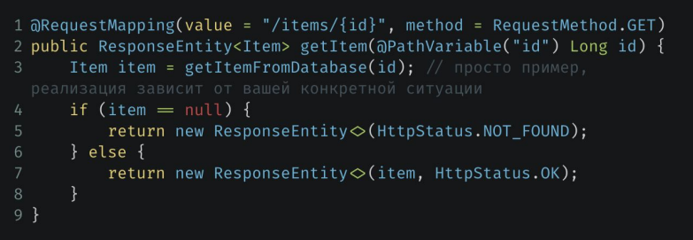

`@PathVariable`("id") - получение переменной из запроса "items/{id}", когда такая переменная обязательна  

**Работаем с параметрами запроса**  
Для того чтобы принять параметры из строки запроса, мы можем использовать аннотацию `@RequestParam`. (параметры передаются через ?ключ=значение&ключ=значение)
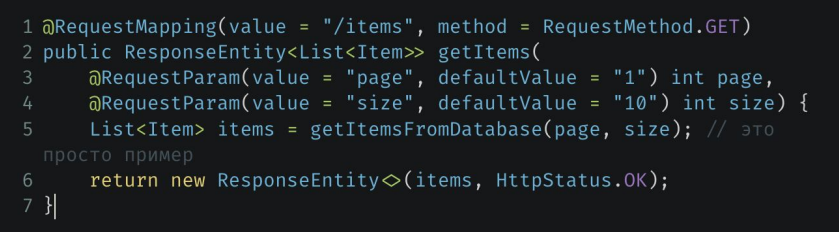

`Сделать не обязательным параметр @RequestParam`:  
```java
@RequestParam(required = false)
```

`@RequestParam`(value = "amount") long id. Если используем примитив, то параметр обязательный, если Обертку, то может быть null.

**Обработка исключений в Spring**  
В Spring мы можем использовать
аннотацию `@ExceptionHandler` для определения методов, которые будут обрабатывать определенные
исключения.
  
  * можно и не внедрять исключение в метод в качестве параметра 

Также, можно определить целый `класс для перехвата всех исключений` и реализовать в нем методы их обработки  
Такие классы помечаются с помощью `@ControllerAdvice`  
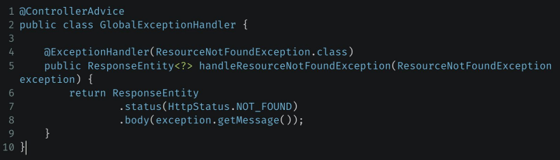

**Обработка JSON в Spring**  
Большинство RESTful API используют JSON для обмена данными. Spring автоматически преобразует объекты в JSON и наоборот. Все, что нам нужно сделать, это использовать аннотацию `@RequestBody` для принятия JSON
в качестве входных данных и возвращать объекты из наших обработчиков.
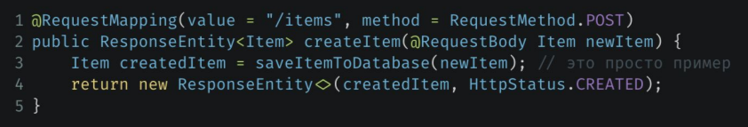 

`@RequestHeader` - для получения значение конкретного заголовка в запросе

**Составление HTTP-запросов, включая POST**  
Для этого используется программа HTTPie - аналог Postman    
[ссылка: HTTPPie](https://httpie.io/app) или приложение локально на ПК

`Postman` — это приложение, которое
позволяет вам легко создавать и отправлять HTTP-запросы
к любому эндпоинту и просматривать ответы.   
https://www.postman.com/downloads/

`Пример использования для POST-запроса в HTTPie`  
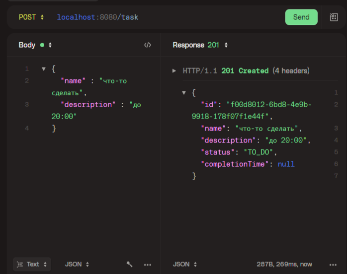  
* в Postman: body -> raw + JSON для POST-запроса  

**Точка входа в Spring-приложение:**  
```java
	public static void main(String[] args) {
        //эта тема класса типа ApplicationContext context
		SpringApplication.run(StudentApiApplication.class, args);
        //из нее можно вытаскивать бины через .getBean()
	}
```

`Swagger`  
Swagger — это инструмент для автоматической генерации документации для RESTful
API. Он позволяет вам описать структуру вашего API, а затем автоматически
создает красивую, интерактивную документацию, которую можно использовать для
проверки работы вашего API. Это очень удобно для разработчиков, тестировщиков
и конечных пользователей вашего API.  

`Просто добавить зависимость и ВСЕ`
**Зависимость Swagger**  
```xml
<!--1 вариант-->
		<dependency>
			<groupId>org.springdoc</groupId>
			<artifactId>springdoc-openapi-starter-webmvc-ui</artifactId>
			<version>2.3.0</version>
		</dependency>

<!--2 вариант тоже рабочий-->
        		<dependency>
			<groupId>io.springfox</groupId>
			<artifactId>springfox-swagger2</artifactId>
			<version>3.0.0</version>
		</dependency>
```

**Документация, созданная с помощью Swagger**  
[http://localhost:8080/swagger-ui.html](http://localhost:8080/swagger-ui.html)  (замените
localhost:8080 на адрес и порт вашего приложения, если они отличаются). 

Генерация документации JSON с помощью Swagger:  localhost:8080/v3/api-docs  

Настройка информации в UI-документации от сваггера   
для контроллеров с помощью `@Operation` и `@ApiResponse`:  
```java
    @Operation(summary = "get all books", description = "Предоставляет список всех имеющихся книг в библиотеке")
    @ApiResponses(value = {
            @ApiResponse(responseCode = "200", description = "OK"),
            @ApiResponse(responseCode = "404", description = "NOT FOUND"),
    })
```

для моделей или dto с помощью `@Schema`:  - НЕ ДЕЛАТЬ ТАК   
```java
@Schema(name = "Книга")
public class BookEntity {
    @Id
    @GeneratedValue(strategy = GenerationType.IDENTITY)
    @Schema(name = "Идентификатор", minimum = "0")
    private long id;
    @Schema(name = "Название книги")
    private String name;
```

`Конфиг Swagger для генерации документации` не работает  
```java
@EnableSwagger2
@Configuration
public class SwaggerConfig {
    @Bean
    public Docket api(){
        return new Docket(DocumentationType.SWAGGER_2)
                .select()
                .apis(RequestHandlerSelectors.basePackage("com.example"))
                .build();
    }
}

```

`Curl` (запрос можно создать в Swagger (в браузере), Postman)  
для тестирования на стороне клиента - просто послать сообщением команду, а клиент в командной строке может тупо ее вставить и нажать Enter.

**curl** — это мощный инструмент командной
строки, который позволяет отправлять HTTP-запросы к серверу.
* (curl) GET-запросы: Для отправки GET-запроса в curl
достаточно просто указать URL. Например,
если вы хотите получить список всех задач,
вы можете ввести следующую команду: curl
http://localhost:8080/api/tasks  
* (curl) POST-запросы: Для отправки POST-запросов
и передачи данных в теле запроса в curl вы
можете использовать флаг -d (или --data).
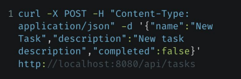  
-X - тип запроса  
-H - заголовки  
-d - тело

`Docker`  
**Создание Dockerfile**  
Dockerfile — это текстовый файл, который описывает, как создать Docker-образ.  
Вот простой Dockerfile для нашего приложения:  
FROM openjdk:11  
COPY ./target/my-app-1.0.0.jar /usr/src/my-app/ my-app-1.0.0.jar
WORKDIR /usr/src/my-app  
EXPOSE 8080  
CMD ["java", "-jar", "my-app-1.0.0.jar"]  

**Вот что делает каждая строка:**
* FROM openjdk:11 говорит Docker использовать официальный образ Java 11 в качестве базового.  
* COPY ./target/my-app-1.0.0.jar /usr/src/my-app/my-app-1.0.0.jar копирует JAR-файл
нашего приложения в контейнер.
* WORKDIR /usr/src/my-app устанавливает рабочий каталог внутри контейнера.
* EXPOSE 8080 говорит Docker, что наше приложение будет слушать на порту 8080.
* CMD ["java", "-jar", "my-app-1.0.0.jar"] запускает наше приложение внутри контейнера

---

`Приоритезация бина`
```java
@Primary //делает бин приоритетным
```

Для уточнения бина, используемого при @Autowired. 
```java
@Qualifier("rockBean") //rockBean - id бина 
``` 
  * НО! когда используем в конструкторе, указывать рядом с входящим аргументом вот так:
```java
    @Autowired
    public MusicPlayer(@Qualifier("rockBean") Music music) {
        this.music = music;
    }
```

`Spring MVC`

Предполагает архитектуру: Model - View - Contoller

`Spring MVC` - один из компонентов фреймворка, который позволяет разрабатывать Web-приложения на 

`Состав` Spring MVC - приложения:
1. Java POJO (контроллеры, модели и прочее) + аннотации
2. Набор HTML-страниц(представления). JS+HTML+CSS
3. Spring-конфигурация (XML/аннотации или Java)

Особенный компонент: `DispatcherServlet`

`DispatcherServlet` - распределитель HTTP-запросов по сервлетам (обработчикам). Все запросы сначала приходят в него — это как раз и есть определение, что нужно пользователю. Когда диспетчер понимает, что нужно пользователю, он ищет нужную страницу среди всех контроллеров приложения (сервлетов).  

**DispatcherServlet:**  
* является входной точкой приложения
* реализован за нас командой Spring

`Tomcat` - контейнер сервлетов для обработки запросов  

`Работа сервлетов:`  
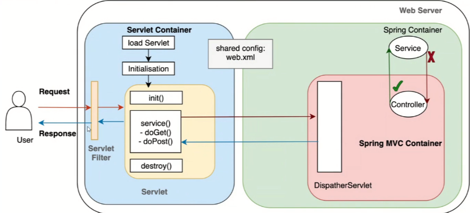

`Фильтр` - содержит Spring Security, определяет, стоит ли предоставлять те или иные данные.  

Интерфейс фильтра лежит в библиотеке **Jakarta**     
Чтобы создать фильтр - имплементировать интерфейс Filter  

**методы фильтра:**  
```java
filterChain.doFilter(servletRequest, servletResponse); //пробросить дальше
```

**пример фильтра:**  
```java
@Slf4j
@Component
public class MyFilter implements Filter {
    @Override
    public void doFilter(ServletRequest servletRequest,
                         ServletResponse servletResponse,
                         FilterChain filterChain) throws IOException, ServletException {
        if (servletRequest instanceof HttpServletRequest httpServletRequest){
            String uri = httpServletRequest.getRequestURI(); //к какому ресурсу хотят получить запрос
            log.info("Входящий запрос: {}", uri);

            if(uri.contains("admin")){
                ((HttpServletResponse) servletResponse).sendError(403, "Forbidden");
            } else{
                filterChain.doFilter(servletRequest, servletResponse);
            }
        } else {
            filterChain.doFilter(servletRequest, servletResponse);
        }
    }
}
```  

`Жизненный цикл бина:`
1. Создание BeanDefinition
2. Возможность создать свои BeanDefinition(через ImportBeanDefinitionRegistrar)
3. Пост обработка BeanDefinition
4. Создание бинов и внедрение через конструктор
5. Внедрение через сеттеры и поля (в т.ч. через @Value)
6. Вызовы методов Aware-интерфейсов ????? (вроде как для инфраструктурных бинов) - не юзать (bad practice)
7. Пост-обработка бина (1-й этап) (через BeanPostProcessor) (можно встретить прокси при работе с бинами)
8. Вызов методов инициализации (@PostConstruct, InitializingBean, Custom init method (@Bean))
9. Пост-обработка бина (2-й этап) (через BeanPostProcessor)
10. Бин готов к работе
11. Завершение работы
12. Вызов методов деинициализации (@PreDestroy, DisposableBean, Custom destroy method (@Bean))
  * Prototype не поддерживает @PreDestroy

`Специальные методы бинов`
* init-method (@PostConstruct) - метод, вызываемый при создании бина. Обычно это: инициализация ресурсов, обращение к внешним файлам и запуск БД
  * аналог - имплементировать InitializingBean и реализовать единственный метод 
  afterPropertiesSet()
  * аналог - @Bean(initMethod = "anyInitMethodName")
* destroy-method (@PostDestroy или @PreDestroy) - метод, вызываемый при уничтожении бина (завершении работы приложения). Обычно это: очищение ресурсов, закрытие потоков ввода-вывода, закрытие доступа к БД.  
  * аналог - имплементировать DisposableBean и реализовать destroy()
  * аналог - @Bean(destroyMethod = "anyDestroyMethodName")

> Для бинов с scope=prototype - метод уничтожения (destroy) вызван не будет  

* factory method - фабричный метод для создания объектов класса //см. NOTEBOOK
для бинов с scope=singletone - вызовется лишь единожды

`Особенности init и destroy:`
* любой модификатор доступа
* тип возвращаемого значения - любой. Но чаще всего void
* название методов - произвольное
* не может принимать аргументы на вход

@PostConstruct - `init-method` (особенности выше) главное - не должны принимать методы и чаще всего это void

@PostDestroy/@PreDestroy - `destroy-method` (особенности выше) главное - не должны принимать методы и чаще всего это void. **Не сработает для prototype**

При прохождении **жизненного цикла приложения**, интересные `события (Events)`: 
На них можно как-то подписаться:   
1. ContextRefreshedEvent - когда создались бины
```java
@EventListener(ContextRefreshedEvent.class)
//здесь какой-то метод
```
2. ApplicationReadyEvent - когда приложение полностью готово к работе  
```java
@EventListener(ApplicationReadyEvent.class)
```

`Создать слушателя событий (EventListener)`    
**1 вариант** (событие в аннотации)  
```java
    @EventListener(ApplicationReadyEvent.class)
    public void myEventHandler(){
        //do something
    }
```
**2 вариант** (событие в методе) - можно что-то извлекать из ивента:    
```java
    @EventListener
    public void myEventHandler(ApplicationReadyEvent event){
        //do something
    }
```

`Создать свое событие (Event)`  

Нужно создать: 
1. класс-событие, наследуемый от ApplicationEvent  
2. и класс-издатель  
```java
//класс-событие
public class MyEvent extends ApplicationEvent {
    public MyEvent(Object source) { //source - объект, который вызвал событие
        super(source);
    }
}

//класс-издатель
@Component
public class MyPublisher {
    ApplicationEventPublisher publisher;

    public MyPublisher(ApplicationEventPublisher publisher) {
    this.publisher = publisher;
    }

    public void postConstruct(){
        publisher.publishEvent(new MyEvent(this));
    }
}
//после этого можно подписываться на событие через @EventListener(MyEvent.class) и в коде вызывать метод публикации
```

`Слои (директории)` в Spring-приложении:  
1. контроллеры (controllers, api)
2. сервисы, логика приложения (services)
3. репозитории (repository, dao)
4. сущности (entity, model)
5. служебные (util)
6. data transfer object (dto) 
7. конфигурация проекта (config) - класс помечается `@ConfigurationProperties` (внутри)
8. mapper/converter

Получить `значение переменной из application.yml` (через Environment)  
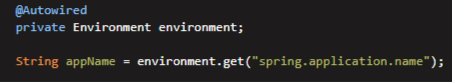
можно еще указать дефолтное значение, если переменная отсутствует:  
```java
Integer maxAllowedBooks = environment.getProperty("${application.issue.max-allowed-books:1}", Integer.class); //1 - дефолтное значение
```

Значение переменной из application.yml через `@Value` - ВЕШАТЬ К ПЕРЕМЕННЫМ В КОНСТРУКТОРЕ, А НЕ НАД ПОЛЕМ! (ТЕСТИРОВАНИЕ)  
```java
@Value("${application.security.jwt.SECRET_KEY}")
    private  String SECRET_KEY;
```
МОЖЕТ ПОНАДОБИТСЯ ЗАЮЗАТЬ `@PropertySource`, если не Spring Boot!
```java
@PropertySource("classpath:application.properties")
```

---

### Spring Data

> эта история сама создает необходимые таблицы под сущности!!  

`Spring Data` - это слой абстракции, который построен поверх JPA (или других технологий доступа к данным), и который автоматизирует много общего кода, который нам пришлось бы написать самим. 

Левая инфа:   
`NoSQL` (Not Only SQL) базы данных – это тип баз данных,
который был разработан для обработки больших объемов
данных, которые не могут быть эффективно обработаны
с помощью традиционных реляционных баз данных.  
**(MongoDB, Cassandra и Redis)**

**Spring Data Commons** - основной модуль Spring Data. Он предоставляет общие интерфейсы и классы, которые используются всеми остальными модулями Spring Data. 

`Spring Data JPA` – это модуль, который предоставляет 
поддержку для работы с SQL базами данных через JPA.

JPA использует `JPQL` в методах:  
`Словарь JPQL`:  
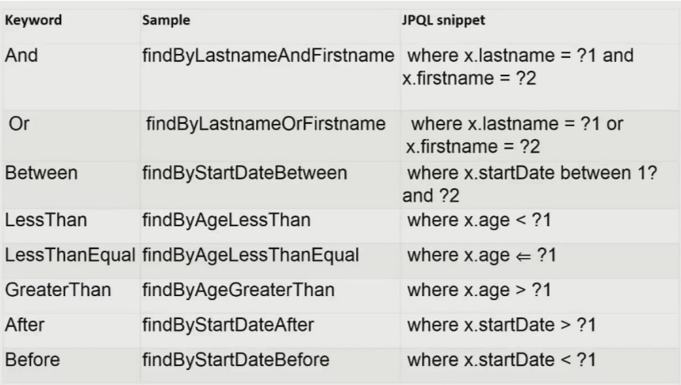  
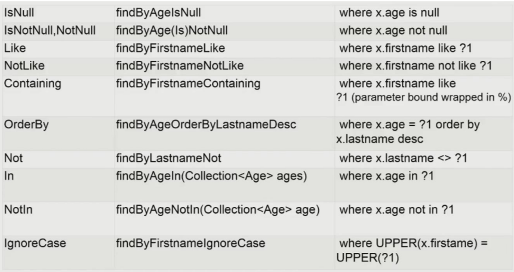

`Spring Data MongoDB` позволяет нам работать
с документами MongoDB, как если бы это были
обычные Java объекты.

`Spring Data Redis` предоставляет поддержку
для структур данных Redis, таких как списки,
множества и отсортированные множества.

Репозитории в `Spring Data` – это как магазины
данных для ваших Java объектов.

`Интерфейс Repository` - для использования своих кастомных методов и только

`Создать CRUD-репозиторий Spring Data`:  
  
У него есть findAll, который возвращает **Iterable**, а не коллекцию. Этого недостатка нет у JpaRepo...  

Чтобы `преобразовать Iterable в List`:  
```java
Iterable<User> iterable = dao.findAll();
StreamSupport.stream(iterable.spliterator(), false).toList();
```

`Создание JPA-репозитория Spring Data:`  
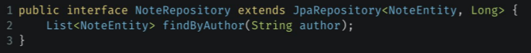  
**JpaRepository** предоставляет нам множество полезных методов,
таких как findAll(), findById(), save(), delete(), и т.д., без необходимости их реализовывать.  

Создать **метод для JPA-репозитория**: достаточно просто объявить его сигнатуру в интерфейсе!!!!  
```java
public interface UserRepository extends CrudRepository<User, Long>{
    List<User> findByName(String name); //будет работать без реализации
}
```  

Дотянуть зависимые сущности в модели с JpaRepository:  
```java
public interface PersonRepository extends JpaRepository<Person, Long> {
    @EntityGraph(attributePath = "email") //больше нигде не надо указывать. email - имя поля в Person
    List<Person> findAll();
}
```

`@NamedEntityGraph`  - установить граф для внутренней сущности
```java
@NamedEntityGraph(
        name = "author-entity-graph",
        attributeNodes = {@NamedAttributeNode("author")})
public class Book {}
```

`Запрос с графом`  
```java
import static org.springframework.data.jpa.repository.EntityGraph.EntityGraphType.FETCH;
//используется в setHint

    @Override
    public Optional<Book> findById(long id) {
        String sqlForBook = "select b from Book b left join fetch b.genres where b.id = :id";
        EntityGraph<?> entityGraph = em.getEntityGraph("author-entity-graph");
        TypedQuery<Book> query = em.createQuery(sqlForBook, Book.class);
        query.setParameter("id", id);
        query.setHint(FETCH.getKey(), entityGraph);

        return query.getResultList().isEmpty() ? Optional.empty() : Optional.of(query.getResultList().get(0));
    }
```

`Создание метода с сложным запросом`  

`@Query` - для модификации запроса JpaRepository. 

С помощью `@Query`  
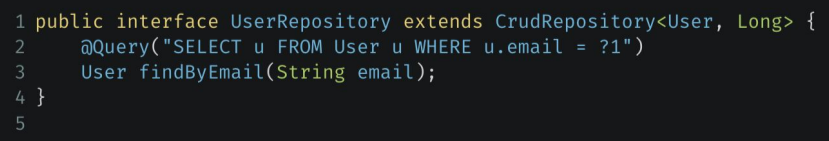

Если запрос модифицирует БД, то сверху еще `@Modifying` - без него при попытке модификации выбросит ислючение InvalidDataAccessApiUsageException  + @Transactional (без него тоже исключение)
```java
@Modifying
@Transactional
@Query("update Acctount a set a.name = :name where a.id = :id")
void updateNameById(@Param("name") String name, @Param("id") long id);
//или
@Modifying
@Transactional
@Query("update Acctount a set a.name = ?2 where a.id = ?1")
void updateNameById(long id, String name);
```

Добавить свою реализацию методов к JpaRepository:  (ничего не понятно)
```java
//неследуемся от JPA и своего интерфейса
public interface AcctountRepository extends JpaRepository<Account, Long> {}

//свой интерфейс
public interface AcountRepositoryCustom {
    public void customMethod();
}

//Название важно!
public class AccountRepositoryImpl implements AcountRepositoryCustom {
    //инжектим наш JpaRepo..
    private AccountRepository accountRepository;

    public void customMethod() {}

}
```

`Магия JPA-репозитория` базируется на названии метода, в соответствии с [документацией](https://docs.spring.io/spring-data/jpa/reference/repositories/query-keywords-reference.html)   

`Базовый пример конфига Spring Data с помощью Java:`  
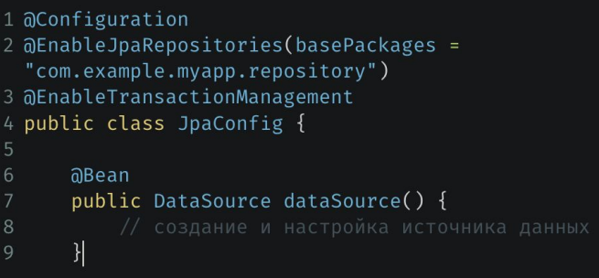  
● @EnableJpaRepositories: Эта аннотация активирует создание репозиториев Spring Data.   
● @EnableTransactionManagement: Эта аннотация включает поддержку управления транзакциями Spring.   

Пример `конфига Spring Data с помощью application.yml`  
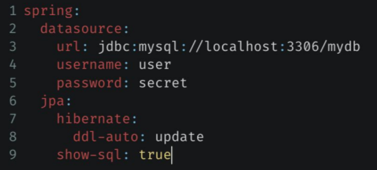
  + spring.jpa.generate-ddl: false - также отключает генерацию таблиц крч

● **spring.datasource**: Здесь мы указываем параметры подключения к базе данных,
такие как URL, имя пользователя и пароль.  
● **spring.jpa.hibernate.ddl-auto**: Этот параметр определяет, как Hibernate должен управлять схемой базы данных. (**update** - если таблицы не соответствуют - будут подогнаны под сущности в коде, **create** - создаст, если еще не создано)  
  * может быть еще **validate** (очень часто) - проверка соответствия сущностей структуре таблиц в БД  - приложение не запустится, если не соответствует
  * **create** - при запуске создат таблицы
  * **create-drop** (редко) - при запуске создат, при остановке - уничтожит таблицы
● **spring.jpa.show-sql**: Если этот параметр установлен в true, Hibernate будет
показывать SQL запросы, которые он выполняет.  
Может еще понадобится **driver-class-name**:  
```java
driver-class-name: com.mysql.jdbc.Driver
```

`Собрать приложение (проект) Spring для работы с БД`  
● **Spring Web**: Для создания веб-приложения с использованием Spring MVC.  
● **Spring Data JPA**: Для работы с базой данных через JPA.  
● **Thymeleaf**: Для создания веб-страниц нашего приложения.  
● **Spring Boot DevTools**: Для автоматической перезагрузки приложения при изменении кода.  
● **PostgreSQL**: Драйвер для нашей базы данных. Мы будем использовать postgres.  

В случае, когда нужно `обработать отрицательный случай обработки запроса`, но с **сообщением**:  
```java
throw new ResponseStatusException(HTTPStatus.NOT_FOUND, "Не удалось что-то там");
//само исключение обработается внутри DispatcherServlet
```
И!!! добавить в application.yml (для включения сообщения об ошибке в тело ответа):  
```yml
server.error.include-message = ALWAYS
```

`Spring Data JDBC` - надстройка над JDBC, позволяющая не создавать коннекты и не делать стейтмены   
JdbcTemplate - ботокобезопасен  
Пример использования:  
```java
		ConfigurableApplicationContext context = SpringApplication.run(SpringDataSeminarApplication.class, args);

		JdbcTemplate jdbcTemplate = context.getBean(JdbcTemplate.class);

		jdbcTemplate.execute("create table users(id bigint, name varchar(250))");
		jdbcTemplate.execute("insert into users (id, name) values (1, 'Коля')");

		List<User> users = jdbcTemplate.query("select * from users", new RowMapper<User>() {
			@Override
			public User mapRow(ResultSet rs, int rowNum) throws SQLException {
				return new User(rs.getLong("id"), rs.getString("name"));
			}
		});
```

> Для выполнения SQL команд INSERT, UPDATE, DELETE использовать jdbcTemplate.update()

Пример `jdbcTemplate.query()` с маппингом:  
```java
    public Map<String, StatisticByCompanyDto> getCompaniesStatisticsToday() {
        Map<String, StatisticByCompanyDto> companyStatistics = new HashMap<>();
        String formattedDate = getFormattedToday();

        jdbcTemplate.query("select company_name, event, count(*)\n" +
                        "from (select companies.company_name                                       as company_name,\n" +
                        "             te.event                                                     as event,\n" +
                        "             row_number() over (partition by trips.id order by time desc) as rn\n" +
                        "      from trip_events as te\n" +
                        "               inner join trips\n" +
                        "                          on te.trip = trips.id\n" +
                        "               inner join tasks\n" +
                        "                          on trips.task = tasks.id\n" +
                        "               inner join companies\n" +
                        "                          on tasks.company = companies.id\n" +
                        "      where te.time > " + formattedDate +
                        ") as res\n" +
                        "where res.rn = 1\n" +
                        "group by company_name, event;",
                (rs, rowNum) -> {
                    mapToStatisticByCompany(rs, companyStatistics);
                    return null;
                });
        return companyStatistics;
    }
```

queryForObject через `NamedParameterJdbcOperations`:  
```java
private final NamedParameterJdbcOperations jdbc;

//конструктор...

public Entity getById(long id) {
    final Map<String, Object> params = new HashMap<>();
    params.put("id", id);
    return jdbc.queryForObject("select * from entities where id = :id", 
    params, new PersonMapper()); //параметры просто хранятся в мапе по именам, в тексте будет :paramName
}
```

`NamedParameterJdbcOperations`
```java
    public List<Genre> findAllByIds(Set<Long> ids) {
        if (ids.isEmpty()) {
            return List.of();
        }

        String sql = "SELECT * FROM genres WHERE id IN (:ids)";

        return jdbc.query(sql, new MapSqlParameterSource("ids", ids), new GenreRowMapper());
    }
```

`H2 - временная БД`  
конфиг h2:  
```yml
spring:
  datasource:
    url: jdbc:h2:mem:test
    username: root
    password:
    driver-class-name: org.h2.Driver
#для инициализации schema.sql и data.sql
  sql:
    init:
      mode: always
      data-locations: data.sql //здесь прописывать инсерты
      schema-locations: schema.sql //здесь прописывать создание таблиц

```
Зависимость h2:  
```xml
		<dependency>
			<groupId>com.h2database</groupId>
			<artifactId>h2</artifactId>
			<scope>runtime</scope>
		</dependency>
```

`BPP` - бин пост процессор - для имплементации при реализации классов, которые должны быть реализованы при создании бинов, перед инит методом и перед дестрой методом. (например, при создании своей кастомной аннотации)

`@ConfigurationProperties(applicatoin.issue)`  - для использования параметров конфигурации в application.yml  
Чтобы пользоваться, нужно:  
`@Component`  и зависимость  
```xml
<dependency>
    <groupId>org.springframework.boot</groupId>
    <artifactId>spring-boot-configuration-processor</artifactId>
</dependency>
```

`@ConfigurationProperties`  
```java
//всего этого достаточно
@ConfigurationProperties("application.issue")
@Component
@Data
public class IssueConf {
    private int maxAllowedBooks;

    @EventListener(ContextRefreshedEvent.class)
    private void postInit(){
        System.out.println("max allowed books in IssueConf-class: " + maxAllowedBooks);
    }
}
```

@ConfigurationProperties("application") - использовать с @ConstructorBinding над конструктором, чтобы поля сделать **final**

`@Valid` - для валидации объектов в контроллерах, проверки @NotNull полей.  
чтобы пользоваться, нужна зависимость:  
```xml
<dependency>
    <groupId>org.springframework.boot</groupId>
    <artifactId>spring-boot-starter-validation</artifactId>
</dependency>
```
@Valid
```java
    @PostMapping("/example")
    public ResponseEntity<Object> create(@Valid @RequestBody ExampleRequest request) {
```

Для `периодического выполнения методов`:  
```java
//над классом
@EnableScheduling
//над методом
@Scheduled(fixedDelay = 1000, initialDelay = 0) //для периодического выполнения
```

---

### Свой стартер

`Свой стартер`  
1. Создать отдельный модуль со своими зависимостями (spring boot web starter + lombok достаточно)
2. Реализовать логику
3. Создать @Configuration класс и добавить необходимые бины, которые должны подниматься в других проектах
4. в resource создать папку META-INF -> в ней папку spring -> файл "org.springframework.boot.autoconfigure.AutoConfiguration.imports" - ровно так
5. в нем построчно указать файлы, которые необходимо импортировать в другие проекты (например, файл конфигурации)
  * ru.gb.httploggerstarter.HTTPLoggerAutoConfiguration
6. mvn clean install
7. импортировать по полному имени в нужный проект
8. если не видит либу - project structure - modules - добавлять вручную

Для добавления возмоности `конфигурации стартера из application.yml` проекта:  

Создать `класс параметра, который будет конфигурироваться:`  
```java
/**
 * Параметр с возможностью конфигурации стартера через application.yml
 */
@Getter
@Setter
@ConfigurationProperties(value = "http.logging")
public class LoggingProperties {

    /**
     * Уровень логирования
     */
    private Level logLevel = Level.DEBUG; //значение по умолчанию
}
```

В конфигурации `создать бины классов, использующих параметры`:
```java
@Configuration
@EnableConfigurationProperties(LoggingProperties.class) //подключает @ConfigurationProperties - класс - вроде как работает без Enable...
public class HTTPLoggerAutoConfiguration {
    @Bean
    LoggerFilter loggerFilter(LoggingProperties loggingProperties){
        return new LoggerFilter(loggingProperties);
    }
}
```

Сам `класс, использующий параметры:`  
```java
@Component
@Slf4j
@RequiredArgsConstructor
public class LoggerFilter implements Filter {

    private final LoggingProperties loggingProperties;

    //...реализация
}
```

Теперь, можно `конфигурировать стартер`:  
```yml
http:
  logging:
    log-level: info
```

`@ConditionalOnMissingBean` / `@ConditionalOnProperty`  
Использовать другой бин при отсутствии данного / использовать бин при наличии конфига для него в файле application.yml  
```java
    @Bean
    @ConditionalOnProperty(value = "http.logging.log-level") //если пользователь устанавливает конфиг, то этот бин будет создан
    LoggerFilter loggerFilter(LoggingProperties loggingProperties){
        return new LoggerFilter(loggingProperties);
    }

    @Bean
    @ConditionalOnMissingBean(value = LoggerFilter.class) //будет создан, если пользователь не установил конфиг для бина LoggerFilter
    LoggerFilterStub createLoggerStub(){
        return new LoggerFilterStub();
    }
```

`@RequestScope` - бин, живущий в рамках 1 HTTP-запроса

Condition-аннотации - вешаются над @Bean

`@ConditionalOnProperty` - определение какой бин выбрать на основе application.yml
```java
@ConditionalOnProperty(prefix = "example", name = "someName", matchIfMissing = true, havingValue = "false") //кроме прочего - используем эту реализацию, если такого конфига в файле нет совсем
```

`@ConditionalOnClass` - если есть такой класс в класспассе, то бин создатся
```java
@ConditionalOnClass(CustomCondition.class)
```

`@ConditionOnMissingBean` - бин создатся, если такого бина еще нет в контексте

Зависимость от кастомных условий `@Conditional`(SomeClass.class):  
```java
/**
 * Этот бин будет создан, если соблюдены ВСЕ условия в классе кастомных условий
 */
@Component
@Conditional(CustomCondition.class)
public class SomeBean {
}

/**
 * Кастомные условия (несколько)
 * AllTestedConditions - для соблюдения всех условий
 */
public class CustomCondition extends AllNestedConditions {
    public CustomCondition(ConfigurationPhase configurationPhase) {
        super(configurationPhase.PARSE_CONFIGURATION);
    }

    @ConditionalOnProperty(name = "condition.alexey-exists", havingValue = "false")
    static class AlexeyDoesNotExistsCondition {
    }

    @ConditionalOnProperty(name = "condition.yanis-exists", havingValue = "true")
    static class YanisExistsCondition {
    }
}
```

`AnyNestedConditions` - для соблюдения одного из условий  

**Когда НЕ использовать профили**:  
* для формирования контекста в интеграционных тестах
* для загрузки свойств из нужного файла в интеграционных тестах. application.yml в тестовых ресурсах ПЕРЕОПРЕДЕЛЯЕТ основной
* @ActiveProfile нужен для тестирования профиля приложения, а не для включения профиля тестирования

`KeyHolder` - для ловли сгенерированного id базой данных в связке с jdbcTemplate  
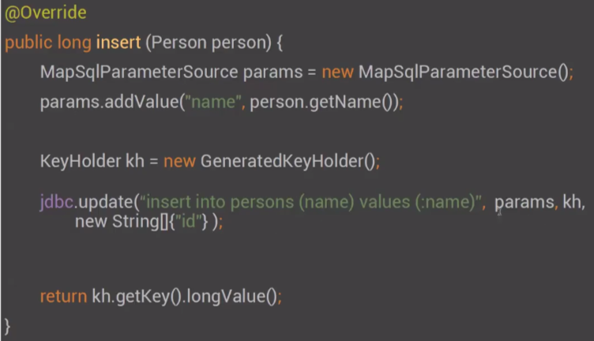
  * id - название колонки идентификатора
  * в конце забираем сгенерированный ключ
Используй keyholder.getKeys() - для получения мапы ключей 

`Spring boot starter jdbc` - что делает:  
* поднимает DataSource
* создает JdbcOperations
* и NamedParatererJdbcOperations
* подключает транзакционность
* автоматически выполняет файлы schema.sql, data.sql

`@SuppressWarnings`({"SpellCheckingInspection", "unused"}) - для подавления `Предупреждений`  

`WebApplicationContext` – это интерфейс и имеет
несколько реализаций:
○ XmlWebApplicationContext – XML-based
○ AnnotationConfigWebApplicationContext –
Java-based
○ GroovyWebApplicationContext – Groovy-based
○ XmlPortletApplicationContext –XML-based для
portlet-ов
○ И т.д.

`MediaType` типы  
* `MediaType.APPLICATION_JSON`: Используется для обмена данными в формате JSON. Это стандартный тип для REST API, так как он обеспечивает структурированный и легкий для обработки формат. 
* `MediaType.APPLICATION_XML`: Используется для обмена данными в формате XML. Он был популярен раньше, но сейчас JSON предпочтительнее в большинстве случаев.
* `MediaType.TEXT_PLAIN`: Используется для обмена текстовыми данными, например, в файлах с простым текстом. 
* `MediaType.TEXT_HTML`: Используется для обмена HTML-контентом. 
* `MediaType.APPLICATION_OCTET_STREAM`: Используется для передачи произвольных двоичных данных, таких как файлы изображений, архивы и т.д.

Типы изображений:

* `MediaType.IMAGE_JPEG`: Используется для передачи изображений в формате JPEG. 
* `MediaType.IMAGE_PNG`: Используется для передачи изображений в формате PNG. 
* `MediaType.IMAGE_GIF`: Используется для передачи изображений в формате GIF.

Другие типы:

* `MediaType.APPLICATION_PDF`: Используется для передачи файлов PDF. 
* `MediaType.APPLICATION_ZIP`: Используется для передачи ZIP-архивов.