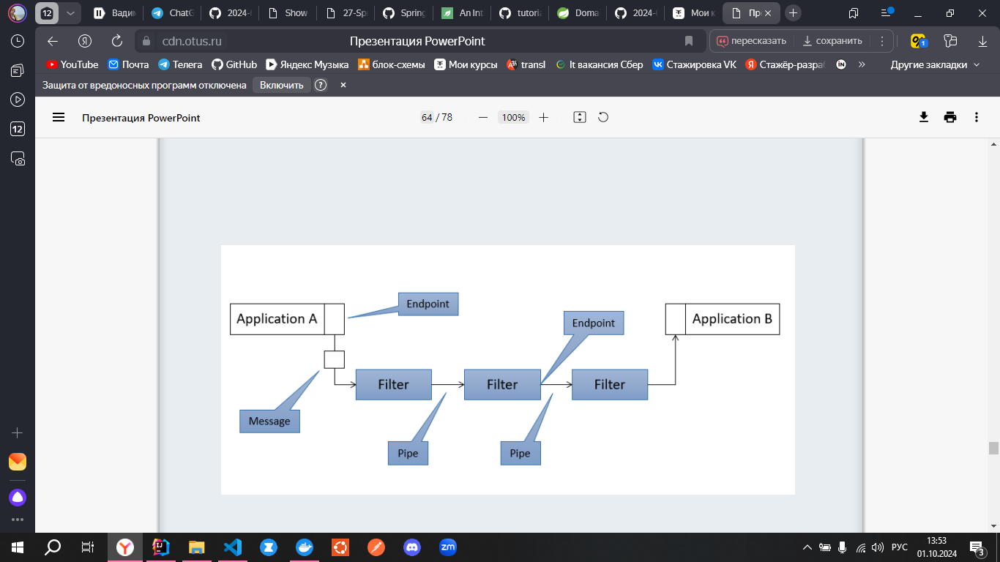

## Spring Integration

`Зависимость`
```xml
<dependency>
    <groupId>org.springframework.boot</groupId>
    <artifactId>spring-boot-starter-integration</artifactId>
    <version>3.3.4</version>
</dependency>
```

`Задачи`
- реализация Messaging-паттернов
- простая модель для сложных Enterprice-решений
- упростить асинхронное, message-driven взаимодействие внутри ОДНОГО МОНОЛИТА
- минимальная связанность для простой модульности и тестирования
- разделение бизнес-логики и интеграции

## Связность и связанность

Low Coupling (связанность) и Hight Cohesion (связность) - принципы GRASP (General Responsibility Assignment Software Patterns)
  * предложены в начале 2000-х Крейгом Ларманом
  * Связующее звено между базовыми принципами ООП и шаблонами GoF

Pipes and Filters архитектура - дает преимещества микросервисов монолиту - внутри общение происходит с помощью сообщений (Messeging паттерны)

Схема общения внутри монолита с помощью месседжинга  


`Ключевые термины`
**Message** - письмо, содержащее полезную информацию Peyload   
**Pipe** (Message Channel) - соединение фильтров   
**Filter** - независимый узел обработки сообщения   
**Endpoint** (port) – Pipe + Filter-s 

`Компоненты Spring Integration`:  
1. Message
2. Endpoint (отправитель или получатель)
3. Channel (канал + фильтры для модификации сообщений в нем)

`Endpoints`:
• Router - куда-то направляет
• Filter - фильтрует
• Splitter - разделители
• Transformer - трансформируют 
• Aggregator - собирает после сплиттера
• Resequencer - меняет последовательности
• Service Activator - штука, отвечающая за момент включения бизнес-логики
• Channel Adapter - односторонний канал (входной/выходной)

Пример Spring Integration
```java
@SpringBootApplication
public class IntegrationApplication {
    //выходной канал
    @Bean
    DirectChannel outputChannel() {
        return new DirectChannel();
    }

    //односторонний канал, т.к. void
    @MessagingGateway
    public interface I {
        @Gateway(requestChannel = "personFlow.input")
        void process(Animal animal);
    }

    //канал DirectChannel с именем personFlow.input создается автоматически
    @Bean
    public IntegrationFlow integrationFlow() { //это реализация @Gateway
        return flow -> flow
                .handle("bService", "process")
                .handle("cService", "process")
                .handle("aService", "process")
                //можно без этого, если метод в канале двусторонний (не void)
                .channel("outputChannel");
    }

    public static void main(String[] args) {
        ConfigurableApplicationContext ctx =
                SpringApplication.run(IntegrationApplication.class, args);

        DirectChannel outputChannel = ctx.getBean("outputChannel", DirectChannel.class);
        //обработчик внутри subscribe выполнится как только закончится выполнение flow
        outputChannel.subscribe(x -> System.out.println(x));
        //запускаем выполнением flow
        ctx.getBean(I.class).process(new Animal("cat"));

        //можно было запустить flow отправкой сообщения во входной канал input:
//        MessageChannel inputChannel = ctx.getBean("personFlow.input", MessageChannel.class);
//        inputChannel.send(MessageBuilder.withPayload(new Animal("cat"))).build;
        ctx.close();
    }
}
```

## Message (интерфейс)

`состав`:  
* заголовки/headers - содержит получателя 
  * 4 дефолтных заголовка:  
  * id и timestemp сгенерируются по дефолту, если их не определить
  * reply_channel and error_channel - нужно задавать
* нагрузка/payload

`Типы Message`:  
1. Command - действия и данные, необходимые для действия
2. Document - только данные, ничего не делает

`Message`
Работа с хедерами (нельзя добавлять новые заголовки)
```java
Message<?> message = …;
Object object = message.getHeaders().get("customer");
Customer customer = message.getHeaders().get("customer", Customer.class);
Long timestamp = message.getHeaders().getTimestamp();
// throw new UnsupportedOperationException("MessageHeaders is immutable");
message.getHeaders().put("any", "value");
// throw new UnsupportedOperationException("MessageHeaders is immutable");
message.getHeaders().remove("any");
```

`Особенности` работы с заголовками (headers):  
* Headers неизменяемы!
* Объект в сообщении (как ссылка) – тоже
immutable.
* Объект (как объект) может изменяться.
* Считается хорошим тоном, чтобы и объект не
изменялся.
* Позволяет избежать проблем, когда сообщение
будет дублироваться в разные каналы

Основные `реализации` интерфейса Message:  
* GenericMessage<T>
* ErrorMessage<Throwable>

`GenericMessage` and `ErrorMessage`

```java
// GenericMessage<T>
PayloadClass payload = ...;
Map<String, Object> headers = ...; //можно через MessageHeaders(Map<String, Object>)
Message<PayloadClass> message1 =
new
GenericMessage<>(payload);
Message<PayloadClass> message2 =
new GenericMessage<>(payload,
headers);

// ErrorMessage
try {
// ...
} catch (Throwable throwable) {
Message<Throwable> message =
new ErrorMessage(throwable);
Throwable t = message.getPayload();
}
```

`MessageBuilder`

```java
Message<String> helloMessage =
MessageBuilder.withPayload("Hello, world!")
.setHeader("custom.header", "Value")
.setHeaderIfAbsent("custom.header2", "Value2")
.build();

// creates GenericMessage/ErrorMessage according to original type (точная копия первого сообщения)
Message<String> message1 = MessageBuilder.fromMessage(original)
.build();
// copy headers
Message<String> message2 = MessageBuilder.withPayload("test2")
.copyHeaders(original.getHeaders()).build();
// copy absent headers
Message<String> message3 = MessageBuilder.withPayload("test3")
.setHeader("foo", 123)
.copyHeadersIfAbsent(message1.getHeaders())
.build();
```

## MessageChannel (интерфейс)

имеет `дефолтный метод отправки` сообщения 
```java
public interface MessageChannel {
default boolean send(Message<?> message) {
return send(message, INDEFINITE_TIMEOUT); //default = -1 - отправка без задержки
}
boolean send(Message<?> message, long timeout);
}
```

`типы` каналов:  
* Point-to-Point Channel (сокр. P2P) - это очередь (Queue), только один Consumer получает отдельно взятое сообщение
* Publish-Subscribe Channel (сокр. pub/sub) - сообщение направляется всем Consumer, которые подписались на топик/канал

`Задачи` канала:  
* отделить отправителя от получателя
* отправитель и получатель (Endpoints) не могут общаться напрямую

`Классификация` каналов:
* Буферезированный/небуферезированный
* С опрашивающими Consumer-ами (Pollers) - либо Consumer-ы сами опрашивают канал на наличие сообщений, либо канал сам доставляет сообщения
* Синхронные (выполняются в том же методе)/асинхронные - это про запись и чтения сообщений в канал в разных потоках

`Реализации`:
* PollableChannel (интерфейс) - предполагает, что для получения сообщения к нему нужно будет обратиться. Как раз история про **опрашивающих** Consumer-ов. 1 сообщение может получить лишь 1 Consumer. Чистый P2P
* SubscribableChannel (интерфейс) - подписка на топики для получения сообщений. Внутри принимает в себя MessageHandler (интерфейс), который определяет КАК обрабатывать полученное сообщение. Чистый pub/sub

`PollableChannel`
```java
public interface PollableChannel extends
Message<?> receive();
Message<?> receive(long timeout);
```

`SubscribableChannel`
```java
public interface SubscribableChannel extends MessageChannel {
boolean subscribe(MessageHandler handler);
boolean unsubscribe(MessageHandler handler);
}

public interface MessageHandler {
void handleMessage(Message<?> message) throws MessagingException;
}
```

## Реализации P2P каналов (классы): 

1. `QueueChannel`
  * Буферизованный, P2P семантика - то есть очередь
  * Когда буфер заполнен на 100%, отрпавитель блокируется
  * Если не задать capacity, то будет ограничен только памятью JVM

Создать `QueueChannel`: 
```java
@Bean
public MessageChannel queueChannel() {
return new QueueChannel(100); //задаем capacity
}

@Bean
public MessageChannel queueChannel() {
return MessageChannels.queue(100) //задаем capacity
                      .get();
}
```

2. `PriopityChannel`
 * Тоже самое, что QueueChannel, только с приоритетом (у Message есть поле priority и его можно задавать при его создании)
 * Может использовать компаратор
 * А может основываться на данных header

Создать `PriorityChannel`
```java
@Bean
public MessageChannel priorityCh() {
return MessageChannels.priority()
.capacity(100).get();
}

//Пример отправки в канал соощения с приоритетом
public void sendHello() {
Message<String> message
= MessageBuilder
.withPayload("Hello")
.setPriority(10) //устанавливаем приоритет сообщению
.build();
priorityChannel.send(message);
}
```

3. `RandezvousChannel`
  * P2P реализация небуферизированного потока
  * блокирует получателя и отправителя пока оба не вызовут send() и receive() соответственно
  * идеален для синхронизации двух потоков

Создать `RandezvousChannel`
```java
@Bean
public MessageChannel
queueChannel() {
return MessageChannels
.rendezvous().get();
}
```

## Реализации pub/sub каналов (классы)

1. `PublishSubscribeChannel`
  * Реализация SuscribabelChannel
  * можно использовать самостоятельно
  * от него наследуются остальные pub/sub реализации
  * по умолчанию напрямую вызывает подписчиков
  * при передаче Executor, отправка сообщений подписчикам будет происходить исходя из его логики

Создать `PublishSubscribeChannel`:  
```java
@Bean
public MessageChannel pubSubCh() {
return MessageChannels
.publishSubscribe()
.minSubscribers(0)
.get();
}

//или так
@Bean
public MessageChannel pubSubCh() {
return MessageChannels
.publishSubscribe(
new ThreadPoolTaskExecutor() //если передаем экзекьютор, то логика отправки сообщений подписчикам будет в соответствии с ним
).get();
}
```

2. `DirectChannel` - все те же подписчики, но сам отправляет им сообщения
  * P2P канал с SubscribeChannel интерфейсом. 
  * выбирает одного подписчика по round-robin (последовательно по индексам)
  * стратегию выбора можно переопределить, имплементировав LoadBalancingStrategy
  * не нужно вызывать receive() у канала - он ведь сам все отправит

Создать `DirectChannel`:
```java
@Bean
public MessageChannel directCh() {
return MessageChannels.direct("subscribeDirectChannel").get();
}
```

3. `ExecutorChannel`
  * DirectChannel, но со специальным Executor-ом

Создать `ExecutorChannel`
```java
@Bean
public MessageChannel executorCh() {
return MessageChannels
.executor(executorObj).get();
}
```

КАК `ограничить по типам полезной нагрузки` в сообщениях: 
```java
@Bean
public MessageChannel ch() {
return MessageChannels.direct() 
//задаем 2 возможных варианта PayLoad сообщений
.datatype(String.class) 
.datatype(Integer.class)
.get();
}
```

`Специальные каналы`
● NullChannel (типа /dev/null), стартером
создаётся всегда – nullChannel. Сюда, например, бросаются сообщения, если на канал никто не подписан
● ErrorChannel - если сообщение не обработано, то бросается сюда

## Endpoint

[Spring Integration Endpoints Docs](https://docs.spring.io/spring-integration/reference/endpoint-summary.html)

* В messaging-приложении бизнес-логика
отделена от логики интеграции
* Endpoint – компоненты, которые отделяют логику
интеграции от бизнес-логики
* Endpoint-s получают сообщения из канала (ов) и
отправляют в каналы (ы)
* Каналы не могут быть связаны без endpoint-ов, и
наоборот


`MessagingGateway` - эндпоинт, в который приходят все сообщения, и откуда их забирать.
`@MessagingGateway` - вешается над интерфейсом. Автоматически будет создана реализация у этого интерфейса

`@IntegrationComponentScan` - вешать над конфигом/main-ом Spring Integration - приложения
```java
@MessagingGateway
public interface Upcase {
@Gateway(requestChannel = "upcaseCh") //входной канал. можно задать еще выходной. Если не указать - автоматически создастся
Collection<String> upcase(Collection<String> strings);
}

@Configuration
@IntegrationComponentScan
public class AppConfiguration {
@Bean
public MessageChannel upcaseCh() { //канал для записи
return new DirectChannel();
}
}

@Bean
public IntegrationFlow upcase() {
return f -> f.split() //разбивает коллекцию по элементам
.<String, String>transform(String::toUpperCase)
.aggregate();
}
```

`ServiceActivator` - вставляется во flow, чтобы отработала бизнес-логика
```java
@Bean
public IntegrationFlow flow(CafeService cafeService) {
return IntegrationFlow
.from("ordersChannel")
.handle(cafeService, "placeOrder") //SERVICE ACTIVATOR + название метода
.channel("foodChannel")
.get();
}
@Service
class CafeService() {
public Food placeOrder(Order o) { … }
}
```

`Message Bridge` - для перекладывания сообщения из одного канала в другой
* Обычно Message Bridge создаётся неявно
(хотя это отдельный EIP-паттерн)
* В случае Pub/Sub -> Pub/Sub или Pub/Sub -> P2P
Message Bridge простой. Никакой опрашиватель не нужен, ведь сообщения улетают получателям посредством канала
* А вот с P2P (Pollable) -> Pub/Sub всё
становится намного сложнее, потому как канал нужно опросить. Автоматически создастся опрашиватель PollingConsumer

```java
@Bean
public IntegrationFlow flow() {
return f -> f
.channel(
MessageChannels.queue(
"p2pChannel", 10 //в какой канал переложить сообщение
)
);
}
```

`PollingConsumer` - чтобы автоматически опрашивать все P2P каналы
```java
// Один из способов подключения P2P (Pollable) -> Pub/Sub
PollableChannel channel =
context.getBean("pollableChannel", PollableChannel.class);
PollingConsumer consumer =
new PollingConsumer(channel, exampleHandler);
```

Какие ещё Integration Endpoints (Adapter)
* File Support – позволяют оперировать с
файловой системой + FTP
* HTTP – позволяет писать REST-вызовы
* JDBC – позволяет выполнять SQL запросы (*)
* JPA – собственно JPA
* JMS Gateways – собственно, позволяют
переслать сообщение

`Flow Components` (endpoints) - типы эндпоинтов, которые мы описываем исключительно во Flow:  
1. Rounters
2. Filters
3. Splitter //.split() - разделяет коллекцию по элементам
4. Aggregator //.aggregate() - собирает после split()

`Router` - направляет сообщение у другой канал

Реализации Router:  
* PayloadTypeRouter - по типу сообщения определяет в какой канал переложить
* HeaderValueRouter - по заголовку
* И, конечно, Ваш собственный роутер

`PayloadTypeRouter` - пример его реализации
```java
@Bean
public IntegrationFlow orders() {
return f -> f
.<Order, Boolean>route(
Order::isIced, //метод в классе роутера, принимающий решение куда переложить (boolean)
mapping -> mapping
.subFlowMapping(true, sf -> sf //если true, то в один канал
.channel("icedOrders")
)
.subFlowMapping(false, sf -> sf //если false - то в другой
.channel("notIcedOrders")
)
);
}

//или так
@Router(inputChannel="allChannel")
public String route(Object payload) {
if (payload instanceof Account) {
return "accountsChannel";
}
// ...
}
```

Еще пример роутинга route:  
```java
                .<Adventurer, Boolean>route(Adventurer::isAlive, m -> m
                        .channelMapping(true, "survivalsChannel")
                        .channelMapping(false, "cemetery"))
```

`Filters` - такие же как в стримах. Нужно описать правило для фильтрации
```java
@Bean
public IntegrationFlow trades() {
return f -> f
.<Trade>filter(
trade -> trade.getStatus()
.equalsIgnoreCase("cancel")
)
.channel("outChannel");
}

//или так
@Component
public class NewTradeFilter {
@Filter
public boolean isTradeCancelled(Message<?> message) {
Trade t = (Trade) message.getPayload();
//правило для фильтрации
return t.getStatus()
.equalsIgnoreCase("cancel");
}
}
```

`Splitter` - разделить коллекции в теле сообщения на отдельные месседжи. При разбиении, заголовок "id" сообщения становится "correletionId", а "id" получает новое значение + новый заголовок "sequenceNumber" - порядок сообщения в коллекции, и "sequenceSize" - изначальный размер коллекции
```java
@Bean
public IntegrationFlow upcase() {
return f -> f
.split() // splits collection
// ... ;
}
// Variant #2
public class CustomSplitter {
public List<Trade> split(Message<?> message) {
// ...
}
}
```

`Aggregator`
```java
@Bean
public IntegrationFlow upcase() {
return f -> f
.split()
.<String, String>transform(String::toUpperCase)
.aggregate(); //аггрегация после сплиттера
}
```

`Transformers` - для изменения Payload сообщения
```java
@Bean
public IntegrationFlow transform() {
return IntegrationFlows.from("objectsChannel" )
.transform(
Transformers.objectToString() 
//Transformers.toMap() - в мапу название=значение
).channel("stringsChannel")
.get();
}
```

`Серриализация и дессериализация через трансформеры`:  
```java
@Bean
public IntegrationFlow transform() {
return f -> f
.transform(
Transformers.serializer()
)
.transform(
Transformers.deserializer()
);
}
```

`в/из JSON через трансформеры`:  
```java
@Bean
public IntegrationFlow transform() {
return f -> f
.transform(
Transformers.toJson() // Jackson is required
)
.transform(
Transformers.fromJson()
);
}
```