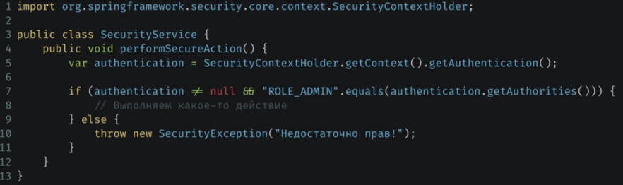

> [НАЗАД к СОДЕРЖАНИЮ](README.md)

---

# Spring Patterns

`GoF` или "**Gang of Four**" паттерны — это четверка умных парней,
которые собрали в одной книге "Design Patterns" базовые принципы
и паттерны, которые можно использовать при проектировании
программ.

`Плюсы:`  
• Кодовая База Становится Чище.  
• Облегчает Командную Работу.  
• Повторное Использование Кода.  
• Повышение Производительности.  

### Adapter

`Adapter` - когда есть класс, не имплементирующий Интерфейс, но его нужно использовать.  


### Bridge

`Bridge` - полезно, когда  есть
разные реализации одного и того же
интерфейса и нужно динамически
переключаться между ними.


### Composite

`Composite` - Этот паттерн позволяет считать
единичный объект и композицию
объектов одинаково.  
Круто для работы с деревьями
или графами в Spring!


### Singleton

`Singleton` - гарантирует, что класс имеет
только один экземпляр и
предоставляет глобальную точку
доступа к этому экземпляру.


### Fabric method

`Fabric method` - у ряда классов будет общий интерфейс. В зависимости от какого-то условия, в фабричном методе будет создан объект конкретного класса, реализующего общий интерфейс.  
  

### Prototype

`Prototype` -  паттерн, который создаёт
новый экземпляр класса каждый раз, когда он запрашивается.   


### Observer

`Observer` - слушатель событий

> Можно через создание своего ивента, паблишера - в класс, который его опубликовывает и тупо навешиванием 
```java
@Listener(SomeEvent.class)
```

**2 способ (3 шага)**:  

1 ШАГ  
`Создание события`    
  

2 ШАГ
`Реализация слушателя через интерфейс`


3 ШАГ  
`Publisher и публикация события`  


### Strategy

`Strategy` - классы с разной реализацией методов одного и того же интерфейса  - для выбора реализации за счет внедрения бина конкретного класса   


### Command

`Command` - по реализации тоже самое, что и Strategy, но направлен на то, чтобы вызывать общий метод у коллекции объектов независимо от реализации (когда нужно что-то сделать)

### Message Bus

`Message Bus` - позволяет сервисам общаться между собой посредством бина, отвечающего за перенос сообщений.  
  

### Singleton Security Context

`Singleton Security Context` - обещает, что аутентификация пользователя будет произведена единожды из единого реестра (хранилища). Этот паттерн УЖЕ применен в Spring Security.  


### Sharding

> сложно, не понятно

`Sharding` - при работе с БД позволяет улучшить производительность, масштабируемость и управляемость. Spring Data JPA **не поддерживает** шардинг.  

Шардинг может быть реализован как по горизонтали (разделение данных по строкам), так и по вертикали (разделение данных по столбцам).
    

### LeaderElection

> сложно, не понятно

`LeaderElection` - для выбора одного из участников распределенной системы в качестве лидера или координатора. Целью этого паттерна является обеспечение единственного "лидера" из группы узлов, который будет принимать решения или координировать действия других узлов в распределенной системе.  

В распределенных системах, таких как кластеры, сети узлов, микросервисные архитектуры и облачные приложения, возникает необходимость в выборе одного из узлов в качестве "лидера" для выполнения каких-то особенных действий или решения проблемы конкуренции взаимодействия различных узлов системы.
  

### FilterChain  

`FilterChain` - это паттерн, когда несколько объектов одного класса долны обработать один запрос.  

**Реализация в Spring:**  
1. Поле с List<Filter> - например с фильтрами (без аннотаций к нему)
2. Все бины класса Filter будут помещены в данный список без конфликта меду собой