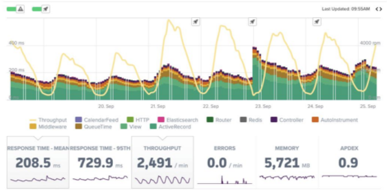
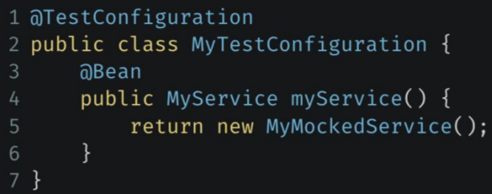
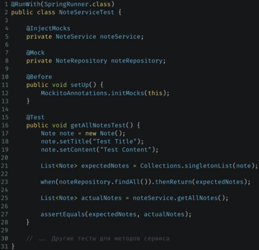
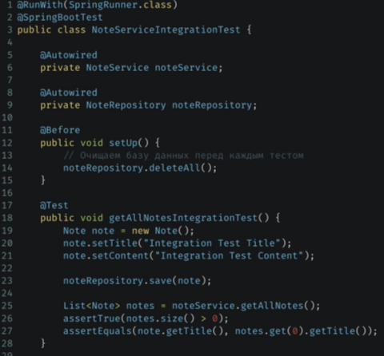

> [НАЗАД к СОДЕРЖАНИЮ](README.md)

---

### Spring Testing

Spring TestContext Framework - основная фича Spring Testing  

`@SpringBootTest` - для загрузки контекста приложения. Начинает работу с поиска класса с аннотацией @SpringBootApplication 
`@MockBean` - мок-версия бина  
`@WebMvcTest` - для тестирования конкретных частей приложения (веб-часть - api/контроллеры)  
`@DataJpaTest` - для тестирования jpa dao-слоя  
`@TestConfiguration` - для определения дополнительных бинов для теста

Можно еще:  
```
//создаются только те бины, которые указаны (чтобы не поднимать весь контекст)
@SpringBootTest(classes = {
        AutoService.class,
        Auto.class,
        TestConfig.class // обычно используется именно класс конфига, где создаются необходимые бины
})
```

`Нагрузочное тестирование`  
Как провести?  
1. Определите ожидаемую нагрузку - например, для банка это зарплатные дни  
2. Создайте тестовые сценарии - какие операции будут использовать пользователи чаще всего
3. Подготовьте тестовое окружение - поднять тестовые бд и сервера
4. Выполните тесты. 
5. Анализируйте результаты. Анализ с помощью `Locust`/`JMetr`- приоритет

Нагрузочное тестирование с помощью `JMetr`  
1. Установка JMeter
2. Создание тестового плана
3. Настройка запросов
4. Добавление слушателей = агрегатчики результатов
5. Запуск теста

Аннотация `@Lob` - для пометки теоретически больших объектов, тяжелых строк и двоичных данных. После пометки объект может быть сохранен в форме CLOB (для текстовых данных) или BLOB (для двоичных данных) в базе данных.  

`Нагрузочное тестирование` нашего Spring-проекта  
1. Установка JMeter.
2. Создание тестового плана.
3. Добавление и конфигурации HTTP Request.
4. Добавление Listener.
5. Запуск теста.
6. Анализ результатов.

`Метрики нагрузочного тестирования`

1. Throughput (Пропускная способность)
2. Response Time (Время ответа)
3. Error Rate (Процент ошибок)
4. Concurrent Users
(Конкурентные пользователи)
5. CPU/Memory Utilization
(Использование ЦПУ/Памяти)

`Зависимости` для тестирования:
1. spring-boot-starter-test
2. mockito-core

`@TestConfiguration`  


`Unit-Тест на Spring:`  - вместо @InjectMocks здесь @Autowired

* @RunWith - походе без контекста
* @InjectMocks - внедряет мок-объект
* @Mock - создает мок-объект
* MockitoAnnotations.initMocks - инициализация мок-объектов

`Интеграционнный тест на Sping:`  

* @SpringBootTest - для загрузки контекста приложения (для внедрения реальных бинов)

Пример работающего теста с помощью Spring-test:  
```java
@SpringBootTest
@ExtendWith(MockitoExtension.class)
class ReaderControllerTest {
    @Autowired
    private ReaderController readerController;
    @MockBean
    private ReaderService readerServiceMock;
    @MockBean
    private IssueService issueServiceMock;

    @BeforeEach
    void resetMock() {
        reset(readerServiceMock, issueServiceMock);
    }

    @Test
    void getByIdWhenExists() {
        ReaderEntity readerEntity = new ReaderEntity();
        readerEntity.setId(1);
        when(readerServiceMock.findById(1)).thenReturn(readerEntity);

        ResponseEntity<ReaderEntity> response = readerController.getById(1);

        Assertions.assertEquals(1, response.getBody().getId());
        Assertions.assertEquals(HttpStatus.OK, response.getStatusCode());
    }

    @Test
    void getByIdWhenNotExists() {
        when(readerServiceMock.findById(1)).thenReturn(null);

        ResponseEntity<ReaderEntity> response = readerController.getById(1);

        Assertions.assertNull(response.getBody());
        Assertions.assertEquals(HttpStatus.NOT_FOUND, response.getStatusCode());
    }
}
```

`@SpyBean` - оригинальный бин. Но можно заменить реализацию методов и следить за вызовами


Чтобы протестировать приложение с Security:
```java
@TestConfiguration
public class WebSecurityTestConfig {
    @Bean
    public SecurityFilterChain filterChain(HttpSecurity httpSecurity) throws Exception {
        System.out.println("Создался тестовый бин WebSecurityConfig!!!");

        return httpSecurity
                .authorizeHttpRequests(registry-> registry
                        .requestMatchers("/**").permitAll()
                        .anyRequest().authenticated()
                )
                .build();
    }
}
```

> Чтобы не поднимать контекст приложения с помощью @SpringBootTest в каждом новом классе, можно создать единственный класс с этой аннотацией, и наследовать все тестовые классы от него

`WebTestClient` - подключить webflux - для тестирования API/Контроллеров
```java
//mono
        ReaderEntity response = webTestClient.get()
                .uri("reader/" + readerEntity.getId())
                .exchange()
                .expectStatus().isOk()
                .expectBody(ReaderEntity.class)
                .returnResult()
                .getResponseBody();

//collection
        List<ReaderEntity> readers = webTestClient.get()
                .uri("reader")
                .exchange()
                .expectStatus().isOk()
                .expectBody(new ParameterizedTypeReference<List<ReaderEntity>>() {
                })
                .returnResult()
                .getResponseBody();
```