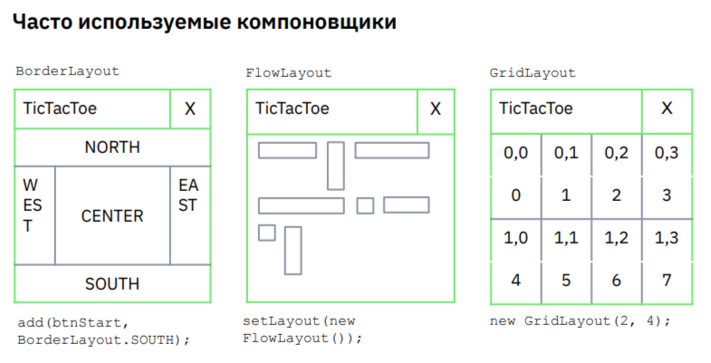

> [НАЗАД к СОДЕРЖАНИЮ](README.md)

---

## **Курс по JDK - добавление графического интерфейса с помощью фреймворка swing**

Проект с шарами на свинге https://github.com/Liberate520/animation_test

JFrame (класс библиотеки swing) - наследовать от него, чтобы создать окно

Базовые свойства окон:
* все окна по умолчанию - невидимые
* нажатие на крестик, по умолчанию, делает окно невидимым, а не завершает работу

Методы класс `JFrame`

- setDefaultCloseOperation(EXIT_ON_CLOSE); - действие при закрытии окна (закрыть программу при закрытии окна):

- setLocation (int x, int y) - метод для определения положения окна

- setLocationRelativeTo(window) - установить положение относительно другуго компонента, при этом, левый верхний угол этого окна будет по центру относительного
  - setLocationRelativeTo(null) - установить положение по центру экрана

- setSize(x, y) - метод для задания размера окна

- setVisible(true) - сделать окно видимым

- setResizable(false) - можно ли менять размер окна мышкой

- add (Component comp) - добавить кнопку, лейблу и т.д. (по умолчанию - компонент займет все свободное место)

* Чтобы переопределить действие при закрытии:
@override
protected void processWindowEvent(WindowEvent e){
    super.processWindowEvent(E);
    if (e.getID() == WindowEvent.WINDOW_CLOSING){
        //какое-то действие, если пользователь нажал на галочку закрытия окна
    }
}

`Компоненты и менеджеры размещения в окнах` - вся работа в Swing происходит через них

> Все кнопки, лейблы - это наследники класса Component. ?? Почему-то кнопки следует задавать вне конструктора окна.

`JButton` - наследовать от него, чтобы создать обычную кнопку
  * JButton btnStart = new JButton("Start new game");
  

> Чтобы оживить кнопку: (подключить слушателя нажатий)
        exit.addActionListener(new ActionListener() { //exit - имя кнопки
            @Override
            public void actionPerformed(ActionEvent e) {
                System.exit(0);
            }
        });

> Start
            btnStart.addActionListener(new ActionListener() {
            @Override
            public void actionPerformed(ActionEvent e) {
                settingWindow.setVisible(true);
            }
        });

`JRadioButton` - кнопка  круглешочком (типа для выбора, обычно мы делаем их несколько)
  * humanVersusHuman = new JRadioButton("human vs human", true); //второй параметр - кнопка выбрана (при нескольких кнопках, одна всегда долджна быть true);

Методы:
* setSelected(true) - или включаем так
* isSelected - вернет тру или фолс

`JSlider` - поле с бегунком для выбора значения параметра (например, от 3 до 10 (как цена на Авито)) sizeSlider = new JSlider(5, 3, 0); //макс значение, мин и текущее
  * `JLabel` - для текущего значения слайдеров

Методы JSlider: 
getValue() - текущее значение на слайдере
sizeSlider.addChangeListener(new ChangeListener() { //действие при перетаскивании ползунка
            @Override
            public void stateChanged(ChangeEvent e) {
                sizeSliderLabel.setText("Selected field size: " + sizeSlider.getValue());
            }
        });

`JLabel` - просто надпись
методы: 
sizeSliderLabel.setText("Selected field size: " + sizeSlider.getValue()); //установить текст

`Менеджер размещений (компановщик)` - специальный объект, который помещается на некоторые (наследники RootPaneContainer) компоненты и осуществляет автоматическую расстановку добавляемых на него компонентов, согласно правилам, в окне приложения.

Список компановщиков:
* BorderLayout (по умолчанию) - располагает элемент в соответствии со стороной света, заданной в качестве второго параметра в методе add()
  * add (buttonStart, BorderLayout.SOUTH);
* BoxLayout
* CardLayout
* FlowLayout - располагает элементы в соответствии с последовательностью строк кода - слева-направо, сверху-вниз
* GridBagLayout
* GridLayout (таблица) - располагает элементы в получившуюся таблицу размером, заданным в конструкторе
  * new GridLayout(2, 4);
* GroupLayout
* SpringLayout

`JPanel` - для складывания групп элементов. Это невидимый прямоугольник со своим внутренним компановщиком. //вот в него уже добавляем кнопки методом add()
  * JPanel panButton = new JPanel(new GridLayout(1,2)); - новая группа элементов с компановщиком-таблицей из 1 строки и 2 столбцов

Методы JPanel:
* setBackground(Color.BLACK); - цвет фона
* paintComponent(Graphics g) - чтобы перерисовывать компонент при клике мыши
* repaint(); - перерисовать - бывает нужно из-за ассинхронности потоков (в конструктор писать)
  * paintComponent() - вызывает внутренний метод. Его можно переопределять
* addMouseListener(new MouseAdapter() { //метод ожидания действия мыши
    @Override
    public void mouseReleased(MouseEvent e) { //метод, ожидающий отпускания мыши после клика
        if (e.getButton() == MouseEvent.BUTTON1) //для левой мыши
        if (e.getButton() == MouseEvent.BUTTON3) //для правой мыши
        update(e); //самописный метод, вызывающий repaint();
    }
});
Рисование самих компонентов (пишем в объекте типа JPanel):

`Graphics` - класс для рисования

методы Graphics:
- setColor(Color.BLACK) - цвет карандаша
- drawLine(0,0,100,100) - рисует линию из точки (0,0) в точку (100,100)
- drawOval(4 инта) - тоже из одной точки до другой
- fillRect(0, getHeight() / 2, getWidth(), 70); - установить заливку (крч прямоугольник с фоновой заливкой, где 4 координаты - его углы)
- setFont(new Font("Times new roman", Font.BOLD, 48)) - установить шрифт
- drawString(MSG_DRAW, 180, getHeight() / 2 + 60) - нарисовать надпись. //MSG_DRAW - стринга, x,y - коориднаты крайней левой точки, от которой начинается надпись

`MouseEvent` - класс-событие для клика мыши

методы MouseEvent:
getX(), getY() - координаты клика мыши 

`ButtonGroup` - используется для группировки радиокнопок (JRadioButton) таким образом, что можно выбрать только одну кнопку из группы. Это позволяет создать **взаимоисключающие кнопки**, где выбор одной кнопки автоматически отменяет выбор другой.

`JOptionPane` - утилитный класс ВРОДЕ

* Для вывода сообщения об ошибке и т.д.:
JOptionPane.showMessageDialog(startServer, "Server is already disabled!"); //startServer - базовый Component

`Текстовые компоненты:`

https://java-online.ru/swing-jtextfield.xhtml

`JTextField` - класс для однострочного ввода текста
  * new JTextField("Текст поля", 25); //задать значение пустой строки и ее длину в конструкторе
  * setToolTipText("Короткое поле"); //установить текст, отображающийся по дефолту  
  * setText(""); //установить текст во время работы приложения
JPasswordField - класс, скрывающий на экране введенный текст (как для паролей)
  *     textField.addKeyListener(new KeyAdapter() { //слушать нажатие Enter
        @Override
        public void keyPressed(KeyEvent e) {
            if (e.getKeyChar() == '\n'){
                serverWindow.appendToChat(textField.getText());
            }
        }
    });

`JPasswordField` - класс для ввода пароля
- password.setEchoChar('*');

`JTextArea` //текстовое поле
  * setText("") //чтобы очистить поле
  * setEditable(false); //чтобы в окне в это поле нельзя было писать (идеально для вывода чата)

`JScrollPane` - для скроллинга текстового поля при выхода текста за пределы окна
JScrollPane(new JTextArea());

`Исключения в графическом интерфейсе фреймворка Swing:`
(Чтобы обработать исключения без падения приложения..., иначе - при появлении неожиданного исключения - приложение упадет)
 - необходимо имплементировать Thread.UncaughtExceptionHandler, реализовать единственный метод uncaughtExceptinon(Thread t, Throwable e){
    //здесь по умолчанию бросается исключение в консоль, что не приведет к падению графического приложения
 }

 далее можно Thread.setDefaultUncaughtExceptionHandler(this);

 Реализовывать интерфейсы можно с помощью адаптеров - классов, реализующий несколько интерфейсов с пустой реализацией {}, дабы при имплементации реализовать только тот, который нам будет нужен метод

 * Чтобы задать цвет в RGB-формате:
 new Color(int red, int green, int blue); //0-255 для каждого

