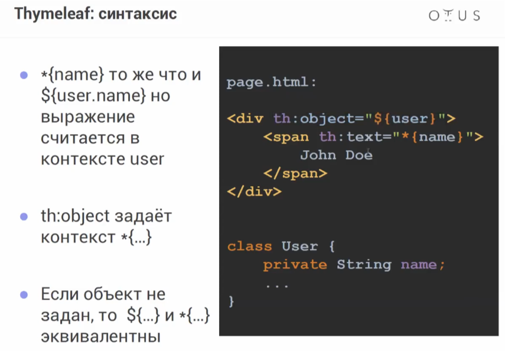
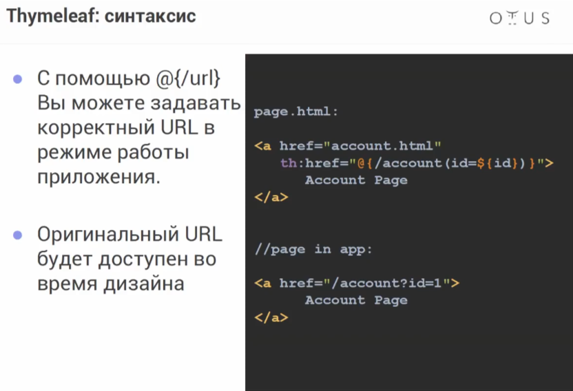
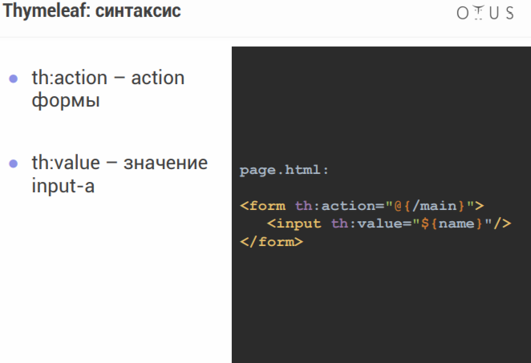
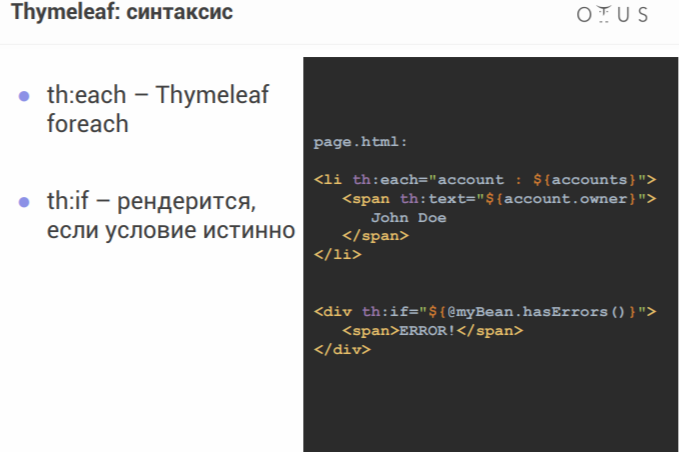
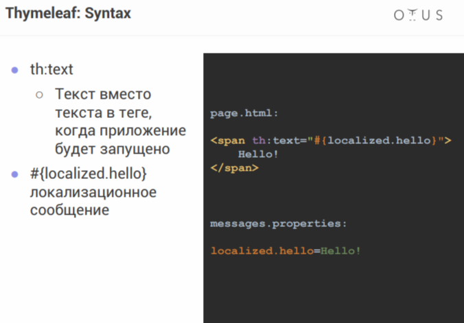
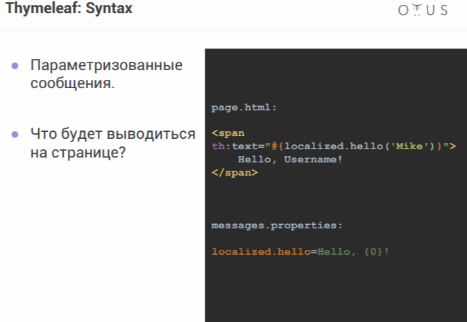
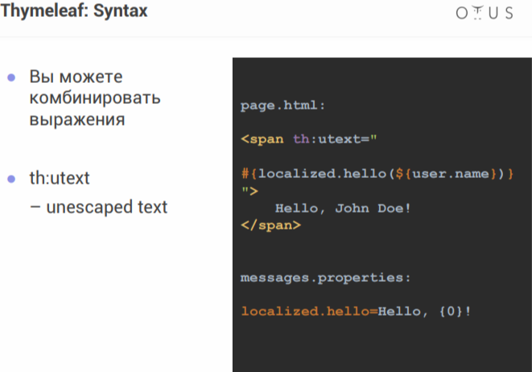

> [НАЗАД к СОДЕРЖАНИЮ](README.md)

---

## Thymeleaf - шаблонизатор представлений

[туториал (habr)](https://habr.com/ru/articles/350862/)

`Шаблонизатор` - художник веб-страниц. Это инструмент, который помогает нам создавать веб-страницы более эффективно. Он позволяет нам разделить структуру страницы (HTML) и данные, которые мы хотим отобразить на этой странице.  

**Представления** шаблонизатора должны располагаться в директории:  
src/main/resources/templates  

**Статичные страницы**, такие как index.html (первая страница сайта) и таблицы стилей CSS, должны располагаться в директории:  
src/main/resources/static

`Зависимость`
```xml
<dependency>
    <groupId>org.springframework.boot</groupId>
    <artifactId>spring-boot-starter-thymeleaf</artifactId>
</dependency>
```

`Синтаксис`  


`Синтаксис №2`
  
  * так задастся @RequestParam в виде ?id=1

`Синтаксис №3`  
```
● <a th:href="@{/account(id=${id})}"> – такая
конструкция позволяет подставлять query/request
параметры  
● <a th:href="@{/account/__${author.id}__}"> – а такая в подставлять параметры путь (path)
● error.html – сделать это шаблон достаточно, чтобы обработать ошибки
```

`Синтаксис №4`
 

`Синтаксис №5`
 

`Синтаксис №6`  
● @beanName – Spring-бин с именем "beanName"  
● #locale – текущая локаль  
● #ctx – текущий контекст  
● Конкатенация, арифметические и условные
операции.  

`Синтаксис №7` Локализация
 

`Синтаксис №8` Локализация с параметрами
 

`Синтаксис №9` Локализация с параметрами
 

**Thymeleaf в цикле:**
```xml
<!doctype html>
<html lang="en" xmlns:th="http://www.thymeleaf.org">
<head>
    <meta charset="UTF-8">
    <meta name="viewport"
          content="width=device-width, user-scalable=no, initial-scale=1.0, maximum-scale=1.0, minimum-scale=1.0">
    <meta http-equiv="X-UA-Compatible" content="ie=edge">
    <title>People</title>
</head>
<body>
<div th:each="person : ${people}"> <!--цикл-->
    <th:block>
        <a th:href="@{/people/{id}(id=${person.getId()})}" th:text="${person.getName()}">user</a> <!--создаст ссылку по айди из геттера с именем пользователя, тоже из геттера-->
    </th:block>
</div>
</body>
</html>
```

`Thymeleaf-форма для ввода данных` и отправки POST-запроса и других, за исключением GET. Get запрос отпр-ся с помощью тега \<a>

```xml
<body>
<!--1 - тип запроса, 2 - адрес, по которому будет пост-запрос, 3 - пустой объект, который передается для
его инициализации пользователем-->
<form th:method="POST" th:action="@{/people}" th:object="${newPerson}">
    <!--здесь поле для ввода значения для свойства name объекта класса Person-->
    <label for="name">Enter name: </label>
    <input type="text" th:field="*{name}" id="name"/>
    <br>
    <!--Кнопка типа отправить-->
    <input type="submit" value="Create">
</form>
</body>
```

`Thymeleaf работа с текстом` - подставить в определенное место текст, соответствующий, в данном случае, сообщению
```xml
<p th:text="${message}"></p>
```

Чтобы подключить таблицу стилей в представление:  
```html
<head>
<title>Main page<title>
<link href="styles.css" rel="stylesheet" type="styles/css">
</head>
```

`Пример Post-ручки`
```java
    @PostMapping("/edit")
    public String editBook(BookViewDto book) {
        bookService.update(book.getId(), book.getTitle(), book.getAuthorId(), book.getGenres());
        return "redirect:/book"; //редирект на страницу со списком книг
    }
```

Пример "ручки" при работе с **отображениями с помощью Thymeleaf**:  
```java
    @GetMapping
    public String getAllUsers(Model model){
        model.addAttribute("users", userService.getAll());
        return "users";
    }
```
Model model - ровно тоже самое, что HashMap. В модель внедрятся те значения, которые следует передать в представление
.addAttrubete - добавляем ключ, значение  

`span`
```xml
<span th:text="hello, ${name}">Hello, Username</span> - вместо дефолтного текста отобразится сгенерированный, если в переменной name что-то есть
```