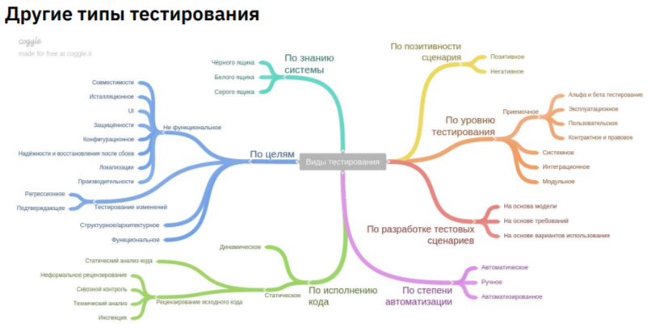

> [НАЗАД к СОДЕРЖАНИЮ](README.md)

---

# Unit-тесты

Преподаватель - Илья Смотров. Руководитель отдела тестирования компании "Аэро" в подразделении консалтинга

`Виды тестирования`


`Тестирование` - проверка соответствия между реальным поведением программы и ее ожидаемым поведением.

Преимущества тестирования:
* проверка соответствия требованиям.  
Гарантирует работоспособность и качество предоставляемых сервисов для получения прибыли, поэтому тестирование - обязательный этап в разработке
* обнаружение багов на более ранних этапах разработки и предотвращение повышения стоимости продукта (поддержание стабильного качества продукта)

`Баг` - ситуация, при которой программа выдает неожиданное поведение и результат.
Виды багов:
* синтаксические (решаются до компилляции)
* логические
* ошибки выполнения (Runtime exception) /0

Кривая Боэма - рост затрат на поиск и устранения причин дефектов


Рекомендации от Google:  
1. 70% - модульные
2. 20% - интеграционные
3. 10% - E2E

Принципы тестирования:
* тестирование показывает наличие дефектов //это значит, что тестирование не гарантирует отсутствие багов после тестирования
* исчерпывающее тестирование невозможно //поэтому фокусируемся на самых важных моментах
* раннее тестирование //начинать тестирование в жизненном цикле ПО необходимо как можно раньше
* кластеризация деффектов //80% деффектов находятся в 20% модулей
* парадокс пестицида //при использовании одних и тех же тестов, со временем, они перестают находить баги
* тестирование зависит от контекста
* заблуждение об отсутствии ошибок //+ предложенный функционал должен быть нужен пользователю

> Баги водятся на границах))

`Ошибки в пограничных случаях` - самая частая причина логических ошибок в программе. Мы можем просто не подумать что-то учесть. Программа упадет только в каком-то крайнем случае из возможных.

> Тесты принято выносить в отдельный класс для того, чтобы они не влияли на основную логику. Имя = имя тестируемого класса + Test. CalculatorTest

Ошибка приема не корректного параметра в метод - использовать `AssertionError`

Утверждения (`Assert`) - встроенный в java механизм проверки правильности предположений. В основном, используется для тестирования во время разработки. Утверждения реализуются с помощью оператора assert и java.lang.Class AssertionError. 

> изначально, в среде разработки **assert(утверждение)** не работает. Его необходимо включить. 
Или в настройках Idea: 
1. Откройте меню Run
2. Выберите Edit Configurations
3. add new config...
4. application
5. add VM options
6. в графу add VM option: -ea
7. Выбираем Main class
8. Apply
* Можно запустить из терминала: java -ea .\src\main\java\org\example\Main.java

```java
assert booleanExpression; //если результат false, то программа выбросит AssertionError
//например:
assert 2 == Math.pow(2,1): "Текст ошибки";
```
`AssertJ` - библиотека для написания более гибких и удобочитаемых утверждений с полезными сообщениями об ошибках, улучшает читаемость тестового кода. Принцип: fluent API - строка тестового кода легко читается в строку на на англ.
https://assertj.github.io/doc/

Для Maven:
    <dependencies>
        <dependency>
            <groupId>org.assertj</groupId>
            <artifactId>assertj-core</artifactId>
            <version>3.24.2</version>
            <scope>test</scope>
        </dependency>
    </dependencies>

Далее **импортируем** в класс: 
import static org.assertj.core.api.Assertions.assertThat;; //начало пути можно посмотреть в зависимостях в pom

`Методы Assertions:`
```java
//для проверки результата метода:  
Assertions.assertThat(Foo.sum(3,4)).isEqualTo(8); //утверждаем, что сумма ... равна ...
//для сравнения объектов:  
Assertions.assertThat(worker1).isNotEqualTo(worker2);
        Assertions.assertThat(shop
                .getProducts())
                .isNotEmpty()
                .hasSize(5)
                .doesNotHaveDuplicates()
                .extracting(Product::getTitle) //ПРОХОДКА ПО СВОЙСТВУ ОБЪЕКТА
                .containsSequence("Water", "Milk", "Bread", "Tea", "Chocolate");
//для проверки коллекций:  
Assertions.assertThat(collect).hasSize(9).contains(frodo, sam).doesNotContain(sauron);
Assertions.assertThat(colors).isNotEmpty().hasSize(7).doesNotHaveDuplicates()
        .contains("orange", "green", "violet")
        .endsWith("gold")
        .startsWith("aqua")
        .containsSequence("yellow", "blue")
        .doesNotContain("red", "black");

//для фильтрации коллекции и дальнейшей проверки:
Assertions.assertThat(collect).filteredOn(character -> character.getName().contains("O")).containsOnly(aragorn, frodo, legolas, boromir);

//для проверки соответствия выбрасываемого исключения:  
Assertions.assertThatThrownBy(()->Foo.div(4,0)).isInstanceOf(ArithmeticException.class); //.hasMessage() - пр-ка сообщ.

//модификация сообщения об ошибке - метод as()
Assertions.assertThat(frodo.getAge()).as("check %'s age", frodo.getAge().isEqualTo(33));

//чисто на эквивалентность проверка: - ХЗ откуда метод
@Test
public void testSquareRootPositive(){
    assertEquals(5.0, squareRoot(25.0), 0.0001); //1 парам - ожидаемое, 2 - действительное, 3 - точность вычисления
}
```

`JUnit` - фреймворк для модульного тестирования ПО на Java. (семейство xUnit)

JUnit 5 - 2016 y.

Компоненты любого xUnit-фреймворка:
1. Test runner (средство для запуска тестов)
2. Test case (класс для наследования для реализации своего теста)
3. Test fixtures (набор условий или состояний, необходимых для выполнения теста)
4. Test suites (компонент, позволяющий объединять тесты в suit и запускать их в опред. последовательности)
5. Test execution (особенности при выполнении теста)
6. Test result formatter (формирование результата и подготовка отчета после выполнения теста)
7. Assertions (проверки, что фактический результат соответствет ожидаемому)

### Unit-тесты

функции юнит-тестов:  
- проверка правильности работы небольшого фрагмента кода (также называемого юнитом), а также модулей
- скорость выполнения тестов должна быть быстрой
- изоляция тестов от другого кода. 2 подхода:
  - лондонская школа - изоляция каждого класса. больше хрупких тестов с большей изоляцией - проще найти ошибку
  - классическая школа - изоляция класса или группы классов (совместные зависимости), при этом происходит изоляция юнит-тестов. Изоляция достигается "мокированием" - заменой элементов симуляциями (пример - подмена значения из консоли)

Фазы тестирования:
1. модульное (Unit-тесты)
2. интеграционное (Integration)
3. системное (E2E - end to end) - здесь проверяется сценарий всей безнесс-логики

По пирамиде Майка Кона - примерно: 60% - юнит-тесты, 30% - интеграционные, 10% - системные

`Интеграционное тестирование` - одна из фаз тестирования ПО, при которой отдельные программные модули объединяются и тестируются в группе.

Тест интеграционный, если:
* использует БД
* использует сеть для вызова другого приложения
* использует внешнюю систему (например, почтовый сервер)
* выполняет операции ввода-вывода
* полагается не на исходный код (а на готовую программу или сервис)

Популярные фреймворки на Java:
* `JUnit`
* Mockito (позволяет писать тестовые заглушки или псевдообъекты)
* JBehave (тесты на человекообразном языке)
* Spock (интуитивный фреймворк для создания документации)
* TestNG (позволяет структурировать тесты, основан на JUnit)

JUnit 5:
1. Платформа JUnit - проект платформы JUnit предоставляет API для запуска тестов //просто документация
2. JUnit Jupiter - API для написания тестов (новые). Jupiter - потому что 5 верия = 5 планета от Солнца
3. JUnit Vintage - API для обратной совместимости (для поддержания тестов, написанных на JUnit 3/4)

`Методы JUnit junit.framework.Assert:`
* assertEquals (принимает 3 значения. 3 - точность. типа: 0,001)
  * assertEquals(420, cart.getTotalPrice());
* assertFalse
* assertNotNull
* assertNull
* assertNotSame
* assertSame
* assertTrue

Для использования: качаем JUnit Jupiter API, JUnit Platform Commons

> Тесты писать в отдельной папке "test" - ниже уровня src, наряду с main. -> Mark as test... После этого у пакета появится новая опция - "Run all tests"! - за это отвечает зависимость junit-platform-commons

`Аннотации JUnit:`
* @Test - для пометки метода, как тестового  
* @BeforeEach == @Before (JU4) - аннотированный метод будет выполняться после каждого метода @Test, @RepeatedTest, @ParameterizatedTest, @TestFactory в текущем классе  //типа очистки консоли или еще чего-то
* @BeforeAll (в JU4 - @BeforeClass) - выполняется перед всеми методами @Test, @RepeatedTest, @ParameterizatedTest, @TestFactory в текущем классе. Такие методы должны быть статисескими, если не используется жизненный цикл тестового экземпляра "для каждого класса" - хз вообще.
* @AfterAll == @AfterClass (JU4)- после всех методов
* @AfterEach == @After (JU4) - после каждого
* @DisplayName - объявляет пользовательское отображаемое имя для тестового класса или тестового метода //для отчетов
    @Test
    @DisplayName("name")
    ...method
* @Disabled == @Ignored (JU4) - для исключения метода или класса из тестирования 
  @Disabled("Disabled until....")
  @Test
  ...method  
* @RepeatedTest - метод является шаблоном теста для повторного тестирования.
  @RepeatedTest(10) //кол-во повторов
  ...method
* @ParameterizeTest - метод являет параметризованным тестом
  @ParametetizeTest
  1 вариант - для набора параметров одного типа, когда метод принимает только один аргумент
  @ValueSource(strings = {"first", "second", "the third stroke"}) //здесь указывается набор из параметров
  ...void testMethod(String value){...}
  2 вариант - для набора аргументов из нескольких, когда метод принимает нексолько аргументов
    @ParameterizedTest
    @CsvSource({"Kte, underworld","Kate, underwrld"})
    void testAuthenticationNegative(String login, String password){
        assertFalse(user.authenticate(login, password));}
* @TimeOut
  @Timeout(value = 70, unit = TimeUnit.MILLISECONDS)
* @Tag == @Category (JU4) - для маркировки тестов (потом можно будет запустить группу таких тестов), можно и несколько
  @Test
  @Tag("development")
  @Tag("production")

---

**Тестирование методов, работающих с консолью:**


### INPUT

```java
    /**
     * Метод для тестирования методов, работающих с консолью (сканнером)
     */
    public void substitudeInput(){
        String testValue = "9";
        ByteArrayInputStream in = new ByteArrayInputStream(testValue.getBytes());
        InputStream inputStream = System.in;//сохраняем дефолтную историю
        System.setIn(in);

        //какой-то метод, который работает со сканером
        
        System.setIn(inputStream);
    }
```

### OUTPUT

```java
    public void substitudeOutput(){
        ByteArrayOutputStream out = new ByteArrayOutputStream();
        System.setOut(new PrintStream(out));
        //теперь можем работать с тем, что вывелось в консоль
        assertEquals("Этого товара нет в наличии", output.toString().trim());
    }
```


---

> Тесты должны не быть static!!! Иначе Idea не увидит тесты

Пример теста по блокам:
```java
    @Test
    void priceCartIsCorrectCalculated() {
        //блок подготовки
        //в данном случае - переменные глобальные. Этот блок пуст.
        //блок выполнения
        cart.addProductToCartByID(1);
        cart.addProductToCartByID(2);
        //блок утверждения
        assertEquals(420, cart.getTotalPrice());
    }
```

Пример теста с несколькими аннотациями:
```java
    @Disabled
    @DisplayName("Advanced test for calculating TotalPrice")
    @RepeatedTest(10)
    @Timeout(value = 1000, unit = TimeUnit.MILLISECONDS)
    public void calculateTotalPrice(){
        cart.addProductToCartByID(2);
        assertThat(250.0).isEqualTo(cart.getTotalPrice());
    }
```

`Регрессионное тестирование` - собирательное название для всех видов тестирования ПО, направленное на обнаружение ошибок в уже протестированных участках кода. (после внесений изменений)

**Регрессионные ошибки возникают:**
* после рефакторинга
* после добавления в ПО нового функционала (фичи)
* после устранения багов
* после корректировки проблем производительности

Атрибуты качества Unit-теста:
1. Защита от регрессий - достаточный объем проверяемого кода, важность с точки зрения бизнес-логики
2. Устойчивость к новым изменениям - тест должен быть отвязан от деталей реализации и проверять только результат
3. Простота поддержки - тест должен быть легко читаем и изменяем
4. Быстрая обратная связь - быстрые тесты + небольшие тесты + изоляция от окружения


//не особо про юнит-тесты
`Тестирование черного ящика` (black box testing) - проверка результата работы приложения, а не процесса реализации
  * лучшая устойивость к рефакторингу исходного кода, но меньшее обнаружение багов
  * используетяся для тестирования с точки зрения пользователя

//моя история
`Тестирование белого ящика` (white box testing) - проверка результата работы приложения, учитывая процесс реализации
  * лушчая борьба с багами, но плохая устойчивость к рефакторингу исходного кода
  * используется во время разработки и проверки реализации методов

//история авто-тестировщиков
`Тестирование серого ящика` (grey box testing) - комбинация первых двух подходов. Мы знаем о реализации системы не все. Так, учитываются некоторые особенности реализации, но тестирование проиходит с точки зрения пользователя.


`Метрики покрытия` (coverage metric) - являются одними из немногих объективных методов оценки качества тестирования ПО. Они показывают процент исходного кода программы, который был выполнен в процессе тестирования. 

**Способы измерения покрытия:**
* Покрытие строк (stroke coverage) //top
  * но вот в случае строки: return a == b, мы покроем не все логические ветви...
* Покрытие ветвей (branch coverage)
* Покрытие требований (requirements coverage)

`Покрытие строк` (code coverage/test coverage) = количеству строк кода, выполняемых по крайней мере одним тестом / общее кол-во строк в основном коде проекта

`Покрытие ветвей` (branch coverage) - направлена на структуры if и switch-case. Она показывает, какое кол-во ветвей логики покрываются хотябы одним тестом. = кол-во покрытых ветвей / общее кол-во ветвей

`Покрытие бизнес-требований`. Пример: приложение с 5тью функциями, реализовано на данный момент 4. Мы все протестировали. Покрытие = 4/5 = 80%. 

> для расчета покрытия - Run... with Coverage. При этом, в тестируемых классах протестированные строки - будут подсвечиваться зеленым, остальные - красным.

Другие инструменты для расчета покрытия кода:
- JaCoCo
- Cobertura
- Clover

### Разработка через тестирование (TDD)

Экстремальное программирование - Кент Бек (книга)

- Test-dreven Development (TDD) - техника разработки ПО, которая основывается на повторении очень коротких циклов разработки:
1. написание теста, покрывающего желаемое изменение
2. код, который позволит пройти тест
3. рефакторинг кода к соответствующим стандартам

`TDD`  
* Преимущества:
1. Уменьшает зависимость от отладки
2. Анализирует пользовательский опыт
3. Сокращает общее время разработки
* Недостатки:
1. Не любит большой дизайн (простой тест = простой код для его прохождения)
2. Не подходит для всех (если мы не понимаем,как будет выглядеть функция в итоге, этот подход нам не поможет)
3. Требует доп. затрат времени (много тестов)

### Разработка через поведение (BDD)

- Behavior-driven development (BDD) - крч, тестирование через формы пользовательского интерфейса

Фокус идет на:
* с чего начинается процесс
* что нужно тестировать, а что нет
* сколько проверок должно быть совершено за один раз
* что можно назвать проверкой
* как понять, почему тест не прошел


`Test Doubles` - общий термин для всех видов **заглушек**. Сам процесс - `мокирование` - замена внешних зависимостей на заглушки для изоляции и концентрации за тестируемом коде.

Типы тестовых заглушек:  
1. Dummy (Фиктивный объект или объект-заглушка) - передается тестируемой системе в качестве аргумента. Порой, можно передавать вообще **пустые классы** без реализации, или даже null!
2. Stub (Заглушка) - объект, заменяющий реальный компонент, от которого зависит тестируемая система, для которого задаются **готовые ответы на вызовы**. (без логики, просто возвращение конкретных предопределенных значений). Можно использовать для эмуляции **входных зависимостей/получаемых значений**. (БД)
3. Mock - крч. Создается общий интерфейс для реального рабочего класса и для таких вот моков. Мок реализует этот интерфейс и подключается куда надо. Обычно, моки создаются для проверки контракта между тестируемым кодом и зависимостями. Позволяет тесту **проверять вывод**. Например, взаимодействие с почтовым сервером.
4. Fake - заменяет функциональность вызываемого компонента альтернативной реализацией. Например, обращаться не к БД, а к какой-то коллекции с данными.
5. Spy (Шпион) - заглушки, записывающие некоторую инфу, в т.ч. о том, как они были вызываны. (должна быть ссылка на реальный объект). При этом, записывает все, что вызывает его. Используется в приложениях, распределенных по разным сервисам для записи порядка вызовов //редко используются

Фреймворки для моделирования тестовых зависимостей:
* Mockito //top
* EasyMock
* WireMock
* MockWebServer
* PowerMock //top2
* JMockit

### `Mockito` - инструмент создания тестовых заглушек. В основном, используется для выявления ошибок регресса после изменения бизнес-требований

`Mockito` - популярный фреймворк, который используется с JUnit. Он позволяет создавать и настраивать mock-объекты. 
Позволяет работать с моками, стабами и шпионами.

import static org.mockito.Mockito.*;

`Использование Mock`
  * пример мока: 
  1 способ - статический метод
  List mocketList = mock(List.class); //такой список не будет работать. 
  2 способ - аннотация
    @Mock
    private Object object;

> virify () НЕ УЧИТЫВАЕТ вызовы методов, если они помещены в цикл!!!!!

> Правило: when() и verify() прописывать внутри конкретного теста

`Задание условий вызова:`
when() //принимает ТОЛЬКО возвращаемые типы данных!!!

`Чтобы вызвать реальный метод на моковом войде`:  
doCallRealMethod().when(bot).onUpdateReceived(update);

`Когда, тогда вернуть:`
when(...).thenReturn(...)
  * when(mocketList.get(0)).thenReturn("nullValue");
  * when(iterator.next()).thenReturn("Hello ").thenReturn("World");
  * или так: when(iterator.next()).thenReturn("Hello", "World"); //при первом вызове вернет первый объект и так далее
  
`Настройка выбрасываемых исключений:`
when(...).thenThrow()
  * when(mocketList.get(1)).thenThrow(new RuntimeException());

`Отследить вызову методов:`
verify(...)
  * verify(mocketList.get(0)); //убедиться, что данный момент именно в таком виде был вызван ранее

`Вызов реальных методов`
when(mock.somMethod()).thenCallRealMethod()
  * when(mocketList.get(4)).thenCallRealMethod();

`Проверка с таймаутом`
verify(mock, timeout(100)).someMethod();

`Проверка точного количества вызовов` //если нужно проверить void методы, то используем объект по количеству вызовов!
verify(mockedList, never()).add("never happened"); //add() здесь проверка вызова этого метода с конкретным параметром
verify(mockedList, times(2)).add(twice);
  * verify(mocketList, times(2)).add("lalala"); 

`Настройка ответа с помощью лябды`
when().thenAnswer()
when(hotelService.isRoomAvailable(anyInt())).thenAnswer(i -> ( Integer)i.getArgument(0) % 2 == 0);

`Чтобы следить за объектом и его вызовами, когда это не мок-объект`
@Spy - чтобы сработало, 
включить аннотации - MockitoAnnotations.initMocks(this); //depricated
НАД КЛАССОМ аннотировать:
для JUnit5 - @ExtendWith(MockitoExtension.class)
для JUnit4 - @RunWith(MockitoJUnitRunner.class)

еще можно: Mockito.spy(объект, за которым слидим (не класс))

Пример полноценного теста и использованием `Mockito`:
```java
    @Test
    public void iteratorMightSayHelloWorld(){
        Iterator iterator = mock(Iterator.class); //создали мок-объект
        when(iterator.next()).thenReturn("Hello").thenReturn("World");

        String result = iterator.next() + " " + iterator.next();

        assertEquals("Hello World", result);
    }
```

`donothing` пример:
```java
doNothing().when(bot).sendMessage(anyLong(), anyString());
```

`doThrow` пример: (если void метод должен что-то выбросить)
```java
Mockito.doThrow(RuntimeException.class).when(auto).changeWheels();
```


Для тестирования в поведенческом паттерне: import static org.mockito.BDDMockito.*;

Ограничения Mockito:
* не умеет работать с final классами и методами
* не умеет работать со static методами
* не умеет с анонимными классами
* не умеет с примитивными типами


### Интеграционное тестирование - одна из фас тестирования ПО, при котором отдельные юниты объединяются и тестируются в совокупности. (обычно, это обязанности QA-инженера (тестировщика))

Инструменты `интеграционного тестирования`:
* TestContainers - библиотека, представляющая легковесные основные БД, браузеры и т.д. в виде контейнеров (Docker); -   Обертка Java над Докером. После тестирования происходит автоматическое удаление контейнеров
* Robot Framework

Минусы интеграционных тестов:
* долго выполняются (особенно при работе с БД)
* тяжело локализовать ошибку
* тесты нестабильны

Плюсы интеграционных тестов:
* тестирование в почти реальном окружении
* нахождение проблемы до развертывания приложения
* можно запустить в процессе разработки


### TestContainers - по сути, java-обертка над докером //на практике почти не используют, т.к. мы либо мокируем зависимости, либо поднимаем свою же БД в докере

> [Пример от OTUS](https://github.com/petrelevich/otus_java_2022_06/tree/main/L09-docker)

`Зависимость`
```xml
<dependency>
 <groupId>org.testcontainers</groupId>
 <artifactId>testcontainers</artifactId>
 <version>1.11.1</version>
 <scope>test</scope>
</dependency>
```

Пример использования TestContainers
```java
public class RedisBackedCacheIntTest {
 private RedisBackedCache underTest;
 @Rule
 public GenericContainer redis = new GenericContainer<>("redis:5.0.3-alpine")
 .withExposedPorts(6379);
 @Before
 public void setUp() {
 String address = redis.getContainerIpAddress();
 Integer port = redis.getFirstMappedPort();
 underTest = new RedisBackedCache(address, port);
 }
 @Test
 public void testSimplePutAndGet() {
 underTest.put("test", "example");
 String retrieved = underTest.get("test");
 assertEquals("example", retrieved);
 }
}
```
* @Rule говорит Junit уведомлять это поле о ходе
тестов
* TestContainer найдет и проверит что докер
установлен
* Скачает image если нужно
* Поднимет контейнер
* Удалит контейнер после окончания тестов

Объекты подмены:
* для БД - Postgres container
* для какого-то сервиса, с которым общаемся по HTTP - MockServer/WireMock

`Аннотации Testcontainers`:
* @TestContainers - означает, что в рамках КЛАССА мы будем использовать тестовые контейнеры. Пишется над классом
* @Container //для создания контейнера. Пишется непосредственно над объявляемой переменной
private PostgreSQLContainer postgresqlContainer = new PostgreSQLContainer() //создаем БД и сразу задаем параметры
 .withDatabaseName("foo")
 .withUsername("foo")
 .withPassword("secret");

**Проверка работы контейнера**:
 @Test
 void test() {
 assertThat(postgresqlContainer.isRunning()).isTrue();
 }

` Контейнеры TestContainers:`
● Databases
● JDBC support
● Cassandra Module
● Clickhouse Module
● MongoDB Module
● Postgres Module
● Docker Compose Module
● Elasticsearch container
● Kafka Containers
● Mockserver Module
● Nginx Module
● RabbitMQ Module
● …

**Мокирование сервера:** //в рамках работы SPRING!!! //хз работает ли
 public static MockServerContainer mockServer = new
MockServerContainer(DockerImageName.parse("jamesdbloom/mockserver"));
 . . .
 public void initialize(ConfigurableApplicationContext configurableApplicationContext) {
 TestPropertyValues.of(
 "service-bank.base-url=http://" + mockServer.getContainerIpAddress() + ":" +
mockServer.getFirstMappedPort()
 ).applyTo(configurableApplicationContext.getEnvironment());
 }

**Проверка работы сервера**  //хз работает ли
@Test
 void getCitizenStatistic_forHelenZheludOK() {
 // Подготовка
 new MockServerClient(mockServer.getHost(), mockServer.getServerPort())
 .when(request()
 .withPath("/users/1"))
 .respond(response()
 .withBody("[]");
 // Действие
 ResponseEntity<User> entity = restTemplate
 .getForEntity("http://localhost:" + port + "/users/1", User.class);
 // Проверка
 assertThat(entity.getStatusCode()).isEqualTo(HttpStatus.OK);
 assertThat(entity.getBody()).isNotNull();
 assertThat(entity.getBody().getTotal).isEqualTo(BigDecimal.ZERO);
 }

### Сквозное тестирование (End to end E2E) - вид тестирования, который проверяет работоспособность приложения от начала и до конца, а также взаимодействие с внешними зависимостями

> Тесты в Е2Е пишутся так: 1 класс для одной страницы

> В Е2Е тестах не может быть тестовых заглушек!

**Цель сквозного тестирования** состоит в проверке всего программного обеспечения
на предмет зависимостей, целостности данных и связи с другими системами, интерфейсами
и базами данных для проверки успешного выполнения **полного производственного сценария**
По сравнению с интеграционными тестами такие тесты обычно включают пользовательский
интерфейс, если он есть. 

Инструменты для сквозного тестирования:
* `Selenium` - для автоматизации тестирования web-приложений. Может эмулироват действия пользователя: навигация по странице, переход по ссылкам, ввод данных в поля, нажатия кнопок и т.д. Представляет удобный интерфейс для создания сценариев, а также имеет web-драйвер для работы с браузером и запуска E2E тестов. //TOP

* Cucumber - фреймворк для автоматизированного тестирования ПО.

`Selenium` - эмуляция поведенияв E2E-тестах

> Форма с вводом и сайт для тренировки на Selenium: https://www.saucedemo.com/

> кроме самого селениума нужен веб-драйвер для браузеров selenium. Нужно скачать и подключить внутрь. Пример: Chrome web-driver selenium (искать по соответствию версии браузера)

**Пример** подключения: + проверка на содержание ссылки на странице
```java
public class GettingSrarted {
    @Test
    public void testGoogleSearch() throws InterruptedException {
        System.setProperty("webdriver.chrome.driver", "/path/to/chromedriver"); //подрубили драйвер. Необязательно задавать, если драйвер только один в проекте
        WebDriver driver = new ChromeDriver();
        driver.get("http://www.google.com/"); //получаем сайт
        Thread.sleep(5000);  // Let the user actually see something!
        WebElement searchBox = driver.findElement(By.name("q")); //ищем поле поискового запроса
        searchBox.sendKeys("Любой поисковой запрос"); //поисковый запрос
        searchBox.submit(); //имитация нажатия на Enter

        //1 вариант
        WebElement selenium = driver.findElement(By.partialLinkText("https://www.selenium.dev"));
        assertTrue(selenium.getText().contains("Selenium"));

        //2 вариант вариант поиска ссылки. Пробегаемся по тегу, потом по атрибуту
        List<String> links = driver.findElements(By.tagName("a")).stream().map(it -> it.getAttribute("href")).collect(Collectors.toList());
        assertTrue(links.contains("https://www.selenium.dev/")); //ну и понятно

        Thread.sleep(5000);  // Let the user actually see something!
        driver.quit(); //закрыть окно браузера
    }
}
```

> Элементы на странице можно искать по x-path. Копируй из инструментов разработчика. Пример:  
```java
WebElement products = driver.findElement(By.xpath("//*[@id=\"header_container\"]/div[2]/span"));
assertEquals("Products", products.getText());
```

Непрерывная интеграция (`CI`, англ. `Continuous Integration`) — практика разработки программного
обеспечения, которая заключается в постоянном слиянии рабочих копий в общую основную ветвь
разработки (до нескольких раз в день) и выполнении частых автоматизированных сборок проекта
для скорейшего выявления потенциальных дефектов и решения интеграционных проблем.

> На практике при выполнении package Maven, сразу после этого выполняется test. И, если тесты не проходят, package падает.

> Обычно, сборки выполняются после каждого нового коммита в main

Инструменты для автоматизации непрерывной интеграции (`CI continues integration`):
1. Jenkins
2. TeamCity (от JetBrains)
3. GitLub CI
- и др.


Антипаттерны тестирования: //по-моему тупо слизано с DRY, YAGNI, KISS
1. Чрезмерное тестирование (тестирование одной и той же функциональности, а также исплоьзования assert-стандартного)
2. Копипаста - дублирование кода в разных тестах
3. Тест ничего не делает - в тестах отсутствуют утверждения
4. Непонятные имена - капитан очевидность
5. Ненадежные данные - крч не использовать рандомные значения в тестировании
6. Тестирование зависимостей - тестирование зависимостей вместо функциональности. Крч для тестирования классов, зависящих от непредсказуемых зависимостей, типа БД, лучше использовать mock-объекты либо другие заглушки

> Для автоматической генерации модульных тестов с ИИ -> `Diffblue Cover - Create complete JUnit tests with AI`
**АВТОМАТИЧЕСКИ, КАРЛ!**

правило @Rule TestName предоставляет текущее имя теста внутри данного метода тестирования:
@Rule public TestName name = new TestName();
name.getMethodName(); //в теле теста

`Порядок тестирования`

В JUnit4 порядок выполнения тестовых методов контролируется с помощью использования аннотации @FixMethodOrder, которая предоставляет опции выполнения тестов в порядке "method name" или "random".
```java
@FixMethodOrder(MethodSorters.NAME_ASCENDING)
public class MyTestClass
```

В JUnit5, для управления порядком выполнения тестовых методов можно использовать аннотацию @TestMethodOrder
```java
над классом
@TestMethodOrder(OrderAnnotation.class) - для определения порядковых номеров тестов над тестами
@Test
    @Order(1)
    public void firstTest() {
    }
@TestMethodOrder(MethodOrderer.MethodName.class) - в алфавитном порядк
```

Плагин для `тестирования всего проекта` жизненным циклом Maven test:  
    <build>
        <plugins>
            <plugin>
                <groupId>org.apache.maven.plugins</groupId>
                <artifactId>maven-surefire-plugin</artifactId>
                <version>3.0.0-M5</version>
                <dependencies>
                    <dependency>
                        <groupId>org.junit.jupiter</groupId>
                        <artifactId>junit-jupiter-engine</artifactId>
                        <version>5.7.0</version>
                    </dependency>
                </dependencies>
            </plugin>
        </plugins>
    </build>

`Thrown/ThrowBy/Бросает/Исключение`  
```java
        assertThatExceptionOfType(ResponseStatusException.class)
                .isThrownBy(() -> driverService.getDriversTasks(anyLong(), anyString()))
                .withMessageContaining("400")
                .withMessageContaining(HttpStatus.BAD_REQUEST.name());
```

Протестировать `количество SQL-запросов`:  
```java
    void shouldReturnCorrectStudentsListWithAllInfo() {
      //em - is EntityManager
        SessionFactory sessionFactory = em.getEntityManager().getEntityManagerFactory()
                .unwrap(SessionFactory.class);
        sessionFactory.getStatistics().setStatisticsEnabled(true);

        //some code with sql-queries
        
        val students = repositoryJpa.findAll();
        assertThat(sessionFactory.getStatistics().getPrepareStatementCount()).isEqualTo(EXPECTED_QUERIES_COUNT);
    }
```

`assertThrows`() - проверка выбрасывания исключения из JUnit5
```java
assertThrows(IllegalArgumentException.class, ()-> bookService.insert("someTitle", 1L, Set.of()));
```