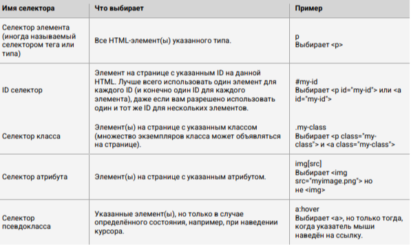
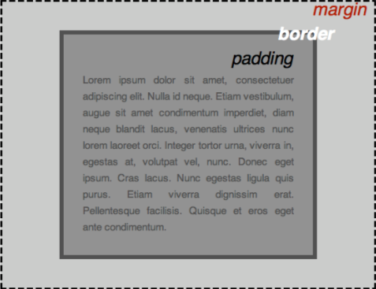

> [НАЗАД к СОДЕРЖАНИЮ](README.md)

---

# Веб-технологии

> Бесплатный веб-хостинг: https://beget.com/ru/hosting/free

> Sublime text - редактор html-разметки  

`tcp/ip` - протокол передачи данных  

`HTTP` (hyperText transfer protocol) - широко распространенный протокол передачи данных, изначально предназначенный для передачи гиппертекстовых документов (то есть документов, содержащих ссылки, позволяющие организовать переход к другим документам)  
Решает задачу:  
- обмен данными между сервером и клиентом (веб-браузер или др.)  

`HTTPS` - шифрованный протокол = протокол HTTP + шифрование SSL(с помощью этого сертификата происходит расшифровка)   

`URI` - Uniform Resource Identifier (унифицированный идентификатор ресурса) 
`URL` - Uniform Resouce Locator (унифицированный определитель местонахождения ресурса) - синоним веб-адреса  
`URN` - Uniform Resouce Name (унифицированне имя ресурса) //речь о какой-то библиотеке с именами всех ресурсов (место хранения данных может меняться, а имя останется)  

> Главная страница сайта всегда: index.html

`Сниппеты/аллиасы/эмметы - сокращения:`  
* Чтобы создать шаблон: html-страницы: ! + Tab
* Чтобы создать просто ссылку на файл: a
* Чтобы создать ссылку: a:link
* Чтобы создать ссылку на почту: a:mail
* Перенос строки: br
* Чтобы подключить файл стилей: link:css
  * link:favicon - хз
  * link:rss- хз


`HTML` (HyperText Markup Language) - язык гиппертекстовой разметки веба. Определяет что будет показано на веб-странице и где будет размещено (F12 в браузере - для просмотра html-тегов в режиме разработчика)  
`CSS` (Cascading Syle Sheets) - язык для описания внешнего вида (представления) как будет выглядеть (так называемая каскадная таблица стилей)  
  * селекторы со стилями прописываются внутри HTML в \<style>

`Стили`  
```html
    <style>
    p, li{ //p - селектор, кот. определяет тип элемента. Здесь p - все элементы абзаца, li - элементы списка
        font-size: 50;
        font-weight:bold;//для жирности
        color: red; //color - свойство, red - значение
        width: 500px;
        border: 1px solid black;
    }
    </style>
```



`Блоки CSS`:  
● padding, пространство только вокруг контента (например, вокруг абзаца текста)  
● border, сплошная линия, которая расположена рядом с padding  
● margin, пространство вокруг внешней стороны элемента 



**Внутри padding:**  
* width (ширину элемента)  
* background-color, цвет позади контента и padding элементов
* color, цвет контента элемента (обычно текста)
* text-shadow: устанавливает тень на тексте внутри элемента
* display: устанавливает режим отображения элемента (пока что не волнуйтесь об этом)

**Чтобы изменить цвет страницы:**  
```html
html { //настройка всей страницы в целом
 background-color: #FFEFD5;
}
```

**Настройки отображения тела (body):**  
```html
   body {
    width: 600px; //фиксированная ширина тела контента
    margin: 0 auto;
    background-color: #FFE4B5;
    padding: 0 20px 20px 20px; //верх, низ, по-бокам
    border: 2px solid white; //ширина, качество (жирный), цвет
   }
```
ГДЕ:  
● width: 600px; — заставляет тело быть всегда 600 пикселей в ширину.  
● margin: 0 auto; — когда вы устанавливаете два значения для таких свойств как margin или padding,
первое значение элемента влияет на верхнюю и нижнюю сторону (делает их 0 в данном случае), и
второе значение на левую и правую сторону (здесь, auto является особым значением, которое делит
доступное пространство по горизонтали поровну слева и справа). Вы также можете использовать
один, три или четыре значения, как описано здесь.  
● background-color: #FF9500; — как и прежде, устанавливает цвет фона элемента. Я использовал
красновато-оранжевый для тела, в отличие от темно-синего цвета для \<html> элемента, но не
стесняйтесь и экспериментируйте.  
● padding: 0 20px 20px 20px; — у нас есть четыре значения, установленные для padding, чтобы сделать
немного пространства вокруг нашего контента. В этот раз мы не устанавливаем padding на верхней
части тела, но делаем 20 пикселей слева, снизу и справа. Значения устанавливаются сверху, справа,
снизу, слева, в таком порядке.  
● border: 5px solid black; — просто устанавливает сплошную чёрную рамку шириной 5 пикселей  

**Оформление заголовка:**  
```html
h1 {
 margin: 0; //отсутствие отсупа от верха
 padding: 20px 0; //отступы внутри блока
 text-shadow: 2px 2px 1px white; //1зн - горизонт. смещение тени, 2 - вертикальное, 3- радиус размытия тени
}
```

**Отображение изображения:**  
```html
img {
 display: block;
 margin: 0 auto;
}
```

> Шрифты для оформления: в google font. (размещать в \<head>\</head>)  
```html
<link rel="preconnect" href="https://fonts.googleapis.com">
<link rel="preconnect" href="https://fonts.gstatic.com" crossorigin>
<link href="https://fonts.googleapis.com/css2?family=Roboto&display=swap" rel="stylesheet"> //сюда можно размеры для сжатия под размер основного блока,а можно и без них  
```

> Стили сохранять в отдельном от страницы файле. И добавить:  
```html
<head>
<title>Main page<title>
<link href="styles.css" rel="stylesheet" type="styles/css">
</head>
```

> Найти особенный цвет для html css: html color в браузере

`Веб-страница` - формируется после запроса, часть действий на ней может производиться пользователем без обращения к серверу  
**Состав:**
1. шапка - хэдер (логотип + контактные данные + главное меню)
2. подвал - футер (логотип + упрощенная меню + форма для обратной связи или контакты)
3. зона контента
4. зона виджетов (поисковая строка и т.д.)

**Типы веб-приложений:**
* Backend - бэкенд или серверная часть приложения. Генерируется новый HTML-файл и страница в браузере перегружается.
* Frontend - фронтенд или клиентская часть приложения. JavaScript
* Single page application - SPA или одностраничное приложение. фронт + бэк. Можно создать приложение, которое будет работать совсем без перегрузок в браузере. Фреймворки: Angular и Ember

`Архитектуры взаимодействия фронтенда с бэкендом:`
* серверные приложения (с отправлением запроса браузером и генерацией HTML-странице от сервера)
* связь с использованием AJAX (Asynchronous JavaScript and XML) (иссинхронный запрос, с получением от сервера xml или json, для дальнейшего выстраивания страницы) 
* клиентские одностраничные приложения (могут работать без запроса на сервер) Фреймворки: Angular и Ember
* универсальные/изоморфные приложения (часть стринцы обновляется за счет сервера, а другая часть - либо не обновляется, либо работает локально) Фреймворки: React и Ember

`Фреймворки` - это шаблоны, ускоряющие процесс разработки.
Фреймворк позволяет вместо написания функционала заново сделать настройки и получить продукт.

Также фреймворки дают возможность подключаться к СУБД.

**Broadcast** - это когда однопотоковая передача данных (1 ко всем) //в интернете все получают всю информацию  
**Multycast** - многопоточка

Чем отличаются веб-приложения от сайтов?
Веб-приложения - это программы, а веб-сайты - набор связанных HTML-страниц

`Сниппет` — это блок информации о странице сайта, которая отображается в результатах поиска. Сниппет состоит из заголовка и описания страницы, а также может содержать дополнительную информацию о сайте. Благодаря сниппету пользователь получает представление о странице или нужную информацию, не заходя на сайт. (зависит от поисковой системы)  
**Состав:**
* заголовок
* URL
* описание

`Поисковые машины` узнают о сайте при попадании ссылки в сеть по мессенджерам и т.д., или: через самостоятельной загрузки в Яндекс Метрику, Google Аналитику. После чего поисковая машина проверяет сайт на соблюдение правил и норм + у сайта должно быть два документа (Как-то так: Sitemaps.xml (содержит все ссылки, имеющиеся на сайте), robots.txt (здесь какие страницы индексировать, а какие нет)), и при положительном сходе добавляет сайт в базы индексации.

У сайта должна быть сематическая разметка (для СЕО-оптимизации поисковых роботов по поиску контента на странице)

`CEO-оптимизатор` - целая специальность, представители которой занимаются оптимизацией сайтов под поисковые системы
```html
<title> шапка для сниппета
<meta> основная инфа для снеппета
```

> Сайты оцениваются по уровню "`Конверсии`" - действия пользователей, а главное - покупки. Всем по-барабану что под капотом и какой дизайн.

WayBackMachine - **сайт-архив** сайтов web.archive.org

`Инструменты разработчика в браузере`: F12
1. Перейти на сайт
2. правой кнопкой мыши - посмотреть код или исследовать элемент
  * вес ресурса, время загрузки и количество запросов - вкладка Network (выбрать All (где JS, CSS...) -> перезагрузить и в футере
  * кодировка сайта elements - meta -> charset -> UTF-8 (обычно)
  * img - информация о картинках
  * font - инфа о шрифтах. Чтобы шрафит конкретного элемента - elements - справа второе окно Computed - внизу этого окна Rended Fonts
  * js - если скрипты битые - подсвечиваются красным

---

### `Теги:` 

HTML состав элемента (element): opening tag with atribut (название и его свойства), content, closing tag
```html
<p class="editor-note">Text</p> - текст абзаца. можно нумировать типа: p1
<p><strong>жирный текст с пометкой для машин</strong></p> //также поисковые роботы будут видеть, что этот текст более важен  
<p><b>жирный текст</b></p>       
<p><i>курсив</i></p>       
 //вставка изображения/вставить картинку. src - путь где лежит картинка, alt - текст, если картинка не загрузится, далее размеры
  //это изображение с компа
<ul> - ненумированный список
  * <li> - элемент списка внутри
<ol> - нумированный список
  * <li> - элемент списка внутри

можно вместо ссылки в href указывать путь к фалу или (Spring - приходящий запрос)
<p><a href="https://www.murcat.ru/">О кошечках</a></p> //базовый элемент - гипперссылка на элемент
<br /> - перенос строки - не парный
<hr> - линия подчеркивания
<em>важный текст в эмоциональном плане</em> - визуально тоже самое, что и курсив, но выделяет эмоциональный окрас для машин
<p id="elem_first">//чтобы дать id элементу. После чего - в стилеях можно: #elem_first{} //и задать стиль конкретно этому элементу
<p style="color:red"> //добавить стиль прямо внутри тега
<scrypt></scrypt> //для добавления кода js
<span>Здесь отображается изолированный участок текста</span>
<table>
  <thead> - голова таблицы
  <tr>
    <th></th> - TH заголовочное значение Колонки1
    <th></th> - заголовочное значение Колонки2
    <th></th> - заголовочное значение Колонки3
  </tr> - строка
  </thead>
    <tr>
    <td></td> - TD обычное значение Колонки1
    <td></td> - обычное значение Колонки2
    <td></td> - обычное значение Колонки3
  </tr> - строка
</table> - таблица

<form action="/logout" method="POST"></form> - формы
```

Пример формы:  
```xml
<form action="/login" method="POST">
    <div>
        <label>Username: <input type="text" name="username"></label>
    </div>
    <div>
        <label>Password: <input type="password" name="password"></label>
    </div>
    <div>
        <button type="submit">Login</button>
    </div>
</form>
```
---

`Пример базовой разметки HTML:  `
```html
<!DOCTYPE html>  
<html> //корневой элемент  
 <head> //сюда все, что не контент: ключевые слова и описание страницы, которые будут появляться в результатах поиска, стили нашего контента, кодировка, подключаемые шрифты и многое другое
 <meta charset="utf-8"> //кодировка
 <title>Моя тестовая страница</title>//заголовок страницы
 </head>
 <body> //контент - текст, изображения, видео, игры, проигрываемые аудиодорожки или что-то ещё
 
 </body>
</html>
```

**Заголовки** существуют 6 типов. Могут располагаться как в хедере, так и в контент-зоне.  
```html
<h1>Первый заголовок</h1>
<h2>Второй и т.д.</h2>
```

Вставить картинку в качестве фона:
```html
html {
    background-image: url(https://w.forfun.com/fetch/ea/ea737abe98e2a6f650558e7f810f43df.jpeg);
    background-repeat: no-repeat;
    background-position: center center;
    background-attachment: fixed;
    -webkit-background-size: cover;
    -moz-background-size: cover;
    -o-background-size: cover;
    background-size: cover;
   }
```

---


