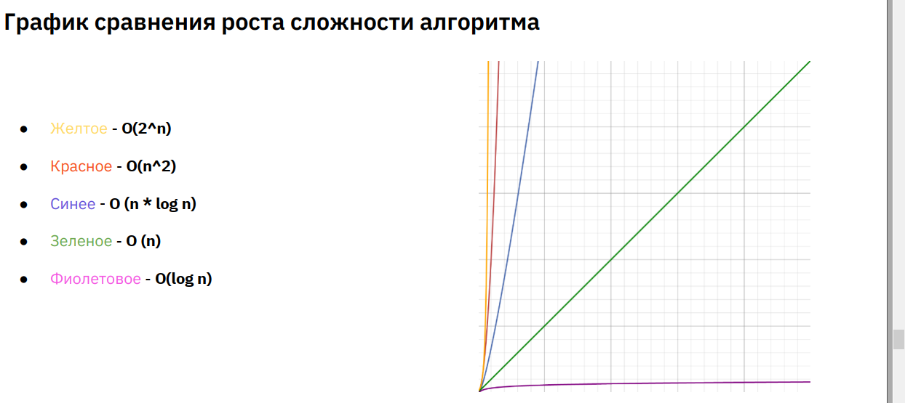

Преподаватель - Алексей Плеханов (компания IBS)

# Алгоритмы и структуры данных

**Алгоритм** — это точно определённая инструкция, последовательно применяя которую к исходным данным,
можно получить решение задачи. Часто алгоритм можно представить в виде блок-схемы.
Например - алгоритм вычисления, является ли введенное число четным

**Критерии сложности алгоритма:**
* скорость работы //на практике более частая проблема, т.к. оперируем небольшим объемом данных
* память (оперативная или постоянная)

> ## ОЦЕНКА СЛОЖНОСТИ (Ассимптотики)

> Не гонимся за точным количеством шагов алгоритма, а лишь ищем закономерность прироста итераций относительно исходных данных

`Нотация О(n)` - характеризует поведения алгоритма в целом, а не дает точное кол-во итераций.
  * крч если цикл в цикле, но границы не с 0 до n, то все равно сложность n^2, т.к. зависимость прироста сложности в целом остается той же

**Линейная зависимость О(n)** - когда есть определенное кол-во входных данных N и для выработки алгоритмов мы делаем N действий.
  * с ростом n на x кол-во шагов тоже вырастет на х.

**Квадратичная зависимость O(n^2)** - два вложенных цикла. Резкий рост сложности относительно входных данных.
  * Идеальная квадратичная зависимость: при n = 100 происходит 100 итераций, по 10 итерации на каждый элемент. 

**Экспоненциальная зависимость** - в таких задачах **мы можем не знать окончательную длину наших вложенных циклов**. Скорость прироста растет очень быстро. 2^(n). При увеличении размера на 1 сложность возрастает вдвое.
  * Пример: шанс выпадения суммы трех игральных кубиков, но что если кубов будет больше...
  * Пример: числа фибоначи, в алгоритме на каждом шаге функция вызывает себя два раза, а значит, что с увеличением кол-ва элементов на 1, будет делаться на два шага больше. 

**Оценка корень** n sqrt(n) - когда два цикла. Второй идет до корня.

`Правила объединения сложности`  

//**все константы сокращаются**
Это когда: 
* Вызов нескольких методов на каждом шаге: O(2n) == O(n)
* Обход половины размерности массива: O(n/2) == O(n)
Цифровые множители сокращаются.
* Вызов нескольких методов вне цикла: O(2+n) == O(n). Цифровые слагаемые сокращаются

**`Если происходит вложенность методов друг в друга (вложенные циклы)`** //если внутри - то сложности перемножаются (степень складывается), если последовательно, то берется максимальная сложность из них
Пример:
method1() - имеет сложность O(n^3)
method2() - имеет сложность O(n^2)

**Если внутри** method1() будет вызываться method2(),
то их сложности перемножаются:
O(n^3) * O(n^2) == O(n^5)

Если методы будут вызываться последовательно, то
их сложности складываются, т.е. берется
**максимальная** из них:
O(n^3) + O(n^2) == O(n^3)

`Список сложности (ассимптотик) алгоритмов:`
● O(1) - `константная`. Не зависит от объема данных. //всегда выполняется за одно и тоже время
Например - доступ к индексу массива. Комп всегда знает где и что у него лежит в памяти
● O(log n) - `логарифмическая`. Увеличение размера
почти не сказывается на количестве итераций.
Обычно: нужно увеличить кол-во входных данных вдвое, чтобы увеличилось кол-во шагов на 1
Например - бинарный поиск, поиск по сбалансированному дереву
//Мы за один шаг отбрасываем n/2 значений - поэтому это выгодно. **Принцип - разделяй и властвуй.**
● O(n) - `линейная`. Увеличение сложности эквивалентно
увеличению размера. Например - поиск по
неотсортированному массиву
● O(n * log n) - `увеличение размера заметно сказывается на сложности`. Например - быстрая
сортировка. Если элементов 1000, то сколько операций понадобится совершить? Ответ: 1000* (число, при возведении двойки в которую получим 1000. 2^10 = 1024, значит 10 (это, кстати, глубина рекурсии)). Итого: 1000*10;
● O(n^2) - `квадратичная`. Увеличение размера очень
сильно сказывается на сложности. Например -
пузырьковая сортировка
● O(2^n) - `экспоненциальная`. С увеличением размера
на 1, сложность возрастает вдвое

**Оценка сложности рекурсии:**
Сколько рекурсивных вызовов в теле рекурсии, такое число и будет в основании. Пример: 3^n
  * Рекурсивные решения можно улучшить с помощью запоминаний (значения F(2..4)) в массив (меморизация)

> Средняя скорость работы современного компьютера:
  * 2023 г. = 10^9 операций в секунду
  * 2013 г. = 10^7

`Структурами данных` называют некоторый контейнер с данными, обладающий специфическим внутренним устройством
(макетом) и логикой хранения. Различные макеты могут быть эффективны для некоторых операций и неэффективны для
других.

`Массив` - это контейнер, хранящий данные идентифицируемые по индексу.
К любому элементу массива всегда можно обратиться по его индексу и
достать или заменить его.
Особенностью массива является то, что доступ к элементам по индексу
осуществляется за константное время, т.е. имеет сложность O(1)

Основные операции с массивом: 
1. Поиск
2. Сортировка

`Алгоритмы поиска:`
1. Простой перебор //тупо бежим фором по массиву. Сложность: O(n)
2. Бинарный поиск - используя свойства отсортированного массива, мы пропускаем значительную часть массива при поиске нужного значения. 
  * решается через рекурсию
  * принцип - разделяй и влавствуй. Почему? - на каждом шаге делим массив на два пока не найдем искомое, пользуясь свойством отсортированного массива. Если текущий элемент меньше искомого - делим левый кусок, больше - правый

`Простые сортировки:`
1. Пузырьковая
2. Сортировка выбором
3. Сортировка вставкой
`Продвинутые алгоритмы сортировки`
1. Быстрая сортировка
2. Пирамидальная

`Быстрая сортировка ` Сложность O(n*log(n)) 
`Сортировка слиянием`Сложность O(n*log(n)) - суть в том, чтобы разделить массив на множество кусочков длиной 1. И сранивая элементы в получившейся правой и левой части, помещать их в буфер. в итоге перезалить из буфера все в основной массив
`Разделяй и властвуй` (от анг. divide and conquer) — парадигма разработки алгоритмов, заключающаяся в
рекурсивном разбиении решаемой задачи на две или более подзадачи того же типа, но меньшего размера, и
комбинировании их решений для получения ответа к исходной задаче; разбиения выполняются до тех пор,
пока все подзадачи не окажутся элементарными.
**Пивот** (от анг. pivot - поворот) - Элемент, служащий точкой сравнения элементов и их “поворота”, в случае
необходимости
**Частный случай быстрой сортировки O(n^2)** - когда массив уже отсортирован и мы выбираем крайний элемент в качестве пивота. 

`Пирамидальная сортировка/сортировка кучей` //оч сложный алгоритм
Бинарная куча. Если принять элемент с индексом i за родителя, то индексы его дочерних элементов будут 2 * i
+ 1 и 2 * i + 2

`Связный список` - базовая структура данных, состоящая из узлов, где каждый узел содержит одну или две ссылки, который
ссылаются на следующий или на следующий и предыдущий узел соответственно.
  * вставка элементов O(1)
  * найти элемент O(n)
  * сортировка - пузырьком одна из самых эффективных из-за особенностей структуры данных

Дерево - структура данных, представленная в виде набора связных узлов.
Обход в глубину дерева - рекурсивный.
Обход в ширину дерева - циклический.

`Бинарным деревом` называют частный случай дерева, где все элементы обязательно строго уникальны, каждый
родитель имеет не более 2 детей, при этом левый ребенок всегда меньше родителя, а правый – больше.
  * Элементы бинарного дерева в обязательном порядке реализуют интерфейс Comparable (дерево отсортировано)

`Сбалансированным деревом` называют частный случай бинарного дерева, у которого выполняется
следующее требование: для любого узла дерева высота его правого поддерева отличается от высоты
левого поддерева не более чем на единицу
  * Поиск по сбалансированному дереву O(log n)

Способ балансировки:
`Красно-черное дерево:`
* Каждый узел может быть либо черным, либо красным и иметь двух потомков
* Корень всегда черный
* Дети красного узла обязательно черные
  Для частного случая - левосторонее красно-черное дерево - также применяется след. критерий
  * Красный узел может быть только левым потомком

`Хеш-таблица` //Hash-map
Структура данных, представляющая собой ассоциативный массив
использующий хеш-функцию для выполнения операций добавления,
удаления и поиска элементов.
В свою очередь ассоциативным массивом называют структуру данных,
которая хранит пары ключ – значение, где ключ каждой пары является
уникальным в пределах всего массива данных.
Важной особенностью хеш-таблиц является, при некотором разумном
допущении, получить сложность каждой из перечисленных операций
равной O(1)
  * элементы хеш-таблицы - связный список, что позволяет в случае коллизиции хранить в одной ячейке несколько значений
  * в таблице используется результат хеш-функции по модулю, чтобы избежать отрицательных значений
  * поиск по таблице O(1). В случае, когда в ячейке более 1 элемента, этим кол-вом можно пренебречь.
  * Индекс в хеш-таблице: index = hashcode%array.size

`Хеш-функция`
**Хеш-функцией** называется специальный алгоритм, позволяющий преобразовать входные данные произвольного размера
и состава в битовую строку фиксированной длины
Популярные хеш-алгоритмы:
● MD5
● SHA-1
● SHA-256
● SHA-384
● SHA-512

Коллизиця - ситуация, когда у разных значений существует одинаковый хеш