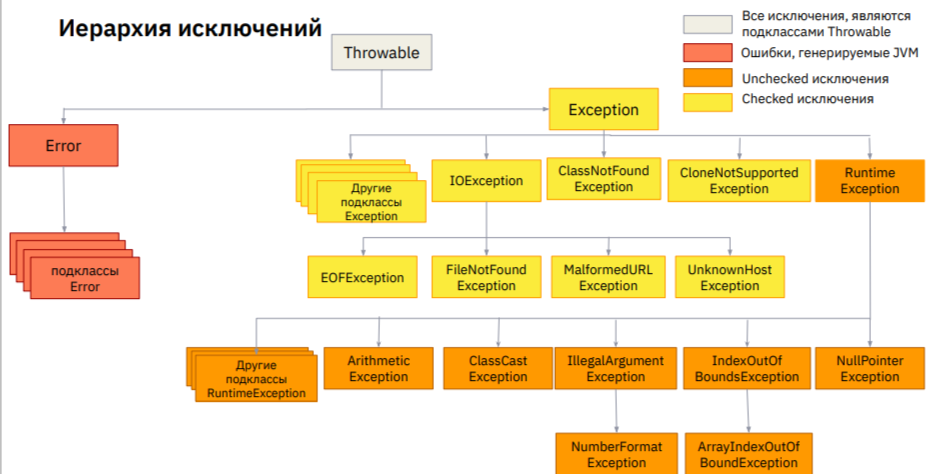

Преподаватель - Алексей Плеханов (как и по алгоритмам)

## Исключения в программировании

Отказоустойчивое приложение - приложение, которое может продолжить работу при возникновении некритических ошибок.

`Исключение` - это отступление от общего правила, несоответствие обычному порядку вещей

**Причины возникновения ошибок в приложении:**  
* Разработчик не учел ситуацию, которая привела к ошибке //не идеальная инструкция для компьютера, ошибки в алгоритме
* При работе приложения с внешней средой/базой данных/внешним диском изменилось их состояние. Например - пользователь вынул флешку во время работы с ней приложения
* Баги в используемых библиотеках

Что произойдет при возникновении ошибки:
1. Приложение падает с ошибкой
2. Код, учитывающий конкретно эту ситуацию перехватит ошибку и корректно обработает ее

`Код ошибки` - целочисленный код, указывающий на причину ошибки.
  * могут использоваться в ситуациях с ознозначным ответом да/нет. тогда ответ -1 будет понятен пользователю.

Коды ошибок веб-сервера:
200 = положительный
500 = отрицательный ответ из-за ошибки сервера
400 = отрицательный ответ из-за ошибки клиента

**Размер файла** - тип **long** всегда в Java

Недостатки использования кодов ошибок:  
📌 Зачастую невозможно отличить код ошибки от результата исполнения
метода.  //пример: код ошибки = -1 также может быть результатом деления (-10/10)
📌 Разработчик может забыть о том, что метод возвращает коды ошибок, и
просто не будет их обрабатывать.  
📌 Нельзя «заставить» разработчика на этапе компиляции проверять
критические ошибки.  
📌 Код ошибки не может предоставить детальную информацию, почему
эта ошибка возникла.  
📌 В Java метод не может возвращать одновременно два типа данных (int
для кодов ошибок и Object для «полезного» результата).  

`Исключения`(Exceptions) - это специальный тип объектов, которые создаются при возникновении ошибочной ситуации и выбрасываются Java-машиной

`StackTrace` - путь возникновения ошибки в терминале

**Пример исключения:** 
```java
 
    public static int divide(int a, int b){
        if (b == 0) {
            throw new RuntimeException("Divide by zero not permitted");
        }
        return a/b;
    }
```

Ситуация, когда может быть сгенерировано **2 исключения невозможно**.
Что произойдет? - стандартный обработчик исключений нашего приложения должен обработать его для того, чтобы
приложение продолжило работу или же приложение упадет с ошибкой (стак трейсом).

`Типы исключений и их описание`
* **ClassCastException** - неверное приведение типов
Пример:  
        Object obj = new String("123");
        File file = (File) obj;
* **IllegalArgumentException** - употребление недопустимого аргумента при вызове метода //мб тип входных данных
* **IndexOutOfBoundsException** - выхода индекса за пределы массива
* **NumberFormatException** - неверное преобразование строки в число
Пример:
        String str = "str";
        int numb = Integer.parseInt(str);
* **IOException** - ошибка при работе с потоками ввода/вывода //при чтении файла или при попытке его записать
Пример: сетевое соединение разорвалось
* **NullPointerException** - обращение к несуществующему объекту
Пример: 
        String name = null;
        System.out.println(name.length());
* **FileNotFoundException** - файл не найден (не существует либо нет прав доступа к нему)
* **ClassNotFoundException** - класс не найден //когда внутри java-машины отсутствует ссылка на класс
//когда в mavan/gradle не подключен класс, который ожидаемо должен был быть подключен
* **UnsupportedOperationException** - попытка выполнения нереализованного или запрещенного к выполнению метода
Пример:
        List<Object> list = Collections.emptyList(); //emptyList является иммутабельным
        list.add(new Object()); //поэтому добавить сюда не получится
* **ConcurrentModificationException** - когда два действия с объектом, конфликтующие друг с другом
Пример: бежим по массиву foreach и удаляем какой-то элемент. Будет конфликт, т.к. в foreach нужно пробежаться по всем, а мы удалили один из элементов
* **EOFException** - неожиданный конец файла



**`Иерархия исключений:`**
-0. Serialazible
0. Throwable -> //Все исключения являются подклассом Throwable
1. `Error` -> Подклассы Error //Кидает исключительно Java-машина. Их невозможно обработать, только залогировать
1.1 ThreadDeath
1.2 VirtualMachineError
1.2.1 OutOfMemoryError
1.2.2 StackOverflowError
1.2.3 UncknownError
`Checked-исключения`: // - должны быть обработаны с помощью try-catch. Если этого не сделать = ошибка на этапе компиляции
Пример: OutOfMemoryException - переполнение кучи (по дефолту 2ГБ в Java)
Еще пример: FileReader fr = new FileReader("filename.txt"); //невозможно создать вне блока try-catch, нужно предусмотреть в блоке catch выбрасывание exception в случае, когда файл filename.txt не существует
Как бороться:
  * Предусматривать так, чтобы большие данные не скапливались в куче
  * Увеличить размер кучи заранее
  * Использовать слабые ссылки на объекты, чтобы Java могла удалять объекты в случае необходимости //ХЗ что это значит
2. Exception ->
  2.1 IOException
    2.1.1 FileNotFoundException
    2.1.2 EOFException
  2.2 ClassNotFoundException
  2.3 CloneNotSupportedException
  2.4 Др.
`Unchecked-исключения`: //Класс RuntimeException и его подклассы. Типо деление на ноль и выхода за пределы массива
//Обработка не обязательна. НО! Не гарантирует правильную работу при кривых входных данных от пользователя
  2.5 RuntimeException
    2.5.1 NullPointerException
    2.5.2 IndexOutOfBoundsException
      2.5.2.1 ArrayIndexOutOfBoundsException
    2.5.3 IllegalArgumentException
      2.5.3.1 NumberFormatException
    2.5.4 ClassCastException
    2.5.5 ArithmeticException //деление на ноль здесь
    2.5.6 Др. подклассы RuntimeException
    2.5.7 ConcurrentModificationException 


`Спобобы обработки исключений:`
1. Поместить код, бросающий исключение в блок `try-catch` //**зачастую только для unchacked**, остальные с помощью if
  * можно несколько блоков catch для перехвата нескольких эксепшнов
    * в случае с несколькими блоками catch нельзя использовать общий класс exception поверх наследников
  * блок `finally`: для того, чтобы, например, закрыть открытое соединение в любом случае.
2. Пробросить с помощью `throws` исключение методу на уровень выше, то есть методу, вызывающему текущий

Пример блока `try-catch-finally:`
```java
        FileReader fr = null; //выносим наружу, т.к. блок finally не увидит его изнутри блока try
        try{
            fr = new FileReader("file.txt"); //открываем соединение
        } catch (IOException | RuntimeException e) {
            System.out.println("caught exception: " + e.getClass().getSimpleName()); //смотрим какая из двух ошибок
        } finally {
            if (fr != null){ //если открыто
                try {
                    fr.close(); //закрываем тоже в блоке трай-кетч, т.к. тоже может быть исключение
                } catch (IOException e) {
                    System.out.println("Exception while closing");
                }
            }
        }
```

Пример блока `try with resources`
```java
        try (Writer writer = new FileWriter(fileName) ){ //в скобках ресурс должен быть закрыт после работы блока try
            for (var entrySet: names.entrySet()) {
                writer.write(entrySet.getKey() + "=" + entrySet.getValue() + "\n");
            }
        } catch (IOException e) {
            //e.printStackTrace(); - чтобы приложение, в теории, не упало
            throw new RuntimeException(e); //закрываем с помощью unchecked exception - чтобы приложение упало
        }
```
> При внутреннем исключениее до закрытия файла или потока в блоке трай с ресурсами, стактрейс выведет и подавленное исключение закрытия (в конце основного исключения: Suppressed: тело исключения close (IOException)

`Проброс исключений на уровень выше по стеку (throws):`
* в том случае, если исключение нельзя обработать на месте
* для анализа, предпринятия каких-то действий, корректировке бизнес-логики или сценария +
* если можно корректно обработать, то использовать try-catch

Пример проброса `throws` в метод выше (когда обработка ошибки должна произойти в методе с бизнес-логикой)
```java
public  static void blockTryCatch() throws IOException
```

`Создание нового типа исключений:`
➔ Создать новый класс
➔ Унаследовать его от существующего типа исключения
➔ Будет ли созданное исключение Checked или Unchecked зависит от типа родителя

> В 99% случаев бросания своих исключений, они должны быть проброшены выше, дабы возложить ответственность на разработчика, использующего этот класс (касаемо, конечно, checked-exc)

Пример своего исключения:
```java
public class SavedException extends IOException { //будет checked
    private Date startDate;
    public SavedException(String message, Date startDate, Exception e){
        super(message, e); //во всех исключениях есть конструктор message + exception //конструктор mess + e есть во всех исключениях
        this.startDate = startDate;
    }
}
```
- очень удобно создавать свои исключения для ситуаций, когда в ходе выполнения программы несколько методов могут броить одно и тоже исключение. С помощью своих исключений можно обозначать каждое из них наследую одного предка, например: когда должно упасть IO, мы бросаем свое исключение
```java
        } catch (IOException e) {
            throw new SavedException("file creating is faling", e);
        }
```

`Пример AutoClosable/Авто-закрываемого класса:`
```java
public class Counter implements AutoCloseable{
    private static int counter = 0;
    private boolean condition = false;

    public Counter() {
        open();
    }

    public void add() throws IOException {
        if (!condition) throw new IOException();
        else counter++;
    }

    public void open(){
        condition = true;
    }

    public void close(){
        condition = false;
    }

    public int getCounter() {
        return counter;
    }
}
```

Методы исключений:
e.getMesage(); .sout //для вывода
e.printStackTrace();

Если нужно уронить приложение в нештатной ситуации:
        } catch (IOException e) {
            throw new RuntimeException(e); //закрываем с помощью unchecked exception - чтобы приложение упало
        }