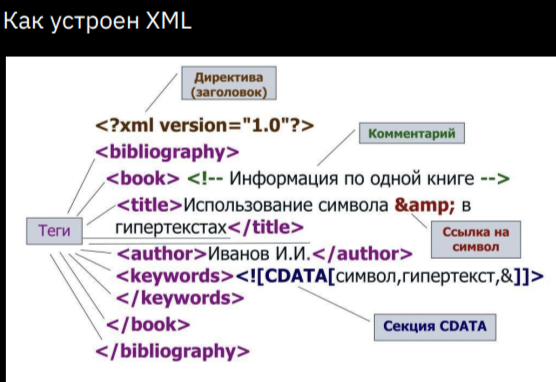
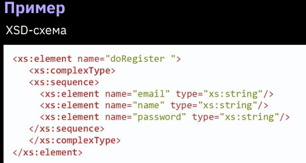

* Сериализация — это процесс сохранения состояния объекта в последовательность байт.  
Десериализация — это процесс восстановления объекта из этих байт.  
Serializable (**сериалайзбл**) **Serializable - интерфейс-маркер.** Он просто помечает машине, что эти данные разрешено переводить в бинарные код.  
  * private transient String password;

  ### `Обычная серриализация/дессериализация: ` - процесс преобразования объектов в поток `байтов`

* Объект из файла:
```java
    public static Object deserialize(String filename) throws IOException, ClassNotFoundException {
        try (FileInputStream fileInputStream = new FileInputStream(filename);
             ObjectInputStream objectInputStream = new ObjectInputStream(fileInputStream)) {
            return objectInputStream.readObject();
        }
    }
```

* Объект в файл:
```java
    public static void serialize(Object object, String filename) throws IOException {
        try (FileOutputStream fileOutputStream = new FileOutputStream(filename);
             ObjectOutputStream objectOutputStream = new ObjectOutputStream(fileOutputStream)) {
            objectOutputStream.writeObject(object);
        }
    }
```

> Для кастомных типов - имплементировать `Serializeble` для серриализации!

### JAXB 

Статься: https://habr.com/ru/companies/simbirsoft/articles/704818/

JAXB (Java Architecture for XML Binding) — это специальный инструмент для маршалинга и демаршалинга объектов в XML.

JAXB предоставляет аннотации, которыми размечаются поля JAVA-классов.

Для начала необходимо создать требуемые классы.

Принцип получается примерно следующий: если тег имеет дочерние элементы или атрибуты, значит это объект. Если тег в документе не имеет дочерних элементов, значит это поле объекта.

`Аннтотации`:
- @XmlRootElement(name = "Screen") — определяет корневой элемент. Может быть указана над классом или полем класса;

- @XmlAccessorType(XmlAccessType.FIELD) — определяет сущности, которые используются в процессах преобразования; //для прямой связи полей с XML-элементами

- @XmlAttribute(name = "Stage") — определяет, что поле является атрибутом, а не тегом в XML-документе;

- @XmlElement(name = "Title") — определяет, что поле является тегом в XML-документе;

- @XmlElementWrapper(name="Buttons") — создает некоторую обертку вокруг группы повторяющихся тегов;

- @XMLValue — определяет, что поле содержит в себе значение тега.

Пример класса для `маршалинга` в XML:
```java
@Data
@XmlAccessorType(XmlAccessType.FIELD)
public class Book {
    @XmlElement(name = "TITLE")
    private final String title;
    @XmlElement(name = "AUTHOR")
    private final String author;
    @XmlElement(name = "PAGES")
    private final int pages;
    @XmlElement(name = "YEAR")
    private final String publicationDate;
    @XmlElement(name = "PRICE")
    private final double price;
}
```


### Форматы передачи данных JSON and XML

Две разновидности API:
* SOAP 1.2 с 2003г. (XML) (Simple Object Access Protocol) - актульный. Больше корпоративная история (ebay, salesFores, sage)
SOAP - это стандартизированный протокол, который отправляет сообщения с использованием других протоколов, таких
как HTTP и др. 
* REST (JSON, редко - XML) с 2018г. (Facebook, Twitter, stripe) 
REST (Representational State Transfer) — это не протокол, а архитектурный стиль.
Архитектура REST устанавливает набор рекомендаций, которым необходимо следовать, если вы хотите
предоставить веб-службе RESTful, например, существование без сохранения состояния и использование кодов состояния HTTP.

`XML` (eXtensible Markup Language) — расширяемый язык разметки. Используется для хранения и передачи
данных. Так что увидеть его можно не только в API, но и в коде.

Проверка кода xml: https://jsonformatter.org/xml-formatter#Sample



<req> - запрос

Стандарт построения запроса в XML - **XSD-схема**   

`XSD` (XML Schema Definition) — это описание вашего XML.
Как он должен выглядеть, что в нем должно быть? ТЗ, написанное на языке машины.

Если мы создаем SOAP-метод,
то указываем в схеме:
1. какие поля будут в запросе;
2. какие поля будут в ответе;
3. какие типы данных у каждого поля;
4. какие поля обязательны для заполнения, а какие нет;
5. есть ли у поля значение по умолчанию, и какое оно;
6. есть ли у поля ограничение по длине;
7. есть ли у поля другие параметры;
8. какая у запроса структура по вложенности элементов;
9. ...



Пример запроса по такой схеме:


Правила оформления XML:
1. Есть корневой элемент.
2. У каждого элемента есть закрывающийся тег.
3. Теги регистрозависимы!
4. Соблюдается правильная вложенность элементов.
5. Атрибуты оформлены в кавычках.


`JSON` (англ. JavaScript Object Notation) — текстовый формат обмена данными, основанный на JavaScript. Но при этом формат независим от JS и может использоваться в любом языке программирования.

**JSON-объект** — это неупорядоченное множество пар «ключ:значение».

Правила оформления JSON
1. Данные написаны в виде пар «ключ:значение». ключ всегда String
2. Данные разделены запятыми
3. Объект находится внутри фигурных скобок {}
4. Массив — внутри квадратных []

---


```java
        JsonObject jsonObject = JsonConverterUtil.getJsonObjectFromString(response.body()); //с помощью своего утильного класса
        System.out.println(jsonObject.get("result").getAsJsonObject().get("username"));
```

---

### библиотека `Jackson` - Для работы с Json и XML

> Чтобы игнорировать поле при серриализации:     @JsonIgnore private transient double GPA;

```java
//СЕРИАЛИЗАЦИЯ объекта в файл
    public static void saveTasksToFile(String fileName, List<ToDoV2> tasks) {
        try {
            if (fileName.endsWith(".json")) {
                objectMapper.configure(SerializationFeature.INDENT_OUTPUT, true); //INDENT_OUTPUT - красивая запись с пробелами
                objectMapper.writeValue(new File(fileName), tasks);
            } else if (fileName.endsWith(".bin")) { //обычная бинарная запись
                try (ObjectOutputStream oos = new ObjectOutputStream(new FileOutputStream(fileName))) {
                    oos.writeObject(tasks);
                }
            } else if (fileName.endsWith(".xml")) { //запись в XML
                xmlMapper.configure(SerializationFeature.INDENT_OUTPUT, true);
                xmlMapper.writeValue(new File(fileName), tasks);
            }
        } catch (IOException e) {
            e.printStackTrace();
        }
    }

//ДЕССЕРИАЛИЗАЦИЯ объекта из файла (даже составного - список с объектами)
    public static List<ToDoV2> loadTasksFromFile(String fileName) {
        List<ToDoV2> tasks = new ArrayList<>();

        File file = new File(fileName);
        if (file.exists()) {
            //дессериализуем составной тип объекта
            try {
                //JSON
                if (fileName.endsWith(".json")) {
                    tasks = objectMapper.readValue(file, objectMapper.getTypeFactory().constructCollectionType(List.class, ToDoV2.class));
                    //БИНАРНЫЙ файл
                } else if (fileName.endsWith(".bin")) {
                    try (ObjectInputStream ois = new ObjectInputStream(new FileInputStream(file))) {
                        tasks = (List<ToDoV2>) ois.readObject();
                    }
                    //XML
                } else if (fileName.endsWith(".xml")) {
                    tasks = xmlMapper.readValue(file, xmlMapper.getTypeFactory().constructCollectionType(List.class, ToDoV2.class));
                }
            } catch (IOException | ClassNotFoundException e) {
                e.printStackTrace();
            }
        }

        return tasks;
    }
```


интерфейс `Externalizable` - для самостоятельной реализации серриализации и дессериализации

> при дессериализации стоит сохранять порядок полей. Если в файле первое поле "name", то и читать его стоит первым.

//реализуемые методы в классе объекта
```java
    @Override
    public void writeExternal(ObjectOutput out) throws IOException {
        out.writeObject(title);
        out.writeBoolean(isDone);
    }

//поля в строгом записанном порядке
    @Override
    public void readExternal(ObjectInput in) throws IOException, ClassNotFoundException {
        title = (String) in.readObject();
        isDone = in.readBoolean();
    }
``` 

Пример как вытащить любое поле из json:
```java
        JsonObject jsonObject = JsonConverterUtil.getJsonObjectFromString(response.body()); //с помощью своего утильного класса
        System.out.println(jsonObject.get("result").getAsJsonObject().get("username"));
```
