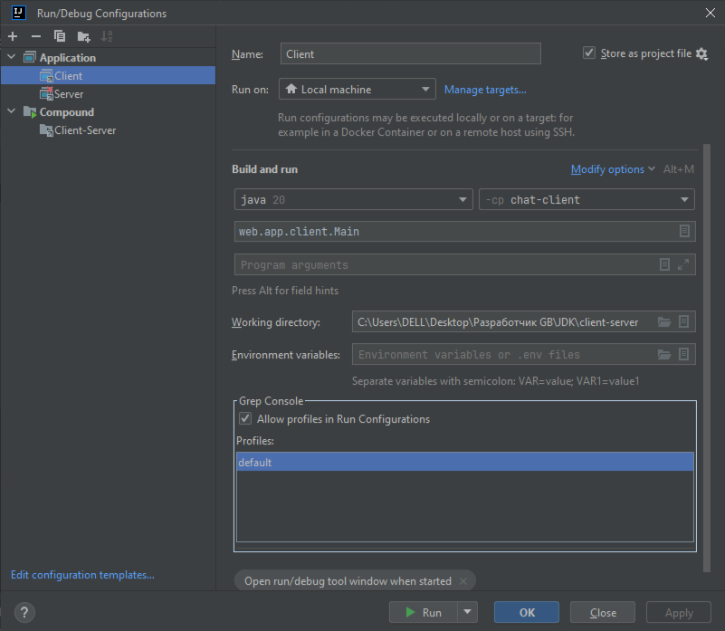
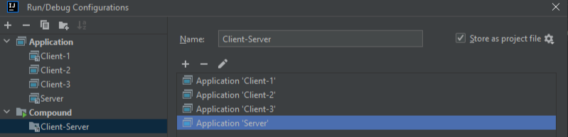

> [НАЗАД к СОДЕРЖАНИЮ](README.md)

---

### Сеть/Web

[OTUS репо с примерами Http-клиентов](https://github.com/OtusTeam/Spring/blob/master/2024-05/spring-30-http-client/rest-template/src/main/java/ru/otus/spring/service/WebCountryService.java)

`Работа с сетью` — это фактически обязательная составляющая работы с компьютером. Даже когда мы просто
пишем текст или, тем более, рисуем в графическом редакторе. Мы ждём авто проверку, доступ к
графическим ресурсам, примерам, онлайн помощь и многое другое. А значит, практически любая программа
должна уметь работать с сетью. Инфраструктура сети уже устоялась и изменений в ней не предвидится, а в
Java имеется **пакет** `java.net` специально для работы с сетью!

`ip` - интернет протокол, позволяющий объединить отдельные компьютеры во всемирную сеть по индивидуальному идентификатору

**доменное имя** - способ обращения через dns-сервера по названию. Под капотом - по названию ищет его ip-адрес

Класс `Socket` - для создания подключения (ip+port) - двусторонний канал связи между двумя процессами, выполняющимися на разных машинах, и служит для обмена данными между ними. Основная цель использования Socket в Java - это создание клиентсерверных приложений, где сервер принимает запросы от клиентов, обрабатывает их и отправляет обратно ответ. Это может включать в себя различные сетевые приложения, такие как чаты, онлайн-игры, системы сообщений и многое другое. Кроме того, Socket позволяет взаимодействовать с различными протоколами, такими как HTTP, FTP и другими, обеспечивая гибкость и универсальность в разработке Java-приложений.
методы Socket:
- socket.getInputStream(); //приходящие данные
- socket.getOutputStream(); //исходящие данные
- socket.isConnected(); //проверка на подключение к внешнему сокету
- socket.isClosed(); //закрыто ли соединение. ИСПОЛЬЗОВАТЬ ЭТОТ МЕТОД для проверки соединения 
- socket.clost(); //закрыть соединение
- socket.isConnected(); //ХЗ КАК РАБОТАЕТ. ЕСЛИ отключить сокет, все равно возвращает TRUE

`Порт`- это идентификатор, который используется для связи между клиентом и сервером. Он определяет протокол, по которому будет происходить обмен данными, и адрес сервера, к которому нужно подключиться.
//крч, ip - это дом (компьютер), а порт - это квартира (программа, которая слушает этот порт). Зная ip и порт - мы пожем подключиться к конкретной программе на удаленном компьютере.
  * 65536 - **количество** возможных портов на одной машине. Порты с 0 по 1023 - зарезервированы ОС.

> Если указать порт для сокета = 0, то порт будет выбран автоматически свободный

`Создание сокета (конструкторы)`:
- new Socket(String ip-address-host, int port)
- new Socket(InetAddress ip-address-host, int port) //ip в виде объекта класса InetAddress
- new Socket(String ip-address-host, int port, InetAddress localAddress, int localPort) //3, 4 - свои адреса (для СЕРВЕРА). Подключение клиента произойдет в 4 порт
- new Socket(InetAddress ip-address-host, int port, InetAddress localAddress, int localPort)

> Исключение - если порт по указанному адресу никто не слушает, выброситься `ConnectException`


### `КЛИЕНТ`:  

```java
    public static void main(String[] args) {
        try {
            //куда будет направлен запрос
            InetAddress localhost = InetAddress.getLocalHost(); //указание на текущий адрес машины
            Socket socket = new Socket(localhost, 1024);
        } catch (UnknownHostException e) {
            throw new RuntimeException(e);
        } catch (IOException e) {
            throw new RuntimeException(e);
        }
    }
```

> Если **отправка** данных происходит в основном потоке, то **чтение** должно производиться в **отдельном**

### `СЕРВЕР`:

```java
    public static void main(String[] args) {
        try {
            ServerSocket serverSocket = new ServerSocket(1024);
            //Чтобы слушать порт сервера метод .accept()
            Socket socket = serverSocket.accept();
            socket.close();
            serverSocket.close();
        } catch (IOException e){
            throw new RuntimeException(e);
        }
    }
```

Класс ServerSocket - позволяет общаться с клиентскими сокетами и прослушивать входящие соединения.

Сервер должен уметь:
1. Слушать заданный порт, в ожидании запроса на подключение
2. После получения запроса, после начала формирования связи с
клиентом, сервер должен продолжить слушать порт и быть готовым к
новым подключениям
3. Идентифицировать участника чата по имени
4. Формировать оповещение о подключенных участниках чата
5. При подключении участника уметь оповестить оставшихся участников об
этом
6. Уметь передавать сообщения всем участникам, кроме него самого
7. Количество участников не должно быть ограничено

> проект Server-ClientManager-Client = "JDK/client-server-lection"


**Хорошая практика создания клиент-серверного** приложения от Байраковского:
1. Разбиваем приложение на модули: 1) сервер, 2) клиент

2. Создаем конфиги типа `Application` для запуска входных точек (Main) для каждого модуля с сохранением конфигов запуска в файле


3. Создаем конфиг типа `Compound` - для запуска **нескольких** модулей приожения (можно и в нескольких экземплярах), добавив в него два конфига сервера и клиента х 3


---

Spring для отправки простых HTML-запросов

`Зависимость`
```xml
        <dependency>
            <groupId>org.springframework.boot</groupId>
            <artifactId>spring-boot-starter-webflux</artifactId>
        </dependency>
```

Пример Spring HTTP-запросов (WebClient):  
```java
public class BookProvider {

    private final WebClient webClient;

    public BookProvider(ReactorLoadBalancerExchangeFilterFunction loadBalancerExchangeFilterFunction) {
        webClient = WebClient.builder()
                .filter(loadBalancerExchangeFilterFunction) //автоматическая балансировка между сервисами
                .build();
    }

    public UUID getRandomBookId() {
        Book randomBook = webClient.get()
//                .uri("http://localhost:8180/book/random")
//                .uri(getBookServiceIp() + "/book/random")
                .uri("http://book-service/book/random") //на какой адрес запрос. Работает с ReactorLoad... в фильтре
                .retrieve() //осуществит запрос
                .bodyToMono(Book.class) //преобразовать ответ в объект Класса
                .block(); //ждем ответа, только потом продолжаем выполнять остальной код

        return randomBook.getId();
    }

    //для получения списка
    public List<IssueEntity> getReaderIssues(long readerId) {

        return webClient.get()
                .uri("http://issue-microservice/readersIssues/" + readerId)
                .retrieve() //осуществить запрос
                .bodyToFlux(IssueEntity.class) //преобразовать ответ в объект Класса
                .collectList()
                .block();
    }

    //или так (параметризовано)
    	@Override
	public List<Country> getAll() {
		log.info("Web client Request findByCode");
		return webClient.get()
				.uri("/all?access_key={key}")
				.retrieve()
				.bodyToMono(new ParameterizedTypeReference<List<Country>>() {
				})
				.block();
	}
```

`Собрать/забилдить/создать бин WebClient`:
```java
public class WebCountryService implements CountryService {
	final ClientProperties properties;

	final WebClient webClient;

	public WebCountryService(ClientProperties properties) {
		this.properties = properties;
		this.webClient = WebClient.builder()
				.baseUrl(properties.getUrl())
				.defaultUriVariables(Map.of("key", properties.getKey()))
				.filter(errorHandler())
				.build();
	}
}

@Getter
@Setter
@ConfigurationProperties(prefix = "client")
public class ClientProperties {
	private String url;
	private String key;
}
```

`Рабочий HTTP-запрос из проект ТЛГ-бота`:
```java

//получение списка
    public List<IssueEntity> getReaderIssues(long readerId) {
        RestTemplate restTemplate = new RestTemplate();
        String url = getIssueServiceIp() + "issue/readersIssues/" + readerId;

        System.out.println("ISSUE SERVICE: " + url);

        ResponseEntity<List<IssueEntity>> responseEntity = restTemplate.exchange(
                url,
                HttpMethod.GET,
                null,
                new ParameterizedTypeReference<>() {
                }
        );

        if (responseEntity.getStatusCode() == HttpStatus.OK) {

            return responseEntity.getBody();
        } else {
            return null;
        }
    }

//еще можно так (получение списка) - параметризовано
	public List<Country> getAll() {
		log.info("RestTemplate Request getAll");
		URI uri = UriComponentsBuilder.fromHttpUrl(properties.getUrl())
				.path("/all")
				.queryParam("access_key", properties.getKey())
				.build().toUri();
		RequestEntity<List<Country>> requestEntity = new RequestEntity<>(HttpMethod.GET,
				uri);
//		Country[] countries = rest.getForObject(uri, Country[].class); //массив - потому что у списков будет затирание типов, так нельзя
//return List.of(countries);
		ResponseEntity<List<Country>> exchange = rest.exchange(requestEntity, new ParameterizedTypeReference<>() {
		});
		return exchange.getBody();
	}

//получение моно-объекта
    public ReaderEntity findById(long readerId)  {
        RestTemplate restTemplate = new RestTemplate();
        String url = getReaderServiceIp() + "reader/" + readerId;

        ResponseEntity<ReaderEntity> responseEntity = restTemplate.getForEntity(url, ReaderEntity.class);

        if (responseEntity.getStatusCode() == HttpStatus.OK) {
            return responseEntity.getBody();
        } else {
            return null;
        }
    }
```

---

Сервлеты в действии

`HttpServletResponse`

> https://javarush.com/quests/lectures/questservlets.level12.lecture02

Ответ сервера состоит из трех частей:
* Строка статуса (например: 200 OK)
* Заголовки (headers)
* Тело ответа (response body)

---

## RestClient (RestTemplate + WebClient) 

синхронный

```java
public class RestCountryService implements CountryService {
	final ClientProperties properties;

	final RestClient restClient;

	public RestCountryService(ClientProperties properties) {
		this.properties = properties;
		this.restClient = RestClient.builder()
				.requestFactory(new HttpComponentsClientHttpRequestFactory()) //apache HttpClient
//			.messageConverters(converters -> converters.add(new MyCustomMessageConverter()))
				.baseUrl(properties.getUrl())
				.defaultUriVariables(Map.of("key", properties.getKey()))
//			.defaultHeader("Header", "")
//			.requestInterceptor(myCustomInterceptor)
//			.requestInitializer(myCustomInitializer)
				.build();
	}

	@Override
	public Country findByCode(String id) {
		log.info("Rest client Request findByCode");
		return restClient.get()
				.uri(uriBuilder -> uriBuilder.path("/alpha/{id}")
						.queryParam("access_key", properties.getKey())
						.build(Map.of("id", id)))
				.accept(MediaType.APPLICATION_JSON)
				.retrieve()
				.body(Country.class);
	}

//параметризовано. Если просто список ждать, то получится List<Map<String, Object>>
	@Override
	public List<Country> getAll() {
		log.info("Web client Request findByCode");
		return restClient.get()
				.uri("/all?access_key={key}")
				.retrieve()
				.body(new ParameterizedTypeReference<>() {
				});
	}
}
```

## Как ограничить количество запросов - КЭШИРОВАНИЕ

`КАК РАБОТАЕТ`:  
если запрашиваемый объект уже есть в кэшэ, то он возрващаетя из него. Полезно, когда мы получаем одинаковые запросы. Например, книгу с id=1 просят 2 и более раз подряд

`Зависимость`
```xml
<dependency>
<groupId>org.springframework.boot</groupId>
<artifactId>spring-boot-starter-cache</artifactId>
</dependency>
```

```java
@EnableCaching //ВКЛЮЧАЕМ
@SpringBootApplication
public class Main {
public static void main(String[] args) {
ApplicationContext ctx =
SpringApplication.run(Main.class, args);


@Configuration
public class CacheConfig {
@Bean
public CacheManager cacheManager() {
return new
ConcurrentMapCacheManager("countries");
}
}

//над методом СЕРВИСА, где нужно кэшировать результаты запроса повесить аннотацию
@Override
@Cacheable(cacheNames = "countries") //имя кэша из конфига выше. МОЖНО ПОВЕСИТЬ НАД КЛАССОМ. //@EnableCaching не забудь!!
public Country findByCode(String id) {
return rest.getForObject("http://api.countrylayer.com/v2/alpha/" + id
+ "?access_key=[!!!Your key!!!]", Country.class);
}
```

`@CacheEvict` - для чистки коллекций кэша (полностью, или по ключу). Здесь комбинированный пример
```java
    @Caching(evict = {
            @CacheEvict(value = "users", allEntries = true),
            @CacheEvict(value = "userById", key = "#id")})
```

## Spring Retry 

- для того, чтобы повторить запрос если получили 429 статус (слишком много запросов)

`Зависимость`
```xml
<!-- Retry-->
<dependency>
<groupId>org.springframework.retry</groupId>
<artifactId>spring-retry</artifactId>
</dependency>
<dependency>
<groupId>org.aspectj</groupId>
<artifactId>aspectjweaver</artifactId>
</dependency>
```

`@Retryable` - над методом СЕРВИСА, можно и над классом  
Пример:
```java
@Retryable(retryFor = Exception.class, maxAttempts = 3, backoff = @Backoff(3000)) 
public Country findByCode(String id) {
return rest.getForObject("http://api.countrylayer.com/v2/alpha/" + id +
"?access_key=[!!!Your key!!!]", Country.class);
}
```

## FeignClient

* штука от Spring Cloud. Используется в микросервисной архитектуре

Пример:  
```java
@FeignClient(value = "countrylayer", configuration = ClientConfiguration.class)
@Cacheable("countries") //@EnableCaching не забудь!!
@Retryable(retryFor = Exception.class, maxAttempts = 2, backoff = @Backoff(delay = 2000))
public interface FeignCountryService {
	@RequestMapping(method = RequestMethod.GET, value = "/alpha/{code}", produces = "application/json")
	Country findByCode(@PathVariable("code") String code);

	@RequestMapping(method = RequestMethod.GET, value = "/all", produces = "application/json")
	List<Country> getAll();

}
```